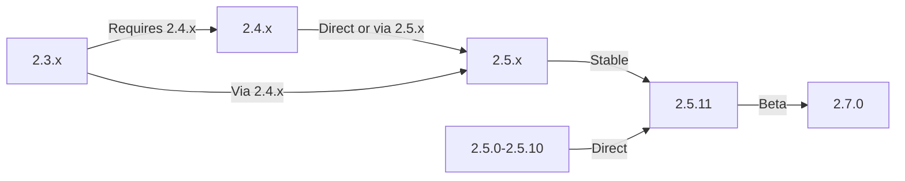

이 가이드에서는 데이터와 사용자 정의를 유지하면서 XOOPS를 이전 버전에서 최신 릴리스로 업그레이드하는 방법을 다룹니다.

> **버전 정보**
> - **안정적:** XOOPS 2.5.11
> - **베타:** XOOPS 2.7.0(테스트 중)
> - **미래:** XOOPS 4.0(개발 중 - 로드맵 참조)

## 업그레이드 전 체크리스트

업그레이드를 시작하기 전에 다음을 확인하십시오.

- [ ] 문서화된 현재 XOOPS 버전
- [ ] 대상 XOOPS 버전이 식별되었습니다.
- [ ] 전체 시스템 백업이 완료되었습니다.
- [ ] 데이터베이스 백업이 확인되었습니다.
- [ ] 설치된 모듈 목록이 기록되었습니다.
- [ ] 사용자 정의 수정 사항이 문서화됨
- [ ] 테스트 환경 이용 가능
- [ ] 업그레이드 경로 확인(일부 버전은 중간 릴리스를 건너뜁니다)
- [ ] 서버 리소스 확인됨(충분한 디스크 공간, 메모리)
- [ ] 유지 관리 모드 활성화됨

## 업그레이드 경로 안내

현재 버전에 따라 다른 업그레이드 경로:



**중요:** 주요 버전을 건너뛰지 마세요. 2.3.x에서 업그레이드하는 경우 먼저 2.4.x로 업그레이드한 다음 2.5.x로 업그레이드하세요.

## 1단계: 시스템 백업 완료

### 데이터베이스 백업

mysqldump를 사용하여 데이터베이스를 백업합니다.

```bash
# Full database backup
mysqldump -u xoops_user -p xoops_db > /backups/xoops_db_backup_$(date +%Y%m%d_%H%M%S).sql

# Compressed backup
mysqldump -u xoops_user -p xoops_db | gzip > /backups/xoops_db_backup_$(date +%Y%m%d_%H%M%S).sql.gz
```

또는 phpMyAdmin을 사용하여:

1. XOOPS 데이터베이스를 선택하세요.
2. "내보내기" 탭을 클릭하세요
3. "SQL" 형식을 선택하세요
4. '파일로 저장'을 선택하세요.
5. "이동"을 클릭하세요

백업 파일 확인:

```bash
# Check backup size
ls -lh /backups/xoops_db_backup*.sql

# Verify backup integrity (uncompressed)
head -20 /backups/xoops_db_backup_*.sql

# Verify compressed backup
zcat /backups/xoops_db_backup_*.sql.gz | head -20
```

### 파일 시스템 백업

모든 XOOPS 파일을 백업하십시오.

```bash
# Compressed file backup
tar -czf /backups/xoops_files_$(date +%Y%m%d_%H%M%S).tar.gz /var/www/html/xoops

# Uncompressed (faster, requires more disk space)
tar -cf /backups/xoops_files_$(date +%Y%m%d_%H%M%S).tar /var/www/html/xoops

# Show backup progress
tar -czf /backups/xoops_files_$(date +%Y%m%d_%H%M%S).tar.gz --verbose /var/www/html/xoops | tail
```

백업을 안전하게 저장하세요:

```bash
# Secure backup storage
chmod 600 /backups/xoops_*
ls -lah /backups/

# Optional: Copy to remote storage
scp /backups/xoops_* user@backup-server:/secure/backups/
```

### 테스트 백업 복원

**중요:** 항상 백업이 작동하는지 테스트하세요.

```bash
# Verify tar archive contents
tar -tzf /backups/xoops_files_*.tar.gz | head -20

# Extract to test location
mkdir /tmp/restore_test
cd /tmp/restore_test
tar -xzf /backups/xoops_files_*.tar.gz

# Verify key files exist
ls -la xoops/mainfile.php
ls -la xoops/install/
```

## 2단계: 유지 관리 모드 활성화

업그레이드 중에 사용자가 사이트에 액세스하지 못하도록 방지합니다.

### 옵션 1: XOOPS 관리자 패널

1. 관리자 패널에 로그인
2. 시스템 > 유지 관리로 이동합니다.
3. "사이트 유지 관리 모드"를 활성화합니다.
4. 유지보수 메시지 설정
5. 저장

### 옵션 2: 수동 유지 관리 모드

웹 루트에 유지 관리 파일을 만듭니다.

```html
<!-- /var/www/html/maintenance.html -->
<!DOCTYPE html>
<html>
<head>
    <title>Under Maintenance</title>
    <style>
        body { font-family: Arial; text-align: center; padding: 50px; }
        h1 { color: #333; }
        p { color: #666; margin: 20px 0; }
    </style>
</head>
<body>
    <h1>Site Under Maintenance</h1>
    <p>We're currently upgrading our site.</p>
    <p>Expected time: approximately 30 minutes.</p>
    <p>Thank you for your patience!</p>
</body>
</html>
```

유지 관리 페이지를 표시하도록 Apache를 구성합니다.

```apache
# In .htaccess or vhost config
ErrorDocument 503 /maintenance.html

# Redirect all traffic to maintenance page
<IfModule mod_rewrite.c>
    RewriteEngine On
    RewriteCond %{REMOTE_ADDR} !^192\.168\.1\.100$  # Your IP
    RewriteRule ^(.*)$ - [R=503,L]
</IfModule>
```

## 3단계: 새 버전 다운로드

공식 사이트에서 XOOPS를 다운로드하세요:

```bash
# Download latest version
cd /tmp
wget https://xoops.org/download/xoops-2.5.8.zip

# Verify checksum (if provided)
sha256sum xoops-2.5.8.zip
# Compare with official SHA256 hash

# Extract to temporary location
unzip xoops-2.5.8.zip
cd xoops-2.5.8
```

## 4단계: 업그레이드 전 파일 준비

### 사용자 정의 수정 사항 식별

사용자 정의된 코어 파일을 확인하십시오.

```bash
# Look for modified files (files with newer mtime)
find /var/www/html/xoops -type f -newer /var/www/html/xoops/install.php

# Check for custom themes
ls /var/www/html/xoops/themes/
# Note any custom themes

# Check for custom modules
ls /var/www/html/xoops/modules/
# Note any custom modules created by you
```

### 현재 상태 문서화

업그레이드 보고서를 생성합니다:

```bash
cat > /tmp/upgrade_report.txt << EOF
=== XOOPS Upgrade Report ===
Date: $(date)
Current Version: 2.5.6
Target Version: 2.5.8

=== Installed Modules ===
$(ls /var/www/html/xoops/modules/)

=== Custom Modifications ===
[Document any custom theme or module modifications]

=== Themes ===
$(ls /var/www/html/xoops/themes/)

=== Plugin Status ===
[List any custom code modifications]

EOF
```

## 5단계: 현재 설치 파일과 새 파일 병합

### 전략: 사용자 정의 파일 보존

XOOPS 코어 파일을 교체하되 다음을 유지합니다.
- `mainfile.php` (데이터베이스 구성)
- `themes/`의 맞춤 테마
- `modules/`의 사용자 정의 모듈
- `uploads/` 사용자 업로드
- `var/`의 사이트 데이터

### 수동 병합 프로세스

```bash
# Set variables
XOOPS_OLD="/var/www/html/xoops"
XOOPS_NEW="/tmp/xoops-2.5.8"
BACKUP="/backups/pre-upgrade"

# Create pre-upgrade backup in place
mkdir -p $BACKUP
cp -r $XOOPS_OLD/* $BACKUP/

# Copy new files (but preserve sensitive files)
# Copy everything except protected directories
rsync -av --exclude='mainfile.php' \
    --exclude='modules/custom*' \
    --exclude='themes/custom*' \
    --exclude='uploads' \
    --exclude='var' \
    --exclude='cache' \
    --exclude='templates_c' \
    $XOOPS_NEW/ $XOOPS_OLD/

# Verify critical files preserved
ls -la $XOOPS_OLD/mainfile.php
```

### 업그레이드.php 사용(사용 가능한 경우)

일부 XOOPS 버전에는 자동 업그레이드 스크립트가 포함되어 있습니다.

```bash
# Copy new files with installer
cp -r /tmp/xoops-2.5.8/* /var/www/html/xoops/

# Run upgrade wizard
# Visit: http://your-domain.com/xoops/upgrade/
```

### 병합 후 파일 권한

적절한 권한을 복원합니다.

```bash
# Set ownership
chown -R www-data:www-data /var/www/html/xoops

# Set directory permissions
find /var/www/html/xoops -type d -exec chmod 755 {} \;

# Set file permissions
find /var/www/html/xoops -type f -exec chmod 644 {} \;

# Make writable directories
chmod 777 /var/www/html/xoops/cache
chmod 777 /var/www/html/xoops/templates_c
chmod 777 /var/www/html/xoops/uploads
chmod 777 /var/www/html/xoops/var

# Secure mainfile.php
chmod 644 /var/www/html/xoops/mainfile.php
```

## 6단계: 데이터베이스 마이그레이션

### 데이터베이스 변경 사항 검토

데이터베이스 구조 변경 사항은 XOOPS 릴리스 노트를 확인하세요.

```bash
# Extract and review SQL migration files
find /tmp/xoops-2.5.8 -name "*.sql" -type f
# Document all .sql files found
```

### 데이터베이스 업데이트 실행

### 옵션 1: 자동 업데이트(사용 가능한 경우)

관리자 패널 사용:

1. 관리자로 로그인
2. **시스템 > 데이터베이스**로 이동합니다.
3. "업데이트 확인"을 클릭하세요.
4. 대기 중인 변경사항 검토
5. "업데이트 적용"을 클릭하세요.

### 옵션 2: 수동 데이터베이스 업데이트

마이그레이션 SQL 파일을 실행합니다.

```bash
# Connect to database
mysql -u xoops_user -p xoops_db

# View pending changes (varies by version)
SELECT * FROM xoops_config WHERE conf_name LIKE '%version%';

# Run migration scripts manually if needed
SOURCE /tmp/xoops-2.5.8/migrate_2.5.6_to_2.5.8.sql;
```

### 데이터베이스 확인

업데이트 후 데이터베이스 무결성을 확인하십시오.

```sql
-- Check database consistency
REPAIR TABLE xoops_users;
OPTIMIZE TABLE xoops_users;

-- Verify key tables exist
SHOW TABLES LIKE 'xoops_%';

-- Check row counts (should increase or stay same)
SELECT COUNT(*) FROM xoops_users;
SELECT COUNT(*) FROM xoops_posts;
```

## 7단계: 업그레이드 확인

### 홈페이지 확인

XOOPS 홈페이지를 방문하세요:

```
http://your-domain.com/xoops/
```

예상: 페이지가 오류 없이 로드되고 올바르게 표시됩니다.

### 관리자 패널 확인

액세스 관리자:

```
http://your-domain.com/xoops/admin/
```

확인:
- [ ] 관리자 패널 로드
- [ ] 내비게이션 작동
- [ ] 대시보드가 제대로 표시됩니다.
- [ ] 로그에 데이터베이스 오류가 없습니다.

### 모듈 검증

설치된 모듈을 확인하십시오.

1. 관리자 메뉴에서 **모듈 > 모듈**로 이동합니다.
2. 아직 설치된 모든 모듈을 확인합니다.
3. 오류 메시지가 있는지 확인하세요.
4. 비활성화된 모든 모듈을 활성화합니다.

### 로그 파일 확인

오류가 있는지 시스템 로그를 검토합니다.

```bash
# Check web server error log
tail -50 /var/log/apache2/error.log

# Check PHP error log
tail -50 /var/log/php_errors.log

# Check XOOPS system log (if available)
# In admin panel: System > Logs
```

### 테스트 핵심 기능

- [ ] 사용자 로그인/로그아웃이 작동합니다.
- [ ] 사용자 등록 작업
- [ ] 파일 업로드 기능
- [ ] 이메일 알림 전송
- [ ] 검색 기능이 작동합니다.
- [ ] 관리 기능 작동
- [ ] 모듈 기능이 그대로 유지됨

## 8단계: 업그레이드 후 정리

### 임시 파일 제거

```bash
# Remove extraction directory
rm -rf /tmp/xoops-2.5.8

# Clear template cache (safe to delete)
rm -rf /var/www/html/xoops/templates_c/*

# Clear site cache
rm -rf /var/www/html/xoops/cache/*
```

### 유지 관리 모드 제거

일반 사이트 액세스를 다시 활성화합니다.

```apache
# Remove maintenance mode redirect from .htaccess
# Or delete maintenance.html file
rm /var/www/html/maintenance.html
```

### 문서 업데이트

업그레이드 노트를 업데이트하세요:

```bash
# Document successful upgrade
cat >> /tmp/upgrade_report.txt << EOF

=== Upgrade Results ===
Status: SUCCESS
Upgrade Date: $(date)
New Version: 2.5.8
Duration: [time in minutes]

Post-Upgrade Tests:
- [x] Homepage loads
- [x] Admin panel accessible
- [x] Modules functional
- [x] User registration works
- [x] Database optimized

EOF
```

## 업그레이드 문제 해결

### 문제: 업그레이드 후 빈 흰색 화면

**증상:** 홈페이지에 아무것도 표시되지 않음

**해결책:**
```bash
# Check PHP errors
tail -f /var/log/apache2/error.log

# Enable debug mode temporarily
echo "define('XOOPS_DEBUG', 1);" >> /var/www/html/xoops/mainfile.php

# Check file permissions
ls -la /var/www/html/xoops/mainfile.php

# Restore from backup if needed
cp /backups/xoops_files_*.tar.gz /tmp/
cd /tmp && tar -xzf xoops_files_*.tar.gz
```

### 문제: 데이터베이스 연결 오류

**증상:** "데이터베이스에 연결할 수 없습니다" 메시지

**해결책:**
```bash
# Verify database credentials in mainfile.php
grep -i "database\|host\|user" /var/www/html/xoops/mainfile.php

# Test connection
mysql -h localhost -u xoops_user -p xoops_db -e "SELECT 1"

# Check MySQL status
systemctl status mysql

# Verify database still exists
mysql -u xoops_user -p -e "SHOW DATABASES" | grep xoops
```

### 문제: 관리자 패널에 액세스할 수 없음

**증상:** /xoops/admin/에 액세스할 수 없습니다.

**해결책:**
```bash
# Check .htaccess rules
cat /var/www/html/xoops/.htaccess

# Verify admin files exist
ls -la /var/www/html/xoops/admin/

# Check mod_rewrite enabled
apache2ctl -M | grep rewrite

# Restart web server
systemctl restart apache2
```

### 문제: 모듈이 로드되지 않음

**증상:** 모듈에 오류가 표시되거나 비활성화됩니다.

**해결책:**
```bash
# Verify module files exist
ls /var/www/html/xoops/modules/

# Check module permissions
ls -la /var/www/html/xoops/modules/*/

# Check module configuration in database
mysql -u xoops_user -p xoops_db -e "SELECT * FROM xoops_modules WHERE module_status = 0"

# Reactivate modules in admin panel
# System > Modules > Click module > Update Status
```

### 문제: 권한 거부 오류

**증상:** 업로드 또는 저장 시 "권한이 거부되었습니다"

**해결책:**
```bash
# Check file ownership
ls -la /var/www/html/xoops/ | head -20

# Fix ownership
chown -R www-data:www-data /var/www/html/xoops

# Fix directory permissions
find /var/www/html/xoops -type d -exec chmod 755 {} \;

# Make cache/uploads writable
chmod 777 /var/www/html/xoops/cache
chmod 777 /var/www/html/xoops/templates_c
chmod 777 /var/www/html/xoops/uploads
chmod 777 /var/www/html/xoops/var
```

### 문제: 느린 페이지 로딩

**증상:** 업그레이드 후 페이지가 매우 느리게 로드됩니다.

**해결책:**
```bash
# Clear all caches
rm -rf /var/www/html/xoops/cache/*
rm -rf /var/www/html/xoops/templates_c/*

# Optimize database
mysql -u xoops_user -p xoops_db << EOF
OPTIMIZE TABLE xoops_users;
OPTIMIZE TABLE xoops_posts;
OPTIMIZE TABLE xoops_config;
ANALYZE TABLE xoops_users;
EOF

# Check PHP error log for warnings
grep -i "deprecated\|warning" /var/log/php_errors.log | tail -20

# Increase PHP memory/execution time temporarily
# Edit php.ini:
memory_limit = 256M
max_execution_time = 300
```

## 롤백 절차

업그레이드가 심각하게 실패하면 백업에서 복원합니다.

### 데이터베이스 복원

```bash
# Restore from backup
mysql -u xoops_user -p xoops_db < /backups/xoops_db_backup_YYYYMMDD_HHMMSS.sql

# Or from compressed backup
gunzip < /backups/xoops_db_backup_YYYYMMDD_HHMMSS.sql.gz | mysql -u xoops_user -p xoops_db

# Verify restoration
mysql -u xoops_user -p xoops_db -e "SELECT COUNT(*) FROM xoops_users"
```

### 파일 시스템 복원

```bash
# Stop web server
systemctl stop apache2

# Remove current installation
rm -rf /var/www/html/xoops/*

# Extract backup
cd /var/www/html
tar -xzf /backups/xoops_files_YYYYMMDD_HHMMSS.tar.gz

# Fix permissions
chown -R www-data:www-data xoops/
find xoops -type d -exec chmod 755 {} \;
find xoops -type f -exec chmod 644 {} \;
chmod 777 xoops/cache xoops/templates_c xoops/uploads xoops/var

# Start web server
systemctl start apache2

# Verify restoration
# Visit http://your-domain.com/xoops/
```

## 업그레이드 확인 체크리스트

업그레이드 완료 후 다음을 확인하십시오.

- [ ] XOOPS 버전이 업데이트되었습니다(관리자 > 시스템 정보 확인).
- [ ] 홈페이지가 오류 없이 로드됩니다.
- [ ] 모든 모듈 기능
- [ ] 사용자 로그인이 작동합니다.
- [ ] 관리자 패널에 액세스 가능
- [ ] 파일 업로드 작업
- [ ] 이메일 알림 기능
- [ ] 데이터베이스 무결성이 확인되었습니다.
- [ ] 파일 권한이 정확함
- [ ] 유지 관리 모드가 제거되었습니다.
- [ ] 백업 보안 및 테스트 완료
- [ ] 성능이 만족스럽습니다.
- [ ] SSL/HTTPS 작동 중
- [ ] 로그에 오류 메시지가 없습니다.

## 다음 단계

성공적인 업그레이드 후:

1. 모든 사용자 정의 모듈을 최신 버전으로 업데이트하세요.
2. 더 이상 사용되지 않는 기능에 대한 릴리스 노트를 검토하세요.
3. 성능 최적화를 고려하세요
4. 보안 설정 업데이트
5. 모든 기능을 철저히 테스트하세요.
6. 백업 파일을 안전하게 보관하세요

---

**태그:** #업그레이드 #유지 관리 #백업 #데이터베이스 마이그레이션

**관련 기사:**
-../../06-Publisher-모듈/사용자 가이드/설치
- 서버 요구 사항
-../구성/기본-구성
-../구성/보안-구성
