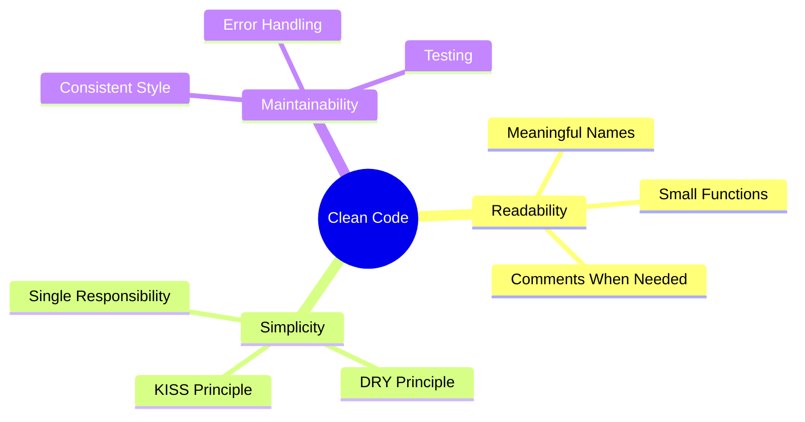

## 개요

클린 코드는 읽고, 이해하고, 유지 관리하기 쉬운 코드입니다. 이 가이드는 특히 XOOPS 모듈 개발에 적용되는 클린 코드 원칙을 다룹니다.

## 핵심 원칙



## 의미 있는 이름

### 변수

```php
// Bad
$d = new DateTime();
$u = $memberHandler->getUser($id);
$arr = [];

// Good
$createdDate = new DateTime();
$currentUser = $memberHandler->getUser($userId);
$publishedArticles = [];
```

### 기능

```php
// Bad
function process($data) { ... }
function handle($item) { ... }
function doStuff($x, $y) { ... }

// Good
function publishArticle(Article $article): void { ... }
function calculateTotalPrice(array $items): float { ... }
function sendNotificationEmail(User $user, string $subject): bool { ... }
```

### 클래스

```php
// Bad
class Manager { ... }
class Helper { ... }
class Utils { ... }

// Good
class ArticleRepository { ... }
class NotificationService { ... }
class PermissionChecker { ... }
```

## 작은 기능

### 단일 책임

```php
// Bad - does too many things
function processArticle($data) {
    // Validate
    if (empty($data['title'])) {
        throw new Exception('Title required');
    }
    // Save
    $article = new Article();
    $article->setTitle($data['title']);
    $this->repository->save($article);
    // Notify
    $this->mailer->send($article->getAuthor(), 'Article published');
    // Log
    $this->logger->info('Article created');
    return $article;
}

// Good - each function does one thing
function validateArticleData(array $data): void
{
    if (empty($data['title'])) {
        throw new ValidationException('Title required');
    }
}

function createArticle(array $data): Article
{
    $this->validateArticleData($data);
    return Article::create($data['title'], $data['content']);
}

function publishArticle(Article $article): void
{
    $this->repository->save($article);
    $this->notifyAuthor($article);
    $this->logArticleCreation($article);
}
```

### 함수 길이

함수를 짧게 유지하세요. 이상적으로는 20줄 미만입니다.

```php
// Good - focused function
public function getPublishedArticles(int $limit = 10): array
{
    $criteria = new CriteriaCompo();
    $criteria->add(new Criteria('status', 'published'));
    $criteria->setSort('published_at');
    $criteria->setOrder('DESC');
    $criteria->setLimit($limit);

    return $this->repository->getObjects($criteria);
}
```

## DRY 원칙(반복하지 마세요)

### 공통코드 추출

```php
// Bad - repeated code
function getActiveUsers() {
    $criteria = new CriteriaCompo();
    $criteria->add(new Criteria('level', 0, '>'));
    $criteria->setSort('uname');
    return $this->userHandler->getObjects($criteria);
}

function getActiveAdmins() {
    $criteria = new CriteriaCompo();
    $criteria->add(new Criteria('level', 0, '>'));
    $criteria->add(new Criteria('is_admin', 1));
    $criteria->setSort('uname');
    return $this->userHandler->getObjects($criteria);
}

// Good - shared logic extracted
function getUsers(CriteriaCompo $criteria): array
{
    $criteria->add(new Criteria('level', 0, '>'));
    $criteria->setSort('uname');
    return $this->userHandler->getObjects($criteria);
}

function getActiveUsers(): array
{
    return $this->getUsers(new CriteriaCompo());
}

function getActiveAdmins(): array
{
    $criteria = new CriteriaCompo();
    $criteria->add(new Criteria('is_admin', 1));
    return $this->getUsers($criteria);
}
```

## 오류 처리

### 예외를 올바르게 사용하세요

```php
// Bad - generic exceptions
throw new Exception('Error');

// Good - specific exceptions
throw new ArticleNotFoundException($articleId);
throw new PermissionDeniedException('Cannot edit article');
throw new ValidationException(['title' => 'Title is required']);
```

### 오류를 적절하게 처리

```php
public function findArticle(string $id): ?Article
{
    try {
        return $this->repository->findById($id);
    } catch (DatabaseException $e) {
        $this->logger->error('Database error finding article', [
            'id' => $id,
            'error' => $e->getMessage()
        ]);
        throw new ServiceException('Unable to retrieve article', 0, $e);
    }
}
```

## 댓글

### 댓글을 작성해야 하는 경우

```php
// Bad - obvious comment
// Increment counter
$counter++;

// Good - explains why, not what
// Cache for 1 hour to reduce database load during peak traffic
$cache->set($key, $data, 3600);

// Good - documents complex algorithm
/**
 * Calculate article relevance score using TF-IDF algorithm.
 * Higher scores indicate better match with search terms.
 */
function calculateRelevanceScore(Article $article, array $terms): float
{
    // ...
}
```

## 코드 구성

### 클래스 구조

```php
class ArticleService
{
    // 1. Constants
    private const MAX_TITLE_LENGTH = 255;

    // 2. Properties
    private ArticleRepository $repository;
    private EventDispatcher $events;

    // 3. Constructor
    public function __construct(
        ArticleRepository $repository,
        EventDispatcher $events
    ) {
        $this->repository = $repository;
        $this->events = $events;
    }

    // 4. Public methods
    public function publish(Article $article): void { ... }
    public function archive(Article $article): void { ... }

    // 5. Private methods
    private function validateForPublication(Article $article): void { ... }
}
```

## 클린 코드 체크리스트

- [ ] 이름은 의미 있고 발음 가능합니다.
- [ ] 함수는 한 가지 작업만 수행합니다.
- [ ] 기능이 작습니다(< 20줄).
- [ ] 중복된 코드 없음
- [ ] 특정 예외를 포함한 적절한 오류 처리
- [ ] 코멘트는 "무엇"이 아닌 "왜"를 설명합니다.
- [ ] 일관된 형식 및 스타일
- [ ] 마법의 숫자나 문자열이 없습니다.
- [ ] 종속성은 생성되지 않고 주입됩니다.

## 관련 문서

- 코드 구성
- 오류 처리
- 모범 사례 테스트
- PHP 표준
