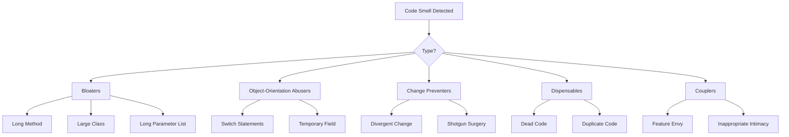

## 개요

코드 냄새는 코드의 잠재적인 문제를 나타내는 지표입니다. 반드시 코드가 손상되었다는 의미는 아니지만 리팩토링을 통해 이점을 얻을 수 있는 영역을 제안합니다.

## 공통 코드 냄새



## 블로터

### 긴 방법

```php
// Smell: Method does too much
function processArticleSubmission($data) {
    // 100+ lines of validation, saving, notification, etc.
}

// Solution: Extract into focused methods
function processArticleSubmission(array $data): Article
{
    $this->validateInput($data);
    $article = $this->createArticle($data);
    $this->saveArticle($article);
    $this->notifySubscribers($article);
    return $article;
}
```

### 대형 클래스(God Object)

```php
// Smell: Class does everything
class ArticleManager {
    public function create() { ... }
    public function delete() { ... }
    public function sendEmail() { ... }
    public function generatePDF() { ... }
    public function exportToExcel() { ... }
    public function validateUser() { ... }
    public function checkPermissions() { ... }
    // ... 50 more methods
}

// Solution: Split into focused classes
class ArticleService { ... }
class ArticleExporter { ... }
class ArticleNotifier { ... }
class PermissionChecker { ... }
```

### 긴 매개변수 목록

```php
// Smell: Too many parameters
function createArticle($title, $content, $author, $category, $tags, $status, $publishDate, $featured, $image) { ... }

// Solution: Use parameter object
class CreateArticleCommand {
    public string $title;
    public string $content;
    public int $authorId;
    public int $categoryId;
    public array $tags;
    public string $status;
    public ?DateTime $publishDate;
    public bool $featured;
    public ?string $image;
}

function createArticle(CreateArticleCommand $command): Article { ... }
```

## 객체지향 남용자

### 스위치 문

```php
// Smell: Type checking with switch
function getDiscount($userType) {
    switch ($userType) {
        case 'regular':
            return 0;
        case 'premium':
            return 10;
        case 'vip':
            return 20;
        default:
            return 0;
    }
}

// Solution: Use polymorphism
interface UserType {
    public function getDiscount(): int;
}

class RegularUser implements UserType {
    public function getDiscount(): int { return 0; }
}

class PremiumUser implements UserType {
    public function getDiscount(): int { return 10; }
}

class VipUser implements UserType {
    public function getDiscount(): int { return 20; }
}
```

### 임시 필드

```php
// Smell: Fields only used in certain situations
class Article {
    private $tempCalculatedScore;

    public function search($terms) {
        $this->tempCalculatedScore = $this->calculateScore($terms);
        // ... use score
    }
}

// Solution: Pass as parameter or return value
class Article {
    public function getSearchScore(array $terms): float {
        return $this->calculateScore($terms);
    }
}
```

## 변경 방지 장치

### 다양한 변화

```php
// Smell: One class changed for many different reasons
class Article {
    public function save() { ... } // Database change
    public function toJson() { ... } // API format change
    public function validate() { ... } // Business rule change
    public function render() { ... } // UI change
}

// Solution: Separate responsibilities
class Article { ... } // Domain object only
class ArticleRepository { public function save() { ... } }
class ArticleSerializer { public function toJson() { ... } }
class ArticleValidator { public function validate() { ... } }
```

### 산탄총 수술

```php
// Smell: One change requires many file edits
// Changing date format requires editing:
// - ArticleController.php
// - ArticleView.php
// - ArticleAPI.php
// - ArticleExport.php

// Solution: Centralize
class DateFormatter {
    public function format(DateTime $date): string {
        return $date->format($this->config->get('date_format'));
    }
}
```

## 필수품

### 데드 코드

```php
// Smell: Unreachable or unused code
function processData($data) {
    if (true) {
        return $this->handleData($data);
    }
    // This never executes
    return $this->legacyHandler($data);
}

// Old unused method still in codebase
function oldMethod() {
    // Not called anywhere
}

// Solution: Remove dead code
function processData($data) {
    return $this->handleData($data);
}
```

### 중복 코드

```php
// Smell: Same logic in multiple places
class ArticleHandler {
    public function getActive() {
        $criteria = new CriteriaCompo();
        $criteria->add(new Criteria('status', 'active'));
        return $this->getObjects($criteria);
    }
}

class NewsHandler {
    public function getActive() {
        $criteria = new CriteriaCompo();
        $criteria->add(new Criteria('status', 'active'));
        return $this->getObjects($criteria);
    }
}

// Solution: Extract common behavior
trait ActiveRecordsTrait {
    public function getActive(): array {
        $criteria = new CriteriaCompo();
        $criteria->add(new Criteria('status', 'active'));
        return $this->getObjects($criteria);
    }
}
```

## 커플러

### 기능 Envy

```php
// Smell: Method uses another object's data more than its own
class Invoice {
    public function calculateTotal(Customer $customer) {
        $total = 0;
        foreach ($this->items as $item) {
            $total += $item->price;
        }
        // Uses customer data extensively
        if ($customer->isPremium()) {
            $total *= (1 - $customer->getDiscountRate());
        }
        if ($customer->getCountry() === 'US') {
            $total *= 1.08; // Tax
        }
        return $total;
    }
}

// Solution: Move behavior to the object with the data
class Customer {
    public function applyDiscount(float $amount): float {
        return $this->isPremium()
            ? $amount * (1 - $this->discountRate)
            : $amount;
    }

    public function applyTax(float $amount): float {
        return $this->country === 'US'
            ? $amount * 1.08
            : $amount;
    }
}
```

## 리팩토링 체크리스트

코드 냄새를 발견한 경우:

1. **확인** - 어떤 냄새인가요?
2. **평가** - 영향이 얼마나 심각한가요?
3. **계획** - 어떤 리팩토링 기술이 적용되나요?
4. **테스트** - 리팩토링 전에 테스트가 존재하는지 확인하세요.
5. **리팩터링** - 조금씩 점진적으로 변경합니다.
6. **확인** - 각 변경 후에 테스트를 실행합니다.

## 관련 문서

- 클린 코드 원칙
- 코드 구성
- 모범 사례 테스트
