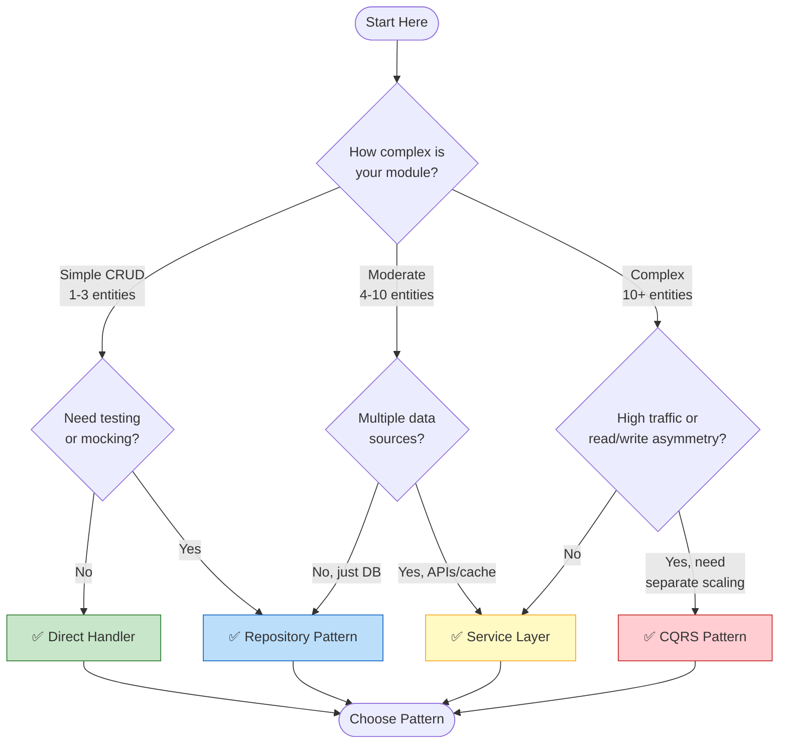
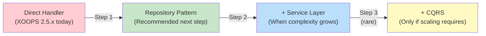

<span class="version-badge version-25x">2.5.x ✅</span> <span class="version-badge version-40x">4.0.x ✅</span>

> **어떤 패턴을 사용해야 합니까?** 이 결정 트리는 직접 처리기, 리포지토리 패턴, 서비스 계층 및 CQRS 중에서 선택하는 데 도움이 됩니다.

---

## 빠른 의사결정 트리



---

## 패턴 비교

| Criteria | 직접 핸들러 | 저장소 | 서비스 계층 | CQRS |
|----------|---------------|------------|---------------|------|
| **복잡성** | ⭐ | ⭐⭐ | ⭐⭐⭐ | ⭐⭐⭐⭐⭐ |
| **테스트 가능성** | ❌ 하드 | ✅ 좋다 | ✅ 좋아요 | ✅ 좋아요 |
| **유연성** | ❌ 낮음 | ✅ 중간 | ✅ 높음 | ✅ 매우 높음 |
| **XOOPS 2.5.x** | ✅ 네이티브 | ✅ 작동 | ✅ 작동 | ⚠️ 복합 |
| **XOOPS 4.0** | ⚠️ 더 이상 사용되지 않음 | ✅ 추천 | ✅ 추천 | ✅ 규모의 경우 |
| **팀 규모** | 개발자 1명 | 개발자 1~3명 | 개발자 2~5명 | 5명 이상의 개발자 |
| **유지보수** | ❌ 더 높음 | ✅ 보통 | ✅ 낮은 | ⚠️ 전문 지식이 필요합니다 |

---

## 각 패턴을 언제 사용해야 하는가

### ✅ 직접 처리자(`XoopsPersistableObjectHandler`)

**최적의 용도:** 간단한 모듈, 빠른 프로토타입, XOOPS 학습

```php
// Simple and direct - good for small modules
$handler = xoops_getModuleHandler('article', 'news');
$articles = $handler->getObjects(new Criteria('status', 1));
```

**다음과 같은 경우에 이것을 선택하세요:**
- 1~3개의 데이터베이스 테이블로 간단한 모듈 구축
- 빠른 프로토타입 제작
- 당신은 유일한 개발자이고 테스트가 필요하지 않습니다
- 모듈이 크게 성장하지 않습니다.

**제한사항:**
- 단위 테스트가 어려움(전역 종속성)
- XOOPS 데이터베이스 계층과의 긴밀한 결합
- 비즈니스 로직이 컨트롤러로 유출되는 경향이 있음

---

### ✅ 저장소 패턴

**최적의 용도:** 대부분의 모듈, 테스트 가능성을 원하는 팀

```php
// Abstraction allows mocking for tests
interface ArticleRepositoryInterface {
    public function findPublished(): array;
    public function save(Article $article): void;
}

class XoopsArticleRepository implements ArticleRepositoryInterface {
    private $handler;

    public function __construct() {
        $this->handler = xoops_getModuleHandler('article', 'news');
    }

    public function findPublished(): array {
        return $this->handler->getObjects(new Criteria('status', 1));
    }
}
```

**다음과 같은 경우에 이것을 선택하세요:**
- 단위 테스트를 작성하고 싶으신 분
- 추후 데이터 소스 변경 가능 (DB → API)
- 2명 이상의 개발자와 함께 작업
- 유통을 위한 모듈 구축

**업그레이드 경로:** XOOPS 4.0 준비에 권장되는 패턴입니다.

---

### ✅ 서비스 계층

**최적의 용도:** 복잡한 비즈니스 로직이 포함된 모듈

```php
// Service coordinates multiple repositories and contains business rules
class ArticlePublicationService {
    public function __construct(
        private ArticleRepositoryInterface $articles,
        private NotificationServiceInterface $notifications,
        private CacheInterface $cache
    ) {}

    public function publish(int $articleId): void {
        $article = $this->articles->find($articleId);
        $article->setStatus('published');
        $article->setPublishedAt(new DateTime());

        $this->articles->save($article);
        $this->notifications->notifySubscribers($article);
        $this->cache->invalidate("article:{$articleId}");
    }
}
```

**다음과 같은 경우에 이것을 선택하세요:**
- 작업은 여러 데이터 소스에 걸쳐 있습니다.
- 비즈니스 규칙이 복잡함
- 거래관리가 필요하신 분
- 앱의 여러 부분이 동일한 작업을 수행합니다.

**업그레이드 경로:** 강력한 아키텍처를 위해 저장소와 결합합니다.

---

### ⚠️ CQRS(명령어 쿼리 책임 분리)

**최적의 용도:** 읽기/쓰기 비대칭성을 갖춘 대규모 모듈

```php
// Commands modify state
class PublishArticleCommand {
    public function __construct(
        public readonly int $articleId,
        public readonly int $publisherId
    ) {}
}

// Queries read state (can use denormalized read models)
class GetPublishedArticlesQuery {
    public function __construct(
        public readonly int $limit = 10
    ) {}
}
```

**다음과 같은 경우에 이것을 선택하세요:**
- 쓰기보다 읽기가 훨씬 더 많습니다(100:1 이상).
- 읽기와 쓰기에 대해 서로 다른 크기 조정이 필요합니다.
- 복잡한 보고/분석 요구사항
- 이벤트 소싱이 귀하의 도메인에 도움이 될 것입니다.

**경고:** CQRS는 상당한 복잡성을 추가합니다. 대부분의 XOOPS 모듈에는 필요하지 않습니다.

---

## 권장 업그레이드 경로



### 1단계: 저장소에 핸들러 래핑(2~4시간)

1. 데이터 액세스 요구 사항에 맞는 인터페이스를 만듭니다.
2. 기존 핸들러를 사용하여 구현
3. `xoops_getModuleHandler()`을 직접 호출하는 대신 저장소를 삽입합니다.

### 2단계: 필요할 때 서비스 계층 추가(1~2일)

1. 비즈니스 로직이 컨트롤러에 나타나면 서비스로 추출합니다.
2. 서비스는 핸들러가 아닌 저장소를 직접 사용합니다.
3. 컨트롤러가 얇아진다 (경로 → 서비스 → 응답)

### 3단계: 다음과 같은 경우에만 CQRS를 고려하세요(드물게)

1. 하루에 수백만 건의 읽기가 발생합니다.
2. 읽기 및 쓰기 모델은 크게 다릅니다.
3. 감사 추적을 위한 이벤트 소싱이 필요합니다.
4. CQRS 경험이 있는 팀이 있습니다.

---

## 빠른 참조 카드

| 질문 | 답변 |
|----------|--------|
| **"데이터를 저장/불러오기만 하면 됩니다"** | 직접 핸들러 |
| **"테스트를 작성하고 싶습니다"** | 리포지토리 패턴 |
| **"복잡한 비즈니스 규칙이 있습니다."** | 서비스 계층 |
| **"읽기 크기를 별도로 조정해야 합니다."** | CQRS |
| **"XOOPS 4.0을 준비 중입니다."** | 저장소 + 서비스 계층 |

---

## 관련 문서

- [리포지토리 패턴 가이드](Patterns/Repository-Pattern.md)
- [서비스 레이어 패턴 가이드](Patterns/Service-Layer-Pattern.md)
- [CQRS 패턴 가이드](../07-XOOPS-4.0/Implementation-Guides/CQRS-Pattern-Guide.md) *(고급)*
- [하이브리드 모드 계약](../07-XOOPS-4.0/Specifications/Hybrid-Mode-Contract.md)

---

#패턴 #데이터 액세스 #결정 트리 #모범 사례 #xoops
