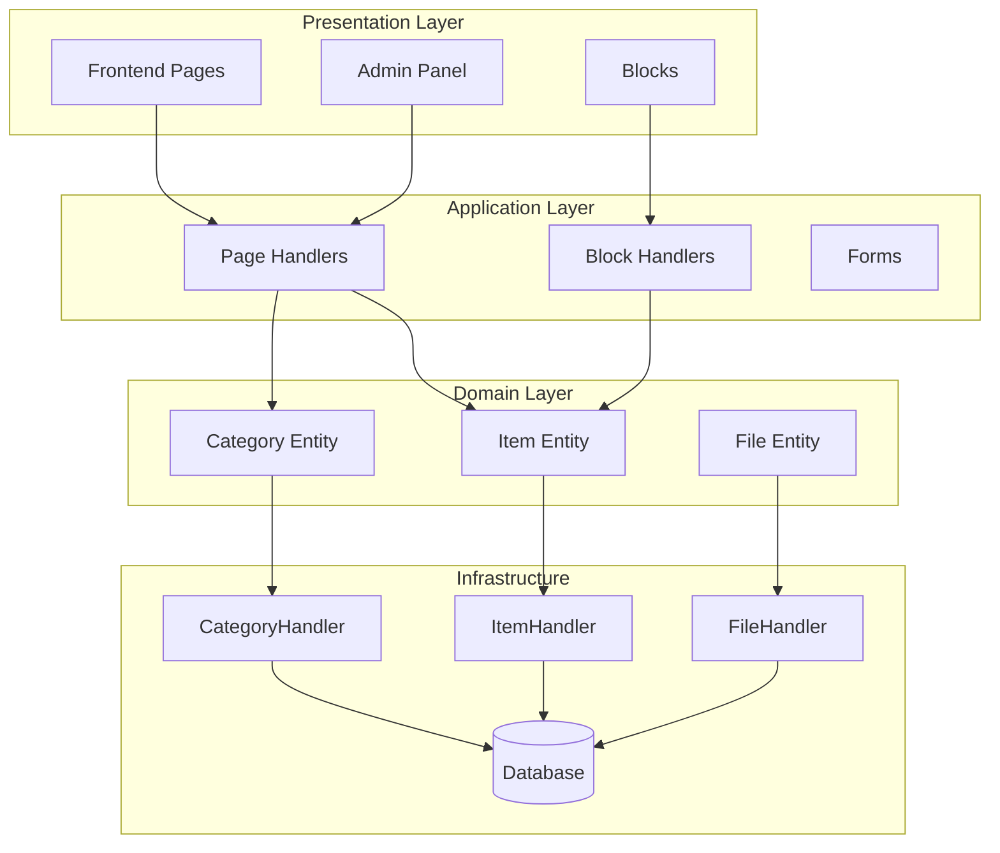
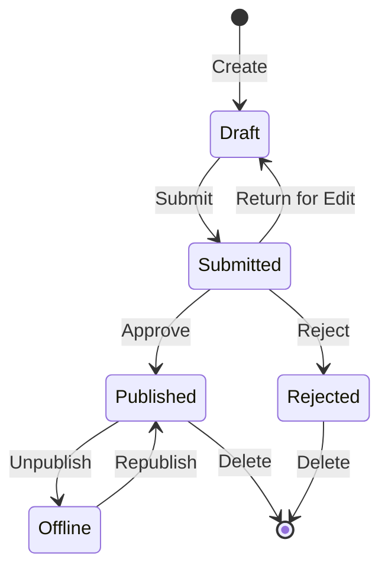

## 개요

이 문서는 게시자 모듈 아키텍처, 패턴 및 구현 세부 사항에 대한 기술 분석을 제공합니다. 프로덕션 품질의 XOOPS 모듈이 어떻게 구성되어 있는지 이해하기 위한 참고 자료로 사용하십시오.

## 아키텍처 개요



## 디렉토리 구조

```
publisher/
├── admin/
│   ├── index.php           # Admin dashboard
│   ├── item.php            # Article management
│   ├── category.php        # Category management
│   ├── permission.php      # Permissions
│   ├── file.php            # File manager
│   └── menu.php            # Admin menu
├── assets/
│   ├── css/
│   ├── js/
│   └── images/
├── class/
│   ├── Category.php        # Category entity
│   ├── CategoryHandler.php # Category data access
│   ├── Item.php            # Article entity
│   ├── ItemHandler.php     # Article data access
│   ├── File.php            # File attachment
│   ├── FileHandler.php     # File data access
│   ├── Form/               # Form classes
│   ├── Common/             # Utilities
│   └── Helper.php          # Module helper
├── include/
│   ├── common.php          # Initialization
│   ├── functions.php       # Utility functions
│   ├── oninstall.php       # Install hooks
│   ├── onupdate.php        # Update hooks
│   └── search.php          # Search integration
├── language/
├── templates/
├── sql/
└── xoops_version.php
```

## 엔터티 분석

### 품목(기사) 엔터티

```php
class Item extends \XoopsObject
{
    // Fields
    public function initVar(): void
    {
        $this->initVar('itemid', XOBJ_DTYPE_INT, null, false);
        $this->initVar('categoryid', XOBJ_DTYPE_INT, 0, false);
        $this->initVar('title', XOBJ_DTYPE_TXTBOX, '', true);
        $this->initVar('subtitle', XOBJ_DTYPE_TXTBOX, '');
        $this->initVar('summary', XOBJ_DTYPE_TXTAREA, '');
        $this->initVar('body', XOBJ_DTYPE_TXTAREA, '', true);
        $this->initVar('uid', XOBJ_DTYPE_INT, 0);
        $this->initVar('status', XOBJ_DTYPE_INT, 0);
        $this->initVar('datesub', XOBJ_DTYPE_INT, time());
        // ... more fields
    }

    // Business methods
    public function isPublished(): bool
    {
        return $this->getVar('status') == _PUBLISHER_STATUS_PUBLISHED;
    }

    public function canEdit(int $userId): bool
    {
        return $this->getVar('uid') == $userId
            || $this->isAdmin($userId);
    }
}
```

### 핸들러 패턴

```php
class ItemHandler extends \XoopsPersistableObjectHandler
{
    public function __construct(\XoopsDatabase $db)
    {
        parent::__construct(
            $db,
            'publisher_items',
            Item::class,
            'itemid',
            'title'
        );
    }

    public function getPublishedItems(int $limit = 10): array
    {
        $criteria = new \CriteriaCompo();
        $criteria->add(new \Criteria('status', _PUBLISHER_STATUS_PUBLISHED));
        $criteria->setSort('datesub');
        $criteria->setOrder('DESC');
        $criteria->setLimit($limit);

        return $this->getObjects($criteria);
    }
}
```

## 권한 시스템

### 권한 유형

| 허가 | 설명 |
|------------|-------------|
| `publisher_view` | 카테고리/기사 보기 |
| `publisher_submit` | 새 기사 제출 |
| `publisher_approve` | 제출 자동 승인 |
| `publisher_moderate` | 보류 중인 기사 검토 |
| `publisher_global` | 글로벌 모듈 권한 |

### 권한 확인

```php
class PermissionHandler
{
    public function isGranted(string $permission, int $categoryId): bool
    {
        $userId = $GLOBALS['xoopsUser']?->uid() ?? 0;
        $groups = $this->getUserGroups($userId);

        return $this->grouppermHandler->checkRight(
            $permission,
            $categoryId,
            $groups,
            $this->helper->getModule()->mid()
        );
    }
}
```

## 워크플로 상태



## 템플릿 구조

### 프런트엔드 템플릿

| 템플릿 | 목적 |
|----------|---------|
| `publisher_index.tpl` | 모듈 홈페이지 |
| `publisher_item.tpl` | 단일 기사 |
| `publisher_category.tpl` | 카테고리 목록 |
| `publisher_submit.tpl` | 제출 양식 |
| `publisher_search.tpl` | 검색결과 |

### 블록 템플릿

| 템플릿 | 목적 |
|----------|---------|
| `publisher_block_latest.tpl` | 최근 기사 |
| `publisher_block_spotlight.tpl` | 주요 기사 |
| `publisher_block_category.tpl` | 카테고리 메뉴 |

## 사용된 주요 패턴

1. **핸들러 패턴** - 데이터 액세스 캡슐화
2. **값 개체** - 상태 상수
3. **템플릿 방법** - 양식 생성
4. **전략** - 다양한 디스플레이 모드
5. **관찰자** - 이벤트 알림

## 모듈 개발을 위한 교훈

1. CRUD에는 XoopsPersistableObjectHandler을 사용하세요.
2. 세분화된 권한 구현
3. 논리와 표현을 분리하라
4. 쿼리에는 Criteria을 사용하세요.
5. 다양한 콘텐츠 상태 지원
6. XOOPS 알림 시스템과 통합

## 관련 문서

- 기사 작성 - 기사 관리
- 카테고리 관리 - 카테고리 시스템
- 권한-설정 - 권한 구성
- 개발자 가이드/후크 앤 이벤트 - 확장 포인트
