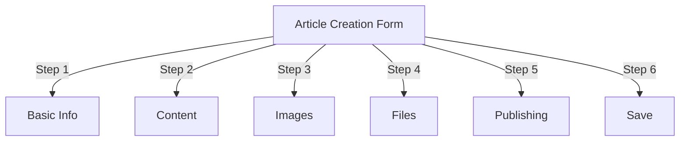
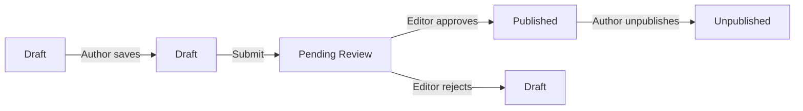
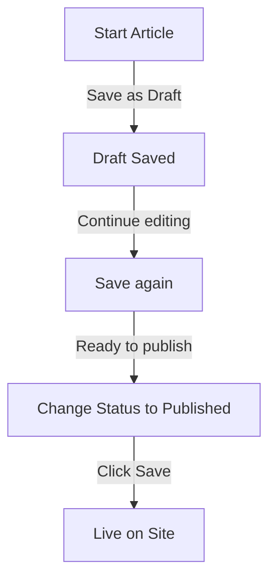

# 게시자에서 기사 만들기

> 게시자 모듈에서 기사 작성, 편집, 형식 지정 및 게시에 대한 단계별 가이드입니다.

---

## 기사 관리에 액세스

### 관리자 패널 탐색

```
Admin Panel
└── Modules
    └── Publisher
        └── Articles
            ├── Create New
            ├── Edit
            ├── Delete
            └── Publish
```

### 가장 빠른 경로

1. **관리자**로 로그인
2. 관리 표시줄에서 **모듈**을 클릭합니다.
3. **출판사** 찾기
4. **관리자** 링크를 클릭하세요.
5. 왼쪽 메뉴에서 **기사**를 클릭합니다.
6. **기사 추가** 버튼을 클릭하세요.

---

## 기사 작성 양식

### 기본정보

새 기사를 작성할 때 다음 섹션을 작성하세요.



---

## 1단계: 기본 정보

### 필수 입력사항

#### 기사 제목

```
Field: Title
Type: Text input (required)
Max length: 255 characters
Example: "Top 5 Tips for Better Photography"
```

**가이드라인:**
- 설명적이고 구체적인 내용
- SEO를 위한 키워드 포함
- 모두 대문자를 사용하지 마세요.
- 최상의 표시를 위해 60자 미만으로 유지하세요.

#### 카테고리 선택

```
Field: Category
Type: Dropdown (required)
Options: List of created categories
Example: Photography > Tutorials
```

**팁:**
- 상위 및 하위 카테고리 사용 가능
- 가장 관련성이 높은 카테고리를 선택하세요.
- 기사당 하나의 카테고리만 가능
- 추후 변경될 수 있습니다.

#### 기사 부제(선택사항)

```
Field: Subtitle
Type: Text input (optional)
Max length: 255 characters
Example: "Learn photography fundamentals in 5 easy steps"
```

**사용 대상:**
- 요약 제목
- 티저 텍스트
- 확장된 제목

### 기사 설명

#### 간단한 설명

```
Field: Short Description
Type: Textarea (optional)
Max length: 500 characters
```

**목적:**
- 기사 미리보기 텍스트
- 카테고리 목록에 표시됩니다.
- 검색결과에 사용됩니다.
- SEO에 대한 메타 설명

**예:**
```
"Discover essential photography techniques that will transform your photos
from ordinary to extraordinary. This comprehensive guide covers composition,
lighting, and exposure settings."
```

#### 전체 콘텐츠

```
Field: Article Body
Type: WYSIWYG Editor (required)
Max length: Unlimited
Format: HTML
```

서식 있는 텍스트 편집이 가능한 주요 기사 콘텐츠 영역입니다.

---

## 2단계: 콘텐츠 형식 지정

### WYSIWYG 편집기 사용

#### 텍스트 서식 지정

```
Bold:           Ctrl+B or click [B] button
Italic:         Ctrl+I or click [I] button
Underline:      Ctrl+U or click [U] button
Strikethrough:  Alt+Shift+D or click [S] button
Subscript:      Ctrl+, (comma)
Superscript:    Ctrl+. (period)
```

#### 제목 구조

적절한 문서 계층 구조를 만듭니다.

```html
<h1>Article Title</h1>      <!-- Use once at top -->
<h2>Main Section</h2>        <!-- For major sections -->
<h3>Subsection</h3>          <!-- For subtopics -->
<h4>Sub-subsection</h4>      <!-- For details -->
```

**편집기에서:**
- **형식** 드롭다운을 클릭합니다.
- 제목 수준 선택(H1-H6)
- 제목을 입력하세요

#### 목록

**순서가 지정되지 않은 목록(글머리 기호):**

```markdown
• Point one
• Point two
• Point three
```

편집기의 단계:
1. [pho] 글머리 기호 목록 버튼을 클릭하세요
2. 각 포인트를 입력하세요
3. 다음 항목을 보려면 Enter를 누르세요.
4. 목록을 종료하려면 백스페이스를 두 번 누르세요.

**순서가 지정된 목록(번호 매기기):**

```markdown
1. First step
2. Second step
3. Third step
```

편집기의 단계:
1. [1.] 번호 목록 버튼을 클릭하세요.
2. 각 항목을 입력합니다.
3. 다음을 위해 Enter를 누르세요.
4. 백스페이스를 두 번 눌러 종료합니다.

**중첩 목록:**

```markdown
1. Main point
   a. Sub-point
   b. Sub-point
2. Next point
```

단계:
1. 첫 번째 목록 만들기
2. 들여쓰기하려면 Tab 키를 누르세요.
3. 중첩 항목 만들기
4. Shift+Tab을 눌러 내어쓰기

#### 링크

**하이퍼링크 추가:**

1. 링크할 텍스트를 선택하세요
2. **[🔗] 링크** 버튼을 클릭하세요.
3. URL 입력: `https://example.com`
4. 선택사항: 제목/대상 추가
5. **링크 삽입**을 클릭하세요.

**링크 제거:**

1. 링크된 텍스트 내부를 클릭하세요.
2. **[🔗] 링크 제거** 버튼을 클릭하세요.

#### 코드 및 인용문

**인용문:**

```
"This is an important quote from an expert"
- Attribution
```

단계:
1. 인용문을 입력하세요
2. **[❝] 인용구** 버튼을 클릭하세요.
3. 텍스트가 들여쓰기되고 스타일이 지정됩니다.

**코드 블록:**

```python
def hello_world():
    print("Hello, World!")
```

단계:
1. **서식 → 코드**를 클릭합니다.
2. 코드 붙여넣기
3. 언어 선택(선택)
4. 구문 강조 표시가 있는 코드 표시

---

## 3단계: 이미지 추가

### 추천 이미지(히어로 이미지)

```
Field: Featured Image / Main Image
Type: Image upload
Format: JPG, PNG, GIF, WebP
Max size: 5 MB
Recommended: 600x400 px
```

**업로드하려면:**

1. **이미지 업로드** 버튼을 클릭하세요.
2. 컴퓨터에서 이미지를 선택하세요
3. 필요한 경우 자르기/크기 조정
4. **이 이미지 사용**을 클릭하세요.

**이미지 배치:**
- 기사 상단에 표시됩니다.
- 카테고리 목록에 사용됩니다.
- 아카이브에 표시됨
- 소셜 공유에 사용됩니다.

### 인라인 이미지

기사 텍스트 내에 이미지 삽입:

1. 편집기에서 이미지가 이동해야 할 위치에 커서를 놓습니다.
2. 툴바에서 **[🖼️] 이미지** 버튼을 클릭하세요.
3. 업로드 옵션을 선택하세요:
   - 새 이미지 업로드
   - 갤러리에서 선택
   - 이미지 URL을 입력하세요
4. 구성:
   ```
   Image Size:
   - Width: 300-600 px
   - Height: Auto (maintains ratio)
   - Alignment: Left/Center/Right
   ```
5. **이미지 삽입**을 클릭하세요.

**이미지 주위에 텍스트 줄 바꿈:**

삽입 후 편집기에서:

```html
<!-- Image floats left, text wraps around -->

```

### 이미지 갤러리

다중 이미지 갤러리 만들기:

1. **갤러리** 버튼을 클릭합니다(가능한 경우).
2. 여러 이미지 업로드:
   - 한 번 클릭: 하나 추가
   - 드래그 앤 드롭: 여러 개 추가
3. 드래그하여 순서 정렬
4. 각 이미지에 대한 캡션 설정
5. **갤러리 만들기**를 클릭하세요.

---

## 4단계: 파일 첨부

### 첨부파일 추가

```
Field: File Attachments
Type: File upload (multiple allowed)
Supported: PDF, DOC, XLS, ZIP, etc.
Max per file: 10 MB
Max per article: 5 files
```

**첨부하려면:**

1. **파일 추가** 버튼을 클릭하세요.
2. 컴퓨터에서 파일을 선택하세요
3. 선택사항: 파일 설명 추가
4. **파일 첨부**를 클릭하세요.
5. 여러 파일에 대해 반복

**파일 예:**
- PDF 가이드
- Excel 스프레드시트
- 워드 문서
- ZIP 아카이브
- 소스 코드

### 첨부파일 관리

**파일 편집:**

1. 파일명을 클릭하세요
2. 설명 수정
3. **저장**을 클릭합니다.

**파일 삭제:**

1. 목록에서 파일 찾기
2. **[×] 삭제** 아이콘을 클릭하세요.
3. 삭제 확인

---

## 5단계: 게시 및 상태

### 기사 상태

```
Field: Status
Type: Dropdown
Options:
  - Draft: Not published, only author sees
  - Pending: Waiting for approval
  - Published: Live on site
  - Archived: Old content
  - Unpublished: Was published, now hidden
```

**상태 워크플로:**



### 게시 옵션

#### 즉시 게시

```
Status: Published
Start Date: Today (auto-filled)
End Date: (leave blank for no expiration)
```

#### 나중에 일정

```
Status: Scheduled
Start Date: Future date/time
Example: February 15, 2024 at 9:00 AM
```

기사는 지정된 시간에 자동으로 게시됩니다.

#### 만료 설정

```
Enable Expiration: Yes
Expiration Date: Future date
Action: Archive/Hide/Delete
Example: April 1, 2024 (article auto-archives)
```

### 가시성 옵션

```yaml
Show Article:
  - Display on front page: Yes/No
  - Show in category: Yes/No
  - Include in search: Yes/No
  - Include in recent articles: Yes/No

Featured Article:
  - Mark as featured: Yes/No
  - Featured section position: (number)
```

---

## 6단계: SEO 및 메타데이터

### SEO 설정

```
Field: SEO Settings (Expand section)
```

#### 메타 설명

```
Field: Meta Description
Type: Text (160 characters recommended)
Used by: Search engines, social media

Example:
"Learn photography fundamentals in 5 easy steps.
Discover composition, lighting, and exposure techniques."
```

#### 메타 키워드

```
Field: Meta Keywords
Type: Comma-separated list
Max: 5-10 keywords

Example: Photography, Tutorial, Composition, Lighting, Exposure
```

#### URL 슬러그

```
Field: URL Slug (auto-generated from title)
Type: Text
Format: lowercase, hyphens, no spaces

Auto: "top-5-tips-for-better-photography"
Edit: Change before publishing
```

#### 오픈 그래프 태그

기사 정보에서 자동 생성됨:
- 제목
- 설명
- 주요 이미지
- 기사 URL
- 출판일

Facebook, LinkedIn, WhatsApp 등에서 사용됩니다.

---

## 7단계: 댓글 및 상호작용

### 댓글 설정

```yaml
Allow Comments:
  - Enable: Yes/No
  - Default: Inherit from preferences
  - Override: Specific to this article

Moderate Comments:
  - Require approval: Yes/No
  - Default: Inherit from preferences
```

### 등급 설정

```yaml
Allow Ratings:
  - Enable: Yes/No
  - Scale: 5 stars (default)
  - Show average: Yes/No
  - Show count: Yes/No
```

---

## 8단계: 고급 옵션

### 작성자 및 작성자

```
Field: Author
Type: Dropdown
Default: Current user
Options: All users with author permission

Display:
  - Show author name: Yes/No
  - Show author bio: Yes/No
  - Show author avatar: Yes/No
```

### 잠금 편집

```
Field: Edit Lock
Purpose: Prevent accidental changes

Lock Article:
  - Locked: Yes/No
  - Lock reason: "Final version"
  - Unlock date: (optional)
```

### 개정 내역

기사의 자동 저장된 버전:

```
View Revisions:
  - Click "Revision History"
  - Shows all saved versions
  - Compare versions
  - Restore previous version
```

---

## 저장 및 게시

### 작업 흐름 저장



### 기사 저장

**자동 저장:**
- 60초마다 트리거됩니다.
- 자동으로 초안으로 저장
- "마지막으로 저장한 시간: 2분 전"을 표시합니다.

**수동 저장:**
- 계속 수정하려면 **저장하고 계속하기**를 클릭하세요.
- 게시된 버전을 보려면 **저장 및 보기**를 클릭하세요.
- **저장**을 클릭하여 저장하고 닫습니다.

### 기사 게시

1. **상태**를 게시됨으로 설정합니다.
2. **시작 날짜** 설정: 현재(또는 미래 날짜)
3. **저장** 또는 **게시**를 클릭합니다.
4. 확인 메시지가 나타납니다.
5. 기사가 라이브(또는 예정)에 있습니다.

---

## 기존 기사 편집

### 기사 편집자 액세스

1. **관리자 → 게시자 → 기사**로 이동합니다.
2. 목록에서 기사 찾기
3. **수정** 아이콘/버튼을 클릭합니다.
4. 변경하기
5. **저장**을 클릭하세요.

### 대량 편집

한 번에 여러 기사 편집:

```
1. Go to Articles list
2. Select articles (checkboxes)
3. Choose "Bulk Edit" from dropdown
4. Change selected field
5. Click "Update All"

Available for:
  - Status
  - Category
  - Featured (Yes/No)
  - Author
```

### 미리보기 기사

게시하기 전:

1. **미리보기** 버튼을 클릭하세요
2. 독자가 보는 대로 보기
3. 서식을 확인하세요
4. 테스트 링크
5. 편집기로 돌아가서 조정하세요.

---

## 기사 관리

### 모든 기사 보기

**기사 목록 보기:**

```
Admin → Publisher → Articles

Columns:
  - Title
  - Category
  - Author
  - Status
  - Created date
  - Modified date
  - Actions (Edit, Delete, Preview)

Sorting:
  - By title (A-Z)
  - By date (newest/oldest)
  - By status (Published/Draft)
  - By category
```

### 기사 필터링

```
Filter Options:
  - By category
  - By status
  - By author
  - By date range
  - Search by title

Example: Show all "Draft" articles by "John" in "News" category
```

### 기사 삭제

**일시 삭제(권장):**

1. **상태** 변경: 게시되지 않음
2. **저장**을 클릭합니다.
3. 글이 숨겨졌으나 삭제되지 않은 경우
4. 추후 복원 가능

**강제 삭제:**

1. 목록에서 기사를 선택하세요
2. **삭제** 버튼을 클릭하세요.
3. 삭제 확인
4. 기사가 영구적으로 삭제되었습니다.

---

## 콘텐츠 모범 사례

### 양질의 기사 작성

```
Structure:
  ✓ Compelling title
  ✓ Clear subtitle/description
  ✓ Engaging opening paragraph
  ✓ Logical sections with headers
  ✓ Supporting visuals
  ✓ Conclusion/summary
  ✓ Call-to-action

Length:
  - Blog posts: 500-2000 words
  - News: 300-800 words
  - Guides: 2000-5000 words
  - Minimum: 300 words
```

### SEO 최적화

```
Title Optimization:
  ✓ Include primary keyword
  ✓ Keep under 60 characters
  ✓ Put keyword near beginning
  ✓ Be descriptive and specific

Content Optimization:
  ✓ Use headings (H1, H2, H3)
  ✓ Include keyword in heading
  ✓ Use bold for important terms
  ✓ Add descriptive links
  ✓ Include images with alt text

Meta Description:
  ✓ Include primary keyword
  ✓ 155-160 characters
  ✓ Action-oriented
  ✓ Unique per article
```

### 서식 지정 팁

```
Readability:
  ✓ Short paragraphs (2-4 sentences)
  ✓ Bullet points for lists
  ✓ Subheadings every 300 words
  ✓ Generous whitespace
  ✓ Line breaks between sections

Visual Appeal:
  ✓ Featured image at top
  ✓ Inline images in content
  ✓ Alt text on all images
  ✓ Code blocks for technical
  ✓ Blockquotes for emphasis
```

---

## 키보드 단축키

### 편집기 단축키

```
Bold:               Ctrl+B
Italic:             Ctrl+I
Underline:          Ctrl+U
Link:               Ctrl+K
Save Draft:         Ctrl+S
```

### 텍스트 단축키

```
-- →  (dash to em dash)
... → … (three dots to ellipsis)
(c) → © (copyright)
(r) → ® (registered)
(tm) → ™ (trademark)
```

---

## 일반적인 작업

### 기사 복사

1. 기사 열기
2. **복제** 또는 **복제** 버튼을 클릭합니다.
3. 원고를 초안으로 복사한 경우
4. 제목 및 내용 수정
5. 게시

### 일정 기사

1. 기사 작성
2. **시작 날짜** 설정: 미래 날짜/시간
3. **상태**를 게시됨으로 설정합니다.
4. **저장**을 클릭하세요.
5. 기사가 자동으로 게시됩니다.

### 일괄 게시

1. 기사를 초안으로 작성
2. 게시 날짜 설정
3. 예정된 시간에 기사가 자동 게시됩니다.
4. "예약" 보기에서 모니터링

### 카테고리 간 이동

1. 기사 편집
2. **카테고리** 드롭다운 변경
3. **저장**을 클릭합니다.
4. 기사가 새 카테고리에 나타납니다.

---

## 문제 해결

### 문제: 기사를 저장할 수 없습니다.

**해결책:**
```
1. Check form for required fields
2. Verify category is selected
3. Check PHP memory limit
4. Try saving as draft first
5. Clear browser cache
```

### 문제: 이미지가 표시되지 않음

**해결책:**
```
1. Verify image upload succeeded
2. Check image file format (JPG, PNG)
3. Verify image path in database
4. Check upload directory permissions
5. Try re-uploading image
```

### 문제: 편집기 도구 모음이 표시되지 않습니다.

**해결책:**
```
1. Clear browser cache
2. Try different browser
3. Disable browser extensions
4. Check JavaScript console for errors
5. Verify editor plugin installed
```

### 문제: 기사가 게시되지 않습니다.

**해결책:**
```
1. Verify Status = "Published"
2. Check Start Date is today or earlier
3. Verify permissions allow publishing
4. Check category is published
5. Clear module cache
```

---

## 관련 가이드

- 구성 가이드
- 카테고리 관리
- 권한 설정
- 맞춤 템플릿

---

## 다음 단계

- 첫 번째 기사 만들기
- 카테고리 설정
- 권한 구성
- 템플릿 사용자 정의 검토

---

#publisher #articles #content #creation #formatting #editing #xoops
