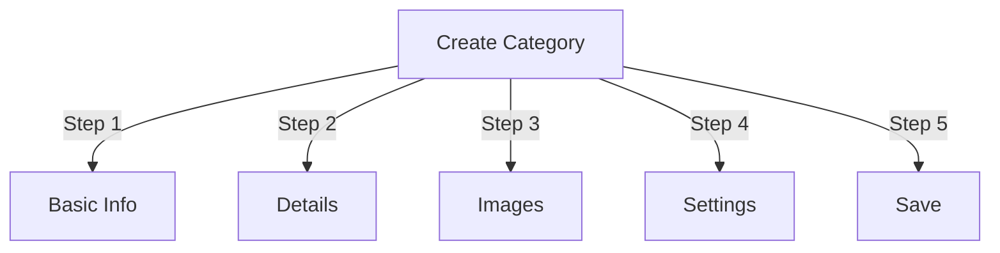

# 게시자에서 카테고리 관리

> 게시자 모듈에서 계층 생성, 구성 및 범주 관리에 대한 전체 가이드입니다.

---

## 카테고리 기본 사항

### 카테고리란 무엇입니까?

카테고리는 기사를 논리적 그룹으로 구성합니다.

```
Example Structure:

  News (Main Category)
    ├── Technology
    ├── Sports
    └── Entertainment

  Tutorials (Main Category)
    ├── Photography
    │   ├── Basics
    │   └── Advanced
    └── Writing
        └── Blogging
```

### 좋은 카테고리 구조의 이점

```
✓ Better user navigation
✓ Organized content
✓ Improved SEO
✓ Easier content management
✓ Better editorial workflow
```

---

## 접속 카테고리 관리

### 관리자 패널 탐색

```
Admin Panel
└── Modules
    └── Publisher
        └── Categories
            ├── Create New
            ├── Edit
            ├── Delete
            ├── Permissions
            └── Organize
```

### 빠른 액세스

1. **관리자**로 로그인
2. **관리자 → 모듈**로 이동합니다.
3. **게시자 → 관리**를 클릭합니다.
4. 왼쪽 메뉴에서 **카테고리**를 클릭하세요.

---

## 카테고리 만들기

### 카테고리 생성 양식



### 1단계: 기본 정보

#### 카테고리 이름

```
Field: Category Name
Type: Text input (required)
Max length: 100 characters
Uniqueness: Should be unique
Example: "Photography"
```

**가이드라인:**
- 서술적이고 단수 또는 복수로 일관되게 사용됨
- 대문자를 올바르게 사용함
- 특수문자는 피하세요
- 적당히 짧게 유지하세요

#### 카테고리 설명

```
Field: Description
Type: Textarea (optional)
Max length: 500 characters
Used in: Category listing pages, category blocks
```

**목적:**
- 카테고리 내용을 설명합니다.
- 카테고리 기사 위에 표시됩니다.
- 사용자가 범위를 이해하도록 돕습니다.
- SEO 메타 설명에 사용됩니다.

**예:**
```
"Photography tips, tutorials, and inspiration for
all skill levels. From composition basics to advanced
lighting techniques, master your craft."
```

### 2단계: 상위 카테고리

#### 계층 구조 만들기

```
Field: Parent Category
Type: Dropdown
Options: None (root), or existing categories
```

**계층 구조 예:**

```
Flat Structure:
  News
  Tutorials
  Reviews

Nested Structure:
  News
    Technology
    Business
    Sports
  Tutorials
    Photography
      Basics
      Advanced
    Writing
```

**하위 카테고리 만들기:**

1. **상위 카테고리** 드롭다운을 클릭합니다.
2. 상위 항목(예: '뉴스')을 선택하세요.
3. 카테고리명을 입력해주세요.
4. 저장
5. 새로운 카테고리가 하위 카테고리로 나타납니다.

### 3단계: 카테고리 이미지

#### 카테고리 이미지 업로드

```
Field: Category Image
Type: Image upload (optional)
Format: JPG, PNG, GIF, WebP
Max size: 5 MB
Recommended: 300x200 px (or your theme size)
```

**업로드하려면:**

1. **이미지 업로드** 버튼을 클릭하세요.
2. 컴퓨터에서 이미지를 선택하세요
3. 필요한 경우 자르기/크기 조정
4. **이 이미지 사용**을 클릭하세요.

**사용처:**
- 카테고리 목록 페이지
- 카테고리 블록 헤더
- 탐색경로(일부 테마)
- 소셜 미디어 공유

### 4단계: 카테고리 설정

#### 디스플레이 설정

```yaml
Status:
  - Enabled: Yes/No
  - Hidden: Yes/No (hidden from menus, still accessible)

Display Options:
  - Show description: Yes/No
  - Show image: Yes/No
  - Show article count: Yes/No
  - Show subcategories: Yes/No

Layout:
  - Items per page: 10-50
  - Display order: Date/Title/Author
  - Display direction: Ascending/Descending
```

#### 카테고리 권한

```yaml
Who Can View:
  - Anonymous: Yes/No
  - Registered: Yes/No
  - Specific groups: Configure per group

Who Can Submit:
  - Registered: Yes/No
  - Specific groups: Configure per group
  - Author must have: "submit articles" permission
```

### 5단계: SEO 설정

#### 메타 태그

```
Field: Meta Description
Type: Text (160 characters)
Purpose: Search engine description

Field: Meta Keywords
Type: Comma-separated list
Example: photography, tutorials, tips, techniques
```

#### URL 구성

```
Field: URL Slug
Type: Text
Auto-generated from category name
Example: "photography" from "Photography"
Can be customized before saving
```

### 카테고리 저장

1. 필수 필드를 모두 입력하세요.
   - 카테고리 이름 ✓
   - 설명(권장)
2. 선택사항: 이미지 업로드, SEO 설정
3. **카테고리 저장**을 클릭하세요.
4. 확인 메시지가 나타납니다.
5. 이제 카테고리를 사용할 수 있습니다

---

## 카테고리 계층

### 중첩 구조 만들기

```
Step-by-step example: Create News → Technology subcategory

1. Go to Categories admin
2. Click "Add Category"
3. Name: "News"
4. Parent: (leave blank - this is root)
5. Save
6. Click "Add Category" again
7. Name: "Technology"
8. Parent: "News" (select from dropdown)
9. Save
```

### 계층 트리 보기

```
Categories view shows tree structure:

📁 News
  📄 Technology
  📄 Sports
  📄 Entertainment
📁 Tutorials
  📄 Photography
    📄 Basics
    📄 Advanced
  📄 Writing
```

하위 카테고리를 표시하거나 숨기려면 확장 화살표를 클릭하세요.

### 카테고리 재구성

#### 카테고리 이동

1. 카테고리 목록으로 이동
2. 카테고리에서 **수정**을 클릭하세요.
3. **상위 카테고리** 변경
4. **저장**을 클릭하세요.
5. 카테고리가 새로운 위치로 이동되었습니다.

#### 카테고리 재정렬

가능한 경우 드래그 앤 드롭을 사용하세요.

1. 카테고리 목록으로 이동
2. 카테고리를 클릭하고 드래그하세요.
3. 새로운 위치로 이동
4. 주문이 자동으로 저장됩니다.

#### 카테고리 삭제

**옵션 1: 일시 삭제(숨기기)**

1. 카테고리 수정
2. **상태**를 비활성화로 설정합니다.
3. **저장**을 클릭합니다.
4. 카테고리가 숨겨졌지만 삭제되지는 않았습니다.

**옵션 2: 영구 삭제**

1. 카테고리 목록으로 이동
2. 카테고리에서 **삭제**를 클릭하세요.
3. 기사에 대한 작업을 선택합니다:
   ```
   ☐ Move articles to parent category
   ☐ Move articles to root (News)
   ☐ Delete all articles in category
   ```
4. 삭제 확인

---

## 카테고리 작업

### 카테고리 편집

1. **관리자 → 게시자 → 카테고리**로 이동합니다.
2. 카테고리에서 **수정**을 클릭하세요.
3. 필드 수정:
   - 이름
   - 설명
   - 상위 카테고리
   - 이미지
   - 설정
4. **저장**을 클릭하세요.

### 카테고리 권한 편집

1. 카테고리로 이동
2. 카테고리에서 **권한** 클릭(또는 카테고리 클릭 후 권한 클릭)
3. 그룹을 구성합니다.

```
For each group:
  ☐ View articles in this category
  ☐ Submit articles to this category
  ☐ Edit own articles
  ☐ Edit all articles
  ☐ Approve/Moderate articles
  ☐ Manage category
```

4. **권한 저장**을 클릭합니다.

### 카테고리 이미지 설정

**새 이미지 업로드:**

1. 카테고리 수정
2. **이미지 변경**을 클릭하세요.
3. 이미지 업로드 또는 선택
4. 자르기/크기 조정
5. **이미지 사용**을 클릭하세요.
6. **카테고리 저장**을 클릭하세요.

**이미지 제거:**

1. 카테고리 수정
2. **이미지 제거**를 클릭합니다(가능한 경우).
3. **카테고리 저장**을 클릭하세요.

---

## 카테고리 권한

### 권한 매트릭스

```
                 Anonymous  Registered  Editor  Admin
View category        ✓         ✓         ✓       ✓
Submit article       ✗         ✓         ✓       ✓
Edit own article     ✗         ✓         ✓       ✓
Edit all articles    ✗         ✗         ✓       ✓
Moderate articles    ✗         ✗         ✓       ✓
Manage category      ✗         ✗         ✗       ✓
```

### 카테고리 수준 권한 설정

#### 카테고리별 액세스 제어

1. **카테고리** 목록으로 이동
2. 카테고리를 선택하세요
3. **권한**을 클릭합니다.
4. 각 그룹에 대해 권한을 선택합니다.

```
Example: News category
  Anonymous:   View only
  Registered:  Submit articles
  Editors:     Approve articles
  Admins:      Full control
```

5. **저장**을 클릭하세요.

#### 필드 수준 권한

사용자가 보거나 편집할 수 있는 양식 필드를 제어합니다.

```
Example: Limit field visibility for Registered users

Registered users can see/edit:
  ✓ Title
  ✓ Description
  ✓ Content
  ✗ Author (auto-set to current user)
  ✗ Scheduled date (only editors)
  ✗ Featured (only admins)
```

**구성:**
- 카테고리 권한
- "현장 가시성" 섹션을 찾으세요.

---

## 카테고리 모범 사례

### 카테고리 구조

```
✓ Keep hierarchy 2-3 levels deep
✗ Don't create too many top-level categories
✗ Don't create categories with one article

✓ Use consistent naming (plural or singular)
✗ Don't use vague names ("Stuff", "Other")

✓ Create categories for articles that exist
✗ Don't create empty categories in advance
```

### 명명 지침

```
Good names:
  "Photography"
  "Web Development"
  "Travel Tips"
  "Business News"

Avoid:
  "Articles" (too vague)
  "Content" (redundant)
  "News&Updates" (inconsistent)
  "PHOTOGRAPHY STUFF" (formatting)
```

### 정리 팁

```
By Topic:
  News
    Technology
    Sports
    Entertainment

By Type:
  Tutorials
    Video
    Text
    Interactive

By Audience:
  For Beginners
  For Experts
  Case Studies

Geographic:
  North America
    United States
    Canada
  Europe
```

---

## 카테고리 블록

### 게시자 카테고리 차단

사이트에 카테고리 목록을 표시합니다.

1. **관리자 → 차단**으로 이동하세요.
2. **출판사 - 카테고리**를 찾습니다.
3. **수정**을 클릭하세요.
4. 구성:

```
Block Title: "News Categories"
Show subcategories: Yes/No
Show article count: Yes/No
Height: (pixels or auto)
```

5. **저장**을 클릭하세요.

### 카테고리 기사 블록

특정 카테고리의 최신 기사 표시:

1. **관리자 → 차단**으로 이동하세요.
2. **게시자 - 카테고리 기사**를 찾으세요.
3. **수정**을 클릭하세요.
4. 선택:

```
Category: News (or specific category)
Number of articles: 5
Show images: Yes/No
Show description: Yes/No
```

5. **저장**을 클릭하세요.

---

## 카테고리 분석

### 카테고리 통계 보기

카테고리 관리자로부터:

```
Each category shows:
  - Total articles: 45
  - Published: 42
  - Draft: 2
  - Pending approval: 1
  - Total views: 5,234
  - Latest article: 2 hours ago
```

### 카테고리 트래픽 보기

분석이 활성화된 경우:

1. 카테고리명을 클릭하세요.
2. **통계** 탭을 클릭하세요.
3. 보기:
   - 페이지 조회수
   - 인기 기사
   - 트래픽 동향
   - 사용된 검색어

---

## 카테고리 템플릿

### 카테고리 표시 사용자 정의

사용자 정의 템플릿을 사용하는 경우 각 범주는 다음을 재정의할 수 있습니다.

```
publisher_category.tpl
  ├── Category header
  ├── Category description
  ├── Category image
  ├── Article listing
  └── Pagination
```

**맞춤설정 방법:**

1. 템플릿 파일 복사
2. HTML/CSS 수정
3. 관리자에서 카테고리를 지정하세요
4. 카테고리는 맞춤 템플릿을 사용합니다.

---

## 일반적인 작업

### 뉴스 계층 구조 만들기

```
Admin → Publisher → Categories
1. Create "News" (parent)
2. Create "Technology" (parent: News)
3. Create "Sports" (parent: News)
4. Create "Entertainment" (parent: News)
```

### 카테고리 간 기사 이동

1. **기사** 관리자로 이동
2. 기사 선택(체크박스)
3. 일괄 작업 드롭다운에서 **"카테고리 변경"**을 선택합니다.
4. 새 카테고리 선택
5. **모두 업데이트**를 클릭합니다.

### 삭제하지 않고 카테고리 숨기기

1. 카테고리 수정
2. **상태** 설정: 비활성화/숨김
3. 저장
4. 메뉴에 표시되지 않는 카테고리(URL을 통해 여전히 접근 가능)

### 초안용 카테고리 생성

```
Best Practice:

Create "In Review" category
  ├── Purpose: Articles awaiting approval
  ├── Permissions: Hidden from public
  ├── Only admins/editors can see
  ├── Move articles here until approved
  └── Move to "News" when published
```

---

## 가져오기/내보내기 카테고리

### 수출 카테고리

가능한 경우:

1. **카테고리** 관리자로 이동하세요.
2. **내보내기**를 클릭합니다.
3. 형식 선택: CSV/JSON/XML
4. 파일 다운로드
5. 백업 저장됨

### 가져오기 카테고리

가능한 경우:

1. 카테고리별 파일 준비
2. **카테고리** 관리자로 이동하세요.
3. **가져오기**를 클릭합니다.
4. 파일 업로드
5. 업데이트 전략을 선택합니다:
   - 새로 만들기
   - 기존 업데이트
   - 모두 교체
6. **가져오기**를 클릭합니다.

---

## 문제 해결 카테고리

### 문제: 하위 카테고리가 표시되지 않음

**해결책:**
```
1. Verify parent category status is "Enabled"
2. Check permissions allow viewing
3. Verify subcategories have status "Enabled"
4. Clear cache: Admin → Tools → Clear Cache
5. Check theme shows subcategories
```

### 문제: 카테고리를 삭제할 수 없습니다.

**해결책:**
```
1. Category must have no articles
2. Move or delete articles first:
   Admin → Articles
   Select articles in category
   Change category to another
3. Then delete empty category
4. Or choose "move articles" option when deleting
```

### 문제: 카테고리 이미지가 표시되지 않습니다.

**해결책:**
```
1. Verify image uploaded successfully
2. Check image file format (JPG, PNG)
3. Verify upload directory permissions
4. Check theme displays category images
5. Try re-uploading image
6. Clear browser cache
```

### 문제: 권한이 적용되지 않습니다.

**해결책:**
```
1. Check group permissions in Category
2. Check global Publisher permissions
3. Check user belongs to configured group
4. Clear session cache
5. Log out and log back in
6. Check permission modules installed
```

---

## 카테고리 모범 사례 체크리스트

카테고리를 배포하기 전에:

- [ ] 계층 구조는 2-3 수준 깊이입니다.
- [ ] 각 카테고리에는 5개 이상의 기사가 있습니다.
- [ ] 카테고리 이름이 일관성이 있습니다.
- [ ] 권한이 적절합니다.
- [ ] 카테고리 이미지가 최적화되었습니다.
- [ ] 설명이 완료되었습니다.
- [ ] SEO 메타데이터가 입력됨
- [ ] URL은 친숙합니다.
- [ ] 프런트엔드에서 테스트된 카테고리
- [ ] 문서가 업데이트되었습니다.

---

## 관련 가이드

- 기사 작성
- 권한 관리
- 모듈 구성
- 설치 가이드

---

## 다음 단계

- 카테고리별로 기사 만들기
- 권한 구성
- 사용자 정의 템플릿으로 사용자 정의

---

#출판사 #카테고리 #조직 #계층 구조 #관리 #xoops
