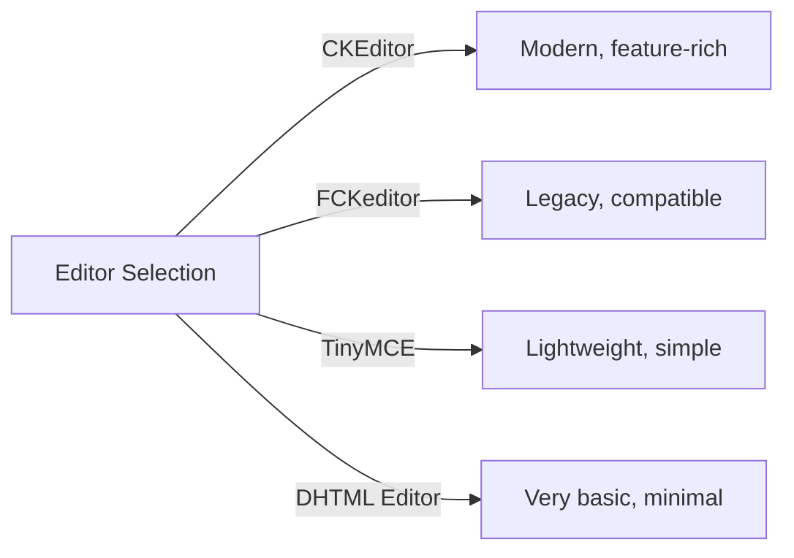
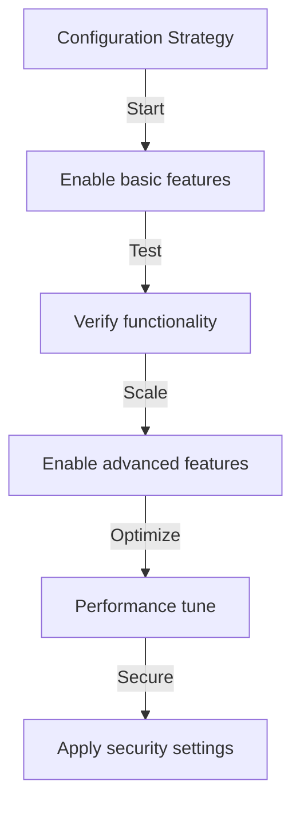

# 게시자 기본 구성

> XOOPS 설치에 대한 게시자 모듈 설정, 기본 설정 및 일반 옵션을 구성합니다.

---

## 구성 액세스

### 관리자 패널 탐색

```
XOOPS Admin Panel
└── Modules
    └── Publisher
        ├── Preferences
        ├── Settings
        └── Configuration
```

1. **관리자**로 로그인
2. **관리자 패널 → 모듈**로 이동합니다.
3. **Publisher** 모듈 찾기
4. **기본 설정** 또는 **관리** 링크를 클릭하세요.

---

## 일반 설정

### 액세스 구성

```
Admin Panel → Modules → Publisher
```

다음 옵션을 보려면 **기어 아이콘** 또는 **설정**을 클릭하세요.

#### 표시 옵션

| 설정 | 옵션 | 기본값 | 설명 |
|---------|---------|---------|-------------|
| **페이지당 항목 수** | 5-50 | 10 | 목록에 표시된 기사 |
| **탐색경로 표시** | 예/아니요 | 예 | 내비게이션 트레일 표시 |
| **페이징 사용** | 예/아니요 | 예 | 긴 목록 페이지 매기기 |
| **날짜 표시** | 예/아니요 | 예 | 기사 날짜 표시 |
| **카테고리 표시** | 예/아니요 | 예 | 기사 카테고리 보기 |
| **작성자 표시** | 예/아니요 | 예 | 기사 작성자 표시 |
| **조회수 표시** | 예/아니요 | 예 | 기사 조회수 표시 |

**구성 예:**

```yaml
Items Per Page: 15
Show Breadcrumb: Yes
Use Paging: Yes
Show Date: Yes
Show Category: Yes
Show Author: Yes
Show Views: Yes
```

#### 작성자 옵션

| 설정 | 기본값 | 설명 |
|---------|---------|-------------|
| **저자 이름 표시** | 예 | 실명 또는 사용자 이름 표시 |
| **사용자 이름 사용** | 아니요 | 이름 대신 사용자 이름 표시 |
| **작성자 이메일 표시** | 아니요 | 작성자 연락처 이메일 표시 |
| **작성자 아바타 표시** | 예 | 사용자 아바타 표시 |

---

## 편집기 구성

### WYSIWYG 편집기 선택

게시자는 여러 편집기를 지원합니다.

#### 사용 가능한 편집자



### CKEditor(권장)

**최적의 대상:** 대부분의 사용자, 최신 브라우저, 전체 기능

1. **기본 설정**으로 이동합니다.
2. **에디터** 설정: CKEditor
3. 옵션 구성:

```
Editor: CKEditor 4.x
Toolbar: Full
Height: 400px
Width: 100%
Remove plugins: []
Add plugins: [mathjax, codesnippet]
```

### FCK편집기

**최적의 용도:** 호환성, 이전 시스템

```
Editor: FCKeditor
Toolbar: Default
Custom config: (optional)
```

### 타이니MCE

**최적의 용도:** 최소 공간, 기본 편집

```
Editor: TinyMCE
Plugins: [paste, table, link, image]
Toolbar: minimal
```

---

## 파일 및 업로드 설정

### 업로드 디렉터리 구성

```
Admin → Publisher → Preferences → Upload Settings
```

#### 파일 형식 설정

```yaml
Allowed File Types:
  Images:
    - jpg
    - jpeg
    - gif
    - png
    - webp
  Documents:
    - pdf
    - doc
    - docx
    - xls
    - xlsx
    - ppt
    - pptx
  Archives:
    - zip
    - rar
    - 7z
  Media:
    - mp3
    - mp4
    - webm
    - mov
```

#### 파일 크기 제한

| 파일 유형 | 최대 크기 | 메모 |
|-----------|----------|-------|
| **이미지** | 5MB | 이미지 파일별 |
| **문서** | 10MB | PDF, 오피스 파일 |
| **미디어** | 50MB | 비디오/오디오 파일 |
| **모든 파일** | 100MB | 업로드당 총계 |

**구성:**

```
Max Image Upload Size: 5 MB
Max Document Upload Size: 10 MB
Max Media Upload Size: 50 MB
Total Upload Size: 100 MB
Max Files per Article: 5
```

### 이미지 크기 조정

게시자는 일관성을 위해 이미지 크기를 자동으로 조정합니다.

```yaml
Thumbnail Size:
  Width: 150
  Height: 150
  Mode: Crop/Resize

Category Image Size:
  Width: 300
  Height: 200
  Mode: Resize

Article Featured Image:
  Width: 600
  Height: 400
  Mode: Resize
```

---

## 댓글 및 상호작용 설정

### 댓글 구성

```
Preferences → Comments Section
```

#### 댓글 옵션

```yaml
Allow Comments:
  - Enabled: Yes/No
  - Default: Yes
  - Per-article override: Yes

Comment Moderation:
  - Moderate comments: Yes/No
  - Moderate guest comments only: Yes/No
  - Spam filter: Enabled
  - Max comments per day: (unlimited)

Comment Display:
  - Display format: Threaded/Flat
  - Comments per page: 10
  - Date format: Full date/Time ago
  - Show comment count: Yes/No
```

### 등급 구성

```yaml
Allow Ratings:
  - Enabled: Yes/No
  - Default: Yes
  - Per-article override: Yes

Rating Options:
  - Rating scale: 5 stars (default)
  - Allow user to rate own: No
  - Show average rating: Yes
  - Show rating count: Yes
```

---

## SEO 및 URL 설정

### 검색 엔진 최적화

```
Preferences → SEO Settings
```

#### URL 구성

```yaml
SEO URLs:
  - Enabled: No (set to Yes for SEO URLs)
  - URL rewriting: None/Apache mod_rewrite/IIS rewrite

URL Format:
  - Category: /category/news
  - Article: /article/welcome-to-site
  - Archive: /archive/2024/01

Meta Description:
  - Auto-generate: Yes
  - Max length: 160 characters

Meta Keywords:
  - Auto-generate: Yes
  - From: Article tags, title
```

### SEO URL 활성화(고급)

**전제조건:**
- `mod_rewrite`이 활성화된 Apache
- `.htaccess` 지원 활성화

**구성 단계:**

1. **환경설정 → SEO 설정**으로 이동하세요.
2. **SEO URL** 설정: 예
3. **URL 재작성** 설정: Apache mod_rewrite
4. `.htaccess` 파일이 게시자 폴더에 있는지 확인하세요.

**.htaccess 구성:**

```apache
<IfModule mod_rewrite.c>
    RewriteEngine On
    RewriteBase /modules/publisher/

    # Category rewrites
    RewriteRule ^category/([0-9]+)-(.*)\.html$ index.php?op=showcategory&categoryid=$1 [L,QSA]

    # Article rewrites
    RewriteRule ^article/([0-9]+)-(.*)\.html$ index.php?op=showitem&itemid=$1 [L,QSA]

    # Archive rewrites
    RewriteRule ^archive/([0-9]+)/([0-9]+)/$ index.php?op=archive&year=$1&month=$2 [L,QSA]
</IfModule>
```

---

## 캐시 및 성능

### 캐싱 구성

```
Preferences → Cache Settings
```

```yaml
Enable Caching:
  - Enabled: Yes
  - Cache type: File (or Memcache)

Cache Lifetime:
  - Category lists: 3600 seconds (1 hour)
  - Article lists: 1800 seconds (30 minutes)
  - Single article: 7200 seconds (2 hours)
  - Recent articles block: 900 seconds (15 minutes)

Cache Clear:
  - Manual clear: Available in admin
  - Auto-clear on article save: Yes
  - Clear on category change: Yes
```

### 캐시 지우기

**수동 캐시 지우기:**

1. **관리자 → 게시자 → 도구**로 이동합니다.
2. **캐시 지우기**를 클릭합니다.
3. 삭제할 캐시 유형을 선택하세요.
   - [ ] 카테고리 캐시
   - [ ] 기사 캐시
   - [ ] 블록 캐시
   - [ ] 모든 캐시
4. **선택 항목 지우기**를 클릭합니다.

**명령줄:**

```bash
# Clear all Publisher cache
php /path/to/xoops/admin/cache_manage.php publisher

# Or directly delete cache files
rm -rf /path/to/xoops/var/cache/publisher/*
```

---

## 알림 및 작업 흐름

### 이메일 알림

```
Preferences → Notifications
```

```yaml
Notify Admin on New Article:
  - Enabled: Yes
  - Recipient: Admin email
  - Include summary: Yes

Notify Moderators:
  - Enabled: Yes
  - On new submission: Yes
  - On pending articles: Yes

Notify Author:
  - On approval: Yes
  - On rejection: Yes
  - On comment: No (optional)
```

### 제출 작업 흐름

```yaml
Require Approval:
  - Enabled: Yes
  - Editor approval: Yes
  - Admin approval: No

Draft Save:
  - Auto-save interval: 60 seconds
  - Save local versions: Yes
  - Revision history: Last 5 versions
```

---

## 콘텐츠 설정

### 게시 기본값

```
Preferences → Content Settings
```

```yaml
Default Article Status:
  - Draft/Published: Draft
  - Featured by default: No
  - Auto-publish time: None

Default Visibility:
  - Public/Private: Public
  - Show on front page: Yes
  - Show in categories: Yes

Scheduled Publishing:
  - Enabled: Yes
  - Allow per-article: Yes

Content Expiration:
  - Enabled: No
  - Auto-archive old: No
  - Archive after days: (unlimited)
```

### WYSIWYG 콘텐츠 옵션

```yaml
Allow HTML:
  - In articles: Yes
  - In comments: No

Allow Embedded Media:
  - Videos (iframe): Yes
  - Images: Yes
  - Plugins: No

Content Filtering:
  - Strip tags: No
  - XSS filter: Yes (recommended)
```

---

## 검색 엔진 설정

### 검색 통합 구성

```
Preferences → Search Settings
```

```yaml
Enable Article Indexing:
  - Include in site search: Yes
  - Index type: Full text/Title only

Search Options:
  - Search in titles: Yes
  - Search in content: Yes
  - Search in comments: Yes

Meta Tags:
  - Auto generate: Yes
  - OG tags (social): Yes
  - Twitter cards: Yes
```

---

## 고급 설정

### 디버그 모드(개발 전용)

```
Preferences → Advanced
```

```yaml
Debug Mode:
  - Enabled: No (only for development!)

Development Features:
  - Show SQL queries: No
  - Log errors: Yes
  - Error email: admin@example.com
```

### 데이터베이스 최적화

```
Admin → Tools → Optimize Database
```

```bash
# Manual optimization
mysql> OPTIMIZE TABLE publisher_items;
mysql> OPTIMIZE TABLE publisher_categories;
mysql> OPTIMIZE TABLE publisher_comments;
```

---

## 모듈 맞춤화

### 테마 템플릿

```
Preferences → Display → Templates
```

템플릿 세트 선택:
- 기본값
- 클래식
- 현대
- 어두운
- 맞춤형

각 템플릿은 다음을 제어합니다.
- 기사 레이아웃
- 카테고리 목록
- 아카이브 디스플레이
- 코멘트 표시

---

## 구성 팁

### 모범 사례



1. **간단하게 시작** - 핵심 기능을 먼저 활성화합니다.
2. **각 변경 사항 테스트** - 계속 진행하기 전에 확인
3. **캐싱 활성화** - 성능 향상
4. **먼저 백업** - 주요 변경 전 설정 내보내기
5. **로그 모니터링** - 정기적으로 오류 로그를 확인하세요.

### 성능 최적화

```yaml
For Better Performance:
  - Enable caching: Yes
  - Cache lifetime: 3600 seconds
  - Limit items per page: 10-15
  - Compress images: Yes
  - Minify CSS/JS: Yes (if available)
```

### 보안 강화

```yaml
For Better Security:
  - Moderate comments: Yes
  - Disable HTML in comments: Yes
  - XSS filtering: Yes
  - File type whitelist: Strict
  - Max upload size: Reasonable limit
```

---

## 설정 내보내기/가져오기

### 백업 구성

```
Admin → Tools → Export Settings
```

**현재 구성을 백업하려면:**

1. **구성 내보내기**를 클릭합니다.
2. 다운로드한 `.cfg` 파일을 저장합니다.
3. 안전한 장소에 보관하세요.

**복원하려면:**

1. **구성 가져오기**를 클릭합니다.
2. `.cfg` 파일을 선택하세요.
3. **복원**을 클릭하세요.

---

## 관련 구성 가이드

- 카테고리 관리
- 기사 작성
- 권한 구성
- 설치 가이드

---

## 문제 해결 구성

### 설정이 저장되지 않습니다

**해결책:**
1. `/var/config/`의 디렉터리 권한을 확인하세요.
2. PHP 쓰기 액세스 확인
3. PHP 오류 로그에서 문제를 확인하세요.
4. 브라우저 캐시를 지우고 다시 시도하세요.

### 편집기가 표시되지 않음

**해결책:**
1. 편집기 플러그인이 설치되어 있는지 확인하세요.
2. XOOPS 편집기 구성을 확인하세요.
3. 다른 편집기 옵션을 사용해 보세요
4. 브라우저 콘솔에서 JavaScript 오류를 확인하세요.

### 성능 문제

**해결책:**
1. 캐싱 활성화
2. 페이지당 항목 줄이기
3. 이미지 압축
4. 데이터베이스 최적화 확인
5. 느린 쿼리 로그 검토

---

## 다음 단계

- 그룹 권한 구성
- 첫 번째 기사 만들기
- 카테고리 설정
- 맞춤 템플릿 검토

---

#publisher #configuration #preferences #settings #xoops
