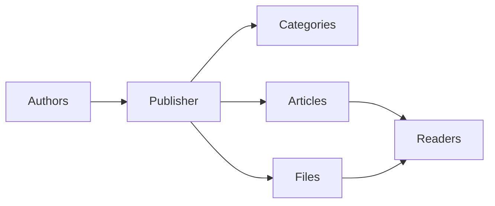
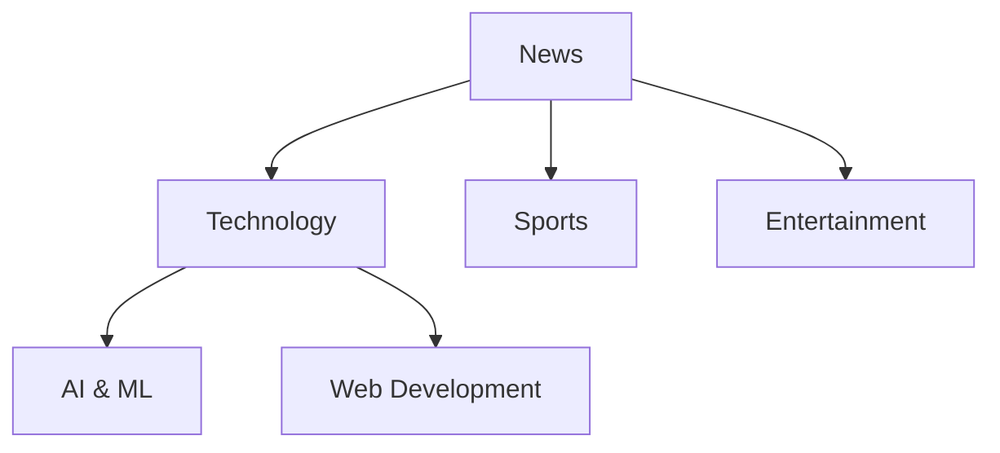
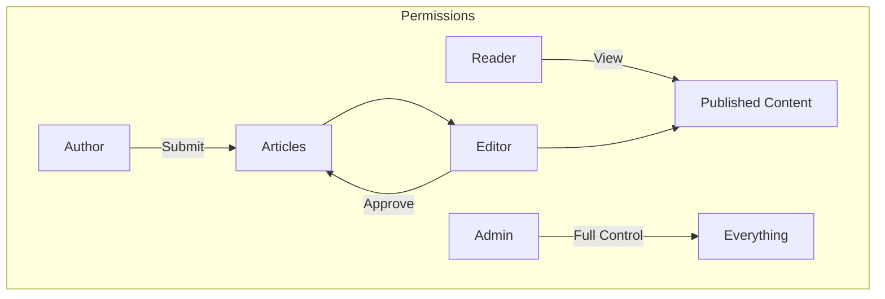
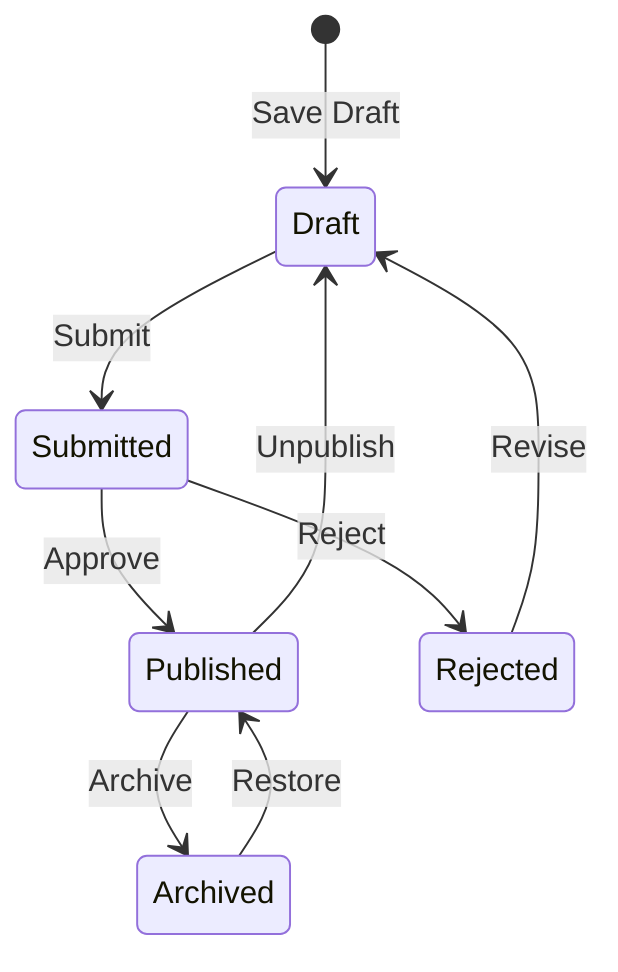

# 게시자 시작하기

> 게시자 뉴스/블로그 모듈 설정 및 사용에 대한 단계별 가이드입니다.

---

## 퍼블리셔란 무엇인가요?

게시자는 다음을 위해 설계된 XOOPS용 최고의 콘텐츠 관리 모듈입니다.

- **뉴스 사이트** - 카테고리가 포함된 기사 게시
- **블로그** - 개인 또는 여러 작성자의 블로그``
- **문서화** - 체계화된 지식 기반
- **콘텐츠 포털** - 혼합 미디어 콘텐츠



---

## 빠른 설정

### 1단계: 게시자 설치

1. [GitHub](https://github.com/XoopsModules25x/publisher)에서 다운로드
2. `modules/publisher/`에 업로드
3. 관리자 → 모듈 → 설치로 이동합니다.

### 2단계: 카테고리 생성



1. 관리자 → 퍼블리셔 → 카테고리
2. '카테고리 추가'를 클릭하세요.
3. 다음 내용을 입력하세요.
   - **이름**: 카테고리 이름
   - **설명**: 이 카테고리에 포함된 내용
   - **이미지**: 선택 카테고리 이미지
4. 권한 설정(제출/조회 가능한 사람)
5. 저장

### 3단계: 설정 구성

1. 관리자 → 게시자 → 환경설정
2. 구성할 주요 설정:

| 설정 | 추천 | 설명 |
|---------|-------------|-------------|
| 페이지당 항목 | 10-20 | 색인에 관한 기사 |
| 편집자 | TinyMCE/CK에디터 | 리치 텍스트 편집기 |
| 평가 허용 | 예 | 독자 피드백 |
| 댓글 허용 | 예 | 토론 |
| 자동 승인 | 아니요 | 편집 통제 |

### 4단계: 첫 번째 기사 만들기

1. 메인메뉴 → 출판사 → 기사제출
2. 다음 양식을 작성하세요.
   - **제목**: 기사 헤드라인
   - **카테고리**: 그것이 속한 곳
   - **요약**: 간단한 설명
   - **본문**: 전체 기사 내용
3. 선택적 요소를 추가합니다.
   - 주요 이미지
   - 파일첨부
   - SEO 설정
4. 검토를 위해 제출하거나 게시하세요.

---

## 사용자 역할



### 독자
- 게시된 기사 보기
- 평가 및 의견
- 콘텐츠 검색

### 작성자
- 새 기사 제출
- 자신의 기사 편집
- 파일 첨부

### 편집자
- 제출물 승인/거부
- 기사 편집
- 카테고리 관리

### 관리자
- 전체 모듈 제어
- 설정 구성
- 권한 관리

---

## 기사 쓰기

### 기사 편집자

```
┌─────────────────────────────────────────────────────┐
│ Title: [Your Article Title                        ] │
├─────────────────────────────────────────────────────┤
│ Category: [Select Category          ▼]              │
├─────────────────────────────────────────────────────┤
│ Summary:                                            │
│ ┌─────────────────────────────────────────────────┐ │
│ │ Brief description shown in listings...          │ │
│ └─────────────────────────────────────────────────┘ │
├─────────────────────────────────────────────────────┤
│ Body:                                               │
│ ┌─────────────────────────────────────────────────┐ │
│ │ [B] [I] [U] [Link] [Image] [Code]               │ │
│ ├─────────────────────────────────────────────────┤ │
│ │                                                  │ │
│ │ Full article content goes here...               │ │
│ │                                                  │ │
│ └─────────────────────────────────────────────────┘ │
├─────────────────────────────────────────────────────┤
│ [Submit] [Preview] [Save Draft]                     │
└─────────────────────────────────────────────────────┘
```

### 모범 사례

1. **강력한 제목** - 명확하고 눈길을 끄는 헤드라인
2. **좋은 요약** - 독자가 클릭하도록 유도
3. **구조화된 콘텐츠** - 제목, 목록, 이미지 사용
4. **적절한 분류** - 독자가 콘텐츠를 찾는 데 도움이 됩니다.
5. **SEO 최적화** - 제목과 내용의 키워드

---

## 콘텐츠 관리

### 기사 상태 흐름



### 상태 설명

| 상태 | 설명 |
|--------|-------------|
| 초안 | 진행 중인 작업 |
| 제출됨 | 검토 대기 중 |
| 게시됨 | 현장 라이브 |
| 만료됨 | 지난 유효기간 |
| 거부됨 | 개정이 필요함 |
| 보관됨 | 목록에서 제거됨 |

---

## 탐색

### 게시자에 액세스 중

- **메인 메뉴** → 출판사
- **직접 URL**: `yoursite.com/modules/publisher/`

### 주요 페이지

| 페이지 | URL | 목적 |
|------|-----|---------|
| 색인 | `/modules/publisher/` | 기사 목록 |
| 카테고리 | `/modules/publisher/category.php?id=X` | 카테고리 기사 |
| 기사 | `/modules/publisher/item.php?itemid=X` | 단일 기사 |
| 제출 | `/modules/publisher/submit.php` | 새 기사 |
| 검색 | `/modules/publisher/search.php` | 기사 찾기 |

---

## 블록

게시자는 사이트에 대해 여러 블록을 제공합니다.

### 최근 기사
최근 게시된 기사를 표시합니다.

### 카테고리 메뉴
카테고리별 탐색

### 인기 기사
가장 많이 본 콘텐츠

### 무작위 기사
무작위 콘텐츠 쇼케이스

### 스포트라이트
주요 기사

---

## 관련 문서

- 기사 작성 및 편집
- 카테고리 관리
- 게시자 확장

---

#xoops #출판사 #사용자 가이드 #시작하기 #cms
