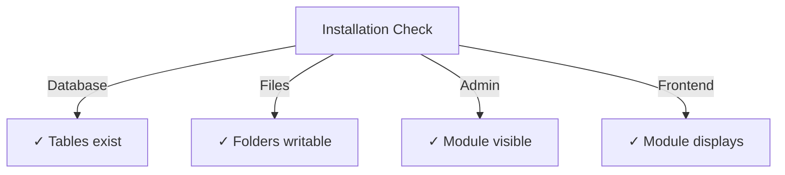

# 퍼블리셔 설치 가이드

> XOOPS CMS용 게시자 모듈 설치 및 구성에 대한 전체 지침입니다.

---

## 시스템 요구사항

### 최소 요구 사항

| 요구사항 | 버전 | 메모 |
|-------------|---------|-------|
| 웁스 | 2.5.10+ | 핵심 CMS 플랫폼 |
| PHP | 7.1+ | PHP 8.x 권장 |
| MySQL | 5.7+ | 데이터베이스 서버 |
| 웹 서버 | Apache/Nginx | 재작성 지원 |

### PHP 확장

```
- PDO (PHP Data Objects)
- pdo_mysql or mysqli
- mb_string (multibyte strings)
- curl (for external content)
- json
- gd (image processing)
```

### 디스크 공간

- **모듈 파일**: ~5MB
- **캐시 디렉터리**: 50MB 이상 권장
- **업로드 디렉터리**: 콘텐츠에 필요한 경우

---

## 설치 전 체크리스트

Publisher를 설치하기 전에 다음을 확인하십시오.

- [ ] XOOPS 코어가 설치되어 실행 중입니다.
- [ ] 관리자 계정에는 모듈 관리 권한이 있습니다.
- [ ] 데이터베이스 백업이 생성되었습니다.
- [ ] 파일 권한은 `/modules/` 디렉토리에 대한 쓰기 액세스를 허용합니다.
- [ ] PHP 메모리 제한은 최소 128MB입니다.
- [ ] 파일 업로드 크기 제한이 적절합니다(최소 10MB).

---

## 설치 단계

### 1단계: 게시자 다운로드

#### 옵션 A: GitHub에서(권장)

```bash
# Navigate to modules directory
cd /path/to/xoops/htdocs/modules/

# Clone the repository
git clone https://github.com/XoopsModules25x/publisher.git

# Verify download
ls -la publisher/
```

#### 옵션 B: 수동 다운로드

1. [GitHub 게시자 릴리스](https://github.com/XoopsModules25x/publisher/releases)를 방문하세요.
2. 최신 `.zip` 파일을 다운로드하세요.
3. `modules/publisher/`으로 추출합니다.

### 2단계: 파일 권한 설정

```bash
# Set proper ownership
chown -R www-data:www-data /path/to/xoops/htdocs/modules/publisher

# Set directory permissions (755)
find publisher -type d -exec chmod 755 {} \;

# Set file permissions (644)
find publisher -type f -exec chmod 644 {} \;

# Make scripts executable
chmod 755 publisher/admin/index.php
chmod 755 publisher/index.php
```

### 3단계: XOOPS 관리자를 통해 설치

1. **XOOPS Admin Panel**에 관리자로 로그인합니다.
2. **시스템 → 모듈**로 이동합니다.
3. **모듈 설치**를 클릭합니다.
4. 목록에서 **출판사**를 찾습니다.
5. **설치** 버튼을 클릭하세요.
6. 설치가 완료될 때까지 기다립니다(생성된 데이터베이스 테이블 표시).

```
Installation Progress:
✓ Tables created
✓ Configuration initialized
✓ Permissions set
✓ Cache cleared
Installation Complete!
```

---

## 초기 설정

### 1단계: 게시자 관리에 액세스

1. **관리자 패널 → 모듈**로 이동합니다.
2. **Publisher** 모듈 찾기
3. **관리자** 링크를 클릭하세요.
4. 이제 게시자 관리에 들어왔습니다.

### 2단계: 모듈 기본 설정 구성

1. 왼쪽 메뉴에서 **환경설정**을 클릭하세요.
2. 기본 설정을 구성합니다:

```
General Settings:
- Editor: Select your WYSIWYG editor
- Items per page: 10
- Show breadcrumb: Yes
- Allow comments: Yes
- Allow ratings: Yes

SEO Settings:
- SEO URLs: No (enable later if needed)
- URL rewriting: None

Upload Settings:
- Max upload size: 5 MB
- Allowed file types: jpg, png, gif, pdf, doc, docx
```

3. **설정 저장**을 클릭합니다.

### 3단계: 첫 번째 카테고리 생성

1. 왼쪽 메뉴에서 **카테고리**를 클릭하세요.
2. **카테고리 추가**를 클릭하세요.
3. 양식을 작성하십시오:

```
Category Name: News
Description: Latest news and updates
Image: (optional) Upload category image
Parent Category: (leave blank for top-level)
Status: Enabled
```

4. **카테고리 저장**을 클릭하세요.

### 4단계: 설치 확인

다음 지표를 확인하세요.



#### 데이터베이스 확인

```bash
mysql -u xoops_user -p xoops_database
mysql> SHOW TABLES LIKE 'publisher%';

# Should show tables:
# - publisher_categories
# - publisher_items
# - publisher_comments
# - publisher_files
```

#### 프런트엔드 확인

1. XOOPS 홈페이지를 방문하세요.
2. **Publisher** 또는 **News** 블록을 찾습니다.
3. 최근 기사를 표시해야 합니다.

---

## 설치 후 구성

### 에디터 선택

게시자는 여러 WYSIWYG 편집기를 지원합니다.

| 편집자 | 장점 | 단점 |
|--------|------|------|
| FCK편집기 | 풍부한 기능 | 더 오래되고 더 커짐 |
| CK에디터 | 현대 표준 | 구성 복잡성 |
| 타이니엠씨 | 경량 | 제한된 기능 |
| DHTML 편집기 | 기본 | 매우 기본적 |

**편집기를 변경하려면:**

1. **기본 설정**으로 이동합니다.
2. **편집기** 설정으로 스크롤합니다.
3. 드롭다운에서 선택
4. 저장 및 테스트

### 디렉토리 설정 업로드

```bash
# Create upload directories
mkdir -p /path/to/xoops/uploads/publisher/
mkdir -p /path/to/xoops/uploads/publisher/categories/
mkdir -p /path/to/xoops/uploads/publisher/images/
mkdir -p /path/to/xoops/uploads/publisher/files/

# Set permissions
chmod 755 /path/to/xoops/uploads/publisher/
chmod 755 /path/to/xoops/uploads/publisher/*
```

### 이미지 크기 구성

기본 설정에서 축소판 크기를 설정합니다.

```
Category image size: 300 x 200 px
Article image size: 600 x 400 px
Thumbnail size: 150 x 100 px
```

---

## 설치 후 단계

### 1. 그룹 권한 설정

1. 관리자 메뉴에서 **권한**으로 이동합니다.
2. 그룹에 대한 액세스를 구성합니다.
   - 익명: 보기만 가능
   - 등록 사용자: 기사 제출
   - 편집자: 기사 승인/수정
   - 관리자: 전체 접근 권한

### 2. 모듈 가시성 구성

1. XOOPS 관리자의 **블록**으로 이동합니다.
2. 게시자 블록 찾기:
   - 출판사 - 최신 기사
   - 출판사 - 카테고리
   - 출판사 - 아카이브
3. 페이지별 블록 가시성 구성

### 3. 테스트 콘텐츠 가져오기(선택 사항)

테스트를 위해 샘플 기사를 가져옵니다.

1. **게시자 관리 → 가져오기**로 이동합니다.
2. **샘플 콘텐츠**를 선택하세요.
3. **가져오기**를 클릭합니다.

### 4. SEO URL 활성화(선택 사항)

검색하기 쉬운 URL의 경우:

1. **기본 설정**으로 이동합니다.
2. **SEO URL** 설정: 예
3. **.htaccess** 재작성을 활성화합니다.
4. `.htaccess` 파일이 게시자 폴더에 있는지 확인하세요.

```apache
# .htaccess example
<IfModule mod_rewrite.c>
    RewriteEngine On
    RewriteBase /modules/publisher/
    RewriteRule ^category/([0-9]+)-(.*)\.html$ index.php?op=showcategory&categoryid=$1 [L]
    RewriteRule ^article/([0-9]+)-(.*)\.html$ index.php?op=showitem&itemid=$1 [L]
</IfModule>
```

---

## 설치 문제 해결

### 문제: 모듈이 관리자에 표시되지 않습니다.

**해결책:**
```bash
# Check file permissions
ls -la /path/to/xoops/modules/publisher/

# Check xoops_version.php exists
ls /path/to/xoops/modules/publisher/xoops_version.php

# Verify PHP syntax
php -l /path/to/xoops/modules/publisher/xoops_version.php
```

### 문제: 데이터베이스 테이블이 생성되지 않았습니다.

**해결책:**
1. MySQL 사용자에게 CREATE TABLE 권한이 있는지 확인하십시오.
2. 데이터베이스 오류 로그를 확인하십시오.
   ```bash
   mysql> SHOW WARNINGS;
   ```
3. SQL을 수동으로 가져옵니다.
   ```bash
   mysql -u user -p database < modules/publisher/sql/mysql.sql
   ```

### 문제: 파일 업로드 실패

**해결책:**
```bash
# Check directory exists and is writable
stat /path/to/xoops/uploads/publisher/

# Fix permissions
chmod 777 /path/to/xoops/uploads/publisher/

# Verify PHP settings
php -i | grep upload_max_filesize
```

### 문제: '페이지를 찾을 수 없음' 오류

**해결책:**
1. `.htaccess` 파일이 있는지 확인하세요.
2. Apache `mod_rewrite`이 활성화되어 있는지 확인합니다.
   ```bash
   a2enmod rewrite
   systemctl restart apache2
   ```
3. Apache 구성에서 `AllowOverride All`을 확인하세요.

---

## 이전 버전에서 업그레이드

### 게시자 1.x에서 2.x로

1. **현재 설치 백업:**
   ```bash
   cp -r modules/publisher/ modules/publisher-backup/
   mysqldump -u user -p database > publisher-backup.sql
   ```

2. **Publisher 2.x 다운로드**

3. **파일 덮어쓰기:**
   ```bash
   rm -rf modules/publisher/
   unzip publisher-2.0.zip -d modules/
   ```

4. **업데이트 실행:**
   - **관리자 → 게시자 → 업데이트**로 이동합니다.
   - **데이터베이스 업데이트**를 클릭하세요.
   - 완료될 때까지 기다리기

5. **확인:**
   - 모든 기사가 올바르게 표시되는지 확인
   - 권한이 손상되지 않았는지 확인하세요.
   - 테스트 파일 업로드

---

## 보안 고려 사항

### 파일 권한

```
- Core files: 644 (readable by web server)
- Directories: 755 (browseable by web server)
- Upload directories: 755 or 777
- Config files: 600 (not readable by web)
```

### 민감한 파일에 대한 직접 액세스 비활성화

업로드 디렉터리에 `.htaccess`을 만듭니다.

```apache
<FilesMatch "\.(php|phtml|php3|php4|php5|phtml)$">
    Deny from all
</FilesMatch>
```

### 데이터베이스 보안

```bash
# Use strong password
ALTER USER 'publisher_user'@'localhost' IDENTIFIED BY 'strong_password_here';

# Grant minimal permissions
GRANT SELECT, INSERT, UPDATE, DELETE ON publisher_db.* TO 'publisher_user'@'localhost';
FLUSH PRIVILEGES;
```

---

## 확인 체크리스트

설치 후 다음을 확인하십시오.

- [ ] 모듈이 관리 모듈 목록에 나타납니다.
- [ ] 게시자 관리 섹션에 액세스할 수 있습니다.
- [ ] 카테고리 생성 가능
- [ ] 기사를 작성할 수 있습니다.
- [ ] 기사가 프런트엔드에 표시됩니다.
- [ ] 파일 업로드 작업
- [ ] 이미지가 올바르게 표시됩니다.
- [ ] 권한이 올바르게 적용되었습니다.
- [ ] 데이터베이스 테이블이 생성되었습니다.
- [ ] 캐시 디렉토리에 쓰기 가능

---

## 다음 단계

성공적으로 설치한 후:

1. 기본 구성 가이드 읽기
2. 첫 번째 기사 만들기
3. 그룹 권한 설정
4. 카테고리 관리 검토

---

## 지원 및 리소스

- **GitHub 문제**: [게시자 문제](https://github.com/XoopsModules25x/publisher/issues)
- **XOOPS 포럼**: [커뮤니티 지원](https://www.xoops.org/modules/newbb/)
- **GitHub Wiki**: [설치 도움말](https://github.com/XoopsModules25x/publisher/wiki)

---

#publisher #installation #setup #xoops #module #configuration
