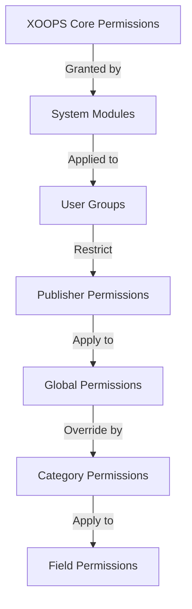

# 게시자 권한 설정

> 게시자에서 그룹 권한 구성, 액세스 제어 및 사용자 액세스 관리에 대한 전체 가이드입니다.

---

## 권한 기본 사항

### 권한이란 무엇입니까?

권한은 다양한 사용자 그룹이 Publisher에서 수행할 수 있는 작업을 제어합니다.

```
Who can:
  - View articles
  - Submit articles
  - Edit articles
  - Approve articles
  - Manage categories
  - Configure settings
```

### 권한 수준

```
Anonymous
  └── View published articles only

Registered Users
  ├── View articles
  ├── Submit articles (pending approval)
  └── Edit own articles

Editors/Moderators
  ├── All registered permissions
  ├── Approve articles
  ├── Edit all articles
  └── Manage some categories

Administrators
  └── Full access to everything
```

---

## 접근 권한 관리

### 권한으로 이동

```
Admin Panel
└── Modules
    └── Publisher
        ├── Permissions
        ├── Category Permissions
        └── Group Management
```

### 빠른 액세스

1. **관리자**로 로그인
2. **관리자 → 모듈**로 이동합니다.
3. **게시자 → 관리**를 클릭합니다.
4. 왼쪽 메뉴에서 **권한**을 클릭하세요.

---

## 전역 권한

### 모듈 수준 권한

게시자 모듈 및 기능에 대한 액세스를 제어합니다.

```
Permissions configuration view:
┌─────────────────────────────────────┐
│ Permission             │ Anon │ Reg │ Editor │ Admin │
├────────────────────────┼──────┼─────┼────────┼───────┤
│ View articles          │  ✓   │  ✓  │   ✓    │  ✓   │
│ Submit articles        │  ✗   │  ✓  │   ✓    │  ✓   │
│ Edit own articles      │  ✗   │  ✓  │   ✓    │  ✓   │
│ Edit all articles      │  ✗   │  ✗  │   ✓    │  ✓   │
│ Approve articles       │  ✗   │  ✗  │   ✓    │  ✓   │
│ Manage categories      │  ✗   │  ✗  │   ✗    │  ✓   │
│ Access admin panel     │  ✗   │  ✗  │   ✓    │  ✓   │
└─────────────────────────────────────┘
```

### 권한 설명

| 허가 | 사용자 | 효과 |
|------------|-------|--------|
| **기사 보기** | 모든 그룹 | 프런트엔드에 게시된 기사를 볼 수 있습니다 |
| **기사 제출** | 등록+ | 새 기사를 작성할 수 있습니다(승인 대기 중) |
| **자신의 기사 편집** | 등록+ | 자신의 기사를 편집/삭제할 수 있습니다 |
| **모든 기사 편집** | 편집자+ | 모든 사용자의 기사를 편집할 수 있습니다 |
| **자신의 기사 삭제** | 등록+ | 자신의 게시되지 않은 기사를 삭제할 수 있습니다 |
| **모든 글 삭제** | 편집자+ | 모든 기사를 삭제할 수 있습니다 |
| **기사 승인** | 편집자+ | 보류 중인 기사를 게시할 수 있습니다 |
| **카테고리 관리** | 관리자 | 카테고리 생성, 편집, 삭제 |
| **관리자 액세스** | 편집자+ | 관리 인터페이스에 액세스 |

---

## 전역 권한 구성

### 1단계: 접근권한 설정

1. **관리자 → 모듈**로 이동합니다.
2. **출판사** 찾기
3. **권한**(또는 관리 링크를 클릭한 후 권한)을 클릭하세요.
4. 권한 매트릭스가 표시됩니다.

### 2단계: 그룹 권한 설정

각 그룹에 대해 수행할 수 있는 작업을 구성합니다.

#### 익명 사용자

```yaml
Anonymous Group Permissions:
  View articles: ✓ YES
  Submit articles: ✗ NO
  Edit articles: ✗ NO
  Delete articles: ✗ NO
  Approve articles: ✗ NO
  Manage categories: ✗ NO
  Admin access: ✗ NO

Result: Anonymous users can only view published content
```

#### 등록된 사용자

```yaml
Registered Group Permissions:
  View articles: ✓ YES
  Submit articles: ✓ YES (with approval required)
  Edit own articles: ✓ YES
  Edit all articles: ✗ NO
  Delete own articles: ✓ YES (drafts only)
  Delete all articles: ✗ NO
  Approve articles: ✗ NO
  Manage categories: ✗ NO
  Admin access: ✗ NO

Result: Registered users can contribute content after approval
```

#### 편집자 그룹

```yaml
Editors Group Permissions:
  View articles: ✓ YES
  Submit articles: ✓ YES
  Edit own articles: ✓ YES
  Edit all articles: ✓ YES
  Delete own articles: ✓ YES
  Delete all articles: ✓ YES
  Approve articles: ✓ YES
  Manage categories: ✓ LIMITED
  Admin access: ✓ YES
  Configure settings: ✗ NO

Result: Editors manage content but not settings
```

#### 관리자

```yaml
Admins Group Permissions:
  ✓ FULL ACCESS to all features

  - All editor permissions
  - Manage all categories
  - Configure all settings
  - Manage permissions
  - Install/uninstall
```

### 3단계: 권한 저장

1. 각 그룹의 권한 구성
2. 허용되는 작업에 대한 확인란을 선택하세요.
3. 거부된 작업의 확인란을 선택 취소합니다.
4. **권한 저장**을 클릭합니다.
5. 확인 메시지가 나타납니다.

---

## 카테고리 수준 권한

### 카테고리 액세스 설정

특정 카테고리를 보거나 제출할 수 있는 사람을 제어합니다.

```
Admin → Publisher → Categories
→ Select category → Permissions
```

### 카테고리 권한 매트릭스

```
                 Anonymous  Registered  Editor  Admin
View category        ✓         ✓         ✓       ✓
Submit to category   ✗         ✓         ✓       ✓
Edit own in category ✗         ✓         ✓       ✓
Edit all in category ✗         ✗         ✓       ✓
Approve in category  ✗         ✗         ✓       ✓
Manage category      ✗         ✗         ✗       ✓
```

### 카테고리 권한 구성

1. **카테고리** 관리자로 이동하세요.
2. 카테고리 찾기
3. **권한** 버튼을 클릭하세요.
4. 각 그룹에 대해 다음을 선택합니다.
   - [ ] 이 카테고리 보기
   - [ ] 기사 제출
   - [ ] 자신의 기사 편집
   - [ ] 모든 기사 편집
   - [ ] 기사 승인
   - [ ] 카테고리 관리
5. **저장**을 클릭하세요.

### 카테고리 권한 예시

#### 공개 뉴스 카테고리

```
Anonymous: View only
Registered: View + Submit (pending approval)
Editors: Approve + Edit
Admins: Full control
```

#### 내부 업데이트 카테고리

```
Anonymous: No access
Registered: View only
Editors: Submit + Approve
Admins: Full control
```

#### 게스트 블로그 카테고리

```
Anonymous: View only
Registered: Submit (pending approval)
Editors: Approve
Admins: Full control
```

---

## 필드 수준 권한

### 제어 양식 필드 가시성

사용자가 보거나 편집할 수 있는 양식 필드를 제한합니다.

```
Admin → Publisher → Permissions → Fields
```

### 필드 옵션

```yaml
Visible Fields for Registered Users:
  ✓ Title
  ✓ Description
  ✓ Content (body)
  ✓ Featured image
  ✓ Category
  ✓ Tags
  ✗ Author (auto-set)
  ✗ Publication date (editors only)
  ✗ Scheduled date (editors only)
  ✗ Featured flag (editors only)
  ✗ Permissions (admins only)
```

### 예

#### 등록된 경우 제한된 제출

등록된 사용자에게는 더 적은 옵션이 표시됩니다.

```
Available fields:
  - Title ✓
  - Description ✓
  - Content ✓
  - Featured image ✓
  - Category ✓

Hidden fields:
  - Author (auto-current user)
  - Publication date (editors decide)
  - Scheduled date (admins only)
  - Featured status (editors choose)
```

#### 편집자를 위한 전체 양식

편집자는 모든 옵션을 볼 수 있습니다:

```
Available fields:
  - All basic fields
  - All metadata
  - Author selection ✓
  - Publication date/time ✓
  - Scheduled date ✓
  - Featured status ✓
  - Expiration date ✓
  - Permissions ✓
```

---

## 사용자 그룹 구성

### 사용자 정의 그룹 만들기

1. **관리자 → 사용자 → 그룹**으로 이동합니다.
2. **그룹 만들기**를 클릭하세요.
3. 그룹 세부정보를 입력하세요.

```
Group Name: "Community Bloggers"
Group Description: "Users who contribute blog content"
Type: Regular group
```

4. **그룹 저장**을 클릭하세요.
5. 게시자 권한으로 돌아가기
6. 새 그룹에 대한 권한 설정

### 그룹 예

```
Suggested Groups for Publisher:

Group: Contributors
  - Regular members who submit articles
  - Can edit own articles
  - Cannot approve articles

Group: Reviewers
  - Can see submitted articles
  - Can approve/reject articles
  - Cannot delete others' articles

Group: Editors
  - Can edit any article
  - Can approve articles
  - Can moderate comments
  - Can manage some categories

Group: Publishers
  - Can edit any article
  - Can publish directly (no approval)
  - Can manage all categories
  - Can configure settings
```

---

## 권한 계층

### 권한 흐름



### 권한 상속

```
Base: Global module permissions
  ↓
Category: Overrides for specific categories
  ↓
Field: Further restricts available fields
  ↓
User: Has permission if ALL levels allow
```

**예:**

```
User wants to edit article:
1. User group must have "edit articles" permission (global)
2. Category must allow editing (category level)
3. Field restrictions must allow (if applicable)
4. User must be author OR editor (for own vs all)

If ANY level denies → Permission denied
```

---

## 승인 워크플로 권한

### 제출 승인 구성

기사에 승인이 필요한지 여부를 제어합니다.

```
Admin → Publisher → Preferences → Workflow
```

#### 승인 옵션

```yaml
Submission Workflow:
  Require Approval: Yes

  For Registered Users:
    - New articles: Draft (pending approval)
    - Editors must approve
    - User can edit while pending
    - After approval: User can still edit

  For Editors:
    - New articles: Publish directly (optional)
    - Skip approval queue
    - Or always require approval
```

#### 그룹별로 구성

1. 환경설정으로 이동
2. "제출 워크플로"를 찾습니다.
3. 각 그룹에 대해 다음을 설정합니다.

```
Group: Registered Users
  Require approval: ✓ YES
  Default status: Draft
  Can modify while pending: ✓ YES

Group: Editors
  Require approval: ✗ NO
  Default status: Published
  Can modify published: ✓ YES
```

4. **저장**을 클릭하세요.

---

## 보통 기사

### 보류 중인 기사 승인

"기사 승인" 권한이 있는 사용자의 경우:

1. **관리자 → 게시자 → 기사**로 이동합니다.
2. **상태**로 필터링: 보류 중
3. 검토할 기사를 클릭하세요.
4. 콘텐츠 품질 확인
5. **상태**를 게시됨으로 설정합니다.
6. 선택사항: 편집 메모 추가
7. **저장**을 클릭하세요.

### 기사 거부

기사가 표준을 충족하지 않는 경우:

1. 기사 열기
2. **상태** 설정: 초안
3. 거절사유 추가 (댓글이나 이메일로)
4. **저장**을 클릭하세요.
5. 작성자에게 거절 이유를 설명하는 메시지 보내기

### 댓글 검토

댓글을 검토하는 경우:

1. **관리자 → 게시자 → 댓글**로 이동합니다.
2. **상태**로 필터링: 보류 중
3. 댓글 검토
4. 옵션:
   - 승인: **승인**을 클릭합니다.
   - 거부: **삭제** 클릭
   - 수정: **수정**을 클릭하고 수정, 저장합니다.
5. **저장**을 클릭하세요.

---

## 사용자 액세스 관리

### 사용자 그룹 보기

어떤 사용자가 그룹에 속하는지 확인하세요.

```
Admin → Users → User Groups

For each user:
  - Primary group (one)
  - Secondary groups (multiple)

Permissions apply from all groups (union)
```

### 그룹에 사용자 추가

1. **관리자 → 사용자**로 이동합니다.
2. 사용자 찾기
3. **수정**을 클릭하세요.
4. **그룹**에서 추가할 그룹을 선택하세요.
5. **저장**을 클릭하세요.

### 사용자 권한 변경

개별 사용자의 경우(지원되는 경우):

1. 사용자 관리자로 이동
2. 사용자 찾기
3. **수정**을 클릭하세요.
4. 개별 권한 재정의를 찾으세요.
5. 필요에 따라 구성
6. **저장**을 클릭하세요.

---

## 일반적인 권한 시나리오

### 시나리오 1: 블로그 열기

누구나 제출할 수 있도록 허용:

```
Anonymous: View
Registered: Submit, edit own, delete own
Editors: Approve, edit all, delete all
Admins: Full control

Result: Open community blog
```

### 시나리오 2: 조정된 뉴스 사이트

엄격한 승인 절차:

```
Anonymous: View only
Registered: Cannot submit
Editors: Submit, approve others
Admins: Full control

Result: Only approved professionals publish
```

### 시나리오 3: 직원 블로그

직원은 다음 사항에 기여할 수 있습니다.

```
Create group: "Staff"
Anonymous: View
Registered: View only (non-staff)
Staff: Submit, edit own, publish directly
Admins: Full control

Result: Staff-authored blog
```

### 시나리오 4: 다양한 편집자가 있는 다중 카테고리

다양한 카테고리에 대한 다양한 편집자:

```
News category:
  Editors group A: Full control

Reviews category:
  Editors group B: Full control

Tutorials category:
  Editors group C: Full control

Result: Decentralized editorial control
```

---

## 권한 테스트

### 권한 작업 확인

1. 각 그룹에 테스트 사용자 생성
2. 각 테스트 사용자로 로그인
3. 다음을 시도하십시오:
   - 기사보기
   - 기사 제출(허용되는 경우 초안을 작성해야 함)
   - 기사 편집(본인 및 기타)
   - 기사 삭제
   - 관리자 패널에 액세스
   - 접근 카테고리

4. 결과가 예상 권한과 일치하는지 확인

### 일반적인 테스트 사례

```
Test Case 1: Anonymous user
  [ ] Can view published articles: ✓
  [ ] Cannot submit articles: ✓
  [ ] Cannot access admin: ✓

Test Case 2: Registered user
  [ ] Can submit articles: ✓
  [ ] Articles go to Draft: ✓
  [ ] Can edit own article: ✓
  [ ] Cannot edit others: ✓
  [ ] Cannot access admin: ✓

Test Case 3: Editor
  [ ] Can approve articles: ✓
  [ ] Can edit any article: ✓
  [ ] Can access admin: ✓
  [ ] Cannot delete all: ✓ (or ✓ if allowed)

Test Case 4: Admin
  [ ] Can do everything: ✓
```

---

## 권한 문제 해결

### 문제: 사용자가 기사를 제출할 수 없습니다.

**확인:**
```
1. User group has "submit articles" permission
   Admin → Publisher → Permissions

2. User belongs to allowed group
   Admin → Users → Edit user → Groups

3. Category allows submission from user's group
   Admin → Publisher → Categories → Permissions

4. User is registered (not anonymous)
```

**해결책:**
```bash
1. Verify registered user group has submission permission
2. Add user to appropriate group
3. Check category permissions
4. Clear user session cache
```

### 문제: 편집자가 기사를 승인할 수 없습니다.

**확인:**
```
1. Editor group has "approve articles" permission
2. Articles exist with "Pending" status
3. Editor is in correct group
4. Category allows approval from editor's group
```

**해결책:**
```bash
1. Go to Permissions, check "approve articles" is checked for editor group
2. Create test article, set to Draft
3. Try to approve as editor
4. Check error messages in system log
```

### 문제: 기사를 볼 수 있지만 카테고리에 접근할 수 없습니다

**확인:**
```
1. Category is not disabled/hidden
2. Category permissions allow viewing
3. User's group is permitted to view category
4. Category is published
```

**해결책:**
```bash
1. Go to Categories, check category status is "Enabled"
2. Check category permissions are set
3. Add user's group to category view permission
```

### 문제: 권한이 변경되었으나 적용되지 않습니다.

**해결책:**
```bash
1. Clear cache: Admin → Tools → Clear Cache
2. Clear session: Logout and login again
3. Check system log for errors
4. Verify permissions actually saved
5. Try different browser/incognito window
```

---

## 권한 백업 및 내보내기

### 내보내기 권한

일부 시스템에서는 내보내기를 허용합니다.

1. **관리자 → 게시자 → 도구**로 이동합니다.
2. **권한 내보내기**를 클릭합니다.
3. `.xml` 또는 `.json` 파일을 저장합니다.
4. 백업으로 보관

### 가져오기 권한

백업에서 복원:

1. **관리자 → 게시자 → 도구**로 이동합니다.
2. **권한 가져오기**를 클릭합니다.
3. 백업 파일 선택
4. 변경사항 검토
5. **가져오기**를 클릭합니다.

---

## 모범 사례

### 권한 구성 체크리스트

- [ ] 사용자 그룹 결정
- [ ] 그룹에 명확한 이름 지정
- [ ] 각 그룹에 대한 기본 권한 설정
- [ ] 각 권한 수준 테스트
- [ ] 문서 권한 구조
- [ ] 승인 워크플로우 생성
- [ ] 편집자에게 조정 방법 교육
- [ ] 권한 사용 모니터링
- [ ] 분기별 권한 검토
- [ ] 백업 권한 설정

### 보안 모범 사례

```
✓ Principle of Least Privilege
  - Grant minimum necessary permissions

✓ Role-Based Access
  - Use groups for roles (editor, moderator, etc)

✓ Audit Permissions
  - Review who has what access

✓ Separate Duties
  - Submitter, approver, publisher are different

✓ Regular Review
  - Check permissions quarterly
  - Remove access when users leave
  - Update for new requirements
```

---

## 관련 가이드

- 기사 작성
- 카테고리 관리
- 기본 구성
- 설치

---

## 다음 단계

- 워크플로에 대한 권한 설정
- 적절한 권한으로 기사 만들기
- 권한이 있는 카테고리 구성
- 기사 작성에 대해 사용자 교육

---

#publisher #permissions #groups #access-control #security #moderation #xoops
