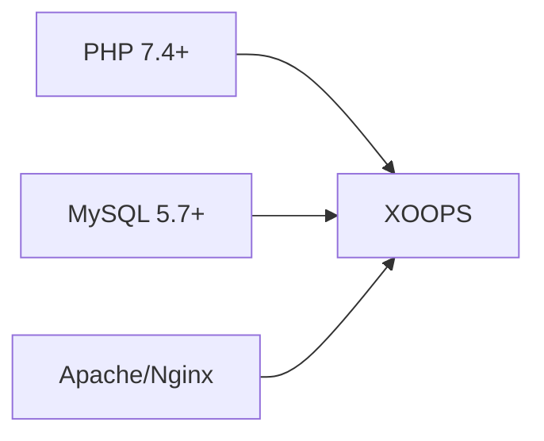
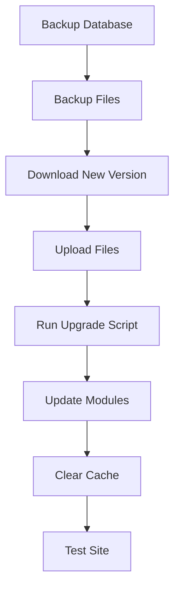

> XOOPS 설치에 대한 일반적인 질문과 답변입니다.

---

## 사전 설치

### Q: 최소 서버 요구 사항은 무엇입니까?

**답:** XOOPS 2.5.x에는 다음이 필요합니다.
- PHP 7.4 이상 (PHP 8.x 권장)
- MySQL 5.7+ 또는 MariaDB 10.3+
- mod_rewrite 또는 Nginx를 사용하는 Apache
- 최소 64MB PHP 메모리 제한(128MB 이상 권장)



### Q: 공유 호스팅에 XOOPS를 설치할 수 있나요?

**A:** 예, XOOPS는 요구 사항을 충족하는 대부분의 공유 호스팅에서 잘 작동합니다. 호스트가 다음을 제공하는지 확인하세요.
- 필수 확장 기능이 포함된 PHP(mysqli, gd, 컬, json, mbstring)
- MySQL 데이터베이스 액세스
- 파일 업로드 기능
-.htaccess 지원(Apache용)

### Q: 어떤 PHP 확장이 필요합니까?

**답:** 필수 확장:
- `mysqli` - 데이터베이스 연결
- `gd` - 이미지 처리
- `json` - JSON 처리
- `mbstring` - 멀티바이트 문자열 지원

권장사항:
- `curl` - 외부 API 호출
- `zip` - 모듈 설치
- `intl` - 국제화

---

## 설치 과정

### 질문: 설치 마법사에 빈 페이지가 표시됩니다.

**답:** 이는 일반적으로 PHP 오류입니다. 시도해 보세요:

1. 일시적으로 오류 표시를 활성화합니다.
```php
// Add to htdocs/install/index.php at the top
error_reporting(E_ALL);
ini_set('display_errors', 1);
```

2. PHP 오류 로그 확인
3. PHP 버전 호환성 확인
4. 필요한 모든 확장이 로드되었는지 확인하세요.

### Q: "mainfile.php에 쓸 수 없습니다"라는 메시지가 나타납니다.

**답:** 설치 전에 쓰기 권한을 설정하세요.

```bash
chmod 666 mainfile.php
# After installation, secure it:
chmod 444 mainfile.php
```

### Q: 데이터베이스 테이블이 생성되지 않습니다.

**답:** 확인:

1. MySQL 사용자에게는 CREATE TABLE 권한이 있습니다.
```sql
GRANT ALL PRIVILEGES ON xoopsdb.* TO 'xoopsuser'@'localhost';
FLUSH PRIVILEGES;
```

2. 데이터베이스가 존재합니다:
```sql
CREATE DATABASE xoopsdb CHARACTER SET utf8mb4 COLLATE utf8mb4_unicode_ci;
```

3. 마법사 일치 데이터베이스 설정의 자격 증명

### Q: 설치가 완료되었지만 사이트에 오류가 표시됩니다.

**답:** 일반적인 설치 후 수정 사항:

1. 설치 디렉터리를 제거하거나 이름을 바꿉니다.
```bash
mv htdocs/install htdocs/install.bak
```

2. 적절한 권한을 설정하십시오.
```bash
chmod -R 755 htdocs/
chmod -R 777 xoops_data/
chmod 444 mainfile.php
```

3. 캐시 지우기:
```bash
rm -rf xoops_data/caches/smarty_cache/*
rm -rf xoops_data/caches/smarty_compile/*
```

---

## 구성

### Q: 구성 파일은 어디에 있나요?

**A:** 기본 구성은 XOOPS 루트의 `mainfile.php`에 있습니다. 주요 설정:

```php
define('XOOPS_ROOT_PATH', '/path/to/htdocs');
define('XOOPS_VAR_PATH', '/path/to/xoops_data');
define('XOOPS_URL', 'https://yoursite.com');
define('XOOPS_DB_HOST', 'localhost');
define('XOOPS_DB_USER', 'username');
define('XOOPS_DB_PASS', 'password');
define('XOOPS_DB_NAME', 'database');
define('XOOPS_DB_PREFIX', 'xoops');
```

### Q: 사이트 URL을 어떻게 변경하나요?

**답:** `mainfile.php` 편집:

```php
define('XOOPS_URL', 'https://newdomain.com');
```

그런 다음 캐시를 지우고 데이터베이스에 하드코딩된 URL을 업데이트하세요.

### Q: XOOPS를 다른 디렉터리로 어떻게 이동합니까?

**답:**

1. 파일을 새 위치로 이동
2. `mainfile.php`의 경로를 업데이트합니다.
```php
define('XOOPS_ROOT_PATH', '/new/path/to/htdocs');
define('XOOPS_VAR_PATH', '/new/path/to/xoops_data');
```
3. 필요한 경우 데이터베이스 업데이트
4. 모든 캐시 지우기

---

## 업그레이드

### Q: XOOPS를 어떻게 업그레이드하나요?

**답:**



1. **모든 것을 백업**(데이터베이스 + 파일)
2. 새로운 XOOPS 버전 다운로드
3. 파일 업로드(`mainfile.php` 덮어쓰지 마세요)
4. 제공된 경우 `htdocs/upgrade/`을 실행합니다.
5. 관리자 패널을 통해 모듈 업데이트
6. 모든 캐시 지우기
7. 철저한 테스트

### Q: 업그레이드할 때 버전을 건너뛸 수 있나요?

**답:** 일반적으로 그렇지 않습니다. 데이터베이스 마이그레이션이 올바르게 실행되도록 주요 버전을 통해 순차적으로 업그레이드하세요. 구체적인 지침은 릴리스 노트를 확인하세요.

### 질문: 업그레이드 후 모듈 작동이 중지되었습니다.

**답:**

1. 새로운 XOOPS 버전과의 모듈 호환성 확인
2. 모듈을 최신 버전으로 업데이트하세요.
3. 템플릿 재생성: 관리 → 시스템 → 유지 관리 → 템플릿
4. 모든 캐시 지우기
5. 특정 오류에 대해서는 PHP 오류 로그를 확인하세요.

---

## 문제 해결

### Q: 관리자 비밀번호를 잊어버렸습니다.

**답:** 데이터베이스를 통해 재설정:

```sql
-- Generate new password hash
UPDATE xoops_users
SET pass = MD5('newpassword')
WHERE uname = 'admin';
```

또는 이메일이 구성된 경우 비밀번호 재설정 기능을 사용하세요.

### Q: 설치 후 사이트가 너무 느려집니다.

**답:**

1. 관리자 → 시스템 → 기본 설정에서 캐싱을 활성화합니다.
2. 데이터베이스 최적화:
```sql
OPTIMIZE TABLE xoops_session;
OPTIMIZE TABLE xoops_online;
```
3. 디버그 모드에서 느린 쿼리를 확인하세요.
4. PHP OpCache 활성화

### 질문: 이미지/CSS가 로드되지 않습니다.

**답:**

1. 파일 권한 확인(파일의 경우 644, 디렉터리의 경우 755)
2. `mainfile.php`에서 `XOOPS_URL`이 올바른지 확인하세요.
3..htaccess에 다시 쓰기 충돌이 있는지 확인하세요.
4. 브라우저 콘솔에서 404 오류를 검사하세요.

---

## 관련 문서

- 설치 가이드
- 기본 구성
- 하얀 죽음의 스크린

---

#xoops #faq #설치 #문제 해결
