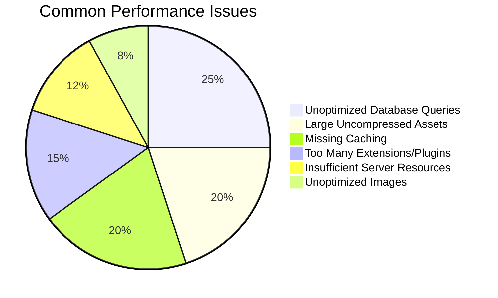
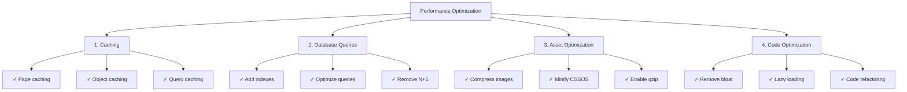
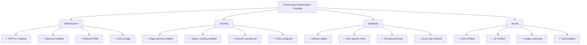

# 성능 자주 묻는 질문

> XOOPS 성능 최적화 및 느린 사이트 진단에 대한 일반적인 질문과 답변입니다.

---

## 일반 성능

### Q: 내 XOOPS 사이트가 느린지 어떻게 알 수 있나요?

**답:** 다음 도구와 측정항목을 사용하세요.

1. **페이지 로드 시간**:
```bash
# Use curl to measure response time
curl -w "@curl-format.txt" -o /dev/null -s https://yoursite.com

# Or use online tools
# - PageSpeed Insights (Google)
# - GTmetrix
# - WebPageTest
```

2. **목표 지표**:
- 첫 번째 콘텐츠가 포함된 페인트(FCP): < 1.8초
- 콘텐츠가 포함된 최대 페인트(LCP): < 2.5초
- 첫 번째 바이트까지의 시간(TTFB): < 0.6s
- 총 페이지 크기: < 2-3MB

3. **서버 로그 확인**:
```bash
# Apache
tail -100 /var/log/apache2/access.log

# Nginx
tail -100 /var/log/nginx/access.log

# Look for slow requests (> 1 second)
```

---

### Q: 가장 일반적인 성능 문제는 무엇입니까?

**답:**


---

### Q: 최적화 노력은 어디에 집중해야 합니까?

**답:** 최적화 우선순위를 따르세요.



---

## 캐싱

### Q: XOOPS에서 캐싱을 활성화하려면 어떻게 해야 합니까?

**답:** XOOPS에는 캐싱이 내장되어 있습니다. 관리 > 설정 > 성능에서 구성합니다.

```php
<?php
// Check cache settings in mainfile.php or admin
// Common cache types:
// 1. file - File-based cache (default)
// 2. memcache - Memcached (if installed)
// 3. redis - Redis (if installed)

// In code, use cache:
$cache = xoops_cache_handler::getInstance();

// Read from cache
$data = $cache->read('cache_key');

if ($data === false) {
    // Not in cache, get from source
    $data = expensive_operation();

    // Write to cache (3600 = 1 hour)
    $cache->write('cache_key', $data, 3600);
}
?>
```

---

### 질문: 어떤 유형의 캐싱을 사용해야 합니까?

**답:**
- **파일 캐시**: 기본, 단순, 추가 설정 없음. 소규모 사이트에 적합합니다.
- **Memcache**: 더 빠른 메모리 기반. 트래픽이 많은 사이트에 더 좋습니다.
- **Redis**: 가장 강력하며 더 많은 데이터 유형을 지원합니다. 스케일링에 가장 적합합니다.

설치 및 활성화:
```bash
# Install Memcached
sudo apt-get install memcached php-memcached

# Or install Redis
sudo apt-get install redis-server php-redis

# Restart PHP-FPM or Apache
sudo systemctl restart php-fpm
sudo systemctl restart apache2
```

그런 다음 XOOPS 관리자에서 활성화하십시오.

---

### Q: XOOPS 캐시를 어떻게 삭제하나요?

**답:**
```bash
# Clear all cache
rm -rf xoops_data/caches/*

# Clear Smarty cache specifically
rm -rf xoops_data/caches/smarty_cache/*
rm -rf xoops_data/caches/smarty_compile/*

# Or in admin panel
Go to Admin > System > Maintenance > Clear Cache
```

코드에서:
```php
<?php
$cache = xoops_cache_handler::getInstance();
$cache->deleteAll();

// Or clear specific keys
$cache->delete('cache_key');
?>
```

---

### Q: 데이터를 얼마 동안 캐시해야 합니까?

**답:** 데이터 최신성 요구사항에 따라 다릅니다.

```php
<?php
// 5 minutes - Frequently changing data
$cache->write('key', $data, 300);

// 1 hour - Semi-static data
$cache->write('key', $data, 3600);

// 24 hours - Static data, images, etc.
$cache->write('key', $data, 86400);

// No expiration (until manual clear)
$cache->write('key', $data, 0);

// Cache during current request only
$cache->write('key', $data, 1);
?>
```

---

## 데이터베이스 최적화

### Q: 느린 데이터베이스 쿼리를 어떻게 찾을 수 있나요?

**A:** 쿼리 로깅을 활성화합니다.

```php
<?php
// In mainfile.php
define('XOOPS_DB_DEBUGMODE', true);
define('XOOPS_SQL_DEBUG', true);

// Then check xoops_log table
SELECT * FROM xoops_log WHERE logid > SOME_NUMBER
ORDER BY created DESC LIMIT 20;
?>
```

또는 MySQL 느린 쿼리 로그를 사용하십시오.
```bash
# Enable in /etc/mysql/my.cnf
[mysqld]
slow_query_log = 1
slow_query_log_file = /var/log/mysql/slow.log
long_query_time = 1  # Log queries > 1 second

# View slow queries
tail -100 /var/log/mysql/slow.log
```

---

### 질문: 데이터베이스 쿼리를 어떻게 최적화합니까?

**답:** 다음 단계를 따르세요.

**1. 데이터베이스 인덱스 추가**
```sql
-- Add index to frequently searched columns
ALTER TABLE `xoops_articles` ADD INDEX `author_id` (`author_id`);
ALTER TABLE `xoops_articles` ADD INDEX `created` (`created`);

-- Check if index helps
ANALYZE TABLE `xoops_articles`;
EXPLAIN SELECT * FROM xoops_articles WHERE author_id = 5;
```

**2. LIMIT 및 페이지 매김 사용**
```php
<?php
// WRONG - Gets all records
$result = $db->query("SELECT * FROM xoops_articles");

// CORRECT - Gets 10 records starting at offset
$limit = 10;
$offset = 0;  // Change with pagination
$result = $db->query(
    "SELECT * FROM xoops_articles LIMIT $limit OFFSET $offset"
);
?>
```

**3. 필요한 열만 선택**
```php
<?php
// WRONG
$result = $db->query("SELECT * FROM xoops_articles");

// CORRECT
$result = $db->query(
    "SELECT id, title, author_id, created FROM xoops_articles"
);
?>
```

**4. N+1 쿼리 방지**
```php
<?php
// WRONG - N+1 problem
$articles = $db->query("SELECT * FROM xoops_articles");
while ($article = $articles->fetch_assoc()) {
    // This query runs once per article!
    $author = $db->query(
        "SELECT * FROM xoops_users WHERE uid = " . $article['author_id']
    );
}

// CORRECT - Use JOIN
$result = $db->query("
    SELECT a.*, u.uname, u.email
    FROM xoops_articles a
    JOIN xoops_users u ON a.author_id = u.uid
");

while ($row = $result->fetch_assoc()) {
    echo $row['title'] . " by " . $row['uname'];
}
?>
```

**5. EXPLAIN을 사용하여 쿼리 분석**
```sql
EXPLAIN SELECT * FROM xoops_articles WHERE author_id = 5 AND status = 1;

-- Look for:
-- - type: ALL (bad), INDEX (ok), const/ref (good)
-- - possible_keys: Should show available indexes
-- - key: Should use best index
-- - rows: Should be low number
```

---

### Q: 데이터베이스 로드를 줄이려면 어떻게 해야 하나요?

**답:**
1. **캐시 쿼리 결과**:
```php
<?php
$cache = xoops_cache_handler::getInstance();
$articles = $cache->read('all_articles');

if ($articles === false) {
    $result = $db->query("SELECT * FROM xoops_articles");
    $articles = $result->fetch_all();
    $cache->write('all_articles', $articles, 3600);
}
?>
```

2. **오래된 데이터**를 별도의 테이블에 보관
3. 정기적으로 **로그 정리**:
```bash
# Delete old log entries (older than 30 days)
DELETE FROM xoops_log WHERE created < NOW() - INTERVAL 30 DAY;
```

4. **쿼리 캐시 활성화**(MySQL):
```sql
SET GLOBAL query_cache_type = 1;
SET GLOBAL query_cache_size = 268435456;  -- 256 MB
```

---

## 자산 최적화

### 질문: CSS와 JavaScript를 어떻게 최적화합니까?

**답:**

**1. 파일 축소**:
```bash
# Using online tools
# - cssminifier.com
# - javascript-minifier.com
# - minify.org

# Or with command-line tools
sudo apt-get install yui-compressor closure-compiler
yui-compressor file.css -o file.min.css
```

**2. 관련 파일 결합**:
```html
{* Instead of many files *}
<link rel="stylesheet" href="{$xoops_url}/themes/{$xoops_theme}/style1.css">
<link rel="stylesheet" href="{$xoops_url}/themes/{$xoops_theme}/style2.css">
<link rel="stylesheet" href="{$xoops_url}/themes/{$xoops_theme}/style3.css">

{* Combine into one *}
<link rel="stylesheet" href="{$xoops_url}/themes/{$xoops_theme}/style.css">
```

**3. 중요하지 않은 JavaScript 연기**:
```html
{* Critical JS - load immediately *}
<script src="critical.js"></script>

{* Non-critical JS - load after page *}
<script src="analytics.js" defer></script>
<script src="ads.js" async></script>
```

**4. Gzip 압축 활성화**(.htaccess):
```apache
<IfModule mod_deflate.c>
    AddOutputFilterByType DEFLATE text/html
    AddOutputFilterByType DEFLATE text/plain
    AddOutputFilterByType DEFLATE text/xml
    AddOutputFilterByType DEFLATE text/css
    AddOutputFilterByType DEFLATE text/javascript
    AddOutputFilterByType DEFLATE application/javascript
    AddOutputFilterByType DEFLATE application/xml
</IfModule>
```

---

### Q: 이미지를 최적화하려면 어떻게 해야 합니까?

**답:**

**1. 올바른 형식 선택**:
- JPG: 사진 및 복잡한 이미지
- PNG: 투명도가 포함된 그래픽 및 이미지
- WebP: 최신 브라우저, 향상된 압축
- AVIF: 최신, 최고의 압축

**2. 이미지 압축**:
```bash
# Using ImageMagick
convert image.jpg -quality 85 image-compressed.jpg

# Using ImageOptim
imageoptim image.jpg

# Online tools
# - imagecompressor.com
# - tinypng.com
```

**3. 반응형 이미지 제공**:
```html
{* Serve different sizes *}
<picture>
    <source srcset="image-large.webp" type="image/webp" media="(min-width: 1200px)">
    <source srcset="image-medium.webp" type="image/webp" media="(min-width: 768px)">
    <source srcset="image-small.webp" type="image/webp">
    
</picture>
```

**4. 지연 로드 이미지**:
```html
{* Native lazy loading *}


{* Or with JavaScript library *}
<script src="https://cdn.jsdelivr.net/npm/lazysizes@5/lazysizes.min.js"></script>

```

---

## 서버 구성

### Q: 서버 성능은 어떻게 확인하나요?

**답:**

```bash
# CPU and Memory
top -b -n 1 | head -20
free -h
df -h

# Check PHP-FPM processes
ps aux | grep php-fpm

# Check Apache/Nginx connections
netstat -an | grep ESTABLISHED | wc -l

# Monitor in real-time
watch 'free -h && echo "---" && df -h'
```

---

### 질문: XOOPS용 PHP를 어떻게 최적화합니까?

**답:** `/etc/php/8.x/fpm/php.ini` 편집:

```ini
; Increase limits for XOOPS
max_execution_time = 300         ; 30 seconds default
memory_limit = 512M              ; 128MB default
upload_max_filesize = 100M       ; 2MB default
post_max_size = 100M             ; 8MB default

; Enable opcache for performance
opcache.enable = 1
opcache.memory_consumption = 256
opcache.max_accelerated_files = 20000
opcache.validate_timestamps = 0   ; Production: 0 (reload on restart)
opcache.revalidate_freq = 0       ; Production: 0 or high number

; Database
default_socket_timeout = 60
mysqli.default_socket = /run/mysqld/mysqld.sock
```

그런 다음 PHP를 다시 시작하십시오.
```bash
sudo systemctl restart php8.2-fpm
# or
sudo systemctl restart apache2
```

---

### Q: HTTP/2 및 압축을 활성화하려면 어떻게 해야 합니까?

**답:** Apache(.htaccess)의 경우:
```apache
# Enable HTTPS (required for HTTP/2)
<IfModule mod_ssl.c>
    Protocols h2 http/1.1
</IfModule>

# Enable compression
<IfModule mod_deflate.c>
    AddOutputFilterByType DEFLATE text/html text/plain text/css text/javascript application/javascript
</IfModule>

# Enable browser caching
<IfModule mod_expires.c>
    ExpiresActive On
    ExpiresByType image/jpeg "access plus 1 year"
    ExpiresByType image/png "access plus 1 year"
    ExpiresByType text/css "access plus 1 month"
    ExpiresByType text/javascript "access plus 1 month"
</IfModule>
```

Nginx(nginx.conf)의 경우:
```nginx
http {
    # Enable gzip
    gzip on;
    gzip_types text/plain text/css text/javascript application/json;
    gzip_min_length 1000;

    # Enable HTTP/2
    listen 443 ssl http2;

    # Browser caching
    expires 1y;
    add_header Cache-Control "public, immutable";
}
```

---

## 모니터링 및 진단

### Q: 시간 경과에 따른 XOOPS 성능을 어떻게 모니터링합니까?

**답:**

**1. Google Analytics를 사용하세요**:
- 핵심 웹 바이탈
- 페이지 로드 시간
- 사용자 행동

**2. 서버 모니터링 도구 사용**:
```bash
# Install Glances (system monitor)
sudo apt-get install glances
glances

# Or use New Relic, DataDog, etc.
```

**3. 요청 기록 및 분석**:
```bash
# Get average response time
grep "GET /index.php" /var/log/apache2/access.log | \
  awk '{print $NF}' | \
  sort -n | \
  awk '{sum+=$1; count++} END {print "Average: " sum/count " ms"}'
```

---

### 질문: 메모리 누수를 어떻게 식별합니까?

**답:**

```php
<?php
// In code, track memory usage
$start_memory = memory_get_usage();

// Do operations
for ($i = 0; $i < 1000; $i++) {
    $array[] = expensive_operation();
}

$end_memory = memory_get_usage();
$used = ($end_memory - $start_memory) / 1024 / 1024;

if ($used > 50) {  // Alert if > 50MB
    error_log("Memory leak detected: " . $used . " MB");
}

// Check peak memory
$peak = memory_get_peak_usage();
echo "Peak memory: " . ($peak / 1024 / 1024) . " MB";
?>
```

---

## 성능 체크리스트



---

## 관련 문서

- 데이터베이스 디버깅
- 디버그 모드 활성화
- 모듈 FAQ
- 성능 최적화

---

#xoops #성능 #최적화 #faq #문제 해결 #캐싱
