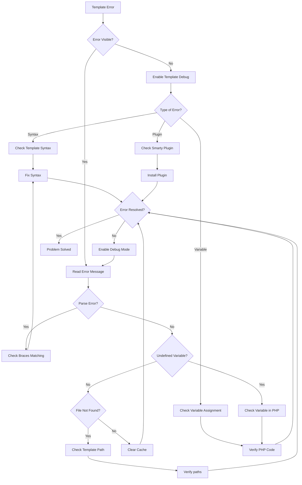
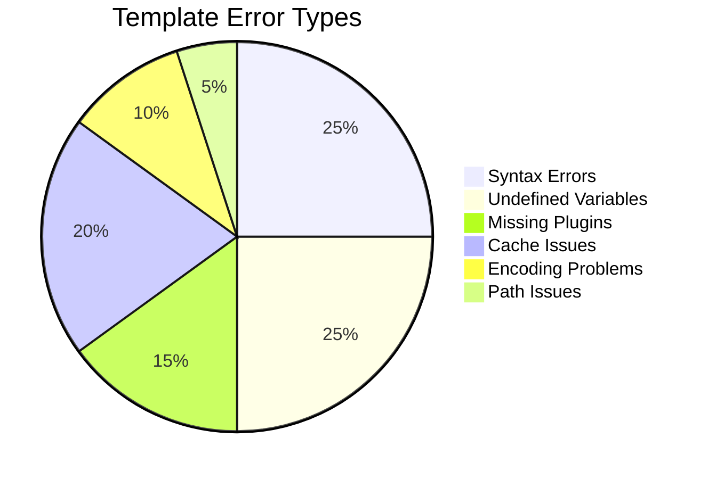

# 템플릿 오류(Smarty 디버깅)

> XOOPS 테마 및 모듈에 대한 일반적인 Smarty 템플릿 문제 및 디버깅 기술입니다.

---

## 진단 흐름도



---

## 일반적인 Smarty 템플릿 오류



---

## 1. 구문 오류

**증상:**
- "Smarty 구문 오류" 메시지
- 템플릿이 컴파일되지 않습니다.
- 출력이 없는 빈 페이지

**오류 메시지:**
```
Syntax error: unrecognized tag 'myfunction'
Unexpected "}" near end of template
```

### 일반적인 구문 문제

**닫는 태그 누락:**
```smarty
{* WRONG *}
{if $user}
User: {$user.name}
{* Missing {/if} *}

{* CORRECT *}
{if $user}
User: {$user.name}
{/if}
```

**잘못된 변수 구문:**
```smarty
{* WRONG *}
{$user->name}          {* Use . not -> *}
{$array[key]}          {* Use quoted keys *}
{$func()}              {* Can't call functions directly *}

{* CORRECT *}
{$user.name}
{$array.key}
{$array['key']}
{$user|@function}      {* Use modifiers instead *}
```

**일치하지 않는 인용문:**
```smarty
{* WRONG *}
{if $name == 'John}     {* Mismatched quotes *}
{assign var="user' value="John"}

{* CORRECT *}
{if $name == 'John'}
{assign var="user" value="John"}
```

**해결책:**

```smarty
{* Always balance braces *}
{if condition}
  ...
{elseif condition}
  ...
{else}
  ...
{/if}

{* Verify tag format *}
{foreach $items as $item}
  ...
{/foreach}

{* Check all variables are defined *}
{if isset($variable)}
  {$variable}
{/if}
```

---

## 2. 정의되지 않은 변수 오류

**증상:**
- "정의되지 않은 변수" 경고
- 변수가 비어 있음으로 표시됩니다.
- 오류 로그의 PHP 알림

**오류 메시지:**
```
Notice: Undefined variable: myvar
Smarty notice: variable "$user" not available
```

**디버그 스크립트:**

```php
<?php
// In your template file or PHP code
// Create modules/yourmodule/debug_template.php

require_once '../../mainfile.php';

// Get template engine
$tpl = new XoopsTpl();

// Check what variables are assigned
echo "<h1>Template Variables</h1>";
echo "<pre>";
print_r($tpl->get_template_vars());
echo "</pre>";

// Or dump Smarty object
echo "<h1>Smarty Debug</h1>";
echo "<pre>";
$tpl->debug_vars();
echo "</pre>";
?>
```

**PHP에서 수정:**

```php
<?php
// Ensure variables are assigned before rendering
$xoopsTpl = new XoopsTpl();

// WRONG - variable not assigned
$xoopsTpl->display('file:templates/page.html');

// CORRECT - assign variables first
$user = [
    'name' => 'John',
    'email' => 'john@example.com'
];
$xoopsTpl->assign('user', $user);
$xoopsTpl->display('file:templates/page.html');
?>
```

**템플릿 수정:**

```smarty
{* Check if variable exists before using *}
{if isset($user)}
    <p>User: {$user.name}</p>
{else}
    <p>No user data</p>
{/if}

{* Use default values *}
<p>Name: {$user.name|default:"No name"}</p>

{* Check array key exists *}
{if isset($array.key)}
    {$array.key}
{/if}
```

---

## 3. 누락되거나 잘못된 수정자

**증상:**
- 데이터 형식이 올바르지 않습니다.
- 텍스트가 HTML로 표시됩니다.
- 잘못된 대소문자/인코딩

**오류 메시지:**
```
Warning: undefined modifier 'stripslashes'
```

**공통 수정자:**

```smarty
{* String operations *}
{$text|upper}                    {* Uppercase *}
{$text|lower}                    {* Lowercase *}
{$text|capitalize}               {* First letter capital *}
{$text|truncate:20:"..."}        {* Truncate to 20 chars *}
{$text|strip_tags}               {* Remove HTML tags *}

{* HTML/Formatting *}
{$html|escape}                   {* HTML escape *}
{$html|escape:'html'}
{$url|escape:'url'}              {* URL escape *}
{$text|nl2br}                    {* Newlines to <br> *}

{* Arrays *}
{$array|@count}                  {* Array count *}
{$array|@implode:', '}           {* Join array *}

{* Default values *}
{$var|default:"No value"}

{* Date formatting *}
{$date|date_format:"%Y-%m-%d"}   {* Format date *}

{* Math operations *}
{$number|math:'+':10}            {* Math operations *}
```

**맞춤 수정자 등록:**

```php
<?php
// Register in your module
$xoopsTpl = new XoopsTpl();
$xoopsTpl->register_modifier('mymodifier', 'my_modifier_function');

function my_modifier_function($string) {
    return strtoupper($string);
}
?>
```

---

## 4. 캐시 문제

**증상:**
- 템플릿 변경사항이 표시되지 않습니다.
- 오래된 콘텐츠가 계속 표시됩니다.
- 오래된 포함 또는 리소스

**해결책:**

```bash
# Clear Smarty cache directories
rm -rf /path/to/xoops/xoops_data/caches/smarty_cache/*
rm -rf /path/to/xoops/xoops_data/caches/smarty_compile/*

# Clear specific module cache
rm -rf /path/to/xoops/xoops_data/caches/smarty_cache/modules/*
```

**코드에서 캐시 지우기:**

```php
<?php
// Clear all Smarty caches
$xoopsTpl = new XoopsTpl();
$xoopsTpl->clear_cache();
$xoopsTpl->clear_compiled_tpl();

// Clear specific template cache
$xoopsTpl->clear_cache('file:templates/page.html');

// Clear all cached files
require_once XOOPS_ROOT_PATH . '/class/xoopsfile.php';
$dh = opendir(XOOPS_CACHE_PATH . '/smarty_cache');
while (($file = readdir($dh)) !== false) {
    if (is_file(XOOPS_CACHE_PATH . '/smarty_cache/' . $file)) {
        unlink(XOOPS_CACHE_PATH . '/smarty_cache/' . $file);
    }
}
closedir($dh);
?>
```

---

## 5. 플러그인을 찾을 수 없음 오류

**증상:**
- "알 수 없는 수정자" 또는 "알 수 없는 플러그인"
- 사용자 정의 기능이 작동하지 않습니다
- 플러그인의 컴파일 오류

**오류 메시지:**
```
Fatal error: Call to undefined function smarty_modifier_custom
Unknown modifier 'myfunction'
```

**맞춤형 플러그인 만들기:**

```php
<?php
// Create: modules/yourmodule/plugins/modifier.custom.php

/**
 * Smarty {$var|custom} modifier plugin
 */
function smarty_modifier_custom($string, $param = '') {
    // Your custom code
    return strtoupper($string) . $param;
}
?>
```

**플러그인 등록:**

```php
<?php
// In your module's init code
$xoopsTpl = new XoopsTpl();

// Add plugin directory to Smarty
$xoopsTpl->addPluginDir(
    XOOPS_ROOT_PATH . '/modules/yourmodule/plugins'
);

// Or manually register
$xoopsTpl->register_modifier(
    'custom',
    'smarty_modifier_custom'
);
?>
```

**플러그인 유형:**

```php
<?php
// Modifier plugin: modifier.name.php
function smarty_modifier_name($string) {
    return $string;
}

// Block plugin: block.name.php
function smarty_block_name($params, $content, &$smarty, &$repeat) {
    if (!isset($smarty->security_settings['IF_FUNCS'])) {
        $smarty->security_settings['IF_FUNCS'] = [];
    }
    return $content;
}

// Function plugin: function.name.php
function smarty_function_name($params, &$smarty) {
    return 'output';
}

// Filter plugin: filter.name.php
function smarty_filter_name($code, &$smarty) {
    return $code;
}
?>
```

---

## 6. 템플릿 포함/확장 문제

**증상:**
- 포함된 템플릿이 로드되지 않습니다.
- 상위 템플릿을 찾을 수 없습니다.
- CSS/JS가 로드되지 않음

**오류 메시지:**
```
Template file 'file:path/to/template.html' not found
Can't find template file 'header.html'
```

**올바른 포함 구문:**

```smarty
{* Include template *}
{include file="file:templates/header.html"}

{* Include with variables *}
{include file="file:templates/header.html" title="My Page"}

{* Template inheritance *}
{extends file="file:templates/base.html"}

{* Named blocks *}
{block name="content"}
    Page content here
{/block}

{* Static resources *}
<link rel="stylesheet" href="{$xoops_url}/themes/{$xoops_theme}/style.css">
<script src="{$xoops_url}/modules/{$xoops_module_dir}/js/script.js"></script>
```

**템플릿 경로 확인:**

```bash
# Verify template file exists
ls -la /path/to/xoops/themes/mytheme/templates/
ls -la /path/to/xoops/modules/mymodule/templates/

# Check permissions
stat /path/to/xoops/themes/mytheme/templates/header.html
```

---

## 7. 변수 배열/객체 액세스

**증상:**
- 배열 값에 접근할 수 없습니다.
- 개체 속성이 표시되지 않습니다.
- 복잡한 변수가 실패함

**오류 메시지:**
```
Undefined variable: user.profile.name
```

**올바른 구문:**

```smarty
{* Array access *}
{$array.key}                     {* Use . for keys *}
{$array['key']}
{$array.0}                       {* Numeric indexes *}
{$array.$variable_key}           {* Dynamic keys *}

{* Nested arrays *}
{$user.profile.name}
{$data.items.0.title}

{* Object properties *}
{$object.property}
{$object.method|escape}          {* Method calls *}

{* Safe access with isset *}
{if isset($array.key)}
    {$array.key}
{/if}

{* Check length *}
{if count($array) > 0}
    Items found
{/if}
```

---

## 8. 문자 인코딩 문제

**증상:**
- 템플릿의 텍스트가 깨졌습니다.
- 특수 문자가 잘못 표시됩니다.
- UTF-8 문자가 깨졌습니다.

**해결책:**

**템플릿 파일 인코딩:**

```smarty
{* Set charset in meta tag *}
<meta charset="UTF-8">

{* Or in HTML head *}
<meta http-equiv="Content-Type" content="text/html; charset=utf-8">

{* Proper PHP declaration *}
header('Content-Type: text/html; charset=utf-8');
```

**PHP 코드:**

```php
<?php
// Set output encoding
header('Content-Type: text/html; charset=utf-8');

// Ensure database uses UTF-8
$conn = new mysqli('localhost', 'user', 'pass', 'db');
$conn->set_charset('utf8mb4');

// Or in SQL
SET NAMES utf8mb4;
SET CHARACTER SET utf8mb4;

// Assign data properly
$text = mb_convert_encoding($text, 'UTF-8', 'UTF-8');
$xoopsTpl->assign('text', $text);
?>
```

---

## 디버그 모드 구성

**템플릿 디버깅 활성화:**

```php
<?php
// In mainfile.php
define('XOOPS_DEBUG_LEVEL', 2);

// In Smarty configuration
$xoopsTpl->debugging = true;
$xoopsTpl->debug_tpl = SMARTY_DIR . 'debug.tpl';

// Or in module
$tpl = new XoopsTpl();
$tpl->debugging = true;
?>
```

**디버그 콘솔 출력:**

```php
<?php
// Create modules/yourmodule/debug_smarty.php

require_once '../../mainfile.php';
require_once XOOPS_ROOT_PATH . '/class/smarty/Smarty.class.php';

$smarty = new Smarty();
$smarty->debugging = true;

// Check compiled template
$compiled_dir = $smarty->getCompileDir();
echo "<h1>Compiled Templates</h1>";
$files = glob($compiled_dir . '/*.php');
foreach ($files as $file) {
    echo "<p>" . basename($file) . "</p>";
}

// View compiled code
echo "<h1>Compiled Code</h1>";
echo "<pre>";
$latest = max(array_map('filemtime', $files));
foreach ($files as $file) {
    if (filemtime($file) == $latest) {
        echo htmlspecialchars(file_get_contents($file));
        break;
    }
}
echo "</pre>";
?>
```

---

## 템플릿 유효성 검사 체크리스트

```mermaid
graph TD
    A[Template Validation] --> B["1. Syntax Check"]
    A --> C["2. Variable Verification"]
    A --> D["3. Plugin Check"]
    A --> E["4. File Paths"]
    A --> F["5. Encoding"]
    A --> G["6. Cache"]

    B --> B1["✓ All braces matched"]
    B --> B2["✓ All tags closed"]
    B --> B3["✓ Proper syntax"]

    C --> C1["✓ Variables assigned"]
    C --> C2["✓ Correct property access"]
    C --> C3["✓ Default values set"]

    D --> D1["✓ Modifiers available"]
    D --> D2["✓ Plugins registered"]
    D --> D3["✓ Custom functions work"]

    E --> E1["✓ Relative paths correct"]
    E --> E2["✓ Files exist"]
    E --> E3["✓ Permissions correct"]

    F --> F1["✓ UTF-8 declared"]
    F --> F2["✓ HTML charset set"]
    F --> F3["✓ Database UTF-8"]

    G --> G1["✓ Cache cleared"]
    G --> G2["✓ Compiled fresh"]
```



---

## 예방 및 모범 사례

1. 개발 중 **디버깅 활성화**
2. 배포하기 전에 **템플릿 유효성 검사**
3. 변경 후 **캐시 지우기**
4. **git을 사용**하여 템플릿 변경 사항 추적
5. 인코딩 문제에 대해 **여러 브라우저에서 테스트**
6. **사용자 정의 플러그인 문서화** 및 수정자
7. 일관성을 위해 **템플릿 상속 사용**

---

## 관련 문서

- Smarty 디버깅 가이드
- Smarty 템플릿
- 디버그 모드 활성화
- 테마 FAQ

---

#xoops #문제 해결 #템플릿 #똑똑함 #디버깅
