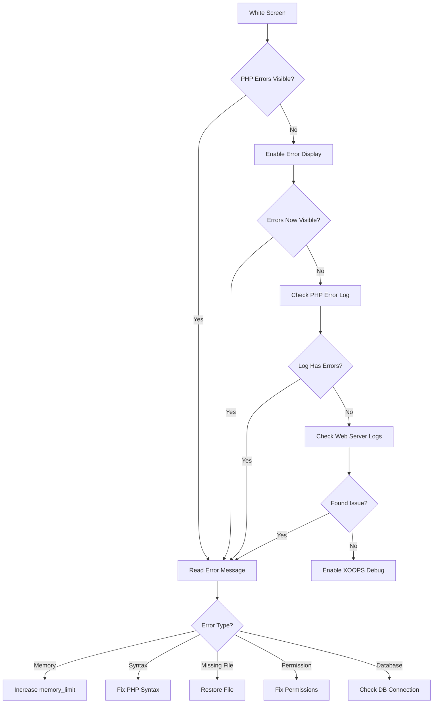
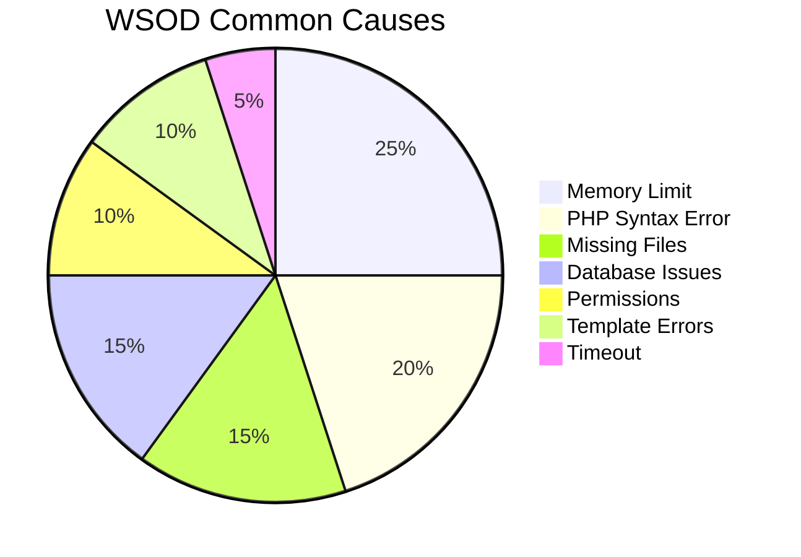
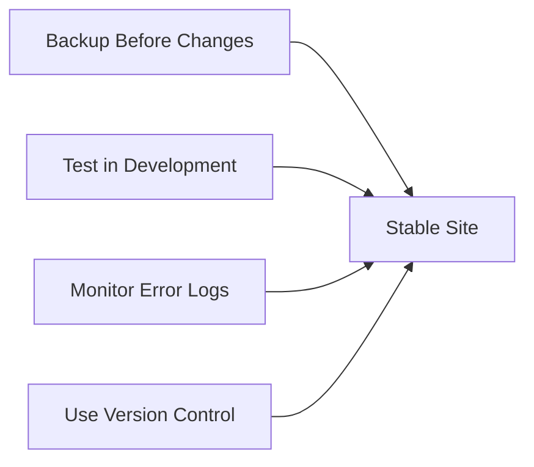

> XOOPS에서 빈 공백 페이지를 진단하고 수정하는 방법.

---

## 진단 흐름도



---

## 빠른 진단

### 1단계: PHP 오류 표시 활성화

`mainfile.php`에 일시적으로 추가:

```php
<?php
// Add at the very top, after <?php
error_reporting(E_ALL);
ini_set('display_errors', '1');
ini_set('display_startup_errors', '1');
```

### 2단계: PHP 오류 로그 확인

```bash
# Common log locations
tail -100 /var/log/php/error.log
tail -100 /var/log/apache2/error.log
tail -100 /var/log/nginx/error.log

# Or check PHP info for log location
php -i | grep error_log
```

### 3단계: XOOPS 디버그 활성화

```php
// In mainfile.php
define('XOOPS_DEBUG_LEVEL', 2);
```

---

## 일반적인 원인 및 해결 방법



### 1. 메모리 제한이 초과되었습니다.

**증상:**
- 대규모 작업 시 빈 페이지
- 작은 데이터에는 작동하지만 큰 데이터에는 실패합니다.

**오류:**
```
Fatal error: Allowed memory size of 134217728 bytes exhausted
```

**해결책:**

```php
// In mainfile.php
ini_set('memory_limit', '256M');

// Or in .htaccess
php_value memory_limit 256M

// Or in php.ini
memory_limit = 256M
```

### 2. PHP 구문 오류

**증상:**
- PHP 파일 편집 후 WSOD
- 특정 페이지가 실패하고 다른 페이지는 작동합니다.

**오류:**
```
Parse error: syntax error, unexpected '}' in /path/file.php on line 123
```

**해결책:**

```bash
# Check file for syntax errors
php -l /path/to/file.php

# Check all PHP files in module
find modules/mymodule -name "*.php" -exec php -l {} \;
```

### 3. 필수 파일 누락

**증상:**
- 업로드/마이그레이션 후 WSOD
- 임의 페이지 실패

**오류:**
```
Fatal error: require_once(): Failed opening required 'class/Helper.php'
```

**해결책:**

```bash
# Re-upload missing files
# Compare against fresh installation
diff -r /path/to/xoops /path/to/fresh-xoops

# Check file permissions
ls -la class/
```

### 4. 데이터베이스 연결 실패

**증상:**
- 모든 페이지에 WSOD가 표시됩니다.
- 정적 파일(이미지, CSS) 작업

**오류:**
```
Warning: mysqli_connect(): Access denied for user
```

**해결책:**

```php
// Verify credentials in mainfile.php
define('XOOPS_DB_HOST', 'localhost');
define('XOOPS_DB_USER', 'your_user');
define('XOOPS_DB_PASS', 'your_password');
define('XOOPS_DB_NAME', 'your_database');

// Test connection manually
<?php
$conn = new mysqli('localhost', 'user', 'pass', 'database');
if ($conn->connect_error) {
    die("Connection failed: " . $conn->connect_error);
}
echo "Connected successfully";
```

### 5. 권한 문제

**증상:**
- 파일 쓰기 시 WSOD
- 캐시/컴파일 오류

**해결책:**

```bash
# Fix directory permissions
chmod -R 755 htdocs/
chmod -R 777 xoops_data/
chmod -R 777 uploads/

# Fix ownership
chown -R www-data:www-data /path/to/xoops
```

### 6. Smarty 템플릿 오류

**증상:**
- 특정 페이지의 WSOD
- 캐시를 지운 후 작동

**해결책:**

```bash
# Clear Smarty cache
rm -rf xoops_data/caches/smarty_cache/*
rm -rf xoops_data/caches/smarty_compile/*

# Check template syntax
```

### 7. 최대 실행 시간

**증상:**
- ~30초 후 WSOD
- 장기 작업 실패

**오류:**
```
Fatal error: Maximum execution time of 30 seconds exceeded
```

**해결책:**

```php
// In mainfile.php
set_time_limit(300);

// Or in .htaccess
php_value max_execution_time 300
```

---

## 디버그 스크립트

XOOPS 루트에 `debug.php`을 만듭니다.

```php
<?php
/**
 * XOOPS Debug Script
 * Delete after troubleshooting!
 */

error_reporting(E_ALL);
ini_set('display_errors', '1');

echo "<h1>XOOPS Debug</h1>";

// Check PHP version
echo "<h2>PHP Version</h2>";
echo "PHP " . PHP_VERSION . "<br>";

// Check required extensions
echo "<h2>Required Extensions</h2>";
$required = ['mysqli', 'gd', 'curl', 'json', 'mbstring'];
foreach ($required as $ext) {
    $status = extension_loaded($ext) ? '✓' : '✗';
    echo "$status $ext<br>";
}

// Check file permissions
echo "<h2>Directory Permissions</h2>";
$dirs = [
    'xoops_data' => 'xoops_data',
    'uploads' => 'uploads',
    'cache' => 'xoops_data/caches'
];
foreach ($dirs as $name => $path) {
    $writable = is_writable($path) ? '✓ Writable' : '✗ Not writable';
    echo "$name: $writable<br>";
}

// Test database connection
echo "<h2>Database Connection</h2>";
if (file_exists('mainfile.php')) {
    // Extract credentials (simple regex, not production safe)
    $mainfile = file_get_contents('mainfile.php');
    preg_match("/XOOPS_DB_HOST.*'(.+?)'/", $mainfile, $host);
    preg_match("/XOOPS_DB_USER.*'(.+?)'/", $mainfile, $user);
    preg_match("/XOOPS_DB_PASS.*'(.+?)'/", $mainfile, $pass);
    preg_match("/XOOPS_DB_NAME.*'(.+?)'/", $mainfile, $name);

    if (!empty($host[1])) {
        $conn = @new mysqli($host[1], $user[1], $pass[1], $name[1]);
        if ($conn->connect_error) {
            echo "✗ Connection failed: " . $conn->connect_error;
        } else {
            echo "✓ Connected to database";
            $conn->close();
        }
    }
} else {
    echo "mainfile.php not found";
}

// Memory info
echo "<h2>Memory</h2>";
echo "Memory Limit: " . ini_get('memory_limit') . "<br>";
echo "Current Usage: " . round(memory_get_usage() / 1024 / 1024, 2) . " MB<br>";

// Check error log location
echo "<h2>Error Log</h2>";
echo "Location: " . ini_get('error_log');
```

---

## 예방



1. 변경하기 전에 **항상 백업**하세요.
2. 배포하기 전에 **로컬에서 테스트**
3. 정기적으로 **오류 로그 모니터링**
4. 변경 사항 추적을 위해 **git 사용**
5. 지원되는 버전 내에서 **PHP 업데이트 유지**

---

## 관련 문서

- 데이터베이스 연결 오류
- 권한 거부 오류
- 디버그 모드 활성화

---

#xoops #문제 해결 #wsod #디버깅 #오류
