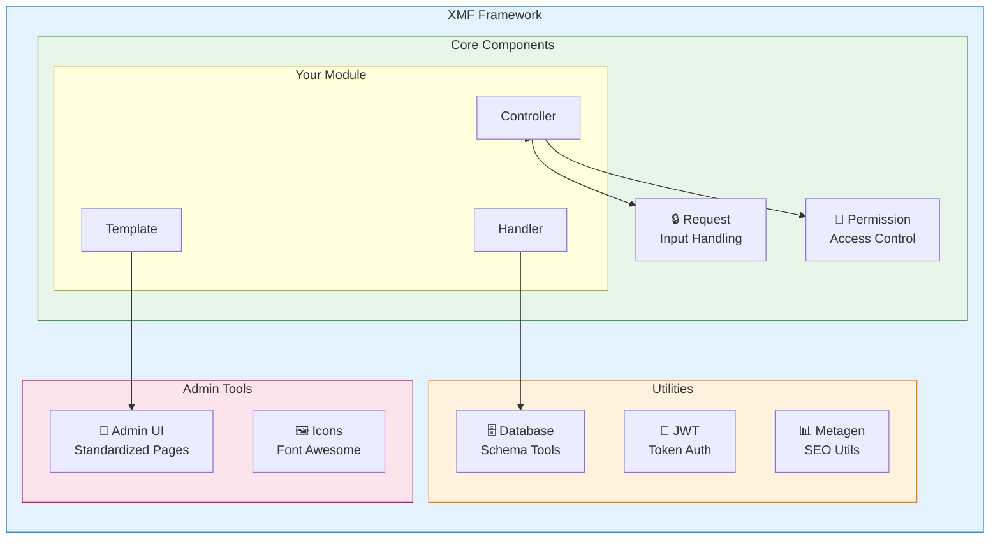
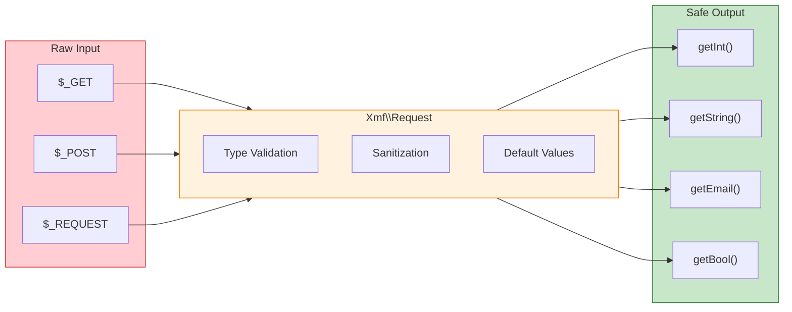

<span class="version-badge version-25x">2.5.x ✅</span> <span class="version-badge version-40x">4.0.x ✅</span>

:::팁[현대 XOOPS로의 연결]
XMF는 **XOOPS 2.5.x 및 XOOPS 4.0.x**에서 작동합니다. 이는 XOOPS 4.0을 준비하는 동안 현재 모듈을 현대화하는 데 권장되는 방법입니다. XMF는 PSR-4 자동 로딩, 네임스페이스 및 원활한 전환을 위한 도우미를 제공합니다.
:::

**XOOPS 모듈 프레임워크(XMF)**는 XOOPS 모듈 개발을 단순화하고 표준화하도록 설계된 강력한 라이브러리입니다. XMF는 네임스페이스, 자동 로딩, 상용구 코드를 줄이고 유지 관리성을 향상시키는 포괄적인 도우미 클래스 세트를 포함한 최신 PHP 방식을 제공합니다.

## XMF란 무엇인가요?

XMF는 다음을 제공하는 클래스 및 유틸리티 모음입니다.

- **최신 PHP 지원** - PSR-4 자동 로딩을 통한 전체 네임스페이스 지원
- **요청 처리** - 안전한 입력 검증 및 삭제
- **모듈 도우미** - 모듈 구성 및 개체에 대한 액세스 단순화
- **권한 시스템** - 사용하기 쉬운 권한 관리
- **데이터베이스 유틸리티** - 스키마 마이그레이션 및 테이블 관리 도구
- **JWT 지원** - 보안 인증을 위한 JSON 웹 토큰 구현
- **메타데이터 생성** - SEO 및 콘텐츠 추출 유틸리티
- **관리 인터페이스** - 표준화된 모듈 관리 페이지

### XMF 구성 요소 개요



## 주요 기능

### 네임스페이스 및 자동 로딩

모든 XMF 클래스는 `Xmf` 네임스페이스에 있습니다. 클래스는 참조될 때 자동으로 로드됩니다. 수동 포함이 필요하지 않습니다.

```php
use Xmf\Request;
use Xmf\Module\Helper;

// Classes load automatically when used
$input = Request::getString('input', '');
$helper = Helper::getHelper('mymodule');
```

### 안전한 요청 처리

[요청 클래스](../05-XMF-Framework/Basics/XMF-Request.md)는 내장된 삭제 기능을 통해 HTTP 요청 데이터에 대한 유형이 안전한 액세스를 제공합니다.



```php
use Xmf\Request;

$id = Request::getInt('id', 0);
$name = Request::getString('name', '');
$email = Request::getEmail('email', '');
```

### 모듈 도우미 시스템

[모듈 도우미](../05-XMF-Framework/Basics/XMF-Module-Helper.md)는 모듈 관련 기능에 대한 편리한 액세스를 제공합니다.

```php
$helper = \Xmf\Module\Helper::getHelper('mymodule');

// Access module configuration
$configValue = $helper->getConfig('setting_name', 'default');

// Get module object
$module = $helper->getModule();

// Access handlers
$handler = $helper->getHandler('items');
```

### 권한 관리

[Permission-Helper](../05-XMF-Framework/Recipes/Permission-Helper.md)는 XOOPS 권한 처리를 단순화합니다.

```php
$permHelper = new \Xmf\Module\Helper\Permission();

// Check user permission
if ($permHelper->checkPermission('view', $itemId)) {
    // User has permission
}
```

## 문서 구조

### 기본 사항

- [XMF 시작하기](../05-XMF-Framework/Basics/Getting-Started-with-XMF.md) - 설치 및 기본 사용법
- [XMF-요청](../05-XMF-Framework/Basics/XMF-Request.md) - 요청 처리 및 입력 유효성 검사
- [XMF-Module-Helper](../05-XMF-Framework/Basics/XMF-Module-Helper.md) - 모듈 헬퍼 클래스 사용법

### 조리법

- [권한 도우미](../05-XMF-Framework/Recipes/Permission-Helper.md) - 권한 작업
- [모듈-관리-페이지](../05-XMF-Framework/Recipes/Module-Admin-Pages.md) - 표준화된 관리 인터페이스 생성

### 참고자료

- [JWT](../05-XMF-Framework/Reference/JWT.md) - JSON 웹 토큰 구현
- [데이터베이스](../05-XMF-Framework/Reference/Database.md) - 데이터베이스 유틸리티 및 스키마 관리
- [Metagen](Reference/Metagen.md) - 메타데이터 및 SEO 유틸리티

## 요구 사항

- XOOPS 2.5.8 이상
- PHP 7.2 이상 (PHP 8.x 권장)

## 설치

XMF는 XOOPS 2.5.8 이상 버전에 포함되어 있습니다. 이전 버전 또는 수동 설치의 경우:

1. XOOPS 저장소에서 XMF 패키지를 다운로드합니다.
2. XOOPS `/class/xmf/` 디렉터리에 압축을 풉니다.
3. 자동 로더는 클래스 로딩을 자동으로 처리합니다.

## 빠른 시작 예

다음은 일반적인 XMF 사용 패턴을 보여주는 전체 예입니다.

```php
<?php
use Xmf\Request;
use Xmf\Module\Helper;
use Xmf\Module\Helper\Permission;

// Get module helper
$helper = Helper::getHelper('mymodule');

// Get configuration values
$itemsPerPage = $helper->getConfig('items_per_page', 10);

// Handle request input
$op = Request::getCmd('op', 'list');
$id = Request::getInt('id', 0);

// Check permissions
$permHelper = new Permission();
if (!$permHelper->checkPermission('view', $id)) {
    redirect_header('index.php', 3, 'Access denied');
}

// Process based on operation
switch ($op) {
    case 'view':
        $handler = $helper->getHandler('items');
        $item = $handler->get($id);
        // ... display item
        break;
    case 'list':
    default:
        // ... list items
        break;
}
```

## 리소스

- [XMF GitHub 저장소](https://github.com/XOOPS/XMF)
- [XOOPS 프로젝트 홈페이지](https://xoops.org)

---

#xmf #xoops #프레임워크 #php #모듈 개발
