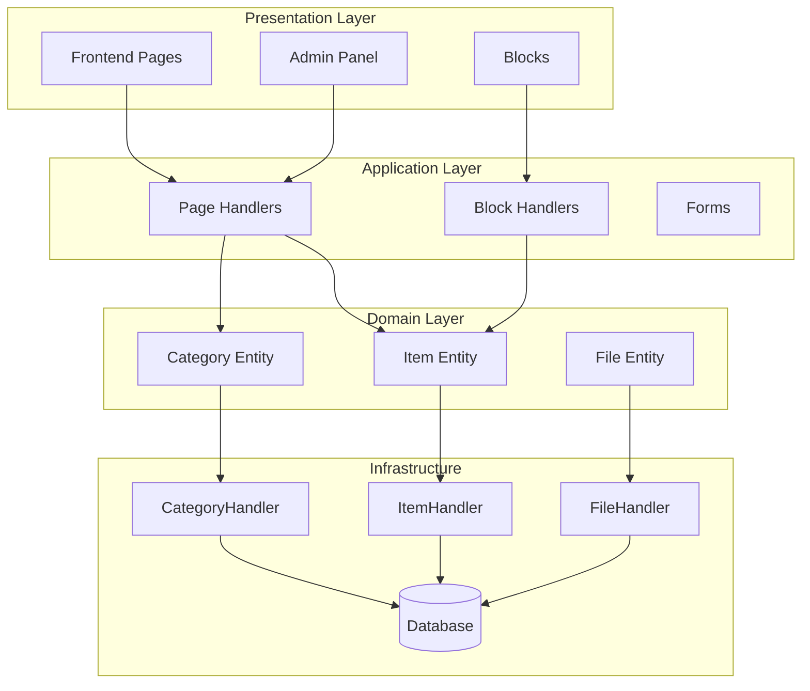
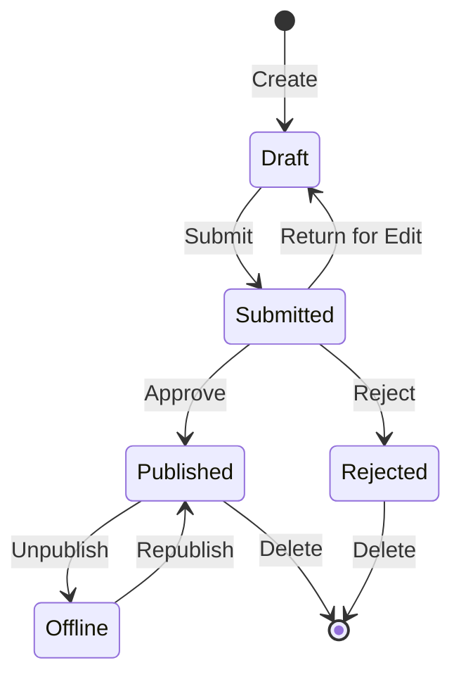

## Gambaran Keseluruhan

Dokumen ini menyediakan analisis teknikal seni bina modul Penerbit, corak dan butiran pelaksanaan. Gunakan ini sebagai rujukan untuk memahami cara modul XOOPS kualiti pengeluaran distrukturkan.

## Gambaran Keseluruhan Seni Bina

## Struktur Direktori
```
publisher/
├── admin/
│   ├── index.php           # Admin dashboard
│   ├── item.php            # Article management
│   ├── category.php        # Category management
│   ├── permission.php      # Permissions
│   ├── file.php            # File manager
│   └── menu.php            # Admin menu
├── assets/
│   ├── css/
│   ├── js/
│   └── images/
├── class/
│   ├── Category.php        # Category entity
│   ├── CategoryHandler.php # Category data access
│   ├── Item.php            # Article entity
│   ├── ItemHandler.php     # Article data access
│   ├── File.php            # File attachment
│   ├── FileHandler.php     # File data access
│   ├── Form/               # Form classes
│   ├── Common/             # Utilities
│   └── Helper.php          # Module helper
├── include/
│   ├── common.php          # Initialization
│   ├── functions.php       # Utility functions
│   ├── oninstall.php       # Install hooks
│   ├── onupdate.php        # Update hooks
│   └── search.php          # Search integration
├── language/
├── templates/
├── sql/
└── xoops_version.php
```
## Analisis Entiti

### Item (Artikel) Entiti
```php
class Item extends \XoopsObject
{
    // Fields
    public function initVar(): void
    {
        $this->initVar('itemid', XOBJ_DTYPE_INT, null, false);
        $this->initVar('categoryid', XOBJ_DTYPE_INT, 0, false);
        $this->initVar('title', XOBJ_DTYPE_TXTBOX, '', true);
        $this->initVar('subtitle', XOBJ_DTYPE_TXTBOX, '');
        $this->initVar('summary', XOBJ_DTYPE_TXTAREA, '');
        $this->initVar('body', XOBJ_DTYPE_TXTAREA, '', true);
        $this->initVar('uid', XOBJ_DTYPE_INT, 0);
        $this->initVar('status', XOBJ_DTYPE_INT, 0);
        $this->initVar('datesub', XOBJ_DTYPE_INT, time());
        // ... more fields
    }

    // Business methods
    public function isPublished(): bool
    {
        return $this->getVar('status') == _PUBLISHER_STATUS_PUBLISHED;
    }

    public function canEdit(int $userId): bool
    {
        return $this->getVar('uid') == $userId
            || $this->isAdmin($userId);
    }
}
```
### Corak Pengendali
```php
class ItemHandler extends \XoopsPersistableObjectHandler
{
    public function __construct(\XoopsDatabase $db)
    {
        parent::__construct(
            $db,
            'publisher_items',
            Item::class,
            'itemid',
            'title'
        );
    }

    public function getPublishedItems(int $limit = 10): array
    {
        $criteria = new \CriteriaCompo();
        $criteria->add(new \Criteria('status', _PUBLISHER_STATUS_PUBLISHED));
        $criteria->setSort('datesub');
        $criteria->setOrder('DESC');
        $criteria->setLimit($limit);

        return $this->getObjects($criteria);
    }
}
```
## Sistem Kebenaran

### Jenis Kebenaran

| Kebenaran | Penerangan |
|------------|-------------|
| `publisher_view` | Lihat category/articles |
| `publisher_submit` | Hantar artikel baharu |
| `publisher_approve` | Autoluluskan penyerahan |
| `publisher_moderate` | Semak artikel belum selesai |
| `publisher_global` | Kebenaran modul global |

### Semakan Kebenaran
```php
class PermissionHandler
{
    public function isGranted(string $permission, int $categoryId): bool
    {
        $userId = $GLOBALS['xoopsUser']?->uid() ?? 0;
        $groups = $this->getUserGroups($userId);

        return $this->grouppermHandler->checkRight(
            $permission,
            $categoryId,
            $groups,
            $this->helper->getModule()->mid()
        );
    }
}
```
## Keadaan Aliran Kerja

## Struktur Templat

### Templat Hadapan

| Templat | Tujuan |
|----------|---------|
| `publisher_index.tpl` | Laman utama modul |
| `publisher_item.tpl` | Artikel tunggal |
| `publisher_category.tpl` | Penyenaraian kategori |
| `publisher_submit.tpl` | Borang penyerahan |
| `publisher_search.tpl` | Hasil carian |

### Templat Sekat

| Templat | Tujuan |
|----------|---------|
| `publisher_block_latest.tpl` | Artikel terkini |
| `publisher_block_spotlight.tpl` | Artikel pilihan |
| `publisher_block_category.tpl` | Menu kategori |

## Corak Utama Digunakan

1. **Corak Pengendali** - Enkapsulasi capaian data
2. **Objek Nilai** - Pemalar status
3. **Kaedah Templat** - Penjanaan borang
4. **Strategi** - Mod paparan yang berbeza
5. **Pemerhati** - Pemberitahuan tentang acara

## Pelajaran untuk Pembangunan Modul

1. Gunakan XoopsPersistableObjectHandler untuk CRUD
2. Laksanakan kebenaran berbutir
3. Asingkan pembentangan daripada logik
4. Gunakan Kriteria untuk pertanyaan
5. Menyokong berbilang status kandungan
6. Sepadukan dengan sistem pemberitahuan XOOPS

## Dokumentasi Berkaitan

- Mencipta-Artikel - Pengurusan artikel
- Pengurusan-Kategori - Sistem kategori
- Persediaan Kebenaran - Konfigurasi kebenaran
- Developer-Guide/Hooks-and-Events - Titik lanjutan