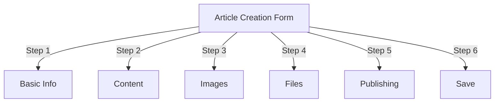
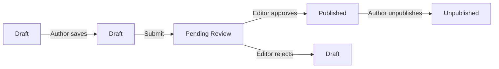
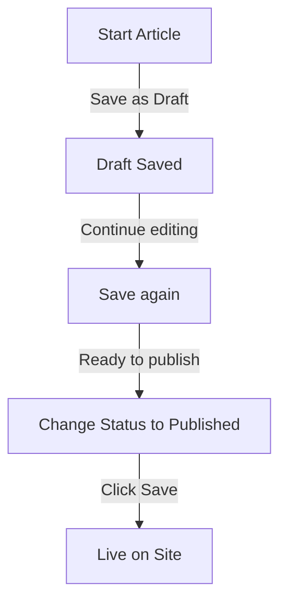

# Mencipta Artikel dalam Penerbit

> Panduan langkah demi langkah untuk mencipta, mengedit, memformat dan menerbitkan artikel dalam modul Penerbit.

---

## Pengurusan Artikel Akses

### Navigasi Panel Pentadbir
```
Admin Panel
└── Modules
    └── Publisher
        └── Articles
            ├── Create New
            ├── Edit
            ├── Delete
            └── Publish
```
### Laluan Terpantas

1. Log masuk sebagai **Pentadbir**
2. Klik **Modules** dalam bar pentadbir
3. Cari **Penerbit**
4. Klik pautan **Admin**
5. Klik **Artikel** dalam menu kiri
6. Klik butang **Tambah Artikel**

---

## Borang Penciptaan Artikel

### Maklumat Asas

Apabila membuat artikel baharu, isikan bahagian berikut:

---

## Langkah 1: Maklumat Asas

### Medan Diperlukan

#### Tajuk Artikel
```
Field: Title
Type: Text input (required)
Max length: 255 characters
Example: "Top 5 Tips for Better Photography"
```
**Garis Panduan:**
- Deskriptif dan khusus
- Sertakan kata kunci untuk SEO
- Elakkan ALL CAPS
- Simpan di bawah 60 aksara untuk paparan terbaik

#### Pilih Kategori
```
Field: Category
Type: Dropdown (required)
Options: List of created categories
Example: Photography > Tutorials
```
**Petua:**
- Ibu bapa dan subkategori tersedia
- Pilih kategori yang paling relevan
- Hanya satu kategori bagi setiap artikel
- Boleh ditukar kemudian

#### Sarikata Artikel (Pilihan)
```
Field: Subtitle
Type: Text input (optional)
Max length: 255 characters
Example: "Learn photography fundamentals in 5 easy steps"
```
**Gunakan untuk:**
- Tajuk ringkasan
- Teks penggoda
- Tajuk lanjutan

### Penerangan Artikel

#### Penerangan Ringkas
```
Field: Short Description
Type: Textarea (optional)
Max length: 500 characters
```
**Tujuan:**
- Teks pratonton artikel
- Paparan dalam penyenaraian kategori
- Digunakan dalam hasil carian
- Perihalan meta untuk SEO

**Contoh:**
```
"Discover essential photography techniques that will transform your photos
from ordinary to extraordinary. This comprehensive guide covers composition,
lighting, and exposure settings."
```
#### Kandungan Penuh
```
Field: Article Body
Type: WYSIWYG Editor (required)
Max length: Unlimited
Format: HTML
```
Kawasan kandungan artikel utama dengan penyuntingan teks kaya.

---

## Langkah 2: Memformat Kandungan

### Menggunakan Editor WYSIWYG

#### Pemformatan Teks
```
Bold:           Ctrl+B or click [B] button
Italic:         Ctrl+I or click [I] button
Underline:      Ctrl+U or click [U] button
Strikethrough:  Alt+Shift+D or click [S] button
Subscript:      Ctrl+, (comma)
Superscript:    Ctrl+. (period)
```
#### Struktur Tajuk

Buat hierarki dokumen yang betul:
```html
<h1>Article Title</h1>      <!-- Use once at top -->
<h2>Main Section</h2>        <!-- For major sections -->
<h3>Subsection</h3>          <!-- For subtopics -->
<h4>Sub-subsection</h4>      <!-- For details -->
```
**Dalam Editor:**
- Klik **Format** lungsur turun
- Pilih tahap tajuk (H1-H6)
- Taip tajuk anda

#### Senarai

**Senarai Tidak Tersusun (Bullet):**
```markdown
• Point one
• Point two
• Point three
```
Langkah dalam editor:
1. Klik [≡] Butang senarai bullet
2. Taip setiap titik
3. Tekan Enter untuk item seterusnya
4. Tekan Backspace dua kali untuk menamatkan senarai

**Senarai Tertib (Bernombor):**
```markdown
1. First step
2. Second step
3. Third step
```
Langkah dalam editor:
1. Klik [1.] Butang senarai bernombor
2. Taip setiap item
3. Tekan Enter untuk seterusnya
4. Tekan Backspace dua kali untuk menamatkan

**Senarai Bersarang:**
```markdown
1. Main point
   a. Sub-point
   b. Sub-point
2. Next point
```
Langkah-langkah:
1. Buat senarai pertama
2. Tekan Tab untuk mengesot
3. Buat item bersarang
4. Tekan Shift+Tab untuk outdent

#### Pautan

**Tambah Hiperpautan:**

1. Pilih teks untuk dipautkan
2. Klik butang **[🔗] Pautan**
3. Masukkan URL: `https://example.com`
4. Pilihan: Tambah title/target
5. Klik **Sisipkan Pautan**

**Alih Keluar Pautan:**

1. Klik dalam teks yang dipautkan
2. Klik butang **[🔗] Alih Keluar Pautan**

#### Kod & Petikan

**Sebut harga:**
```
"This is an important quote from an expert"
- Attribution
```
Langkah-langkah:
1. Taipkan teks petikan
2. Klik butang **[❝] Blockquote**
3. Teks diinden dan digayakan

**Kod Blok:**
```python
def hello_world():
    print("Hello, World!")
```
Langkah-langkah:
1. Klik **Format → Kod**
2. Tampal kod
3. Pilih bahasa (pilihan)
4. Paparan kod dengan sorotan sintaks

---

## Langkah 3: Menambah Imej

### Imej Pilihan (Imej Wira)
```
Field: Featured Image / Main Image
Type: Image upload
Format: JPG, PNG, GIF, WebP
Max size: 5 MB
Recommended: 600x400 px
```
**Untuk Muat Naik:**

1. Klik butang **Muat Naik Imej**
2. Pilih imej daripada komputer
3. Crop/resize jika diperlukan
4. Klik **Gunakan Imej Ini**

**Penempatan Imej:**
- Paparan di bahagian atas artikel
- Digunakan dalam penyenaraian kategori
- Ditunjukkan dalam arkib
- Digunakan untuk perkongsian sosial

### Imej Sebaris

Sisipkan imej dalam teks artikel:

1. Letakkan kursor dalam editor di mana imej harus pergi
2. Klik butang **[🖼️] Imej** dalam bar alat
3. Pilih pilihan muat naik:
   - Muat naik imej baharu
   - Pilih daripada galeri
   - Masukkan imej URL
4. Konfigurasikan:   
```
   Image Size:
   - Width: 300-600 px
   - Height: Auto (maintains ratio)
   - Alignment: Left/Center/Right
   ```5. Klik **Sisipkan Imej**

**Balut Teks Di Sekitar Imej:**

Dalam editor selepas memasukkan:
```html
<!-- Image floats left, text wraps around -->

```
### Galeri Imej

Buat galeri berbilang imej:

1. Klik butang **Galeri** (jika ada)
2. Muat naik berbilang imej:
   - Satu klik: Tambah satu
   - Seret & lepas: Tambah berbilang
3. Susun pesanan dengan menyeret
4. Tetapkan kapsyen untuk setiap imej
5. Klik **Buat Galeri**

---

## Langkah 4: Melampirkan Fail

### Tambah Lampiran Fail
```
Field: File Attachments
Type: File upload (multiple allowed)
Supported: PDF, DOC, XLS, ZIP, etc.
Max per file: 10 MB
Max per article: 5 files
```
**Untuk Dilampirkan:**

1. Klik butang **Tambah Fail**
2. Pilih fail daripada komputer
3. Pilihan: Tambah perihalan fail
4. Klik **Lampirkan Fail**
5. Ulang untuk berbilang fail

**Contoh Fail:**
- PDF panduan
- Hamparan Excel
- Dokumen perkataan
- ZIP arkib
- Kod sumber

### Urus Fail yang Dilampirkan

**Sunting Fail:**

1. Klik nama fail
2. Edit penerangan
3. Klik **Simpan**

**Padam Fail:**

1. Cari fail dalam senarai
2. Klik ikon **[×] Padam**
3. Sahkan pemadaman

---

## Langkah 5: Penerbitan & Status

### Status Artikel
```
Field: Status
Type: Dropdown
Options:
  - Draft: Not published, only author sees
  - Pending: Waiting for approval
  - Published: Live on site
  - Archived: Old content
  - Unpublished: Was published, now hidden
```
**Aliran Kerja Status:**

### Pilihan Penerbitan

#### Terbitkan Segera
```
Status: Published
Start Date: Today (auto-filled)
End Date: (leave blank for no expiration)
```
#### Jadual untuk Kemudian
```
Status: Scheduled
Start Date: Future date/time
Example: February 15, 2024 at 9:00 AM
```
Artikel akan diterbitkan secara automatik pada masa yang ditetapkan.

#### Tetapkan Tamat Tempoh
```
Enable Expiration: Yes
Expiration Date: Future date
Action: Archive/Hide/Delete
Example: April 1, 2024 (article auto-archives)
```
### Pilihan Keterlihatan
```yaml
Show Article:
  - Display on front page: Yes/No
  - Show in category: Yes/No
  - Include in search: Yes/No
  - Include in recent articles: Yes/No

Featured Article:
  - Mark as featured: Yes/No
  - Featured section position: (number)
```
---

## Langkah 6: SEO & Metadata

### SEO Tetapan
```
Field: SEO Settings (Expand section)
```
#### Penerangan Meta
```
Field: Meta Description
Type: Text (160 characters recommended)
Used by: Search engines, social media

Example:
"Learn photography fundamentals in 5 easy steps.
Discover composition, lighting, and exposure techniques."
```
#### Kata Kunci Meta
```
Field: Meta Keywords
Type: Comma-separated list
Max: 5-10 keywords

Example: Photography, Tutorial, Composition, Lighting, Exposure
```
#### URL Slug
```
Field: URL Slug (auto-generated from title)
Type: Text
Format: lowercase, hyphens, no spaces

Auto: "top-5-tips-for-better-photography"
Edit: Change before publishing
```
#### Buka Teg Graf

Dijana secara automatik daripada maklumat artikel:
- Tajuk
- Penerangan
- Imej pilihan
- Perkara URL
- Tarikh penerbitan

Digunakan oleh Facebook, LinkedIn, WhatsApp, dll.

---

## Langkah 7: Komen & Interaksi

### Tetapan Komen
```yaml
Allow Comments:
  - Enable: Yes/No
  - Default: Inherit from preferences
  - Override: Specific to this article

Moderate Comments:
  - Require approval: Yes/No
  - Default: Inherit from preferences
```
### Tetapan Penilaian
```yaml
Allow Ratings:
  - Enable: Yes/No
  - Scale: 5 stars (default)
  - Show average: Yes/No
  - Show count: Yes/No
```
---

## Langkah 8: Pilihan Lanjutan

### Pengarang & Garis Kecil
```
Field: Author
Type: Dropdown
Default: Current user
Options: All users with author permission

Display:
  - Show author name: Yes/No
  - Show author bio: Yes/No
  - Show author avatar: Yes/No
```
### Edit Kunci
```
Field: Edit Lock
Purpose: Prevent accidental changes

Lock Article:
  - Locked: Yes/No
  - Lock reason: "Final version"
  - Unlock date: (optional)
```
### Sejarah Semakan

Versi artikel yang disimpan secara automatik:
```
View Revisions:
  - Click "Revision History"
  - Shows all saved versions
  - Compare versions
  - Restore previous version
```
---

## Menyimpan & Menerbitkan

### Simpan Aliran Kerja

### Simpan Artikel

**Simpan automatik:**
- Dicetuskan setiap 60 saat
- Menyimpan sebagai draf secara automatik
- Menunjukkan "Terakhir disimpan: 2 minit yang lalu"

**Simpan Manual:**
- Klik **Simpan & Teruskan** untuk terus mengedit
- Klik **Simpan & Lihat** untuk melihat versi yang diterbitkan
- Klik **Simpan** untuk menyimpan dan menutup

### Terbitkan Artikel

1. Tetapkan **Status**: Diterbitkan
2. Tetapkan **Tarikh Mula**: Sekarang (atau tarikh akan datang)
3. Klik **Simpan** atau **Terbitkan**
4. Mesej pengesahan muncul
5. Artikel disiarkan secara langsung (atau dijadualkan)

---

## Mengedit Artikel Sedia Ada

### Akses Editor Artikel

1. Pergi ke **Pentadbir → Penerbit → Artikel**
2. Cari artikel dalam senarai
3. Klik **Edit** icon/button
4. Buat perubahan
5. Klik **Simpan**

### Suntingan Pukal

Edit berbilang artikel sekaligus:
```
1. Go to Articles list
2. Select articles (checkboxes)
3. Choose "Bulk Edit" from dropdown
4. Change selected field
5. Click "Update All"

Available for:
  - Status
  - Category
  - Featured (Yes/No)
  - Author
```
### Pratonton Artikel

Sebelum diterbitkan:

1. Klik butang **Pratonton**
2. Lihat seperti yang pembaca akan lihat
3. Semak pemformatan
4. Uji pautan
5. Kembali ke editor untuk melaraskan

---

## Pengurusan Artikel

### Lihat Semua Artikel

**Paparan Senarai Artikel:**
```
Admin → Publisher → Articles

Columns:
  - Title
  - Category
  - Author
  - Status
  - Created date
  - Modified date
  - Actions (Edit, Delete, Preview)

Sorting:
  - By title (A-Z)
  - By date (newest/oldest)
  - By status (Published/Draft)
  - By category
```
### Penapis Artikel
```
Filter Options:
  - By category
  - By status
  - By author
  - By date range
  - Search by title

Example: Show all "Draft" articles by "John" in "News" category
```
### Padam Artikel

**Padam Lembut (Disyorkan):**

1. Tukar **Status**: Tidak diterbitkan
2. Klik **Simpan**
3. Artikel disembunyikan tetapi tidak dipadam
4. Boleh dipulihkan kemudian

**Padam Sukar:**

1. Pilih artikel dalam senarai
2. Klik butang **Padam**
3. Sahkan pemadaman
4. Artikel dialih keluar secara kekal

---

## Amalan Terbaik Kandungan

### Menulis Artikel Berkualiti
```
Structure:
  ✓ Compelling title
  ✓ Clear subtitle/description
  ✓ Engaging opening paragraph
  ✓ Logical sections with headers
  ✓ Supporting visuals
  ✓ Conclusion/summary
  ✓ Call-to-action

Length:
  - Blog posts: 500-2000 words
  - News: 300-800 words
  - Guides: 2000-5000 words
  - Minimum: 300 words
```
### SEO Pengoptimuman
```
Title Optimization:
  ✓ Include primary keyword
  ✓ Keep under 60 characters
  ✓ Put keyword near beginning
  ✓ Be descriptive and specific

Content Optimization:
  ✓ Use headings (H1, H2, H3)
  ✓ Include keyword in heading
  ✓ Use bold for important terms
  ✓ Add descriptive links
  ✓ Include images with alt text

Meta Description:
  ✓ Include primary keyword
  ✓ 155-160 characters
  ✓ Action-oriented
  ✓ Unique per article
```
### Petua Memformat
```
Readability:
  ✓ Short paragraphs (2-4 sentences)
  ✓ Bullet points for lists
  ✓ Subheadings every 300 words
  ✓ Generous whitespace
  ✓ Line breaks between sections

Visual Appeal:
  ✓ Featured image at top
  ✓ Inline images in content
  ✓ Alt text on all images
  ✓ Code blocks for technical
  ✓ Blockquotes for emphasis
```
---

## Pintasan Papan Kekunci

### Pintasan Editor
```
Bold:               Ctrl+B
Italic:             Ctrl+I
Underline:          Ctrl+U
Link:               Ctrl+K
Save Draft:         Ctrl+S
```
### Pintasan Teks
```
-- →  (dash to em dash)
... → … (three dots to ellipsis)
(c) → © (copyright)
(r) → ® (registered)
(tm) → ™ (trademark)
```
---

## Tugas Biasa

### Salin Artikel

1. Buka artikel
2. Klik butang **Pendua** atau **Klon**
3. Artikel disalin sebagai draf
4. Edit tajuk dan kandungan
5. Terbitkan

### Jadual Artikel

1. Buat artikel
2. Tetapkan **Tarikh Mula**: Masa Depan date/time
3. Tetapkan **Status**: Diterbitkan
4. Klik **Simpan**
5. Artikel diterbitkan secara automatik

### Penerbitan Kelompok

1. Cipta artikel sebagai draf
2. Tetapkan tarikh penerbitan
3. Artikel auto-terbit pada masa yang dijadualkan
4. Pantau daripada paparan "Berjadual".

### Beralih Antara Kategori

1. Edit artikel
2. Tukar **Kategori** lungsur turun
3. Klik **Simpan**
4. Artikel muncul dalam kategori baharu

---

## Menyelesaikan masalah

### Masalah: Tidak dapat menyimpan artikel

**Penyelesaian:**
```
1. Check form for required fields
2. Verify category is selected
3. Check PHP memory limit
4. Try saving as draft first
5. Clear browser cache
```
### Masalah: Imej tidak dipaparkan

**Penyelesaian:**
```
1. Verify image upload succeeded
2. Check image file format (JPG, PNG)
3. Verify image path in database
4. Check upload directory permissions
5. Try re-uploading image
```
### Masalah: Bar alat editor tidak dipaparkan

**Penyelesaian:**
```
1. Clear browser cache
2. Try different browser
3. Disable browser extensions
4. Check JavaScript console for errors
5. Verify editor plugin installed
```
### Masalah: Artikel tidak diterbitkan

**Penyelesaian:**
```
1. Verify Status = "Published"
2. Check Start Date is today or earlier
3. Verify permissions allow publishing
4. Check category is published
5. Clear module cache
```
---

## Panduan Berkaitan

- Panduan Konfigurasi
- Pengurusan Kategori
- Persediaan Kebenaran
- Templat Tersuai

---

## Langkah Seterusnya

- Buat Artikel pertama anda
- Sediakan Kategori
- Konfigurasikan Kebenaran
- Penyesuaian Templat Semakan

---

#penerbit #artikel #kandungan #penciptaan #pemformatan #penyuntingan #XOOPS