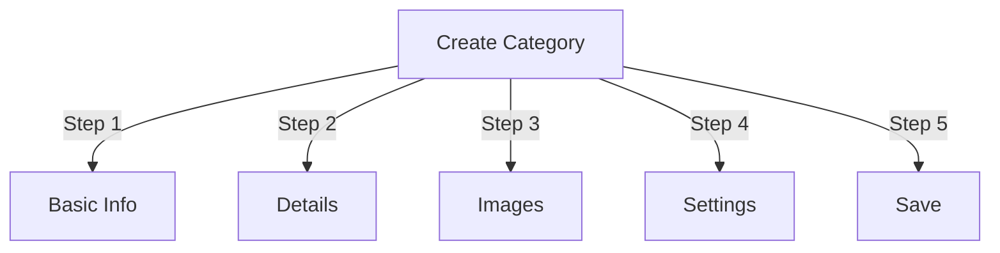

# Menguruskan Kategori dalam Penerbit

> Panduan lengkap untuk mencipta, menyusun hierarki dan mengurus kategori dalam modul Penerbit.

---

## Asas Kategori

### Apakah Kategori?

Kategori menyusun artikel ke dalam kumpulan logik:
```
Example Structure:

  News (Main Category)
    ├── Technology
    ├── Sports
    └── Entertainment

  Tutorials (Main Category)
    ├── Photography
    │   ├── Basics
    │   └── Advanced
    └── Writing
        └── Blogging
```
### Faedah Struktur Kategori Baik
```
✓ Better user navigation
✓ Organized content
✓ Improved SEO
✓ Easier content management
✓ Better editorial workflow
```
---

## Pengurusan Kategori Akses

### Navigasi Panel Pentadbir
```
Admin Panel
└── Modules
    └── Publisher
        └── Categories
            ├── Create New
            ├── Edit
            ├── Delete
            ├── Permissions
            └── Organize
```
### Akses Pantas

1. Log masuk sebagai **Pentadbir**
2. Pergi ke **Admin → Modules**
3. Klik **Penerbit → Pentadbir**
4. Klik **Kategori** dalam menu kiri

---

## Mencipta Kategori

### Borang Penciptaan Kategori

### Langkah 1: Maklumat Asas

#### Nama Kategori
```
Field: Category Name
Type: Text input (required)
Max length: 100 characters
Uniqueness: Should be unique
Example: "Photography"
```
**Garis Panduan:**
- Deskriptif dan tunggal atau jamak secara konsisten
- Digunakan huruf besar dengan betul
- Elakkan watak istimewa
- Pastikan pendek

#### Penerangan Kategori
```
Field: Description
Type: Textarea (optional)
Max length: 500 characters
Used in: Category listing pages, category blocks
```
**Tujuan:**
- Menerangkan kandungan kategori
- Muncul di atas artikel kategori
- Membantu pengguna memahami skop
- Digunakan untuk SEO perihalan meta

**Contoh:**
```
"Photography tips, tutorials, and inspiration for
all skill levels. From composition basics to advanced
lighting techniques, master your craft."
```
### Langkah 2: Kategori Induk

#### Cipta Hierarki
```
Field: Parent Category
Type: Dropdown
Options: None (root), or existing categories
```
**Contoh Hierarki:**
```
Flat Structure:
  News
  Tutorials
  Reviews

Nested Structure:
  News
    Technology
    Business
    Sports
  Tutorials
    Photography
      Basics
      Advanced
    Writing
```
**Buat Subkategori:**

1. Klik lungsur turun **Kategori Induk**
2. Pilih ibu bapa (cth., "Berita")
3. Isikan nama kategori
4. Jimat
5. Kategori baharu muncul sebagai kanak-kanak

### Langkah 3: Imej Kategori

#### Muat Naik Imej Kategori
```
Field: Category Image
Type: Image upload (optional)
Format: JPG, PNG, GIF, WebP
Max size: 5 MB
Recommended: 300x200 px (or your theme size)
```
**Untuk Muat Naik:**

1. Klik butang **Muat Naik Imej**
2. Pilih imej daripada komputer
3. Crop/resize jika diperlukan
4. Klik **Gunakan Imej Ini**

**Di mana Digunakan:**
- Halaman penyenaraian kategori
- Pengepala blok kategori
- Serbuk roti (beberapa tema)
- Perkongsian media sosial

### Langkah 4: Tetapan Kategori

#### Tetapan Paparan
```yaml
Status:
  - Enabled: Yes/No
  - Hidden: Yes/No (hidden from menus, still accessible)

Display Options:
  - Show description: Yes/No
  - Show image: Yes/No
  - Show article count: Yes/No
  - Show subcategories: Yes/No

Layout:
  - Items per page: 10-50
  - Display order: Date/Title/Author
  - Display direction: Ascending/Descending
```
#### Kebenaran Kategori
```yaml
Who Can View:
  - Anonymous: Yes/No
  - Registered: Yes/No
  - Specific groups: Configure per group

Who Can Submit:
  - Registered: Yes/No
  - Specific groups: Configure per group
  - Author must have: "submit articles" permission
```
### Langkah 5: SEO Tetapan

#### Tag Meta
```
Field: Meta Description
Type: Text (160 characters)
Purpose: Search engine description

Field: Meta Keywords
Type: Comma-separated list
Example: photography, tutorials, tips, techniques
```
#### URL Konfigurasi
```
Field: URL Slug
Type: Text
Auto-generated from category name
Example: "photography" from "Photography"
Can be customized before saving
```
### Simpan Kategori

1. Isikan semua medan yang diperlukan:
   - Nama Kategori ✓
   - Penerangan (disyorkan)
2. Pilihan: Muat naik imej, tetapkan SEO
3. Klik **Simpan Kategori**
4. Mesej pengesahan muncul
5. Kategori kini tersedia

---

## Hierarki Kategori

### Buat Struktur Bersarang
```
Step-by-step example: Create News → Technology subcategory

1. Go to Categories admin
2. Click "Add Category"
3. Name: "News"
4. Parent: (leave blank - this is root)
5. Save
6. Click "Add Category" again
7. Name: "Technology"
8. Parent: "News" (select from dropdown)
9. Save
```
### Lihat Pokok Hierarki
```
Categories view shows tree structure:

📁 News
  📄 Technology
  📄 Sports
  📄 Entertainment
📁 Tutorials
  📄 Photography
    📄 Basics
    📄 Advanced
  📄 Writing
```
Klik anak panah kembangkan ke show/hide subkategori.

### Susun Semula Kategori

#### Kategori Alih

1. Pergi ke senarai Kategori
2. Klik **Edit** pada kategori
3. Tukar **Kategori Induk**
4. Klik **Simpan**
5. Kategori dipindahkan ke kedudukan baharu

#### Susun Semula Kategori

Jika tersedia, gunakan drag-and-drop:

1. Pergi ke senarai Kategori
2. Klik dan seret kategori
3. Gugur dalam jawatan baru
4. Pesanan disimpan secara automatik

#### Padamkan Kategori

**Pilihan 1: Padam Lembut (Sembunyikan)**

1. Edit kategori
2. Tetapkan **Status**: Dilumpuhkan
3. Klik **Simpan**
4. Kategori disembunyikan tetapi tidak dipadamkan

**Pilihan 2: Padam Keras**

1. Pergi ke senarai Kategori
2. Klik **Padam** pada kategori
3. Pilih tindakan untuk artikel:   
```
   ☐ Move articles to parent category
   ☐ Move articles to root (News)
   ☐ Delete all articles in category
   ```4. Sahkan pemadaman

---

## Operasi Kategori

### Edit Kategori

1. Pergi ke **Pentadbir → Penerbit → Kategori**
2. Klik **Edit** pada kategori
3. Ubah suai medan:
   - Nama
   - Penerangan
   - Kategori ibu bapa
   - Imej
   - Tetapan
4. Klik **Simpan**

### Edit Kebenaran Kategori

1. Pergi ke Kategori
2. Klik **Kebenaran** pada kategori (atau klik kategori kemudian klik Kebenaran)
3. Konfigurasikan kumpulan:
```
For each group:
  ☐ View articles in this category
  ☐ Submit articles to this category
  ☐ Edit own articles
  ☐ Edit all articles
  ☐ Approve/Moderate articles
  ☐ Manage category
```
4. Klik **Simpan Kebenaran**

### Tetapkan Imej Kategori

**Muat naik imej baharu:**

1. Edit kategori
2. Klik **Tukar Imej**
3. Muat naik atau pilih imej
4. Crop/resize
5. Klik **Gunakan Imej**
6. Klik **Simpan Kategori**

**Alih keluar imej:**

1. Edit kategori
2. Klik **Alih Keluar Imej** (jika ada)
3. Klik **Simpan Kategori**

---

## Kebenaran Kategori

### Matriks Kebenaran
```
                 Anonymous  Registered  Editor  Admin
View category        ✓         ✓         ✓       ✓
Submit article       ✗         ✓         ✓       ✓
Edit own article     ✗         ✓         ✓       ✓
Edit all articles    ✗         ✗         ✓       ✓
Moderate articles    ✗         ✗         ✓       ✓
Manage category      ✗         ✗         ✗       ✓
```
### Tetapkan Kebenaran Peringkat Kategori

#### Kawalan Akses Setiap Kategori

1. Pergi ke senarai **Kategori**
2. Pilih kategori
3. Klik **Kebenaran**
4. Untuk setiap kumpulan, pilih kebenaran:
```
Example: News category
  Anonymous:   View only
  Registered:  Submit articles
  Editors:     Approve articles
  Admins:      Full control
```
5. Klik **Simpan**

#### Kebenaran Peringkat Medan

Kawal medan borang yang mana pengguna boleh see/edit:
```
Example: Limit field visibility for Registered users

Registered users can see/edit:
  ✓ Title
  ✓ Description
  ✓ Content
  ✗ Author (auto-set to current user)
  ✗ Scheduled date (only editors)
  ✗ Featured (only admins)
```
**Konfigurasikan dalam:**
- Kebenaran Kategori
- Cari bahagian "Keterlihatan Medan".

---

## Amalan Terbaik untuk Kategori

### Struktur Kategori
```
✓ Keep hierarchy 2-3 levels deep
✗ Don't create too many top-level categories
✗ Don't create categories with one article

✓ Use consistent naming (plural or singular)
✗ Don't use vague names ("Stuff", "Other")

✓ Create categories for articles that exist
✗ Don't create empty categories in advance
```
### Garis Panduan Penamaan
```
Good names:
  "Photography"
  "Web Development"
  "Travel Tips"
  "Business News"

Avoid:
  "Articles" (too vague)
  "Content" (redundant)
  "News&Updates" (inconsistent)
  "PHOTOGRAPHY STUFF" (formatting)
```
### Petua Organisasi
```
By Topic:
  News
    Technology
    Sports
    Entertainment

By Type:
  Tutorials
    Video
    Text
    Interactive

By Audience:
  For Beginners
  For Experts
  Case Studies

Geographic:
  North America
    United States
    Canada
  Europe
```
---

## Blok Kategori

### Blok Kategori Penerbit

Paparkan penyenaraian kategori di tapak anda:

1. Pergi ke **Admin → Blocks**
2. Cari **Penerbit - Kategori**
3. Klik **Edit**
4. Konfigurasikan:
```
Block Title: "News Categories"
Show subcategories: Yes/No
Show article count: Yes/No
Height: (pixels or auto)
```
5. Klik **Simpan**

### Sekat Artikel Kategori

Tunjukkan artikel terkini daripada kategori tertentu:

1. Pergi ke **Admin → Blocks**
2. Cari **Penerbit - Artikel Kategori**
3. Klik **Edit**
4. Pilih:
```
Category: News (or specific category)
Number of articles: 5
Show images: Yes/No
Show description: Yes/No
```
5. Klik **Simpan**

---

## Analitis Kategori

### Lihat Statistik Kategori

Daripada pentadbir Kategori:
```
Each category shows:
  - Total articles: 45
  - Published: 42
  - Draft: 2
  - Pending approval: 1
  - Total views: 5,234
  - Latest article: 2 hours ago
```
### Lihat Trafik Kategori

Jika analitis didayakan:

1. Klik nama kategori
2. Klik tab **Statistik**
3. Lihat:
   - Paparan halaman
   - Artikel popular
   - Aliran trafik
   - Istilah carian digunakan

---

## Templat Kategori

### Sesuaikan Paparan Kategori

Jika menggunakan templat tersuai, setiap kategori boleh mengatasi:
```
publisher_category.tpl
  ├── Category header
  ├── Category description
  ├── Category image
  ├── Article listing
  └── Pagination
```
**Untuk menyesuaikan:**

1. Salin fail templat
2. Ubah suai HTML/CSS
3. Berikan kepada kategori dalam pentadbir
4. Kategori menggunakan templat tersuai

---

## Tugas Biasa

### Cipta Hierarki Berita
```
Admin → Publisher → Categories
1. Create "News" (parent)
2. Create "Technology" (parent: News)
3. Create "Sports" (parent: News)
4. Create "Entertainment" (parent: News)
```
### Alihkan Artikel Antara Kategori

1. Pergi ke **Artikel** admin
2. Pilih artikel (kotak pilihan)
3. Pilih **"Tukar Kategori"** daripada lungsur turun tindakan pukal
4. Pilih kategori baharu
5. Klik **Kemas kini Semua**

### Sembunyikan Kategori Tanpa Memadam

1. Edit kategori
2. Tetapkan **Status**: Disabled/Hidden
3. Jimat
4. Kategori tidak ditunjukkan dalam menu (masih boleh diakses melalui URL)

### Cipta Kategori untuk Draf
```
Best Practice:

Create "In Review" category
  ├── Purpose: Articles awaiting approval
  ├── Permissions: Hidden from public
  ├── Only admins/editors can see
  ├── Move articles here until approved
  └── Move to "News" when published
```
---

## Import/Export Kategori

### Kategori Eksport

Jika tersedia:

1. Pergi ke **Kategori** admin
2. Klik **Eksport**
3. Pilih format: CSV/JSON/XML
4. Muat turun fail
5. Sandaran disimpan

### Kategori Import

Jika tersedia:

1. Sediakan fail dengan kategori
2. Pergi ke **Kategori** admin
3. Klik **Import**
4. Muat naik fail
5. Pilih strategi kemas kini:
   - Buat baharu sahaja
   - Kemas kini sedia ada
   - Gantikan semua
6. Klik **Import**

---

## Kategori Penyelesaian masalah

### Masalah: Subkategori tidak dipaparkan

**Penyelesaian:**
```
1. Verify parent category status is "Enabled"
2. Check permissions allow viewing
3. Verify subcategories have status "Enabled"
4. Clear cache: Admin → Tools → Clear Cache
5. Check theme shows subcategories
```
### Masalah: Tidak dapat memadamkan kategori

**Penyelesaian:**
```
1. Category must have no articles
2. Move or delete articles first:
   Admin → Articles
   Select articles in category
   Change category to another
3. Then delete empty category
4. Or choose "move articles" option when deleting
```
### Masalah: Imej kategori tidak dipaparkan

**Penyelesaian:**
```
1. Verify image uploaded successfully
2. Check image file format (JPG, PNG)
3. Verify upload directory permissions
4. Check theme displays category images
5. Try re-uploading image
6. Clear browser cache
```
### Masalah: Kebenaran tidak berkuat kuasa

**Penyelesaian:**
```
1. Check group permissions in Category
2. Check global Publisher permissions
3. Check user belongs to configured group
4. Clear session cache
5. Log out and log back in
6. Check permission modules installed
```
---

## Senarai Semak Amalan Terbaik Kategori

Sebelum menggunakan kategori:

- [ ] Hierarki adalah 2-3 tahap dalam
- [ ] Setiap kategori mempunyai 5+ artikel
- [ ] Nama kategori adalah konsisten
- [ ] Kebenaran adalah sesuai
- [ ] Imej kategori dioptimumkan
- [ ] Penerangan telah lengkap
- [ ] SEO metadata diisi
- [ ] URL mesra
- [ ] Kategori diuji pada bahagian hadapan
- [ ] Dokumentasi dikemas kini

---

## Panduan Berkaitan

- Penciptaan Artikel
- Pengurusan Kebenaran
- Konfigurasi Modul
- Panduan Pemasangan

---

## Langkah Seterusnya

- Buat Artikel dalam kategori
- Konfigurasikan Kebenaran
- Sesuaikan dengan Templat Tersuai

---

#penerbit #kategori #organisasi #hierarki #pengurusan #XOOPS