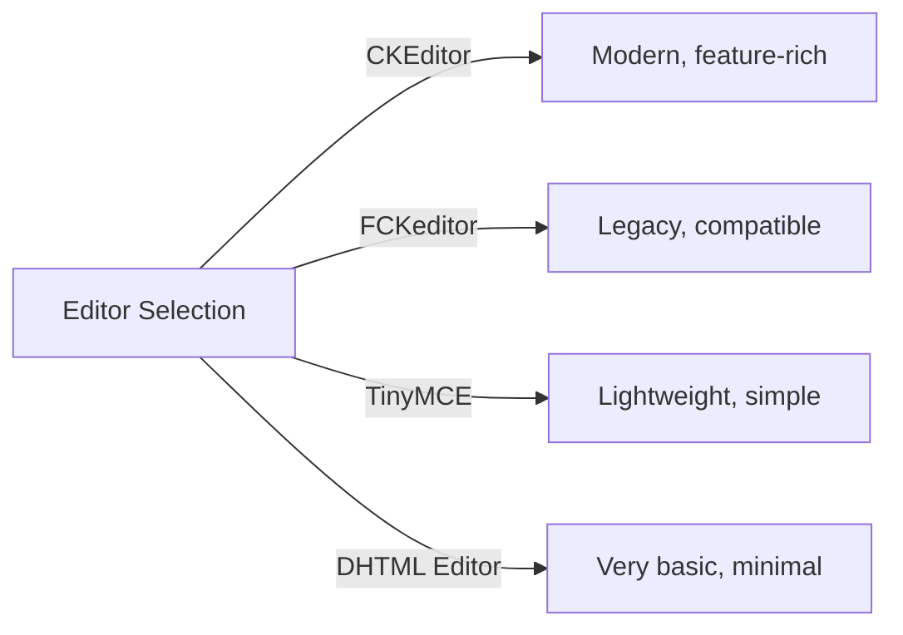
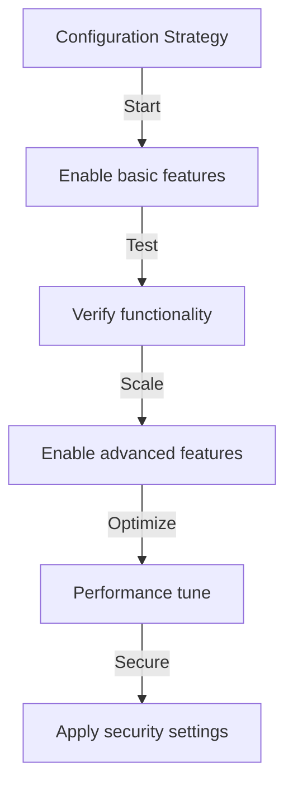

# Konfigurasi Asas Penerbit

> Konfigurasikan tetapan modul Penerbit, keutamaan dan pilihan umum untuk pemasangan XOOPS anda.

---

## Mengakses Konfigurasi

### Navigasi Panel Pentadbir
```
XOOPS Admin Panel
└── Modules
    └── Publisher
        ├── Preferences
        ├── Settings
        └── Configuration
```
1. Log masuk sebagai **Pentadbir**
2. Pergi ke **Panel Pentadbiran → Modul**
3. Cari modul **Penerbit**
4. Klik pautan **Preferences** atau **Admin**

---

## Tetapan Umum

### Konfigurasi Akses
```
Admin Panel → Modules → Publisher
```
Klik **ikon gear** atau **Tetapan** untuk pilihan ini:

#### Pilihan Paparan

| Tetapan | Pilihan | Lalai | Penerangan |
|---------|---------|---------|-------------|
| **Item setiap halaman** | 5-50 | 10 | Artikel yang ditunjukkan dalam senarai |
| **Tunjukkan serbuk roti** | Yes/No | Ya | Paparan jejak navigasi |
| **Gunakan paging** | Yes/No | Ya | Halaman senarai panjang |
| **Tunjukkan tarikh** | Yes/No | Ya | Paparkan tarikh artikel |
| **Tunjukkan kategori** | Yes/No | Ya | Tunjukkan kategori artikel |
| **Tunjukkan pengarang** | Yes/No | Ya | Tunjukkan pengarang artikel |
| **Tunjukkan paparan** | Yes/No | Ya | Tunjukkan kiraan paparan artikel |

**Contoh Konfigurasi:**
```yaml
Items Per Page: 15
Show Breadcrumb: Yes
Use Paging: Yes
Show Date: Yes
Show Category: Yes
Show Author: Yes
Show Views: Yes
```
#### Pilihan Pengarang

| Tetapan | Lalai | Penerangan |
|---------|---------|-------------|
| **Tunjukkan nama pengarang** | Ya | Paparkan nama sebenar atau nama pengguna |
| **Gunakan nama pengguna** | Tidak | Tunjukkan nama pengguna dan bukannya nama |
| **Tunjukkan e-mel pengarang** | Tidak | Paparkan e-mel hubungan pengarang |
| **Tunjukkan avatar pengarang** | Ya | Paparkan avatar pengguna |

---

## Konfigurasi Editor

### Pilih WYSIWYG Editor

Penerbit menyokong berbilang editor:

#### Editor Tersedia

### CKEditor (Disyorkan)

**Terbaik untuk:** Kebanyakan pengguna, penyemak imbas moden, ciri penuh

1. Pergi ke **Preferences**
2. Set **Editor**: CKEditor
3. Konfigurasikan pilihan:
```
Editor: CKEditor 4.x
Toolbar: Full
Height: 400px
Width: 100%
Remove plugins: []
Add plugins: [mathjax, codesnippet]
```
### FCKeditor

**Terbaik untuk:** Keserasian, sistem yang lebih lama
```
Editor: FCKeditor
Toolbar: Default
Custom config: (optional)
```
### TinyMCE

**Terbaik untuk:** Jejak minimum, penyuntingan asas
```
Editor: TinyMCE
Plugins: [paste, table, link, image]
Toolbar: minimal
```
---

## Tetapan Fail & Muat Naik

### Konfigurasikan Direktori Muat Naik
```
Admin → Publisher → Preferences → Upload Settings
```
#### Tetapan Jenis Fail
```yaml
Allowed File Types:
  Images:
    - jpg
    - jpeg
    - gif
    - png
    - webp
  Documents:
    - pdf
    - doc
    - docx
    - xls
    - xlsx
    - ppt
    - pptx
  Archives:
    - zip
    - rar
    - 7z
  Media:
    - mp3
    - mp4
    - webm
    - mov
```
#### Had Saiz Fail

| Jenis Fail | Saiz Maks | Nota |
|-----------|----------|-------|
| **Imej** | 5 MB | Setiap fail imej |
| **Dokumen** | 10 MB | PDF, Fail pejabat |
| **Media** | 50 MB | Video/audio fail |
| **Semua fail** | 100 MB | Jumlah setiap muat naik |

**Tatarajah:**
```
Max Image Upload Size: 5 MB
Max Document Upload Size: 10 MB
Max Media Upload Size: 50 MB
Total Upload Size: 100 MB
Max Files per Article: 5
```
### Saiz Semula Imej

Penerbit menukar saiz imej secara automatik untuk konsisten:
```yaml
Thumbnail Size:
  Width: 150
  Height: 150
  Mode: Crop/Resize

Category Image Size:
  Width: 300
  Height: 200
  Mode: Resize

Article Featured Image:
  Width: 600
  Height: 400
  Mode: Resize
```
---

## Tetapan Komen & Interaksi

### Konfigurasi Komen
```
Preferences → Comments Section
```
#### Pilihan Komen
```yaml
Allow Comments:
  - Enabled: Yes/No
  - Default: Yes
  - Per-article override: Yes

Comment Moderation:
  - Moderate comments: Yes/No
  - Moderate guest comments only: Yes/No
  - Spam filter: Enabled
  - Max comments per day: (unlimited)

Comment Display:
  - Display format: Threaded/Flat
  - Comments per page: 10
  - Date format: Full date/Time ago
  - Show comment count: Yes/No
```
### Konfigurasi Penilaian
```yaml
Allow Ratings:
  - Enabled: Yes/No
  - Default: Yes
  - Per-article override: Yes

Rating Options:
  - Rating scale: 5 stars (default)
  - Allow user to rate own: No
  - Show average rating: Yes
  - Show rating count: Yes
```
---

## SEO & URL Tetapan

### Pengoptimuman Enjin Carian
```
Preferences → SEO Settings
```
#### URL Konfigurasi
```yaml
SEO URLs:
  - Enabled: No (set to Yes for SEO URLs)
  - URL rewriting: None/Apache mod_rewrite/IIS rewrite

URL Format:
  - Category: /category/news
  - Article: /article/welcome-to-site
  - Archive: /archive/2024/01

Meta Description:
  - Auto-generate: Yes
  - Max length: 160 characters

Meta Keywords:
  - Auto-generate: Yes
  - From: Article tags, title
```
### Dayakan SEO URL (Lanjutan)

**Prasyarat:**
- Apache dengan `mod_rewrite` didayakan
- `.htaccess` sokongan didayakan

**Langkah Konfigurasi:**

1. Pergi ke **Preferences → SEO Settings**
2. Tetapkan **SEO URL**: Ya
3. Tetapkan **URL Penulisan Semula**: Apache mod_rewrite
4. Sahkan fail `.htaccess` wujud dalam folder Penerbit

**.htaccess Konfigurasi:**
```apache
<IfModule mod_rewrite.c>
    RewriteEngine On
    RewriteBase /modules/publisher/

    # Category rewrites
    RewriteRule ^category/([0-9]+)-(.*)\.html$ index.php?op=showcategory&categoryid=$1 [L,QSA]

    # Article rewrites
    RewriteRule ^article/([0-9]+)-(.*)\.html$ index.php?op=showitem&itemid=$1 [L,QSA]

    # Archive rewrites
    RewriteRule ^archive/([0-9]+)/([0-9]+)/$ index.php?op=archive&year=$1&month=$2 [L,QSA]
</IfModule>
```
---

## Cache & Prestasi

### Konfigurasi Caching
```
Preferences → Cache Settings
```

```yaml
Enable Caching:
  - Enabled: Yes
  - Cache type: File (or Memcache)

Cache Lifetime:
  - Category lists: 3600 seconds (1 hour)
  - Article lists: 1800 seconds (30 minutes)
  - Single article: 7200 seconds (2 hours)
  - Recent articles block: 900 seconds (15 minutes)

Cache Clear:
  - Manual clear: Available in admin
  - Auto-clear on article save: Yes
  - Clear on category change: Yes
```
### Kosongkan Cache

**Manual Cache Clear:**

1. Pergi ke **Pentadbir → Penerbit → Alat**
2. Klik **Kosongkan Cache**
3. Pilih jenis cache untuk dikosongkan:
   - [ ] Cache kategori
   - [ ] Cache artikel
   - [ ] Sekat cache
   - [ ] Semua cache
4. Klik **Kosongkan Dipilih**

**Barisan Perintah:**
```bash
# Clear all Publisher cache
php /path/to/xoops/admin/cache_manage.php publisher

# Or directly delete cache files
rm -rf /path/to/xoops/var/cache/publisher/*
```
---

## Pemberitahuan & Aliran Kerja

### Pemberitahuan E-mel
```
Preferences → Notifications
```

```yaml
Notify Admin on New Article:
  - Enabled: Yes
  - Recipient: Admin email
  - Include summary: Yes

Notify Moderators:
  - Enabled: Yes
  - On new submission: Yes
  - On pending articles: Yes

Notify Author:
  - On approval: Yes
  - On rejection: Yes
  - On comment: No (optional)
```
### Aliran Kerja Penyerahan
```yaml
Require Approval:
  - Enabled: Yes
  - Editor approval: Yes
  - Admin approval: No

Draft Save:
  - Auto-save interval: 60 seconds
  - Save local versions: Yes
  - Revision history: Last 5 versions
```
---

## Tetapan Kandungan

### Lalai Penerbitan
```
Preferences → Content Settings
```

```yaml
Default Article Status:
  - Draft/Published: Draft
  - Featured by default: No
  - Auto-publish time: None

Default Visibility:
  - Public/Private: Public
  - Show on front page: Yes
  - Show in categories: Yes

Scheduled Publishing:
  - Enabled: Yes
  - Allow per-article: Yes

Content Expiration:
  - Enabled: No
  - Auto-archive old: No
  - Archive after days: (unlimited)
```
### WYSIWYG Pilihan Kandungan
```yaml
Allow HTML:
  - In articles: Yes
  - In comments: No

Allow Embedded Media:
  - Videos (iframe): Yes
  - Images: Yes
  - Plugins: No

Content Filtering:
  - Strip tags: No
  - XSS filter: Yes (recommended)
```
---

## Tetapan Enjin Carian

### Konfigurasikan Penyepaduan Carian
```
Preferences → Search Settings
```

```yaml
Enable Article Indexing:
  - Include in site search: Yes
  - Index type: Full text/Title only

Search Options:
  - Search in titles: Yes
  - Search in content: Yes
  - Search in comments: Yes

Meta Tags:
  - Auto generate: Yes
  - OG tags (social): Yes
  - Twitter cards: Yes
```
---

## Tetapan Lanjutan

### Mod Nyahpepijat (Pembangunan Sahaja)
```
Preferences → Advanced
```

```yaml
Debug Mode:
  - Enabled: No (only for development!)

Development Features:
  - Show SQL queries: No
  - Log errors: Yes
  - Error email: admin@example.com
```
### Pengoptimuman Pangkalan Data
```
Admin → Tools → Optimize Database
```

```bash
# Manual optimization
mysql> OPTIMIZE TABLE publisher_items;
mysql> OPTIMIZE TABLE publisher_categories;
mysql> OPTIMIZE TABLE publisher_comments;
```
---

## Penyesuaian Modul

### Templat Tema
```
Preferences → Display → Templates
```
Pilih set templat:
- Lalai
- Klasik
- Moden
- Gelap
- Adat

Setiap templat mengawal:
- Susun atur artikel
- Penyenaraian kategori
- Paparan arkib
- Paparan ulasan

---

## Petua Konfigurasi

### Amalan Terbaik

1. **Mula Mudah** - Dayakan ciri teras dahulu
2. **Uji Setiap Perubahan** - Sahkan sebelum meneruskan
3. **Dayakan Caching** - Meningkatkan prestasi
4. **Sandaran Dahulu** - Tetapan eksport sebelum perubahan besar
5. **Log Pantau** - Semak log ralat dengan kerap

### Pengoptimuman Prestasi
```yaml
For Better Performance:
  - Enable caching: Yes
  - Cache lifetime: 3600 seconds
  - Limit items per page: 10-15
  - Compress images: Yes
  - Minify CSS/JS: Yes (if available)
```
### Pengerasan Keselamatan
```yaml
For Better Security:
  - Moderate comments: Yes
  - Disable HTML in comments: Yes
  - XSS filtering: Yes
  - File type whitelist: Strict
  - Max upload size: Reasonable limit
```
---

## Export/Import Tetapan

### Konfigurasi Sandaran
```
Admin → Tools → Export Settings
```
**Untuk menyandarkan konfigurasi semasa:**

1. Klik **Konfigurasi Eksport**
2. Simpan fail `.cfg` yang dimuat turun
3. Simpan di tempat yang selamat

**Untuk memulihkan:**

1. Klik **Konfigurasi Import**
2. Pilih fail `.cfg`
3. Klik **Pulihkan**

---

## Panduan Konfigurasi Berkaitan

- Pengurusan Kategori
- Penciptaan Artikel
- Konfigurasi Kebenaran
- Panduan Pemasangan

---

## Konfigurasi Penyelesaian Masalah

### Tetapan Tidak Akan Menyimpan

**Penyelesaian:**
1. Semak kebenaran direktori pada `/var/config/`
2. Sahkan PHP akses tulis
3. Semak PHP log ralat untuk isu
4. Kosongkan cache penyemak imbas dan cuba lagi

### Editor Tidak Muncul

**Penyelesaian:**
1. Sahkan pemalam editor dipasang
2. Semak XOOPS konfigurasi editor
3. Cuba pilihan editor yang berbeza
4. Semak konsol penyemak imbas untuk ralat JavaScript

### Isu Prestasi

**Penyelesaian:**
1. Dayakan caching
2. Kurangkan item setiap halaman
3. Memampatkan imej
4. Semak pengoptimuman pangkalan data
5. Semak log pertanyaan perlahan

---

## Langkah Seterusnya

- Konfigurasikan Kebenaran Kumpulan
- Buat Artikel pertama anda
- Sediakan Kategori
- Semak Templat Tersuai

---

#penerbit #konfigurasi #keutamaan #tetapan #XOOPS