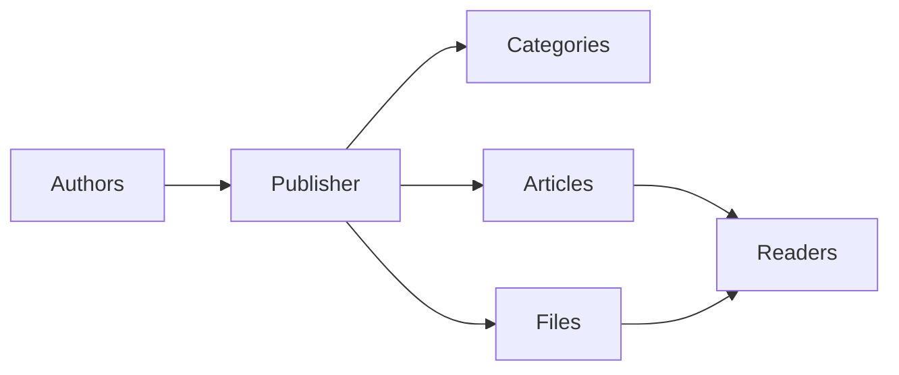
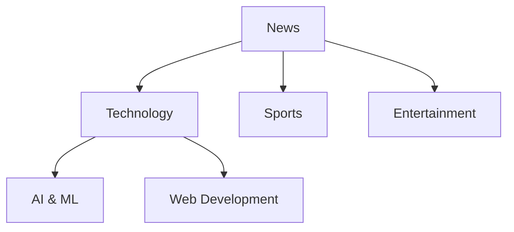
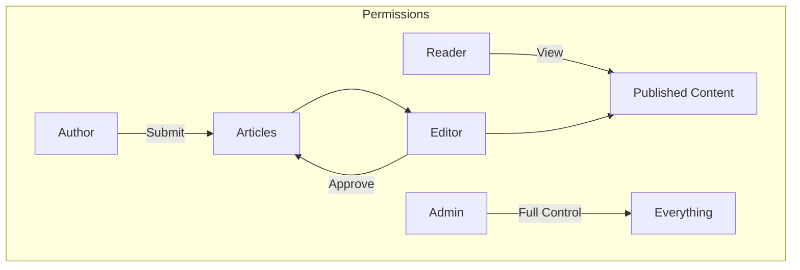
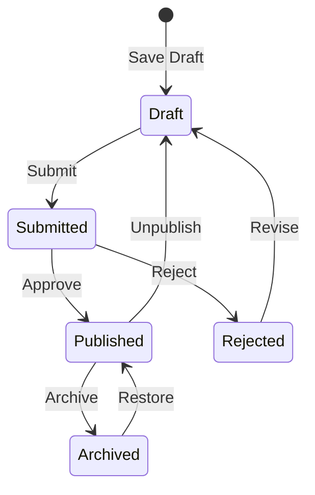

# Bermula dengan Penerbit

> Panduan langkah demi langkah untuk menyediakan dan menggunakan modul Penerbit news/blog.

---

## Apakah itu Penerbit?

Penerbit ialah modul pengurusan kandungan utama untuk XOOPS, direka untuk:

- **Laman Berita** - Terbitkan artikel dengan kategori
- **Blog** - Blogging peribadi atau berbilang pengarang``
- **Dokumentasi** - Pangkalan pengetahuan yang teratur
- **Portal Kandungan** - Kandungan media campuran

---

## Persediaan Pantas

### Langkah 1: Pasang Penerbit

1. Muat turun daripada [GitHub](https://github.com/XoopsModules25x/publisher)
2. Muat naik ke `modules/publisher/`
3. Pergi ke Pentadbir → Modul → Pasang

### Langkah 2: Cipta Kategori

1. Pentadbir → Penerbit → Kategori
2. Klik "Tambah Kategori"
3. Isikan:
   - **Nama**: Nama kategori
   - **Penerangan**: Apa yang terkandung dalam kategori ini
   - **Imej**: Imej kategori pilihan
4. Tetapkan kebenaran (siapa yang boleh submit/view)
5. Jimat

### Langkah 3: Konfigurasikan Tetapan

1. Pentadbir → Penerbit → Keutamaan
2. Tetapan utama untuk mengkonfigurasi:

| Tetapan | Disyorkan | Penerangan |
|---------|-------------|-------------|
| Item setiap halaman | 10-20 | Artikel mengenai indeks |
| Editor | TinyMCE/CKEditor | Penyunting teks kaya |
| Benarkan penilaian | Ya | Maklum balas pembaca |
| Benarkan ulasan | Ya | Perbincangan |
| Autoluluskan | Tidak | Kawalan editorial |

### Langkah 4: Cipta Artikel Pertama Anda

1. Menu utama → Penerbit → Hantar Artikel
2. Isi borang:
   - **Tajuk**: Tajuk artikel
   - **Kategori**: Di mana ia berada
   - **Ringkasan**: Penerangan ringkas
   - **Badan**: Kandungan artikel penuh
3. Tambah elemen pilihan:
   - Imej pilihan
   - Lampiran fail
   - SEO tetapan
4. Serahkan untuk semakan atau terbitkan

---

## Peranan Pengguna

### Pembaca
- Lihat artikel yang diterbitkan
- Nilai dan komen
- Cari kandungan

### Pengarang
- Hantar artikel baharu
- Edit artikel sendiri
- Lampirkan fail

### Editor
- Approve/reject penyerahan
- Edit mana-mana artikel
- Uruskan kategori

### Pentadbir
- Kawalan modul penuh
- Konfigurasikan tetapan
- Urus kebenaran

---

## Menulis Artikel

### Editor Artikel
```
┌─────────────────────────────────────────────────────┐
│ Title: [Your Article Title                        ] │
├─────────────────────────────────────────────────────┤
│ Category: [Select Category          ▼]              │
├─────────────────────────────────────────────────────┤
│ Summary:                                            │
│ ┌─────────────────────────────────────────────────┐ │
│ │ Brief description shown in listings...          │ │
│ └─────────────────────────────────────────────────┘ │
├─────────────────────────────────────────────────────┤
│ Body:                                               │
│ ┌─────────────────────────────────────────────────┐ │
│ │ [B] [I] [U] [Link] [Image] [Code]               │ │
│ ├─────────────────────────────────────────────────┤ │
│ │                                                  │ │
│ │ Full article content goes here...               │ │
│ │                                                  │ │
│ └─────────────────────────────────────────────────┘ │
├─────────────────────────────────────────────────────┤
│ [Submit] [Preview] [Save Draft]                     │
└─────────────────────────────────────────────────────┘
```
### Amalan Terbaik

1. **Tajuk yang menarik** - Tajuk yang jelas dan menarik
2. **Ringkasan yang baik** - Tarik pembaca untuk mengklik
3. **Kandungan berstruktur** - Gunakan tajuk, senarai, imej
4. **Pengkategorian yang betul** - Bantu pembaca mencari kandungan
5. **SEO pengoptimuman** - Kata kunci dalam tajuk dan kandungan

---

## Menguruskan Kandungan

### Aliran Status Artikel

### Penerangan Status

| Status | Penerangan |
|--------|--------------|
| Draf | Kerja sedang dijalankan |
| Diserahkan | Menunggu semakan |
| Diterbitkan | Langsung di tapak |
| Tamat tempoh | Tarikh tamat tempoh yang lalu |
| Ditolak | Memerlukan semakan |
| Diarkibkan | Dialih keluar daripada penyenaraian |

---

## Navigasi

### Mengakses Penerbit

- **Menu Utama** → Penerbit
- **Langsung URL**: `yoursite.com/modules/publisher/`

### Halaman Utama

| Halaman | URL | Tujuan |
|------|-----|---------|
| Indeks | `/modules/publisher/` | Penyenaraian artikel |
| Kategori | `/modules/publisher/category.php?id=X` | Artikel kategori |
| Artikel | `/modules/publisher/item.php?itemid=X` | Artikel tunggal |
| Serahkan | `/modules/publisher/submit.php` | Artikel baharu |
| Cari | `/modules/publisher/search.php` | Cari artikel |

---

## Blok

Penerbit menyediakan beberapa blok untuk tapak anda:

### Artikel Terkini
Memaparkan artikel terkini yang diterbitkan

### Menu Kategori
Navigasi mengikut kategori

### Artikel Popular
Kandungan yang paling banyak dilihat

### Artikel Rawak
Pamerkan kandungan rawak

### Sorotan
Artikel pilihan

---

## Dokumentasi Berkaitan

- Mencipta dan Menyunting Artikel
- Menguruskan Kategori
- Memperluaskan Penerbit

---

#XOOPS #penerbit #panduan-pengguna #bermula #cms