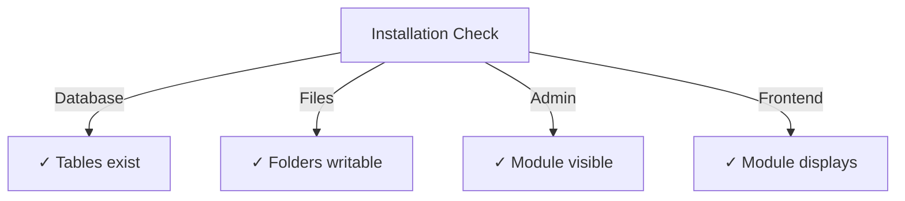

# Panduan Pemasangan Penerbit

> Lengkapkan arahan untuk memasang dan mengkonfigurasi modul Penerbit untuk XOOPS CMS.

---

## Keperluan Sistem

### Keperluan Minimum

| Keperluan | Versi | Nota |
|-------------|---------|-------|
| XOOPS | 2.5.10+ | Teras CMS platform |
| PHP | 7.1+ | PHP 8.x disyorkan |
| MySQL | 5.7+ | Pelayan pangkalan data |
| Pelayan Web | Apache/Nginx | Dengan sokongan tulis semula |

### PHP Sambungan
```
- PDO (PHP Data Objects)
- pdo_mysql or mysqli
- mb_string (multibyte strings)
- curl (for external content)
- json
- gd (image processing)
```
### Ruang Cakera

- **Fail modul**: ~5 MB
- **Direktori cache**: 50+ MB disyorkan
- **Muat naik direktori**: Seperti yang diperlukan untuk kandungan

---

## Senarai Semak Pra-Pemasangan

Sebelum memasang Penerbit, sahkan:

- [ ] XOOPS teras dipasang dan berjalan
- [ ] Akaun pentadbir mempunyai kebenaran pengurusan modul
- [ ] Sandaran pangkalan data dibuat
- [ ] Kebenaran fail membenarkan akses tulis kepada direktori `/modules/`
- [ ] PHP had memori sekurang-kurangnya 128 MB
- [ ] Had saiz muat naik fail adalah sesuai (min 10 MB)

---

## Langkah Pemasangan

### Langkah 1: Muat Turun Penerbit

#### Pilihan A: Daripada GitHub (Disyorkan)
```bash
# Navigate to modules directory
cd /path/to/xoops/htdocs/modules/

# Clone the repository
git clone https://github.com/XoopsModules25x/publisher.git

# Verify download
ls -la publisher/
```
#### Pilihan B: Muat Turun Manual

1. Lawati [GitHub Publisher Releases](https://github.com/XoopsModules25x/publisher/releases)
2. Muat turun fail `.zip` terkini
3. Ekstrak kepada `modules/publisher/`

### Langkah 2: Tetapkan Kebenaran Fail
```bash
# Set proper ownership
chown -R www-data:www-data /path/to/xoops/htdocs/modules/publisher

# Set directory permissions (755)
find publisher -type d -exec chmod 755 {} \;

# Set file permissions (644)
find publisher -type f -exec chmod 644 {} \;

# Make scripts executable
chmod 755 publisher/admin/index.php
chmod 755 publisher/index.php
```
### Langkah 3: Pasang melalui XOOPS Admin

1. Log masuk ke **XOOPS Admin Panel** sebagai pentadbir
2. Navigasi ke **Sistem → Modul**
3. Klik **Pasang Modul**
4. Cari **Penerbit** dalam senarai
5. Klik butang **Pasang**
6. Tunggu pemasangan selesai (menunjukkan jadual pangkalan data yang dibuat)
```
Installation Progress:
✓ Tables created
✓ Configuration initialized
✓ Permissions set
✓ Cache cleared
Installation Complete!
```
---

## Persediaan Awal

### Langkah 1: Akses Pentadbir Penerbit

1. Pergi ke **Panel Pentadbiran → Modul**
2. Cari modul **Penerbit**
3. Klik pautan **Admin**
4. Anda kini berada dalam Pentadbiran Penerbit

### Langkah 2: Konfigurasi Keutamaan Modul

1. Klik **Preferences** dalam menu sebelah kiri
2. Konfigurasikan tetapan asas:
```
General Settings:
- Editor: Select your WYSIWYG editor
- Items per page: 10
- Show breadcrumb: Yes
- Allow comments: Yes
- Allow ratings: Yes

SEO Settings:
- SEO URLs: No (enable later if needed)
- URL rewriting: None

Upload Settings:
- Max upload size: 5 MB
- Allowed file types: jpg, png, gif, pdf, doc, docx
```
3. Klik **Simpan Tetapan**

### Langkah 3: Buat Kategori Pertama

1. Klik **Kategori** dalam menu kiri
2. Klik **Tambah Kategori**
3. Isi borang:
```
Category Name: News
Description: Latest news and updates
Image: (optional) Upload category image
Parent Category: (leave blank for top-level)
Status: Enabled
```
4. Klik **Simpan Kategori**

### Langkah 4: Sahkan Pemasangan

Semak penunjuk ini:

#### Semakan Pangkalan Data
```bash
mysql -u xoops_user -p xoops_database
mysql> SHOW TABLES LIKE 'publisher%';

# Should show tables:
# - publisher_categories
# - publisher_items
# - publisher_comments
# - publisher_files
```
#### Semakan Hadapan

1. Lawati halaman utama XOOPS anda
2. Cari blok **Penerbit** atau **Berita**
3. Hendaklah memaparkan artikel terbaru

---

## Konfigurasi Selepas Pemasangan

### Pemilihan Editor

Penerbit menyokong berbilang WYSIWYG editor:

| Editor | Kebaikan | Keburukan |
|--------|------|------|
| FCKeditor | Kaya dengan ciri | Lebih lama, lebih besar |
| CKEditor | Standard moden | Kerumitan konfigurasi |
| TinyMCE | Ringan | Ciri terhad |
| DHTML Editor | Asas | Sangat asas |

**Untuk menukar editor:**

1. Pergi ke **Preferences**
2. Tatal ke tetapan **Editor**
3. Pilih daripada lungsur turun
4. Simpan dan uji

### Muat Naik Persediaan Direktori
```bash
# Create upload directories
mkdir -p /path/to/xoops/uploads/publisher/
mkdir -p /path/to/xoops/uploads/publisher/categories/
mkdir -p /path/to/xoops/uploads/publisher/images/
mkdir -p /path/to/xoops/uploads/publisher/files/

# Set permissions
chmod 755 /path/to/xoops/uploads/publisher/
chmod 755 /path/to/xoops/uploads/publisher/*
```
### Konfigurasikan Saiz Imej

Dalam Keutamaan, tetapkan saiz lakaran kenit:
```
Category image size: 300 x 200 px
Article image size: 600 x 400 px
Thumbnail size: 150 x 100 px
```
---

## Langkah Selepas Pemasangan

### 1. Tetapkan Kebenaran Kumpulan

1. Pergi ke **Kebenaran** dalam menu pentadbir
2. Konfigurasikan akses untuk kumpulan:
   - Tanpa Nama: Lihat sahaja
   - Pengguna Berdaftar: Hantar artikel
   - Editor: Approve/edit artikel
   - Pentadbir: Akses penuh

### 2. Konfigurasi Keterlihatan Modul

1. Pergi ke **Blocks** dalam XOOPS admin
2. Cari blok Penerbit:
   - Penerbit - Artikel Terkini
   - Penerbit - Kategori
   - Penerbit - Arkib
3. Konfigurasikan keterlihatan blok setiap halaman

### 3. Import Kandungan Ujian (Pilihan)

Untuk ujian, import contoh artikel:

1. Pergi ke **Pentadbir Penerbit → Import**
2. Pilih **Contoh Kandungan**
3. Klik **Import**

### 4. Dayakan SEO URL (Pilihan)

Untuk URL mesra carian:

1. Pergi ke **Preferences**
2. Tetapkan **SEO URL**: Ya
3. Dayakan penulisan semula **.htaccess**
4. Sahkan fail `.htaccess` wujud dalam folder Penerbit
```apache
# .htaccess example
<IfModule mod_rewrite.c>
    RewriteEngine On
    RewriteBase /modules/publisher/
    RewriteRule ^category/([0-9]+)-(.*)\.html$ index.php?op=showcategory&categoryid=$1 [L]
    RewriteRule ^article/([0-9]+)-(.*)\.html$ index.php?op=showitem&itemid=$1 [L]
</IfModule>
```
---

## Menyelesaikan masalah Pemasangan

### Masalah: Modul tidak muncul dalam pentadbir

**Penyelesaian:**
```bash
# Check file permissions
ls -la /path/to/xoops/modules/publisher/

# Check xoops_version.php exists
ls /path/to/xoops/modules/publisher/xoops_version.php

# Verify PHP syntax
php -l /path/to/xoops/modules/publisher/xoops_version.php
```
### Masalah: Jadual pangkalan data tidak dibuat

**Penyelesaian:**
1. Semak pengguna MySQL mempunyai CREATE TABLE keistimewaan
2. Semak log ralat pangkalan data:   
```bash
   mysql> SHOW WARNINGS;
   ```3. Import SQL secara manual:   
```bash
   mysql -u user -p database < modules/publisher/sql/mysql.sql
   
```
### Masalah: Muat naik fail gagal

**Penyelesaian:**
```bash
# Check directory exists and is writable
stat /path/to/xoops/uploads/publisher/

# Fix permissions
chmod 777 /path/to/xoops/uploads/publisher/

# Verify PHP settings
php -i | grep upload_max_filesize
```
### Masalah: Ralat "Halaman tidak ditemui".

**Penyelesaian:**
1. Semak `.htaccess` fail ada
2. Sahkan Apache `mod_rewrite` didayakan:   
```bash
   a2enmod rewrite
   systemctl restart apache2
   ```3. Semak `AllowOverride All` dalam konfigurasi Apache

---

## Naik taraf daripada Versi Sebelumnya

### Daripada Penerbit 1.x hingga 2.x

1. **Pemasangan semasa sandaran:**   
```bash
   cp -r modules/publisher/ modules/publisher-backup/
   mysqldump -u user -p database > publisher-backup.sql
   
```
2. **Muat turun Penerbit 2.x**

3. **Tulis ganti fail:**   
```bash
   rm -rf modules/publisher/
   unzip publisher-2.0.zip -d modules/
   
```
4. **Jalankan kemas kini:**
   - Pergi ke **Pentadbir → Penerbit → Kemas Kini**
   - Klik **Kemas kini Pangkalan Data**
   - Tunggu sehingga selesai

5. **Sahkan:**
   - Semak semua paparan artikel dengan betul
   - Sahkan kebenaran adalah utuh
   - Uji muat naik fail

---

## Pertimbangan Keselamatan

### Kebenaran Fail
```
- Core files: 644 (readable by web server)
- Directories: 755 (browseable by web server)
- Upload directories: 755 or 777
- Config files: 600 (not readable by web)
```
### Lumpuhkan Akses Terus kepada Fail Sensitif

Cipta `.htaccess` dalam direktori muat naik:
```apache
<FilesMatch "\.(php|phtml|php3|php4|php5|phtml)$">
    Deny from all
</FilesMatch>
```
### Keselamatan Pangkalan Data
```bash
# Use strong password
ALTER USER 'publisher_user'@'localhost' IDENTIFIED BY 'strong_password_here';

# Grant minimal permissions
GRANT SELECT, INSERT, UPDATE, DELETE ON publisher_db.* TO 'publisher_user'@'localhost';
FLUSH PRIVILEGES;
```
---

## Senarai Semak Pengesahan

Selepas pemasangan, sahkan:

- [ ] Modul muncul dalam senarai modul pentadbir
- [ ] Boleh mengakses bahagian pentadbir Penerbit
- [ ] Boleh mencipta kategori
- [ ] Boleh mencipta artikel
- [ ] Artikel dipaparkan pada bahagian hadapan
- [ ] Muat naik fail berfungsi
- [ ] Imej dipaparkan dengan betul
- [ ] Kebenaran digunakan dengan betul
- [ ] Jadual pangkalan data dicipta
- [ ] Direktori cache boleh ditulis

---

## Langkah Seterusnya

Selepas pemasangan berjaya:

1. Baca Panduan Konfigurasi Asas
2. Buat Artikel pertama anda
3. Sediakan Kebenaran Kumpulan
4. Semakan Pengurusan Kategori

---

## Sokongan & Sumber

- **Isu GitHub**: [Isu Penerbit](https://github.com/XoopsModules25x/publisher/issues)
- **XOOPS Forum**: [Sokongan Komuniti](https://www.XOOPS.org/modules/newbb/)
- **Wiki GitHub**: [Bantuan Pemasangan](https://github.com/XoopsModules25x/publisher/wiki)

---

#penerbit #pemasangan #persediaan #XOOPS #modul #konfigurasi