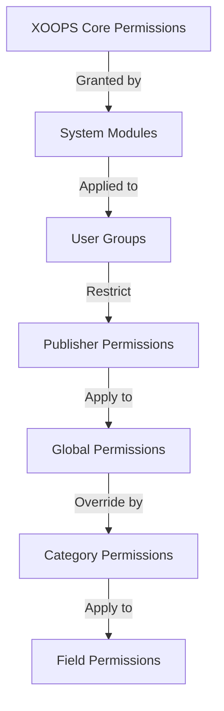

# Persediaan Kebenaran Penerbit

> Panduan lengkap untuk mengkonfigurasi kebenaran kumpulan, kawalan akses dan mengurus akses pengguna dalam Penerbit.

---

## Asas Kebenaran

### Apakah Kebenaran?

Kebenaran mengawal perkara yang boleh dilakukan oleh kumpulan pengguna yang berbeza dalam Penerbit:
```
Who can:
  - View articles
  - Submit articles
  - Edit articles
  - Approve articles
  - Manage categories
  - Configure settings
```
### Tahap Kebenaran
```
Anonymous
  └── View published articles only

Registered Users
  ├── View articles
  ├── Submit articles (pending approval)
  └── Edit own articles

Editors/Moderators
  ├── All registered permissions
  ├── Approve articles
  ├── Edit all articles
  └── Manage some categories

Administrators
  └── Full access to everything
```
---

## Pengurusan Kebenaran Akses

### Navigasi ke Kebenaran
```
Admin Panel
└── Modules
    └── Publisher
        ├── Permissions
        ├── Category Permissions
        └── Group Management
```
### Akses Pantas

1. Log masuk sebagai **Pentadbir**
2. Pergi ke **Admin → Modules**
3. Klik **Penerbit → Pentadbir**
4. Klik **Kebenaran** dalam menu kiri

---

## Kebenaran Global

### Kebenaran Tahap Modul

Kawal akses kepada modul dan ciri Penerbit:
```
Permissions configuration view:
┌─────────────────────────────────────┐
│ Permission             │ Anon │ Reg │ Editor │ Admin │
├────────────────────────┼──────┼─────┼────────┼───────┤
│ View articles          │  ✓   │  ✓  │   ✓    │  ✓   │
│ Submit articles        │  ✗   │  ✓  │   ✓    │  ✓   │
│ Edit own articles      │  ✗   │  ✓  │   ✓    │  ✓   │
│ Edit all articles      │  ✗   │  ✗  │   ✓    │  ✓   │
│ Approve articles       │  ✗   │  ✗  │   ✓    │  ✓   │
│ Manage categories      │  ✗   │  ✗  │   ✗    │  ✓   │
│ Access admin panel     │  ✗   │  ✗  │   ✓    │  ✓   │
└─────────────────────────────────────┘
```
### Perihalan Kebenaran

| Kebenaran | Pengguna | Kesan |
|------------|-------|--------|
| **Lihat artikel** | Semua kumpulan | Boleh melihat artikel yang diterbitkan di bahagian hadapan |
| **Serahkan artikel** | Berdaftar+ | Boleh buat artikel baharu (menunggu kelulusan) |
| **Edit artikel sendiri** | Berdaftar+ | Boleh edit/delete artikel mereka sendiri |
| **Edit semua artikel** | Editor+ | Boleh mengedit mana-mana artikel pengguna |
| **Padam artikel sendiri** | Berdaftar+ | Boleh memadamkan artikel mereka sendiri yang tidak diterbitkan |
| **Padam semua artikel** | Editor+ | Boleh memadam sebarang artikel |
| **Luluskan artikel** | Editor+ | Boleh menerbitkan artikel yang belum selesai |
| **Uruskan kategori** | Pentadbir | Cipta, edit, padamkan kategori |
| **Akses pentadbir** | Editor+ | Akses antara muka pentadbir |

---

## Konfigurasikan Kebenaran Global

### Langkah 1: Akses Tetapan Kebenaran

1. Pergi ke **Admin → Modules**
2. Cari **Penerbit**
3. Klik **Kebenaran** (atau pautan Pentadbir kemudian Kebenaran)
4. Anda melihat matriks kebenaran

### Langkah 2: Tetapkan Kebenaran Kumpulan

Untuk setiap kumpulan, konfigurasikan perkara yang boleh mereka lakukan:

#### Pengguna Tanpa Nama
```yaml
Anonymous Group Permissions:
  View articles: ✓ YES
  Submit articles: ✗ NO
  Edit articles: ✗ NO
  Delete articles: ✗ NO
  Approve articles: ✗ NO
  Manage categories: ✗ NO
  Admin access: ✗ NO

Result: Anonymous users can only view published content
```
#### Pengguna Berdaftar
```yaml
Registered Group Permissions:
  View articles: ✓ YES
  Submit articles: ✓ YES (with approval required)
  Edit own articles: ✓ YES
  Edit all articles: ✗ NO
  Delete own articles: ✓ YES (drafts only)
  Delete all articles: ✗ NO
  Approve articles: ✗ NO
  Manage categories: ✗ NO
  Admin access: ✗ NO

Result: Registered users can contribute content after approval
```
#### Kumpulan Editor
```yaml
Editors Group Permissions:
  View articles: ✓ YES
  Submit articles: ✓ YES
  Edit own articles: ✓ YES
  Edit all articles: ✓ YES
  Delete own articles: ✓ YES
  Delete all articles: ✓ YES
  Approve articles: ✓ YES
  Manage categories: ✓ LIMITED
  Admin access: ✓ YES
  Configure settings: ✗ NO

Result: Editors manage content but not settings
```
#### Pentadbir
```yaml
Admins Group Permissions:
  ✓ FULL ACCESS to all features

  - All editor permissions
  - Manage all categories
  - Configure all settings
  - Manage permissions
  - Install/uninstall
```
### Langkah 3: Simpan Kebenaran

1. Konfigurasikan kebenaran setiap kumpulan
2. Tandakan kotak untuk tindakan yang dibenarkan
3. Nyahtanda kotak untuk tindakan yang ditolak
4. Klik **Simpan Kebenaran**
5. Mesej pengesahan muncul

---

## Kebenaran Peringkat Kategori

### Tetapkan Akses Kategori

Kawal siapa yang boleh view/submit kepada kategori tertentu:
```
Admin → Publisher → Categories
→ Select category → Permissions
```
### Matriks Kebenaran Kategori
```
                 Anonymous  Registered  Editor  Admin
View category        ✓         ✓         ✓       ✓
Submit to category   ✗         ✓         ✓       ✓
Edit own in category ✗         ✓         ✓       ✓
Edit all in category ✗         ✗         ✓       ✓
Approve in category  ✗         ✗         ✓       ✓
Manage category      ✗         ✗         ✗       ✓
```
### Konfigurasi Kebenaran Kategori

1. Pergi ke **Kategori** admin
2. Cari kategori
3. Klik butang **Kebenaran**
4. Untuk setiap kumpulan, pilih:
   - [ ] Lihat kategori ini
   - [ ] Hantar artikel
   - [ ] Edit artikel sendiri
   - [ ] Edit semua artikel
   - [ ] Luluskan artikel
   - [ ] Urus kategori
5. Klik **Simpan**

### Contoh Kebenaran Kategori

#### Kategori Berita Awam
```
Anonymous: View only
Registered: View + Submit (pending approval)
Editors: Approve + Edit
Admins: Full control
```
#### Kategori Kemas Kini Dalaman
```
Anonymous: No access
Registered: View only
Editors: Submit + Approve
Admins: Full control
```
#### Kategori Blog Tetamu
```
Anonymous: View only
Registered: Submit (pending approval)
Editors: Approve
Admins: Full control
```
---

## Kebenaran Peringkat Medan

### Keterlihatan Medan Borang Kawalan

Hadkan medan borang yang mana pengguna boleh see/edit:
```
Admin → Publisher → Permissions → Fields
```
### Pilihan Medan
```yaml
Visible Fields for Registered Users:
  ✓ Title
  ✓ Description
  ✓ Content (body)
  ✓ Featured image
  ✓ Category
  ✓ Tags
  ✗ Author (auto-set)
  ✗ Publication date (editors only)
  ✗ Scheduled date (editors only)
  ✗ Featured flag (editors only)
  ✗ Permissions (admins only)
```
### Contoh

#### Penyerahan Terhad untuk Berdaftar

Pengguna berdaftar melihat lebih sedikit pilihan:
```
Available fields:
  - Title ✓
  - Description ✓
  - Content ✓
  - Featured image ✓
  - Category ✓

Hidden fields:
  - Author (auto-current user)
  - Publication date (editors decide)
  - Scheduled date (admins only)
  - Featured status (editors choose)
```
#### Borang Penuh untuk Editor

Editor melihat semua pilihan:
```
Available fields:
  - All basic fields
  - All metadata
  - Author selection ✓
  - Publication date/time ✓
  - Scheduled date ✓
  - Featured status ✓
  - Expiration date ✓
  - Permissions ✓
```
---

## Konfigurasi Kumpulan Pengguna

### Buat Kumpulan Tersuai

1. Pergi ke **Pentadbir → Pengguna → Kumpulan**
2. Klik **Buat Kumpulan**
3. Masukkan butiran kumpulan:
```
Group Name: "Community Bloggers"
Group Description: "Users who contribute blog content"
Type: Regular group
```
4. Klik **Simpan Kumpulan**
5. Kembali ke kebenaran Penerbit
6. Tetapkan kebenaran untuk kumpulan baharu

### Contoh Kumpulan
```
Suggested Groups for Publisher:

Group: Contributors
  - Regular members who submit articles
  - Can edit own articles
  - Cannot approve articles

Group: Reviewers
  - Can see submitted articles
  - Can approve/reject articles
  - Cannot delete others' articles

Group: Editors
  - Can edit any article
  - Can approve articles
  - Can moderate comments
  - Can manage some categories

Group: Publishers
  - Can edit any article
  - Can publish directly (no approval)
  - Can manage all categories
  - Can configure settings
```
---

## Hierarki Kebenaran

### Aliran Kebenaran

### Warisan Kebenaran
```
Base: Global module permissions
  ↓
Category: Overrides for specific categories
  ↓
Field: Further restricts available fields
  ↓
User: Has permission if ALL levels allow
```
**Contoh:**
```
User wants to edit article:
1. User group must have "edit articles" permission (global)
2. Category must allow editing (category level)
3. Field restrictions must allow (if applicable)
4. User must be author OR editor (for own vs all)

If ANY level denies → Permission denied
```
---

## Kebenaran Aliran Kerja Kelulusan

### Konfigurasikan Kelulusan Penyerahan

Kawal sama ada artikel memerlukan kelulusan:
```
Admin → Publisher → Preferences → Workflow
```
#### Pilihan Kelulusan
```yaml
Submission Workflow:
  Require Approval: Yes

  For Registered Users:
    - New articles: Draft (pending approval)
    - Editors must approve
    - User can edit while pending
    - After approval: User can still edit

  For Editors:
    - New articles: Publish directly (optional)
    - Skip approval queue
    - Or always require approval
```
#### Konfigurasikan Setiap Kumpulan

1. Pergi ke Keutamaan
2. Cari "Aliran Kerja Penyerahan"
3. Untuk setiap kumpulan, tetapkan:
```
Group: Registered Users
  Require approval: ✓ YES
  Default status: Draft
  Can modify while pending: ✓ YES

Group: Editors
  Require approval: ✗ NO
  Default status: Published
  Can modify published: ✓ YES
```
4. Klik **Simpan**

---

## Artikel Sederhana

### Luluskan Artikel Belum Selesai

Untuk pengguna dengan kebenaran "luluskan artikel":

1. Pergi ke **Pentadbir → Penerbit → Artikel**
2. Tapis mengikut **Status**: Belum selesai
3. Klik artikel untuk menyemak
4. Semak kualiti kandungan
5. Tetapkan **Status**: Diterbitkan
6. Pilihan: Tambahkan nota editorial
7. Klik **Simpan**

### Tolak Artikel

Jika artikel tidak memenuhi piawaian:

1. Buka artikel
2. Tetapkan **Status**: Draf
3. Tambah sebab penolakan (dalam komen atau e-mel)
4. Klik **Simpan**
5. Hantar mesej kepada pengarang yang menerangkan penolakan

### Komen Sederhana

Jika menyederhanakan ulasan:

1. Pergi ke **Pentadbir → Penerbit → Komen**
2. Tapis mengikut **Status**: Belum selesai
3. Semak ulasan
4. Pilihan:
   - Luluskan: Klik **Luluskan**
   - Tolak: Klik **Padam**
   - Edit: Klik **Edit**, betulkan, simpan
5. Klik **Simpan**

---

## Urus Akses Pengguna

### Lihat Kumpulan Pengguna

Lihat pengguna yang tergolong dalam kumpulan:
```
Admin → Users → User Groups

For each user:
  - Primary group (one)
  - Secondary groups (multiple)

Permissions apply from all groups (union)
```
### Tambah Pengguna ke Kumpulan

1. Pergi ke **Pentadbir → Pengguna**
2. Cari pengguna
3. Klik **Edit**
4. Di bawah **Kumpulan**, semak kumpulan untuk ditambahkan
5. Klik **Simpan**

### Tukar Kebenaran Pengguna

Untuk pengguna individu (jika disokong):

1. Pergi ke Pentadbir pengguna
2. Cari pengguna
3. Klik **Edit**
4. Cari penggantian kebenaran individu
5. Konfigurasikan mengikut keperluan
6. Klik **Simpan**

---

## Senario Kebenaran Biasa

### Senario 1: Buka Blog

Benarkan sesiapa sahaja menyerahkan:
```
Anonymous: View
Registered: Submit, edit own, delete own
Editors: Approve, edit all, delete all
Admins: Full control

Result: Open community blog
```
### Senario 2: Tapak Berita Disederhanakan

Proses kelulusan yang ketat:
```
Anonymous: View only
Registered: Cannot submit
Editors: Submit, approve others
Admins: Full control

Result: Only approved professionals publish
```
### Senario 3: Blog Kakitangan

Pekerja boleh menyumbang:
```
Create group: "Staff"
Anonymous: View
Registered: View only (non-staff)
Staff: Submit, edit own, publish directly
Admins: Full control

Result: Staff-authored blog
```
### Senario 4: Berbilang Kategori dengan Editor Berbeza

Editor yang berbeza untuk kategori yang berbeza:
```
News category:
  Editors group A: Full control

Reviews category:
  Editors group B: Full control

Tutorials category:
  Editors group C: Full control

Result: Decentralized editorial control
```
---

## Ujian Kebenaran

### Sahkan Kebenaran Berfungsi

1. Buat pengguna ujian dalam setiap kumpulan
2. Log masuk sebagai setiap pengguna ujian
3. Cuba untuk:
   - Lihat artikel
   - Hantar artikel (harus membuat draf jika dibenarkan)
   - Edit artikel (sendiri dan lain-lain)
   - Padamkan artikel
   - Akses panel pentadbir
   - Kategori akses

4. Sahkan keputusan sepadan dengan kebenaran yang dijangkakan

### Kes Ujian Biasa
```
Test Case 1: Anonymous user
  [ ] Can view published articles: ✓
  [ ] Cannot submit articles: ✓
  [ ] Cannot access admin: ✓

Test Case 2: Registered user
  [ ] Can submit articles: ✓
  [ ] Articles go to Draft: ✓
  [ ] Can edit own article: ✓
  [ ] Cannot edit others: ✓
  [ ] Cannot access admin: ✓

Test Case 3: Editor
  [ ] Can approve articles: ✓
  [ ] Can edit any article: ✓
  [ ] Can access admin: ✓
  [ ] Cannot delete all: ✓ (or ✓ if allowed)

Test Case 4: Admin
  [ ] Can do everything: ✓
```
---

## Kebenaran Penyelesaian Masalah

### Masalah: Pengguna tidak boleh menghantar artikel

**Semak:**
```
1. User group has "submit articles" permission
   Admin → Publisher → Permissions

2. User belongs to allowed group
   Admin → Users → Edit user → Groups

3. Category allows submission from user's group
   Admin → Publisher → Categories → Permissions

4. User is registered (not anonymous)
```
**Penyelesaian:**
```bash
1. Verify registered user group has submission permission
2. Add user to appropriate group
3. Check category permissions
4. Clear user session cache
```
### Masalah: Editor tidak dapat meluluskan artikel

**Semak:**
```
1. Editor group has "approve articles" permission
2. Articles exist with "Pending" status
3. Editor is in correct group
4. Category allows approval from editor's group
```
**Penyelesaian:**
```bash
1. Go to Permissions, check "approve articles" is checked for editor group
2. Create test article, set to Draft
3. Try to approve as editor
4. Check error messages in system log
```
### Masalah: Boleh melihat artikel tetapi tidak boleh mengakses kategori

**Semak:**
```
1. Category is not disabled/hidden
2. Category permissions allow viewing
3. User's group is permitted to view category
4. Category is published
```
**Penyelesaian:**
```bash
1. Go to Categories, check category status is "Enabled"
2. Check category permissions are set
3. Add user's group to category view permission
```
### Masalah: Kebenaran ditukar tetapi tidak berkuat kuasa

**Penyelesaian:**
```bash
1. Clear cache: Admin → Tools → Clear Cache
2. Clear session: Logout and login again
3. Check system log for errors
4. Verify permissions actually saved
5. Try different browser/incognito window
```
---

## Kebenaran Sandaran & Eksport

### Kebenaran Eksport

Sesetengah sistem membenarkan pengeksportan:

1. Pergi ke **Pentadbir → Penerbit → Alat**
2. Klik **Kebenaran Eksport**
3. Simpan `.xml` atau `.json` fail
4. Simpan sebagai sandaran

### Kebenaran Import

Pulihkan daripada sandaran:

1. Pergi ke **Pentadbir → Penerbit → Alat**
2. Klik **Kebenaran Import**
3. Pilih fail sandaran
4. Semak semula perubahan
5. Klik **Import**

---

## Amalan Terbaik

### Senarai Semak Konfigurasi Kebenaran

- [ ] Tentukan kumpulan pengguna
- [ ] Berikan nama yang jelas kepada kumpulan
- [ ] Tetapkan kebenaran asas untuk setiap kumpulan
- [ ] Uji setiap tahap kebenaran
- [ ] Dokumen struktur kebenaran
- [ ] Buat aliran kerja kelulusan
- [ ] Latih editor mengenai kesederhanaan
- [ ] Pantau penggunaan kebenaran
- [ ] Semak kebenaran setiap suku tahun
- [ ] Tetapan kebenaran sandaran

### Amalan Terbaik Keselamatan
```
✓ Principle of Least Privilege
  - Grant minimum necessary permissions

✓ Role-Based Access
  - Use groups for roles (editor, moderator, etc)

✓ Audit Permissions
  - Review who has what access

✓ Separate Duties
  - Submitter, approver, publisher are different

✓ Regular Review
  - Check permissions quarterly
  - Remove access when users leave
  - Update for new requirements
```
---

## Panduan Berkaitan

- Mencipta Artikel
- Menguruskan Kategori
- Konfigurasi Asas
- Pemasangan

---

## Langkah Seterusnya

- Sediakan Kebenaran untuk aliran kerja anda
- Buat Artikel dengan kebenaran yang betul
- Konfigurasikan Kategori dengan kebenaran
- Latih pengguna tentang penciptaan artikel

---

#penerbit #kebenaran #kumpulan #kawalan akses #keselamatan #kesederhanaan #XOOPS