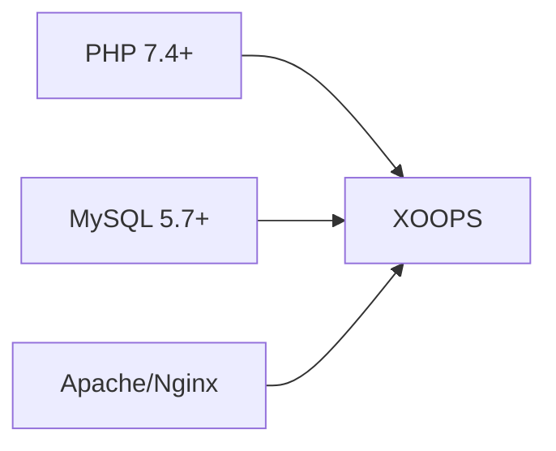
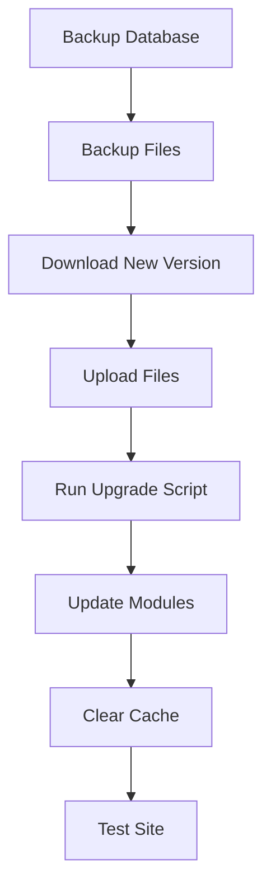

> Soalan dan jawapan biasa tentang memasang XOOPS.

---

## Pra-Pemasangan

### S: Apakah keperluan pelayan minimum?

**A:** XOOPS 2.5.x memerlukan:
- PHP 7.4 atau lebih tinggi (PHP 8.x disyorkan)
- MySQL 5.7+ atau MariaDB 10.3+
- Apache dengan mod_rewrite atau Nginx
- Sekurang-kurangnya 64MB PHP had memori (128MB+ disyorkan)

### S: Bolehkah saya memasang XOOPS pada pengehosan kongsi?

**J:** Ya, XOOPS berfungsi dengan baik pada kebanyakan pengehosan kongsi yang memenuhi keperluan. Semak sama ada hos anda menyediakan:
- PHP dengan sambungan yang diperlukan (mysqli, gd, curl, json, mbstring)
- Akses pangkalan data MySQL
- Keupayaan muat naik fail
- Sokongan .htaccess (untuk Apache)

### S: Sambungan PHP yang manakah diperlukan?

**J:** Sambungan yang diperlukan:
- `mysqli` - Kesalinghubungan pangkalan data
- `gd` - Pemprosesan imej
- `json` - JSON pengendalian
- `mbstring` - Sokongan rentetan berbilangbait

Disyorkan:
- `curl` - Panggilan API luaran
- `zip` - Pemasangan modul
- `intl` - Pengantarabangsaan

---

## Proses Pemasangan

### S: Wizard pemasangan menunjukkan halaman kosong

**J:** Ini biasanya ralat PHP. Cuba:

1. Dayakan paparan ralat buat sementara waktu:
```php
// Add to htdocs/install/index.php at the top
error_reporting(E_ALL);
ini_set('display_errors', 1);
```
2. Semak PHP log ralat
3. Sahkan keserasian versi PHP
4. Pastikan semua sambungan yang diperlukan dimuatkan

### S: Saya mendapat "Tidak boleh menulis ke fail utama.php"

**J:** Tetapkan kebenaran menulis sebelum pemasangan:
```bash
chmod 666 mainfile.php
# After installation, secure it:
chmod 444 mainfile.php
```
### S: Jadual pangkalan data tidak dibuat

**J:** Semak:

1. Pengguna MySQL mempunyai CREATE TABLE keistimewaan:
```sql
GRANT ALL PRIVILEGES ON xoopsdb.* TO 'xoopsuser'@'localhost';
FLUSH PRIVILEGES;
```
2. Pangkalan data wujud:
```sql
CREATE DATABASE xoopsdb CHARACTER SET utf8mb4 COLLATE utf8mb4_unicode_ci;
```
3. Bukti kelayakan dalam tetapan pangkalan data padanan wizard

### S: Pemasangan selesai tetapi tapak menunjukkan ralat

**J:** Pembaikan biasa selepas pemasangan:

1. Alih keluar atau namakan semula direktori pemasangan:
```bash
mv htdocs/install htdocs/install.bak
```
2. Tetapkan kebenaran yang betul:
```bash
chmod -R 755 htdocs/
chmod -R 777 xoops_data/
chmod 444 mainfile.php
```
3. Kosongkan cache:
```bash
rm -rf xoops_data/caches/smarty_cache/*
rm -rf xoops_data/caches/smarty_compile/*
```
---

## Konfigurasi

### S: Di manakah fail konfigurasi?

**J:** Konfigurasi utama adalah dalam `mainfile.php` dalam akar XOOPS. Tetapan utama:
```php
define('XOOPS_ROOT_PATH', '/path/to/htdocs');
define('XOOPS_VAR_PATH', '/path/to/xoops_data');
define('XOOPS_URL', 'https://yoursite.com');
define('XOOPS_DB_HOST', 'localhost');
define('XOOPS_DB_USER', 'username');
define('XOOPS_DB_PASS', 'password');
define('XOOPS_DB_NAME', 'database');
define('XOOPS_DB_PREFIX', 'xoops');
```
### S: Bagaimanakah cara saya menukar tapak URL?

**J:** Edit `mainfile.php`:
```php
define('XOOPS_URL', 'https://newdomain.com');
```
Kemudian kosongkan cache dan kemas kini mana-mana URL berkod keras dalam pangkalan data.

### S: Bagaimanakah cara saya mengalihkan XOOPS ke direktori lain?

**J:**

1. Alihkan fail ke lokasi baharu
2. Kemas kini laluan dalam `mainfile.php`:
```php
define('XOOPS_ROOT_PATH', '/new/path/to/htdocs');
define('XOOPS_VAR_PATH', '/new/path/to/xoops_data');
```3. Kemas kini pangkalan data jika perlu
4. Kosongkan semua cache

---

## Peningkatan

### S: Bagaimanakah cara saya meningkatkan XOOPS?

**J:**

1. **Sandarkan semua** (pangkalan data + fail)
2. Muat turun versi XOOPS baharu
3. Muat naik fail (jangan tulis ganti `mainfile.php`)
4. Jalankan `htdocs/upgrade/` jika disediakan
5. Kemas kini modul melalui panel pentadbir
6. Kosongkan semua cache
7. Uji dengan teliti

### S: Bolehkah saya melangkau versi semasa menaik taraf?

**J:** Secara amnya tidak. Naik taraf secara berurutan melalui versi utama untuk memastikan migrasi pangkalan data berjalan dengan betul. Semak nota keluaran untuk panduan khusus.

### S: Modul saya berhenti berfungsi selepas naik taraf

**J:**

1. Semak keserasian modul dengan versi XOOPS baharu
2. Kemas kini modul kepada versi terkini
3. Menjana semula templat: Pentadbir → Sistem → Penyelenggaraan → Templat
4. Kosongkan semua cache
5. Semak PHP log ralat untuk ralat tertentu

---

## Menyelesaikan masalah

### S: Saya terlupa kata laluan pentadbir

**J:** Tetapkan semula melalui pangkalan data:
```sql
-- Generate new password hash
UPDATE xoops_users
SET pass = MD5('newpassword')
WHERE uname = 'admin';
```
Atau gunakan ciri tetapan semula kata laluan jika e-mel dikonfigurasikan.

### S: Tapak sangat perlahan selepas pemasangan

**J:**

1. Dayakan caching dalam Pentadbiran → Sistem → Keutamaan
2. Optimumkan pangkalan data:
```sql
OPTIMIZE TABLE xoops_session;
OPTIMIZE TABLE xoops_online;
```3. Semak pertanyaan lambat dalam mod nyahpepijat
4. Dayakan PHP OpCache

### S: Imej/CSS tidak dimuatkan

**J:**

1. Semak kebenaran fail (644 untuk fail, 755 untuk direktori)
2. Sahkan `XOOPS_URL` betul dalam `mainfile.php`
3. Semak .htaccess untuk konflik penulisan semula
4. Periksa konsol penyemak imbas untuk 404 ralat

---

## Dokumentasi Berkaitan

- Panduan Pemasangan
- Konfigurasi Asas
- Skrin Putih Kematian

---

#XOOPS #faq #pemasangan #penyelesaianmasalah