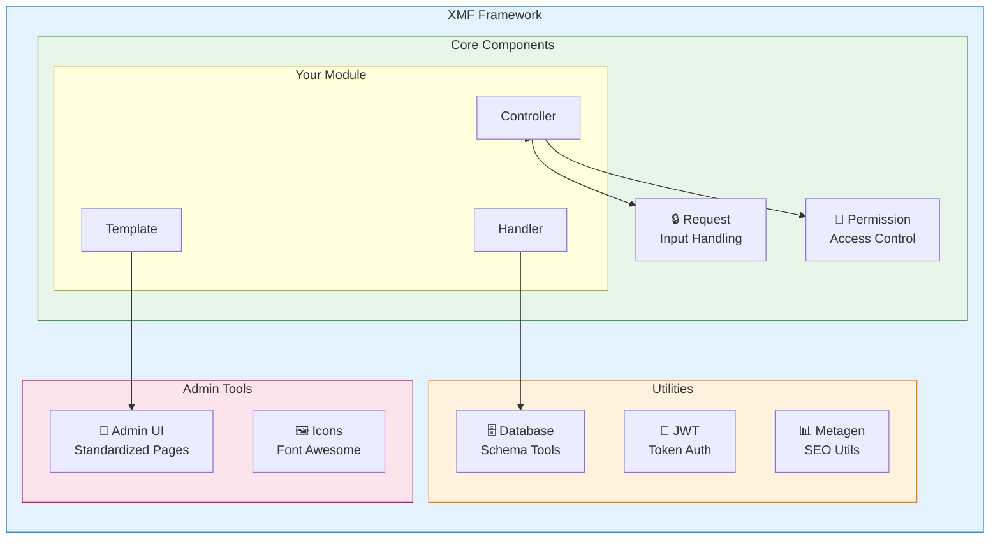
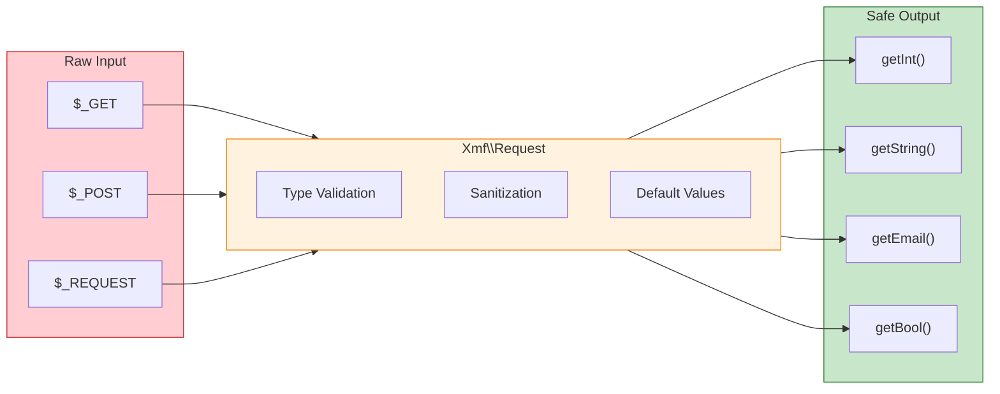

<span class="version-badge version-25x">2.5.x ✅</span> <span class="version-badge version-40x">4.0.x ✅</span>

:::tip[Jambatan ke Moden XOOPS]
XMF berfungsi dalam **kedua-dua XOOPS 2.5.x dan XOOPS 4.0.x**. Ini adalah cara yang disyorkan untuk memodenkan modul anda hari ini sambil membuat persediaan untuk XOOPS 4.0. XMF menyediakan PSR-4 autoloading, ruang nama dan pembantu yang melancarkan peralihan.
:::

**XOOPS Rangka Kerja Modul (XMF)** ialah perpustakaan berkuasa yang direka untuk memudahkan dan menyeragamkan pembangunan modul XOOPS. XMF menyediakan amalan PHP moden termasuk ruang nama, autoloading dan set komprehensif kelas pembantu yang mengurangkan kod plat dandang dan meningkatkan kebolehselenggaraan.

## Apakah itu XMF?

XMF ialah koleksi kelas dan utiliti yang menyediakan:

- **Sokongan PHP Moden** - Sokongan ruang nama penuh dengan pemuatan automatik PSR-4
- **Pengendalian Permintaan** - Pengesahan dan sanitasi input selamat
- **Pembantu Modul** - Akses mudah kepada konfigurasi modul dan objek
- **Sistem Kebenaran** - Pengurusan kebenaran yang mudah digunakan
- **Utiliti Pangkalan Data** - Penghijrahan skema dan alatan pengurusan jadual
- **JWT Sokongan** - JSON Pelaksanaan Token Web untuk pengesahan selamat
- **Penjanaan Metadata** - SEO dan utiliti pengekstrakan kandungan
- **Antara Muka Pentadbiran** - Halaman pentadbiran modul standard### XMF Gambaran Keseluruhan Komponen

## Ciri Utama

### Ruang nama dan Automuat

Semua XMF kelas berada dalam ruang nama `XMF`. Kelas dimuatkan secara automatik apabila dirujuk - tiada manual termasuk diperlukan.
```php
use Xmf\Request;
use Xmf\Module\Helper;

// Classes load automatically when used
$input = Request::getString('input', '');
$helper = Helper::getHelper('mymodule');
```
### Pengendalian Permintaan Selamat

[Kelas Permintaan](../05-XMF-Framework/Basics/XMF-Request.md) menyediakan akses selamat jenis kepada data permintaan HTTP dengan sanitasi terbina dalam:


```php
use Xmf\Request;

$id = Request::getInt('id', 0);
$name = Request::getString('name', '');
$email = Request::getEmail('email', '');
```
### Sistem Pembantu Modul

[Module Helper](../05-XMF-Framework/Basics/XMF-Module-Helper.md) menyediakan akses mudah kepada kefungsian berkaitan modul:
```php
$helper = \Xmf\Module\Helper::getHelper('mymodule');

// Access module configuration
$configValue = $helper->getConfig('setting_name', 'default');

// Get module object
$module = $helper->getModule();

// Access handlers
$handler = $helper->getHandler('items');
```
### Pengurusan Kebenaran

[Permission-Helper](../05-XMF-Framework/Recipes/Permission-Helper.md) memudahkan XOOPS pengendalian kebenaran:
```php
$permHelper = new \Xmf\Module\Helper\Permission();

// Check user permission
if ($permHelper->checkPermission('view', $itemId)) {
    // User has permission
}
```
## Struktur Dokumentasi

### Asas

- [Bermula-dengan-XMF](../05-XMF-Framework/Basics/Getting-Started-with-XMF.md) - Pemasangan dan penggunaan asas
- [XMF-Permintaan](../05-XMF-Framework/Basics/XMF-Request.md) - Permintaan pengendalian dan pengesahan input
- [XMF-Modul-Helper](../05-XMF-Framework/Basics/XMF-Module-Helper.md) - Penggunaan kelas penolong modul

### Resipi

- [Permission-Helper](../05-XMF-Framework/Recipes/Permission-Helper.md) - Bekerja dengan kebenaran
- [Modul-Admin-Pages](../05-XMF-Framework/Recipes/Module-Admin-Pages.md) - Mencipta antara muka pentadbir piawai

### Rujukan

- [JWT](../05-XMF-Framework/Reference/JWT.md) - JSON pelaksanaan Token Web
- [Pangkalan Data](../05-XMF-Framework/Reference/Database.md) - Utiliti pangkalan data dan pengurusan skema
- [Metagen](Reference/Metagen.md) - Metadata dan SEO utiliti

## Keperluan

- XOOPS 2.5.8 atau lebih baru
- PHP 7.2 atau lebih baru (PHP 8.x disyorkan)

## Pemasangan

XMF disertakan dengan XOOPS 2.5.8 dan versi yang lebih baru. Untuk versi terdahulu atau pemasangan manual:

1. Muat turun pakej XMF daripada repositori XOOPS
2. Ekstrak ke direktori XOOPS `/class/XMF/` anda
3. Autoloader akan mengendalikan pemuatan kelas secara automatik

## Contoh Mula PantasBerikut ialah contoh lengkap yang menunjukkan corak penggunaan biasa XMF:
```php
<?php
use Xmf\Request;
use Xmf\Module\Helper;
use Xmf\Module\Helper\Permission;

// Get module helper
$helper = Helper::getHelper('mymodule');

// Get configuration values
$itemsPerPage = $helper->getConfig('items_per_page', 10);

// Handle request input
$op = Request::getCmd('op', 'list');
$id = Request::getInt('id', 0);

// Check permissions
$permHelper = new Permission();
if (!$permHelper->checkPermission('view', $id)) {
    redirect_header('index.php', 3, 'Access denied');
}

// Process based on operation
switch ($op) {
    case 'view':
        $handler = $helper->getHandler('items');
        $item = $handler->get($id);
        // ... display item
        break;
    case 'list':
    default:
        // ... list items
        break;
}
```
## Sumber

- [XMF Repositori GitHub](https://github.com/XOOPS/XMF)
- [XOOPS Laman Web Projek](https://XOOPS.org)

---

#XMF #XOOPS #framework #php #module-development