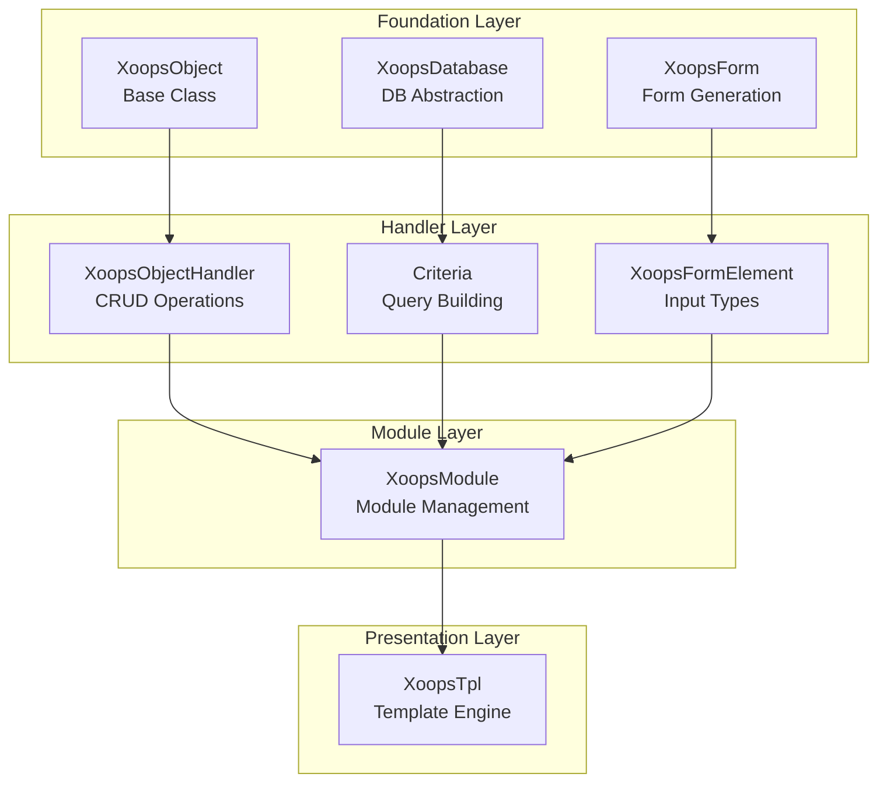
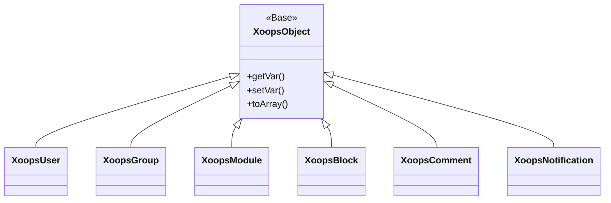
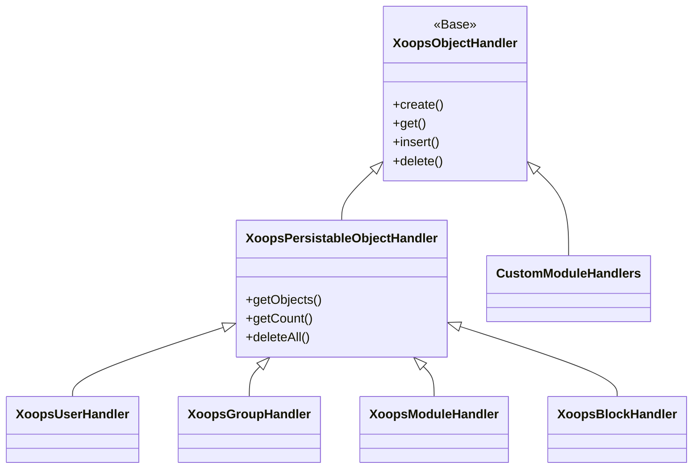
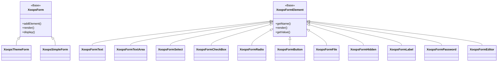

Welkom bij de uitgebreide XOOPS API referentiedocumentatie. Dit gedeelte biedt gedetailleerde documentatie voor alle kernklassen, methoden en systemen waaruit het XOOPS Content Management System bestaat.

## Overzicht

De XOOPS API is georganiseerd in verschillende grote subsystemen, die elk verantwoordelijk zijn voor een specifiek aspect van de CMS-functionaliteit. Het begrijpen van deze API's is essentieel voor het ontwikkelen van modules, thema's en uitbreidingen voor XOOPS.

## API Secties

### Kernklassen

De basisklassen waarop alle andere XOOPS-componenten voortbouwen.

| Documentatie | Beschrijving |
|-------------|------------|
| XoopsObject | Basisklasse voor alle data-objecten in XOOPS |
| XoopsObjectHandler | Handlerpatroon voor CRUD-bewerkingen |

### Databaselaag

Hulpprogramma's voor database-abstractie en het bouwen van query's.

| Documentatie | Beschrijving |
|-------------|------------|
| XoopsDatabase | Database-abstractielaag |
| Criteriasysteem | Zoekcriteria en voorwaarden |
| QueryBuilder | Modern vloeiend query bouwen |

### Formuliersysteem

HTML formulier genereren en valideren.

| Documentatie | Beschrijving |
|-------------|------------|
| XoopsForm | Formuliercontainer en weergave |
| Formulierelementen | Alle beschikbare formulierelementtypen |

### Kernelklassen

Kernsysteemcomponenten en services.

| Documentatie | Beschrijving |
|-------------|------------|
| Kernelklassen | Systeemkernel en kerncomponenten |

### Modulesysteem

Modulebeheer en levenscyclus.

| Documentatie | Beschrijving |
|-------------|------------|
| Modulesysteem | Module laden, installeren en beheren |

### Sjabloonsysteem

Smarty-sjabloonintegratie.

| Documentatie | Beschrijving |
|-------------|------------|
| Sjabloonsysteem | Slimme integratie en sjabloonbeheer |

### Gebruikerssysteem

Gebruikersbeheer en authenticatie.

| Documentatie | Beschrijving |
|-------------|------------|
| Gebruikerssysteem | Gebruikersaccounts, groepen en machtigingen |

## Architectuuroverzicht



## Klassenhiërarchie

### Objectmodel



### Handler-model



### Formuliermodel



## Ontwerppatronen

De XOOPS API implementeert verschillende bekende ontwerppatronen:

### Singleton-patroon
Gebruikt voor mondiale services zoals databaseverbindingen en containerinstanties.

```php
$db = XoopsDatabase::getInstance();
$container = XoopsContainer::getInstance();
```

### Fabriekspatroon
Objecthandlers creëren consistent domeinobjecten.

```php
$handler = xoops_getHandler('user');
$user = $handler->create();
```

### Samengesteld patroon
Formulieren bevatten meerdere formulierelementen; criteria kunnen geneste criteria bevatten.

```php
$criteria = new CriteriaCompo();
$criteria->add(new Criteria('status', 1));
$criteria->add(new CriteriaCompo(...)); // Nested
```

### Waarnemerspatroon
Het evenementensysteem maakt losse koppeling tussen modules mogelijk.

```php
$dispatcher->addListener('module.news.article_published', $callback);
```

## Snelstartvoorbeelden

### Een object maken en opslaan

```php
// Get the handler
$handler = xoops_getHandler('user');

// Create a new object
$user = $handler->create();
$user->setVar('uname', 'newuser');
$user->setVar('email', 'user@example.com');

// Save to database
$handler->insert($user);
```

### Query's met criteria

```php
// Build criteria
$criteria = new CriteriaCompo();
$criteria->add(new Criteria('level', 0, '>'));
$criteria->setSort('uname');
$criteria->setOrder('ASC');
$criteria->setLimit(10);

// Get objects
$handler = xoops_getHandler('user');
$users = $handler->getObjects($criteria);
```

### Een formulier maken

```php
$form = new XoopsThemeForm('User Profile', 'userform', 'save.php', 'post', true);
$form->addElement(new XoopsFormText('Username', 'uname', 50, 255, $user->getVar('uname')));
$form->addElement(new XoopsFormTextArea('Bio', 'bio', $user->getVar('bio')));
$form->addElement(new XoopsFormButton('', 'submit', _SUBMIT, 'submit'));
echo $form->render();
```

## API-conventies

### Naamgevingsconventies

| Typ | Conventie | Voorbeeld |
|-----|-----------|---------|
| Klassen | PascalCase | `XoopsUser`, `CriteriaCompo` |
| Methoden | kameelCase | `getVar()`, `setVar()` |
| Eigenschappen | camelCase (beschermd) | `$_vars`, `$_handler` |
| Constanten | UPPER_SNAKE_CASE | `XOBJ_DTYPE_INT` |
| Databasetabellen | snake_case | `users`, `groups_users_link` |

### Gegevenstypen

XOOPS definieert standaardgegevenstypen voor objectvariabelen:

| Constante | Typ | Beschrijving |
|----------|------|-------------|
| `XOBJ_DTYPE_TXTBOX` | Tekenreeks | Tekstinvoer (opgeschoond) |
| `XOBJ_DTYPE_TXTAREA` | Tekenreeks | Inhoud tekstgebied |
| `XOBJ_DTYPE_INT` | Geheel getal | Numerieke waarden |
| `XOBJ_DTYPE_URL` | Tekenreeks | URL-validatie |
| `XOBJ_DTYPE_EMAIL` | Tekenreeks | E-mailvalidatie |
| `XOBJ_DTYPE_ARRAY` | Array | Geserialiseerde arrays |
| `XOBJ_DTYPE_OTHER` | Gemengd | Aangepaste afhandeling |
| `XOBJ_DTYPE_SOURCE` | Tekenreeks | Broncode (minimale sanering) |
| `XOBJ_DTYPE_STIME` | Geheel getal | Korte tijdstempel |
| `XOBJ_DTYPE_MTIME` | Geheel getal | Middellange tijdstempel |
| `XOBJ_DTYPE_LTIME` | Geheel getal | Lange tijdstempel |

## Authenticatiemethoden

De API ondersteunt meerdere authenticatiemethoden:### API sleutelauthenticatie
```
X-API-Key: your-api-key
```

### OAuth Bearer-token
```
Authorization: Bearer your-oauth-token
```

### Op sessies gebaseerde authenticatie
Maakt gebruik van de bestaande XOOPS-sessie wanneer u bent ingelogd.

## REST API Eindpunten

Wanneer de REST API is ingeschakeld:

| Eindpunt | Werkwijze | Beschrijving |
|----------|--------|------------|
| `/api.php/rest/users` | GET | Lijst gebruikers |
| `/api.php/rest/users/{id}` | GET | Gebruiker op ID ophalen |
| `/api.php/rest/users` | POST | Gebruiker aanmaken |
| `/api.php/rest/users/{id}` | PUT | Gebruiker bijwerken |
| `/api.php/rest/users/{id}` | DELETE | Gebruiker verwijderen |
| `/api.php/rest/modules` | GET | Lijstmodules |

## Gerelateerde documentatie

- Module-ontwikkelingsgids
- Thema-ontwikkelingsgids
- Systeemconfiguratie
- Beste praktijken op het gebied van beveiliging

## Versiegeschiedenis

| Versie | Wijzigingen |
|---------|---------|
| 2.5.11 | Huidige stabiele release |
| 2.5.10 | Ondersteuning voor GraphQL API toegevoegd |
| 2.5.9 | Verbeterd criteriasysteem |
| 2.5.8 | PSR-4 ondersteuning voor automatisch laden |

---

*Deze documentatie maakt deel uit van de XOOPS Knowledge Base. Ga voor de nieuwste updates naar de [XOOPS GitHub-repository](https://github.com/XOOPS).*