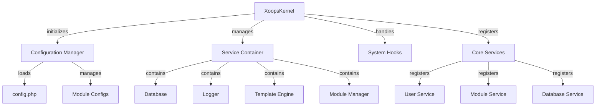

De XOOPS-kernel biedt het fundamentele raamwerk voor het opstarten van het systeem, het beheren van configuraties, het afhandelen van systeemgebeurtenissen en het leveren van kernhulpprogramma's. Deze klassen vormen de ruggengraat van de XOOPS-applicatie.

## Systeemarchitectuur



## XoopsKernel-klasse

De hoofdkernelklasse die het XOOPS-systeem initialiseert en beheert.

### Klassenoverzicht

```php
namespace Xoops;

class XoopsKernel
{
    private static ?XoopsKernel $instance = null;
    protected ServiceContainer $services;
    protected ConfigurationManager $config;
    protected array $modules = [];
    protected bool $isLoaded = false;
}
```

### Constructeur

```php
private function __construct()
```

Een particuliere constructor dwingt het singleton-patroon af.

### getInstance

Haalt de singleton-kernelinstantie op.

```php
public static function getInstance(): XoopsKernel
```

**Retourneert:** `XoopsKernel` - De singleton-kernelinstantie

**Voorbeeld:**
```php
$kernel = XoopsKernel::getInstance();
```

### Opstartproces

Het kernel-opstartproces volgt deze stappen:

1. **Initialisatie** - Foutafhandelaars instellen, constanten definiëren
2. **Configuratie** - Configuratiebestanden laden
3. **Serviceregistratie** - Registreer kernservices
4. **Moduledetectie** - Actieve modules scannen en identificeren
5. **Database-initialisatie** - Maak verbinding met de database
6. **Opschonen** - Bereid u voor op de afhandeling van verzoeken

```php
public function boot(): void
```

**Voorbeeld:**
```php
$kernel = XoopsKernel::getInstance();
$kernel->boot();
```

### Servicecontainermethoden

#### registerService

Registreert een service in de servicecontainer.

```php
public function registerService(
    string $name,
    callable|object $definition
): void
```

**Parameters:**

| Parameter | Typ | Beschrijving |
|-----------|------|------------|
| `$name` | tekenreeks | Service-ID |
| `$definition` | opvraagbaar\|object | Service fabriek of instantie |

**Voorbeeld:**
```php
$kernel->registerService('custom.handler', function($c) {
    return new CustomHandler();
});
```

#### krijgService

Haalt een geregistreerde service op.

```php
public function getService(string $name): mixed
```

**Parameters:**

| Parameter | Typ | Beschrijving |
|-----------|------|------------|
| `$name` | tekenreeks | Service-ID |

**Retourzendingen:** `mixed` - De gevraagde service

**Voorbeeld:**
```php
$database = $kernel->getService('database');
$logger = $kernel->getService('logger');
```

#### heeftService

Controleert of een dienst is geregistreerd.

```php
public function hasService(string $name): bool
```

**Voorbeeld:**
```php
if ($kernel->hasService('cache')) {
    $cache = $kernel->getService('cache');
}
```

## Configuratiemanager

Beheert applicatieconfiguratie en module-instellingen.

### Klassenoverzicht

```php
namespace Xoops\Core;

class ConfigurationManager
{
    protected array $config = [];
    protected array $defaults = [];
    protected string $configPath;
}
```

### Methoden

#### laden

Laadt de configuratie uit een bestand of array.

```php
public function load(string|array $source): void
```

**Parameters:**

| Parameter | Typ | Beschrijving |
|-----------|------|------------|
| `$source` | tekenreeks\|array | Configuratiebestandspad of array |

**Voorbeeld:**
```php
$config = $kernel->getService('config');
$config->load(XOOPS_ROOT_PATH . '/include/config.php');
$config->load(['sitename' => 'My Site', 'admin_email' => 'admin@example.com']);
```

#### krijgen

Haalt een configuratiewaarde op.

```php
public function get(string $key, mixed $default = null): mixed
```

**Parameters:**

| Parameter | Typ | Beschrijving |
|-----------|------|------------|
| `$key` | tekenreeks | Configuratiesleutel (puntnotatie) |
| `$default` | gemengd | Standaardwaarde indien niet gevonden |

**Retourzendingen:** `mixed` - Configuratiewaarde

**Voorbeeld:**
```php
$siteName = $config->get('sitename');
$adminEmail = $config->get('admin.email', 'admin@example.com');
```

#### ingesteld

Stelt een configuratiewaarde in.

```php
public function set(string $key, mixed $value): void
```

**Parameters:**

| Parameter | Typ | Beschrijving |
|-----------|------|------------|
| `$key` | tekenreeks | Configuratiesleutel |
| `$value` | gemengd | Configuratiewaarde |

**Voorbeeld:**
```php
$config->set('sitename', 'New Site Name');
$config->set('features.cache_enabled', true);
```

#### getModuleConfig

Haalt de configuratie op voor een specifieke module.

```php
public function getModuleConfig(
    string $moduleName
): array
```

**Parameters:**

| Parameter | Typ | Beschrijving |
|-----------|------|------------|
| `$moduleName` | tekenreeks | Naam modulemap |

**Retourneert:** `array` - Moduleconfiguratiearray

**Voorbeeld:**
```php
$publisherConfig = $config->getModuleConfig('publisher');
```

## Systeemhaken

Met systeemhooks kunnen modules en plug-ins code uitvoeren op specifieke punten in de levenscyclus van een applicatie.

### HookManager-klasse

```php
namespace Xoops\Core;

class HookManager
{
    protected array $hooks = [];
    protected array $listeners = [];
}
```

### Methoden

#### haak toevoegen

Registreert een haakpunt.

```php
public function addHook(string $name): void
```

**Parameters:**

| Parameter | Typ | Beschrijving |
|-----------|------|------------|
| `$name` | tekenreeks | Hook-ID |

**Voorbeeld:**
```php
$hooks = $kernel->getService('hooks');
$hooks->addHook('system.startup');
$hooks->addHook('user.login');
$hooks->addHook('module.install');
```

#### luister

Bevestigt een luisteraar aan een haak.

```php
public function listen(
    string $hookName,
    callable $callback,
    int $priority = 10
): void
```

**Parameters:**

| Parameter | Typ | Beschrijving |
|-----------|------|------------|
| `$hookName` | tekenreeks | Hook-ID |
| `$callback` | opvraagbaar | Uit te voeren functie |
| `$priority` | int | Uitvoeringsprioriteit (hogere runs eerst) |

**Voorbeeld:**
```php
$hooks->listen('user.login', function($user) {
    error_log('User ' . $user->uname . ' logged in');
}, 10);

$hooks->listen('module.install', function($module) {
    // Custom module installation logic
    echo "Installing " . $module->getName();
}, 5);
```

#### trigger

Voert alle luisteraars uit voor een hook.

```php
public function trigger(
    string $hookName,
    mixed $arguments = null
): array
```

**Parameters:**

| Parameter | Typ | Beschrijving |
|-----------|------|------------|
| `$hookName` | tekenreeks | Hook-ID |
| `$arguments` | gemengd | Gegevens die moeten worden doorgegeven aan luisteraars |**Retouren:** `array` - Resultaten van alle luisteraars

**Voorbeeld:**
```php
$results = $hooks->trigger('system.startup');
$results = $hooks->trigger('user.created', $newUser);
```

## Overzicht kernservices

De kernel registreert verschillende kernservices tijdens het opstarten:

| Dienst | Klasse | Doel |
|---------|-------|---------|
| `database` | XoopsDatabase | Database-abstractielaag |
| `config` | ConfiguratieManager | Configuratiebeheer |
| `logger` | Logger | Applicatieregistratie |
| `template` | XoopsTpl | Sjabloonengine |
| `user` | GebruikerManager | Gebruikersbeheerservice |
| `module` | ModuleManager | Modulebeheer |
| `cache` | CacheManager | Cachinglaag |
| `hooks` | HookManager | Systeemgebeurtenishaken |

## Compleet gebruiksvoorbeeld

```php
<?php
/**
 * Custom module boot process utilizing kernel
 */

// Get kernel instance
$kernel = XoopsKernel::getInstance();

// Boot the system
$kernel->boot();

// Get services
$config = $kernel->getService('config');
$database = $kernel->getService('database');
$logger = $kernel->getService('logger');
$hooks = $kernel->getService('hooks');

// Access configuration
$siteName = $config->get('sitename');
$adminEmail = $config->get('admin.email');

// Register module-specific hooks
$hooks->listen('user.login', function($user) {
    // Log user login
    $logger->info('User login: ' . $user->uname);

    // Track in database
    $database->query(
        'INSERT INTO ' . $database->prefix('event_log') .
        ' (type, user_id, message, timestamp) VALUES (?, ?, ?, ?)',
        ['login', $user->uid(), 'User login', time()]
    );
});

$hooks->listen('module.install', function($module) {
    $logger->info('Module installed: ' . $module->getName());
});

// Trigger hooks
$hooks->trigger('system.startup');

// Use database service
$result = $database->query(
    'SELECT * FROM ' . $database->prefix('users') .
    ' LIMIT 10'
);

while ($row = $database->fetchArray($result)) {
    echo "User: " . htmlspecialchars($row['uname']) . "\n";
}

// Register custom service
$kernel->registerService('custom.repository', function($c) {
    return new CustomRepository($c->getService('database'));
});

// Later access custom service
$repo = $kernel->getService('custom.repository');
```

## Kernconstanten

De kernel definieert verschillende belangrijke constanten tijdens het opstarten:

```php
// System paths
define('XOOPS_ROOT_PATH', '/var/www/xoops');
define('XOOPS_HTDOCS_PATH', XOOPS_ROOT_PATH . '/htdocs');
define('XOOPS_MODULES_PATH', XOOPS_ROOT_PATH . '/htdocs/modules');
define('XOOPS_THEMES_PATH', XOOPS_ROOT_PATH . '/htdocs/themes');

// Web paths
define('XOOPS_URL', 'http://example.com');
define('XOOPS_HTDOCS_URL', XOOPS_URL . '/htdocs');

// Database
define('XOOPS_DB_PREFIX', 'xoops_');
```

## Foutafhandeling

De kernel stelt foutafhandelaars in tijdens het opstarten:

```php
// Set custom error handler
set_error_handler(function($errno, $errstr, $errfile, $errline) {
    $kernel->getService('logger')->error(
        "Error: $errstr in $errfile:$errline"
    );
});

// Set exception handler
set_exception_handler(function($exception) {
    $kernel->getService('logger')->critical(
        "Exception: " . $exception->getMessage()
    );
});
```

## Beste praktijken

1. **Single Boot** - Bel `boot()` slechts één keer tijdens het opstarten van de applicatie
2. **Gebruik Service Container** - Registreer en haal services op via de kernel
3. **Handel hooks vroeg** - Registreer hook-listeners voordat u ze activeert
4. **Belangrijke gebeurtenissen vastleggen** - Gebruik de loggerservice voor foutopsporing
5. **Cacheconfiguratie** - Laad de configuratie één keer en hergebruik deze
6. **Foutafhandeling** - Stel altijd foutafhandelaars in voordat u aanvragen verwerkt

## Gerelateerde documentatie

- ../Module/Module-System - Modulesysteem en levenscyclus
- ../Template/Template-System - Integratie van sjabloonengine
- ../User/User-System - Gebruikersauthenticatie en -beheer
- ../Database/XoopsDatabase - Databaselaag

---

*Zie ook: [XOOPS kernelbron](https://github.com/XOOPS/XoopsCore27/tree/master/htdocs/class)*