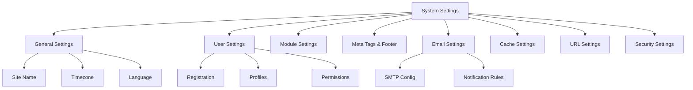

# XOOPS Systeeminstellingen

Deze handleiding behandelt de volledige systeeminstellingen die beschikbaar zijn in het XOOPS-beheerpaneel, geordend op categorie.

## Systeeminstellingen Architectuur



## Toegang tot systeeminstellingen

### Locatie

**Beheerderspaneel > Systeem > Voorkeuren**

Of navigeer direct:

```
http://your-domain.com/xoops/admin/index.php?fct=preferences
```

### Toestemmingsvereisten

- Alleen beheerders (webmasters) hebben toegang tot de systeeminstellingen
- Wijzigingen hebben invloed op de gehele site
- De meeste wijzigingen zijn onmiddellijk van kracht

## Algemene instellingen

De basisconfiguratie voor uw XOOPS-installatie.

### Basisinformatie

```
Site Name: [Your Site Name]
Default Description: [Brief description of your site]
Site Slogan: [Catchy slogan]
Admin Email: admin@your-domain.com
Webmaster Name: Administrator Name
Webmaster Email: admin@your-domain.com
```

### Weergave-instellingen

```
Default Theme: [Select theme]
Default Language: English (or preferred language)
Items Per Page: 15 (typically 10-25)
Words in Snippet: 25 (for search results)
Theme Upload Permission: Disabled (security)
```

### Regionale instellingen

```
Default Timezone: [Your timezone]
Date Format: %Y-%m-%d (YYYY-MM-DD format)
Time Format: %H:%M:%S (HH:MM:SS format)
Daylight Saving Time: [Auto/Manual/None]
```

**Tijdzone-indelingstabel:**

| Regio | Tijdzone | UTC Offset |
|---|---|---|
| VS Oost | Amerika/New York | -5 / -4 |
| VS Centraal | Amerika/Chicago | -6 / -5 |
| Amerikaanse berg | Amerika/Denver | -7 / -6 |
| Amerikaanse Stille Oceaan | Amerika/Los_Angeles | -8 / -7 |
| VK/Londen | Europa/Londen | 0 / +1 |
| Frankrijk/Duitsland | Europa/Parijs | +1 / +2 |
| Japan | Azië/Tokio | +9 |
| China | Azië/Sjanghai | +8 |
| Australië/Sydney | Australië/Sydney | +10 / +11 |

### Zoekconfiguratie

```
Enable Search: Yes
Search Admin Pages: Yes/No
Search Archives: Yes
Default Search Type: All / Pages only
Words Excluded from Search: [Comma-separated list]
```

**Veel voorkomende uitgesloten woorden:** the, a, an, and, or, but, in, on, at, by, to, from

## Gebruikersinstellingen

Beheer het gedrag van gebruikersaccounts en het registratieproces.

### Gebruikersregistratie

```
Allow User Registration: Yes/No
Registration Type:
  ☐ Auto-activate (Instant access)
  ☐ Admin approval (Admin must approve)
  ☐ Email verification (User must verify email)

Notification to Users: Yes/No
User Email Verification: Required/Optional
```

### Nieuwe gebruikersconfiguratie

```
Auto-login New Users: Yes/No
Assign Default User Group: Yes
Default User Group: [Select group]
Create User Avatar: Yes/No
Initial User Avatar: [Select default]
```

### Gebruikersprofielinstellingen

```
Allow User Profiles: Yes
Show Member List: Yes
Show User Statistics: Yes
Show Last Online Time: Yes
Allow User Avatar: Yes
Avatar Max File Size: 100KB
Avatar Dimensions: 100x100 pixels
```

### E-mailinstellingen voor gebruiker

```
Allow Users to Hide Email: Yes
Show Email on Profile: Yes
Notification Email Interval: Immediately/Daily/Weekly/Never
```

### Bijhouden van gebruikersactiviteiten

```
Track User Activity: Yes
Log User Logins: Yes
Log Failed Logins: Yes
Track IP Address: Yes
Clear Activity Logs Older Than: 90 days
```

### Accountlimieten

```
Allow Duplicate Email: No
Minimum Username Length: 3 characters
Maximum Username Length: 15 characters
Minimum Password Length: 6 characters
Require Special Characters: Yes
Require Numbers: Yes
Password Expiration: 90 days (or Never)
Accounts Inactive Days to Delete: 365 days
```

## Module-instellingen

Configureer individueel modulegedrag.

### Algemene moduleopties

Voor elke geïnstalleerde module kunt u het volgende instellen:

```
Module Status: Active/Inactive
Display in Menu: Yes/No
Module Weight: [1-999](higher = lower in display)
Homepage Default: This module shows when visiting /
Admin Access: [Allowed user groups]
User Access: [Allowed user groups]
```

### Systeemmodule-instellingen

```
Show Homepage as: Portal / Module / Static Page
Default Homepage Module: [Select module]
Show Footer Menu: Yes
Footer Color: [Color selector]
Show System Stats: Yes
Show Memory Usage: Yes
```

### Configuratie per module

Elke module kan modulespecifieke instellingen hebben:

**Voorbeeld - Paginamodule:**
```
Enable Comments: Yes/No
Moderate Comments: Yes/No
Comments Per Page: 10
Enable Ratings: Yes
Allow Anonymous Ratings: Yes
```

**Voorbeeld - Gebruikersmodule:**
```
Avatar Upload Folder: ./uploads/
Maximum Upload Size: 100KB
Allow File Upload: Yes
Allowed File Types: jpg, gif, png
```

Toegang tot modulespecifieke instellingen:
- **Beheerder > Modules > [Modulenaam] > Voorkeuren**

## Metatags en SEO-instellingen

Configureer metatags voor zoekmachineoptimalisatie.

### Mondiale metatags

```
Meta Keywords: xoops, cms, content management system
Meta Description: A powerful content management system for building dynamic websites
Meta Author: Your Name
Meta Copyright: Copyright 2025, Your Company
Meta Robots: index, follow
Meta Revisit: 30 days
```

### Beste praktijken voor metatags

| Label | Doel | Aanbeveling |
|---|---|---|
| Trefwoorden | Zoektermen | 5-10 relevante trefwoorden, door komma's gescheiden |
| Beschrijving | Zoek vermelding | 150-160 tekens |
| Auteur | Paginamaker | Uw naam of bedrijf |
| Auteursrecht | Juridisch | Uw auteursrechtverklaring |
| Robots | Crawler-instructies | index, volg (indexering toestaan) |

### Voettekstinstellingen

```
Show Footer: Yes
Footer Color: Dark/Light
Footer Background: [Color code]
Footer Text: [HTML allowed]
Additional Footer Links: [URL and text pairs]
```

**Voorbeeldvoettekst HTML:**
```html
<p>Copyright &copy; 2025 Your Company. All rights reserved.</p>
<p><a href="/privacy">Privacy Policy</a> | <a href="/terms">Terms of Use</a></p>
```

### Sociale metatags (open grafiek)

```
Enable Open Graph: Yes
Facebook App ID: [App ID]
Twitter Card Type: summary / summary_large_image / player
Default Share Image: [Image URL]
```

## E-mailinstellingen

Configureer het e-mailbezorg- en notificatiesysteem.

### E-mailbezorgmethode

```
Use SMTP: Yes/No

If SMTP:
  SMTP Host: smtp.gmail.com
  SMTP Port: 587 (TLS) or 465 (SSL)
  SMTP Security: TLS / SSL / None
  SMTP Username: [email@example.com]
  SMTP Password: [password]
  SMTP Authentication: Yes/No
  SMTP Timeout: 10 seconds

If PHP mail():
  Sendmail Path: /usr/sbin/sendmail -t -i
```

### E-mailconfiguratie

```
From Address: noreply@your-domain.com
From Name: Your Site Name
Reply-To Address: support@your-domain.com
BCC Admin Emails: Yes/No
```

### Meldingsinstellingen

```
Send Welcome Email: Yes/No
Welcome Email Subject: Welcome to [Site Name]
Welcome Email Body: [Custom message]

Send Password Reset Email: Yes/No
Include Random Password: Yes/No
Token Expiration: 24 hours
```

### Beheerdersmeldingen

```
Notify Admin on Registration: Yes
Notify Admin on Comments: Yes
Notify Admin on Submissions: Yes
Notify Admin on Errors: Yes
```

### Gebruikersmeldingen

```
Notify User on Registration: Yes
Notify User on Comments: Yes
Notify User on Private Messages: Yes
Allow Users to Disable Notifications: Yes
Default Notification Frequency: Immediately
```

### E-mailsjablonen

Pas notificatie-e-mails aan in het beheerdersdashboard:

**Pad:** Systeem > E-mailsjablonen

Beschikbare sjablonen:
- Gebruikersregistratie
- Wachtwoord opnieuw instellen
- Opmerkingsmelding
- Privébericht
- Systeemwaarschuwingen
- Modulespecifieke e-mails

## Cache-instellingen

Optimaliseer de prestaties door middel van caching.

### Cacheconfiguratie

```
Enable Caching: Yes/No
Cache Type:
  ☐ File Cache
  ☐ APCu (Alternative PHP Cache)
  ☐ Memcache (Distributed caching)
  ☐ Redis (Advanced caching)

Cache Lifetime: 3600 seconds (1 hour)
```

### Cache-opties per type

**Bestandscache:**
```
Cache Directory: /var/www/html/xoops/cache/
Clear Interval: Daily
Maximum Cache Files: 1000
```

**APCu-cache:**
```
Memory Allocation: 128MB
Fragmentation Level: Low
```

**Memcache/Opnieuw:**
```
Server Host: localhost
Server Port: 11211 (Memcache) / 6379 (Redis)
Persistent Connection: Yes
```

### Wat wordt in de cache opgeslagen

```
Cache Module Lists: Yes
Cache Configuration Data: Yes
Cache Template Data: Yes
Cache User Session Data: Yes
Cache Search Results: Yes
Cache Database Queries: Yes
Cache RSS Feeds: Yes
Cache Images: Yes
```

## URL-instellingen

Configureer URL herschrijven en formatteren.

### Gebruiksvriendelijke URL-instellingen

```
Enable Friendly URLs: Yes/No
Friendly URL Type:
  ☐ Path Info: /page/about
  ☐ Query String: /index.php?p=about

Trailing Slash: Include / Omit
URL Case: Lower case / Case sensitive
```

### URL Regels herschrijven

```
.htaccess Rules: [Display current]
Nginx Rules: [Display current if Nginx]
IIS Rules: [Display current if IIS]
```

## Beveiligingsinstellingen

Beheer beveiligingsgerelateerde configuratie.

### Wachtwoordbeveiliging

```
Password Policy:
  ☐ Require uppercase letters
  ☐ Require lowercase letters
  ☐ Require numbers
  ☐ Require special characters

Minimum Password Length: 8 characters
Password Expiration: 90 days
Password History: Remember last 5 passwords
Force Password Change: On next login
```

### Inlogbeveiliging

```
Lock Account After Failed Attempts: 5 attempts
Lock Duration: 15 minutes
Log All Login Attempts: Yes
Log Failed Logins: Yes
Admin Login Alert: Send email on admin login
Two-Factor Authentication: Disabled/Enabled
```

### Beveiliging van het uploaden van bestanden

```
Allow File Uploads: Yes/No
Maximum File Size: 128MB
Allowed File Types: jpg, gif, png, pdf, zip, doc, docx
Scan Uploads for Malware: Yes (if available)
Quarantine Suspicious Files: Yes
```

### Sessiebeveiliging

```
Session Management: Database/Files
Session Timeout: 1800 seconds (30 min)
Session Cookie Lifetime: 0 (until browser closes)
Secure Cookie: Yes (HTTPS only)
HTTP Only Cookie: Yes (prevent JavaScript access)
```

### CORS-instellingen

```
Allow Cross-Origin Requests: No
Allowed Origins: [List domains]
Allow Credentials: No
Allowed Methods: GET, POST
```

## Geavanceerde instellingen

Extra configuratieopties voor gevorderde gebruikers.

### Foutopsporingsmodus

```
Debug Mode: Disabled/Enabled
Log Level: Error / Warning / Info / Debug
Debug Log File: /var/log/xoops_debug.log
Display Errors: Disabled (production)
```

### Prestatieafstemming

```
Optimize Database Queries: Yes
Use Query Cache: Yes
Compress Output: Yes
Minify CSS/JavaScript: Yes
Lazy Load Images: Yes
```

### Inhoudsinstellingen

```
Allow HTML in Posts: Yes/No
Allowed HTML Tags: [Configure]
Strip Harmful Code: Yes
Allow Embed: Yes/No
Content Moderation: Automatic/Manual
Spam Detection: Yes
```

## Instellingen Exporteren/Importeren

### Back-upinstellingenHuidige instellingen exporteren:

**Beheerderspaneel > Systeem > Extra > Instellingen exporteren**

```bash
# Settings exported as JSON file
# Download and store securely
```

### Instellingen herstellen

Importeer eerder geëxporteerde instellingen:

**Beheerderspaneel > Systeem > Extra > Instellingen importeren**

```bash
# Upload JSON file
# Verify changes before confirming
```

## Configuratiehiërarchie

XOOPS instellingenhiërarchie (van boven naar beneden - eerste wedstrijdoverwinningen):

```
1. mainfile.php (Constants)
2. Module-specific config
3. Admin System Settings
4. Theme configuration
5. User preferences (for user-specific settings)
```

## Back-upscript voor instellingen

Maak een back-up van de huidige instellingen:

```php
<?php
// Backup script: /var/www/html/xoops/backup-settings.php
require_once __DIR__ . '/mainfile.php';

$config_handler = xoops_getHandler('config');
$configs = $config_handler->getConfigs();

$backup = [
    'exported_date' => date('Y-m-d H:i:s'),
    'xoops_version' => XOOPS_VERSION,
    'php_version' => PHP_VERSION,
    'settings' => []
];

foreach ($configs as $config) {
    $backup['settings'][$config->getVar('conf_name')] = [
        'value' => $config->getVar('conf_value'),
        'description' => $config->getVar('conf_desc'),
        'type' => $config->getVar('conf_type'),
    ];
}

// Save to JSON file
file_put_contents(
    '/backups/xoops_settings_' . date('YmdHis') . '.json',
    json_encode($backup, JSON_PRETTY_PRINT)
);

echo "Settings backed up successfully!";
?>
```

## Wijzigingen in algemene instellingen

### Wijzig de sitenaam

1. Beheerder > Systeem > Voorkeuren > Algemene instellingen
2. Wijzig "Sitenaam"
3. Klik op "Opslaan"

### Registratie in-/uitschakelen

1. Beheerder > Systeem > Voorkeuren > Gebruikersinstellingen
2. Schakel 'Gebruikersregistratie toestaan' uit
3. Kies het registratietype
4. Klik op "Opslaan"

### Wijzig het standaardthema

1. Beheerder > Systeem > Voorkeuren > Algemene instellingen
2. Selecteer "Standaardthema"
3. Klik op "Opslaan"
4. Wis het cachegeheugen zodat de wijzigingen van kracht worden

### E-mailadres voor contact bijwerken

1. Beheerder > Systeem > Voorkeuren > Algemene instellingen
2. Wijzig "Beheerder-e-mailadres"
3. Wijzig 'E-mailadres webmaster'
4. Klik op "Opslaan"

## Verificatiechecklist

Controleer na het configureren van de systeeminstellingen:

- [ ] Sitenaam wordt correct weergegeven
- [ ] Tijdzone toont de juiste tijd
- [ ] E-mailmeldingen worden correct verzonden
- [ ] Gebruikersregistratie werkt zoals geconfigureerd
- [ ] De startpagina geeft de geselecteerde standaard weer
- [ ] Zoekfunctionaliteit werkt
- [ ] Cache verbetert de laadtijd van de pagina
- [ ] Vriendelijke URL's werken (indien ingeschakeld)
- [ ] Metatags verschijnen in de paginabron
- [ ] Beheerdermeldingen ontvangen
- [ ] Beveiligingsinstellingen afgedwongen

## Instellingen voor probleemoplossing

### Instellingen worden niet opgeslagen

**Oplossing:**
```bash
# Check file permissions on config directory
chmod 755 /var/www/html/xoops/var/

# Verify database writable
# Try saving again in admin panel
```

### Wijzigingen worden niet van kracht

**Oplossing:**
```bash
# Clear cache
rm -rf /var/www/html/xoops/cache/*
rm -rf /var/www/html/xoops/templates_c/*

# If still not working, restart web server
systemctl restart apache2
```

### E-mail wordt niet verzonden

**Oplossing:**
1. Controleer de SMTP-gegevens in de e-mailinstellingen
2. Test met de knop "Test-e-mail verzenden".
3. Controleer de foutlogboeken
4. Probeer PHP mail() te gebruiken in plaats van SMTP

## Volgende stappen

Na configuratie van de systeeminstellingen:

1. Configureer beveiligingsinstellingen
2. Optimaliseer de prestaties
3. Ontdek de functies van het beheerderspaneel
4. Gebruikersbeheer instellen

---

**Tags:** #systeeminstellingen #configuratie #voorkeuren #admin-panel

**Gerelateerde artikelen:**
- ../../06-Publisher-Module/Gebruikershandleiding/Basisconfiguratie
- Beveiligingsconfiguratie
- Prestatie-optimalisatie
- ../Eerste stappen/Admin-Panel-Overzicht