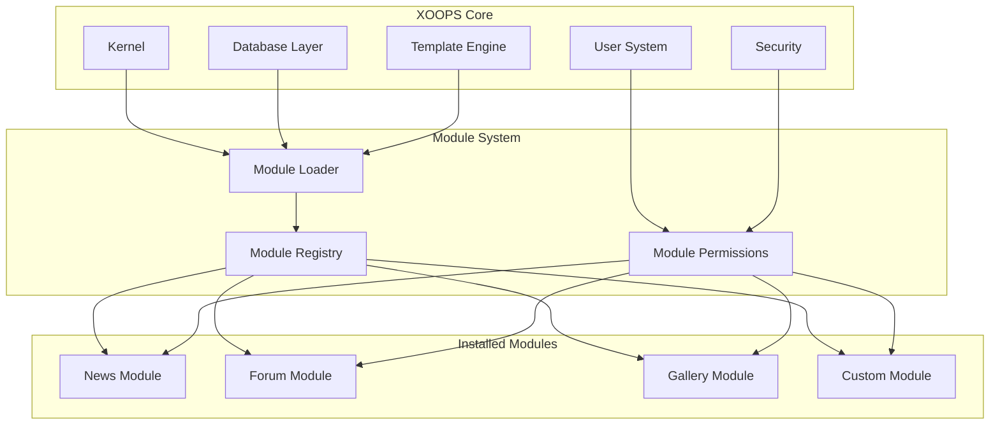
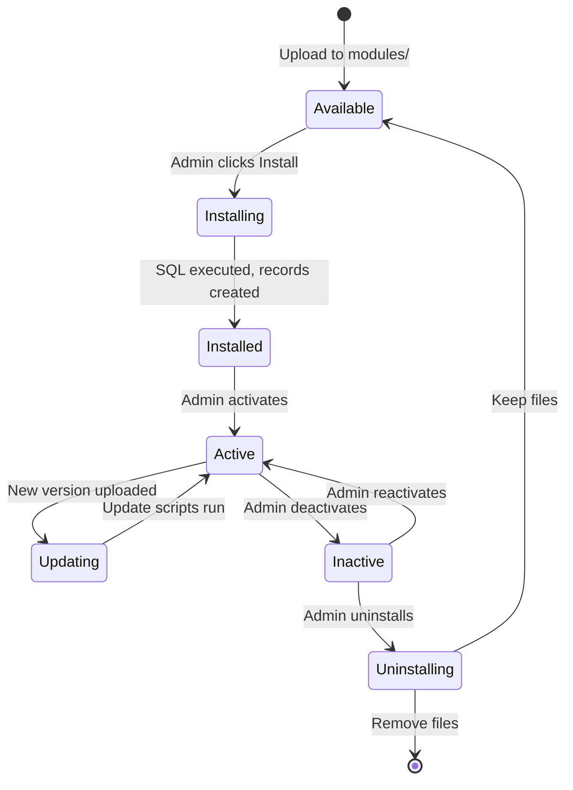

# ADR-001: Modulaire architectuur

> Architectuurbeslissingsrecord voor XOOPS's modulaire ontwerpfilosofie.

---

## Status

**Geaccepteerd** - Fundamenteel besluit sinds de oprichting van XOOPS

---

## Context

XOOPS (eXtensible Object-Oriented Portal System) had een architectuur nodig die:

1. Sta externe ontwikkelaars toe de functionaliteit uit te breiden
2. Geef sitebeheerders de mogelijkheid om aanpassingen aan te brengen zonder codering
3. Ondersteun onafhankelijke ontwikkeling en updates
4. Zorg voor isolatie tussen verschillende functies
5. Schaal van eenvoudige blogs naar complexe portals

Het CMS-landschap van begin jaren 2000 bood monolithische systemen die moeilijk aan te passen en uit te breiden waren.

---

## Beslissingsdiagram



---

## Besluit

We zullen een **modulaire architectuur** implementeren waarbij:

### 1. Kern biedt infrastructuur
- Database-abstractie
- Gebruikersauthenticatie en machtigingen
- Sjabloonweergave (Smarty)
- Beveiligingshulpprogramma's
- Vormgeneratie
- Gemeenschappelijke nutsvoorzieningen

### 2. Modules staan op zichzelf
Elke module:
- Heeft zijn eigen directorystructuur
- Bevat zijn eigen klassen, sjablonen, SQL
- Definieert zijn eigen configuratie
- Kan onafhankelijk worden geïnstalleerd/verwijderd
- Heeft versietracking

### 3. Standaardmodulestructuur
```
modules/modulename/
├── admin/                  # Admin interface
│   ├── index.php
│   └── menu.php
├── class/                  # PHP classes
├── include/                # Include files
├── language/               # Translations
├── sql/                    # Database schema
├── templates/              # Smarty templates
├── blocks/                 # Block definitions
├── xoops_version.php       # Module manifest
├── index.php               # Entry point
└── header.php              # Module bootstrap
```

### 4. Modulemanifest (xoops_version.php)
```php
<?php
$modversion['name']        = 'Module Name';
$modversion['version']     = '1.0.0';
$modversion['description'] = 'Module description';
$modversion['dirname']     = basename(__DIR__);
$modversion['hasMain']     = 1;
$modversion['hasAdmin']    = 1;
$modversion['sqlfile']['mysql'] = 'sql/mysql.sql';
$modversion['tables']      = ['modulename_table1'];
$modversion['templates']   = [...];
$modversion['config']      = [...];
$modversion['blocks']      = [...];
```

### 5. Modulecommunicatie
- Via kern-API's (handlers, evenementen)
- Databaserelaties
- Voorgespannen haken
- Gedeelde diensten

---

## Modulelevenscyclus



---

## Gevolgen

### Positief

1. **Uitbreidbaarheid**: duizenden modules gemaakt door de community
2. **Onafhankelijkheid**: Modules kunnen afzonderlijk worden ontwikkeld
3. **Flexibiliteit**: sites kunnen functies combineren
4. **Onderhoudbaarheid**: Updates hebben geen invloed op andere modules
5. **Marktplaats**: Module-ecosysteem ontstond
6. **Leercurve**: Ontwikkelaars leren één patroon

### Negatief

1. **Overhead**: Elke module heeft bootstrapkosten
2. **Duplicatie**: algemene code kan worden herhaald
3. **Integratie**: Moduleoverschrijdende functies vereisen een zorgvuldig ontwerp
4. **Versionering**: Modulecompatibiliteitsbeheer vereist
5. **Kwaliteitsverschil**: de kwaliteit van modules van derden varieert

### Neutraal

1. **Database**: Elke module beheert zijn eigen tabellen
2. **Sjablonen**: Thema moet verschillende modules bevatten
3. **Updates**: kern- en modules worden onafhankelijk bijgewerkt

---

## Alternatieven overwogen

### 1. Monolithische architectuur
**Afgewezen** - Te rigide, moeilijk aan te passen

### 2. Plug-inarchitectuur (WordPress-stijl)
**Gedeeltelijk overgenomen** - Blokken en preloads bieden plug-in-achtige hooks binnen modules

### 3. Componentarchitectuur (Joomla-stijl)
**Afgewezen** - Complexer, minder ontwikkelaarsvriendelijk

### 4. Microdiensten
**Niet van toepassing** - Te complex voor het tijdperk van gedeelde hosting

---

## Gerelateerde beslissingen

- ADR-002: objectgeoriënteerde databasetoegang
- ADR-003: Smarty-sjabloonengine
- ADR-005: Toestemmingssysteem

---

## Referenties

- XOOPS Projectgeschiedenis
- PHP Applicatiearchitectuurpatronen
- CMS Vergelijkingsstudies (2001-2005)

---

#xoops #architectuur #adr #modules #ontwerpbeslissing