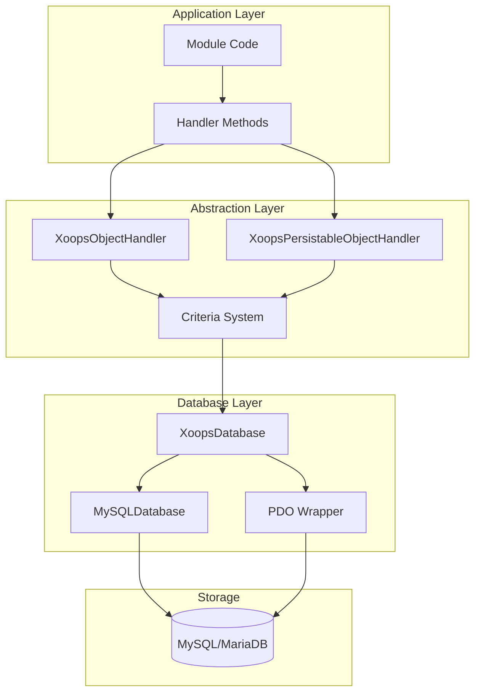
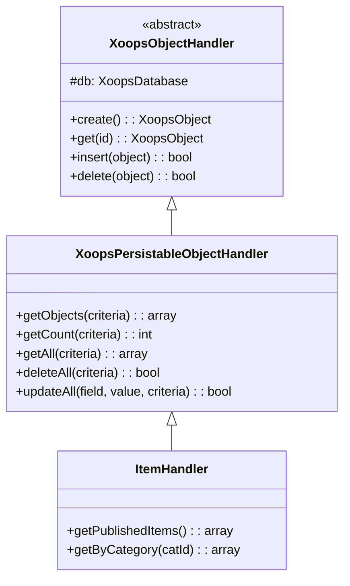
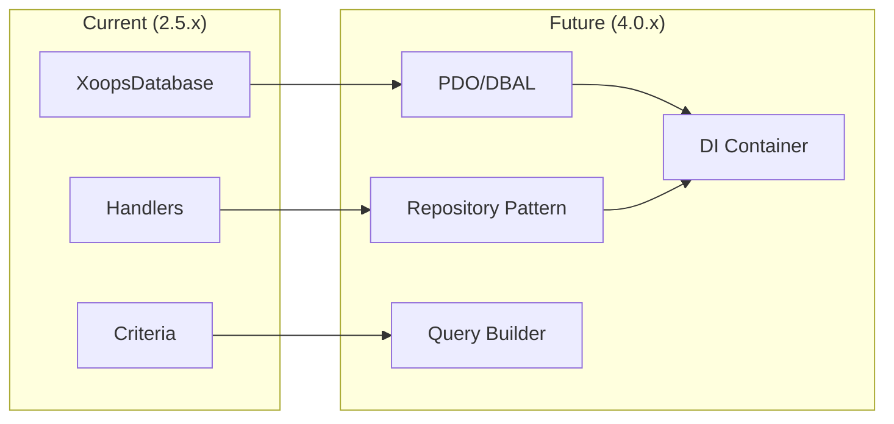

# ADR-002: Database-abstractie

> Architectuurbeslissingsrecord voor het objectgeoriënteerde databasetoegangspatroon van XOOPS.

---

## Status

**Geaccepteerd** - Kernpatroon sinds XOOPS 2.0

---

## Context

XOOPS had een database-interactiestrategie nodig die:

1. Abstracteer database-specifieke SQL-syntaxis
2. Zorg voor consistente CRUD-bewerkingen in alle modules
3. Schakel automatische gegevensopschoning en ontsnapping in
4. Ondersteuning van toekomstige wijzigingen in de database-engine
5. Vereenvoudig algemene handelingen voor ontwikkelaars

De alternatieven waren:
- Raw SQL in de hele codebase
- Volledige ORM (doctrine, welsprekend)
- Aangepaste lichtgewicht abstractie

---

## Beslissingsdiagram



---

## Besluit

We zullen een **Handler-patroon** implementeren met:

### 1. XoopsObject - Gegevenscontainer

Elke gegevensentiteit breidt XoopsObject uit:

```php
class Item extends XoopsObject
{
    public function __construct()
    {
        $this->initVar('id', XOBJ_DTYPE_INT, null, false);
        $this->initVar('title', XOBJ_DTYPE_TXTBOX, '', true, 255);
        $this->initVar('content', XOBJ_DTYPE_TXTAREA, '', false);
        $this->initVar('status', XOBJ_DTYPE_INT, 0, false);
    }
}
```

### 2. Handler - Operationeel manager

Elk object heeft een bijbehorende handler:

```php
class ItemHandler extends XoopsPersistableObjectHandler
{
    public function __construct($db)
    {
        parent::__construct($db, 'mymodule_items', Item::class, 'id', 'title');
    }

    // CRUD methods inherited:
    // - create(), get(), insert(), delete()
    // - getObjects(), getCount(), getAll()
}
```

### 3. Criteria - Querybouwer

Objectgeoriënteerde queryvoorwaarden:

```php
$criteria = new CriteriaCompo();
$criteria->add(new Criteria('status', 1));
$criteria->add(new Criteria('created', time() - 86400, '>='));
$criteria->setSort('created');
$criteria->setOrder('DESC');
$criteria->setLimit(10);

$items = $handler->getObjects($criteria);
```

---

## Gegevenstypeconstanten

```php
// Variable types with automatic sanitization
XOBJ_DTYPE_INT       // Integer
XOBJ_DTYPE_TXTBOX    // Single-line text (escaped)
XOBJ_DTYPE_TXTAREA   // Multi-line text (escaped)
XOBJ_DTYPE_EMAIL     // Email validation
XOBJ_DTYPE_URL       // URL validation
XOBJ_DTYPE_ARRAY     // Serialized array
XOBJ_DTYPE_OTHER     // No processing
XOBJ_DTYPE_FLOAT     // Floating point
```

---

## Overerving van de handler



---

## Gevolgen

### Positief

1. **Consistentie**: Alle modules gebruiken dezelfde patronen
2. **Beveiliging**: automatisch ontsnappen voorkomt injectie met SQL
3. **Eenvoud**: algemene bewerkingen vereisen minimale code
4. **Onderhoudbaarheid**: wijzigingen in de databaselaag hebben geen invloed op modules
5. **Testbaarheid**: Handlers kunnen worden bespot voor het testen

### Negatief

1. **Prestaties**: Extra abstractie-overhead
2. **Complexiteit**: leercurve voor nieuwe ontwikkelaars
3. **Beperkingen**: voor complexe zoekopdrachten is mogelijk onbewerkte SQL nodig
4. **N+1 Probleem**: Geen ingebouwd gretig laden

### Mitigaties

- **Prestaties**: Cache van veelgebruikte objecten
- **Complexe zoekopdrachten**: sta onbewerkte SQL toe wanneer dat nodig is
- **N+1**: Gebruik getAll() met de juiste criteria

---

## Evolutie naar XOOPS 4.0



XOOPS 4.0-abonnementen:
- Doctrine DBAL voor database-abstractie
- Repositorypatroon ter vervanging van handlers
- Querybuilder voor complexe queries
- Volledige PSR-11 containerintegratie

---

## Codevoorbeelden

### Basis CRUD

```php
$helper = Helper::getInstance();
$handler = $helper->getHandler('Item');

// Create
$item = $handler->create();
$item->setVar('title', 'New Item');
$handler->insert($item);

// Read
$item = $handler->get($id);
$title = $item->getVar('title');

// Update
$item->setVar('title', 'Updated Title');
$handler->insert($item);

// Delete
$handler->delete($item);
```

### Complexe zoekopdracht

```php
$criteria = new CriteriaCompo();
$criteria->add(new Criteria('status', 'published'));
$criteria->add(new Criteria('category_id', '(1,2,3)', 'IN'));
$criteria->add(new Criteria('created', strtotime('-30 days'), '>='));
$criteria->setSort('views');
$criteria->setOrder('DESC');
$criteria->setLimit(10);
$criteria->setStart(0);

$items = $handler->getObjects($criteria);
$total = $handler->getCount($criteria);
```

---

## Gerelateerde beslissingen

- ADR-001: modulaire architectuur
- ADR-003: Smarty-sjabloonengine

---

## Referenties

- Martin Fowler - Patronen van Enterprise Application Architecture
- Domeingestuurde ontwerpconcepten
- Actieve Record versus Data Mapper-patronen

---

#xoops #architectuur #adr #database #handler #design-decision