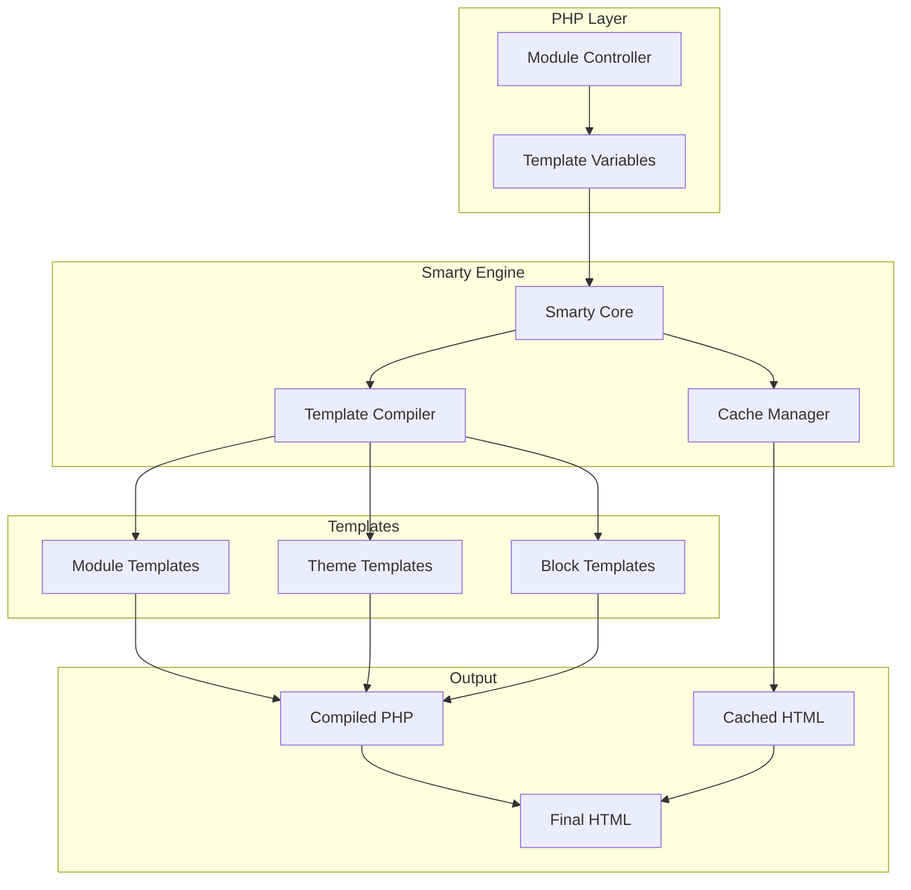
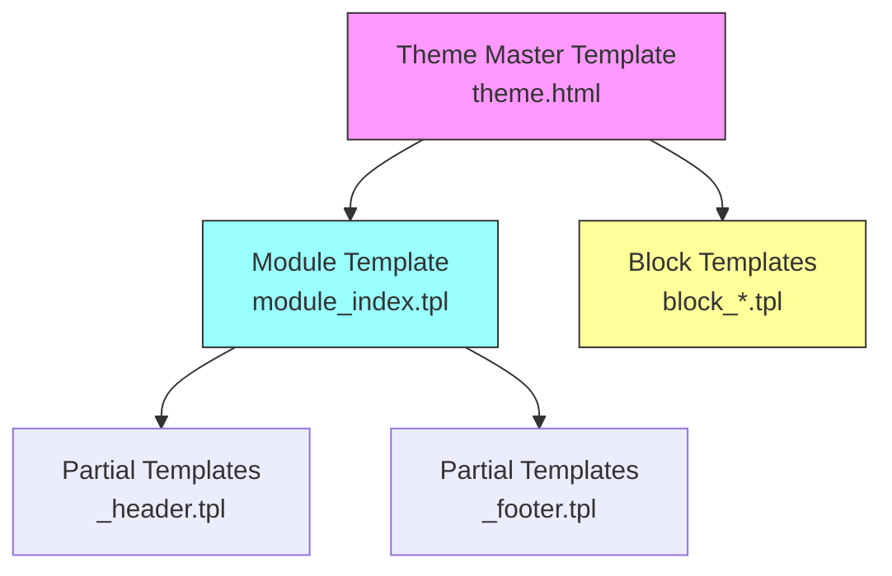
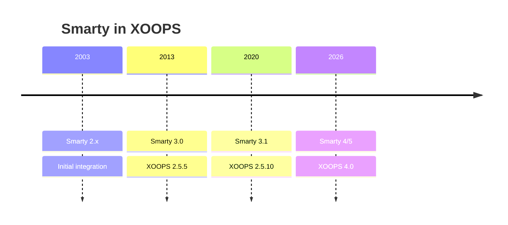

# ADR-003: Sjabloonengine (Smarty)

> Architectuurbeslissingsrecord voor de adoptie door XOOPS van de Smarty-sjabloonengine.

---

## Status

**Geaccepteerd** - Kernbeslissing sinds XOOPS 2.0

**Evoluerend** - Migratie naar Smarty 4/5 gepland voor XOOPS 4.0

---

## Context

XOOPS had een sjabloonoplossing nodig die:

1. Aparte presentatie van bedrijfslogica
2. Laat thema-ontwerpers werken zonder kennis van PHP
3. Ondersteuning van sjabloonovererving en -includes
4. Zorg voor caching voor prestaties
5. Schakel door de gebruiker aanpasbare sjablonen in
6. Ondersteun internationalisering

---

## Beslissingsdiagram



---

## Besluit

We gebruiken **Smarty** als sjabloonengine omdat:

### 1. Scheiding van zorgen

```php
// PHP (Controller) - Business logic
$items = $itemHandler->getPublishedItems();
$xoopsTpl->assign('items', $items);

// Smarty (View) - Presentation
// templates/items.tpl
```

```smarty
{* Smarty template - No PHP logic *}
<{foreach item=item from=$items}>
    <article>
        <h2><{$item.title}></h2>
        <p><{$item.summary}></p>
    </article>
<{/foreach}>
```

### 2. XOOPS scheidingstekens

XOOPS gebruikt `<{` en `}>` in plaats van standaard `{` `}`:

```smarty
{* Standard Smarty *}
{$variable}

{* XOOPS Smarty - Avoids JavaScript conflicts *}
<{$variable}>
```

### 3. Sjabloonhiërarchie



### 4. Sjabloonopslag

- **Database**: aangepaste sjablonen opgeslagen voor herstelmogelijkheden
- **Bestandssysteem**: originele sjablonen in modulemappen
- **Cache**: samengestelde sjablonen voor prestaties

---

## Smarty-configuratie

```php
// XOOPS Smarty initialization
$xoopsTpl = new XoopsTpl();

// Custom delimiters
$xoopsTpl->left_delim = '<{';
$xoopsTpl->right_delim = '}>';

// Caching
$xoopsTpl->caching = XOOPS_TEMPLATE_CACHE;
$xoopsTpl->cache_lifetime = 3600;

// Security
$xoopsTpl->security_policy = new Smarty_Security($xoopsTpl);
$xoopsTpl->security_policy->php_functions = [];
$xoopsTpl->security_policy->php_modifiers = ['escape', 'count'];
```

---

## Gebruikte sjabloonfuncties

### Variabelen

```smarty
{* Simple variable *}
<{$title}>

{* Object property *}
<{$item.title}>

{* With modifier *}
<{$content|truncate:200:'...'}>

{* Escaped output *}
<{$userInput|escape:'html'}>
```

### Controlestructuren

```smarty
{* Conditional *}
<{if $isAdmin}>
    <a href="admin.php">Admin</a>
<{elseif $isUser}>
    <a href="profile.php">Profile</a>
<{else}>
    <a href="login.php">Login</a>
<{/if}>

{* Loop *}
<{foreach item=item from=$items name=itemloop}>
    <{$smarty.foreach.itemloop.index}>: <{$item.title}>
<{/foreach}>
```

### Inclusief

```smarty
{* Include another template *}
<{include file="db:mymodule_header.tpl"}>

{* Include with variables *}
<{include file="db:mymodule_item.tpl" item=$currentItem}>

{* Include from theme *}
<{include file="file:$theme_path/partials/sidebar.tpl"}>
```

---

## Gevolgen

### Positief

1. **Ontwerpervriendelijk**: HTML-achtige syntaxis
2. **Caching**: ingebouwde sjablooncaching
3. **Beveiliging**: PHP-code-isolatie
4. **Flexibiliteit**: modificaties, functies, plug-ins
5. **Aanpassing**: gebruikers kunnen sjablonen wijzigen
6. **Gemeenschap**: Groot Smarty-ecosysteem

### Negatief

1. **Leercurve**: Smarty-specifieke syntaxis
2. **Overhead**: Compilatiestap vereist
3. **Foutopsporing**: sjabloonfouten kunnen cryptisch zijn
4. **Versieproblemen**: belangrijke wijzigingen tussen versies

### Mitigaties

- **Leren**: uitgebreide documentatie
- **Prestaties**: agressieve caching
- **Debugging**: Debug console, wis foutmeldingen
- **Versies**: compatibiliteitslaag in XOOPS

---

## Versiegeschiedenis



---

## Migratie: Smarty 3 naar 4/5

### Brekende veranderingen

```smarty
{* Smarty 3 - Deprecated *}
<{php}>echo date('Y');<{/php}>

{* Smarty 4+ - Use modifiers or assign from PHP *}
<{$current_year}>

{* Smarty 3 - {section} deprecated *}
<{section name=i loop=$items}>
    <{$items[i].title}>
<{/section}>

{* Smarty 4+ - Use {foreach} *}
<{foreach $items as $item}>
    <{$item.title}>
<{/foreach}>
```

### Compatibiliteitslaag

XOOPS biedt een compatibiliteitslaag voor vloeiende overgangen:

```php
// XoopsTpl extends Smarty with compatibility methods
class XoopsTpl extends Smarty
{
    public function assign($tpl_var, $value = null)
    {
        // Handles both Smarty 3 and 4 syntax
        return parent::assign($tpl_var, $value);
    }
}
```

---

## Alternatieven overwogen

### 1. Takje
**Voordelen**: Modern Symfony-ecosysteem
**Nadelen**: verschillende syntaxis, migratie-inspanningen
**Beslissing**: Mogelijke toekomstige optie voor XOOPS 3.x

### 2. Mes (Laravel)
**Voordelen**: Schone syntaxis, populair
**Nadelen**: Laravel-specifiek
**Beslissing**: Niet geschikt voor zelfstandig gebruik

### 3. Native PHP-sjablonen
**Voordelen**: Geen leercurve, snel
**Nadelen**: veiligheidsrisico's, geen scheiding
**Beslissing**: afgewezen vanwege onderhoudbaarheid

---

## Gerelateerde beslissingen

- ADR-001: modulaire architectuur
- ADR-002: Database-abstractie

---

## Referenties

- Smarty-documentatie: https://www.smarty.net/docs/en/
- XOOPS-sjabloonsysteemhandleiding
- MVC-patroon in webapplicaties

---

#xoops #architectuur #adr #Smarty #templates #design-decision