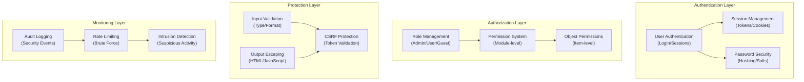

# ADR-004: Architectuur van beveiligingssysteem

> Uitgebreide beveiligingsarchitectuur voor XOOPS CMS ter bescherming tegen moderne bedreigingen.

---

## Status

**Geaccepteerd** - Kernbeveiligingslaag sinds XOOPS 2.5

---

## Context

### Probleemverklaring

XOOPS heeft een robuust beveiligingssysteem nodig dat:

1. **Beschermt tegen veelvoorkomende kwetsbaarheden op internet** (OWASP Top 10)
2. **Biedt gedetailleerd toestemmingscontrole** voor alle modules
3. **Maakt veilige gebruikersauthenticatie mogelijk** met moderne standaarden
4. **Voorkomt datalekken** en ongeautoriseerde toegang
5. **Ondersteunt toegangscontrole op meerdere niveaus** (beheerder, moderator, gebruiker, gast)
6. **Integreert naadloos met alle modules**

### Huidige bedreigingen

Moderne webaanvallen omvatten:

- **SQL Injectie** - Schadelijke SQL in gebruikersinvoer
- **XSS (Cross-Site Scripting)** - JavaScript in pagina's geïnjecteerd
- **CSRF (Cross-Site Request Forgery)** - Ongeautoriseerde formulierinzendingen
- **Authenticatie omzeilen** - Zwakke verwerking van sessies/wachtwoorden
- **Autorisatie omzeilen** - Escalatie van bevoegdheden
- **Gegevensblootstelling** - Gevoelige gegevens in URL's, logs of caches

### XOOPS Beveiligingsvereisten

1. Gebruikersauthenticatie en sessiebeheer
2. Rolgebaseerde toegangscontrole (RBAC)
3. Machtigingssysteem voor modules en objecten
4. Invoervalidatie en uitvoer ontsnappen
5. Bescherming tegen veelvoorkomende aanvallen
6. Auditregistratie van beveiligingsgebeurtenissen
7. Veilig omgaan met wachtwoorden
8. CSRF-tokenbescherming

---

## Besluit

### Kernbeveiligingsarchitectuur



---

## Beveiligingscomponenten

### 1. Authenticatiesysteem

**Aanmeldingsproces gebruiker:**

```php
<?php
// 1. Validate credentials
$user = $userHandler->findByLogin($username);
if (!$user || !password_verify($password, $user->getVar('pass'))) {
    throw new AuthenticationException('Invalid credentials');
}

// 2. Check if account is active
if (!$user->getVar('uactive')) {
    throw new AuthenticationException('Account inactive');
}

// 3. Create secure session
session_regenerate_id(true);
$_SESSION['uid'] = $user->getVar('uid');
$_SESSION['token'] = bin2hex(random_bytes(32));
$_SESSION['created'] = time();

// 4. Log the login
$this->auditLog('USER_LOGIN', $user->getVar('uid'));
```

**Wachtwoordbeveiliging:**

```php
<?php
// Use password_hash (not MD5 or SHA1)
$hashed = password_hash($password, PASSWORD_BCRYPT, [
    'cost' => 12, // High cost = slow brute force
]);

// Verify password
if (!password_verify($inputPassword, $hashed)) {
    throw new Exception('Invalid password');
}

// Rehash if algorithm or cost changed
if (password_needs_rehash($hashed, PASSWORD_BCRYPT, ['cost' => 12])) {
    $newHash = password_hash($password, PASSWORD_BCRYPT, ['cost' => 12]);
    $user->setVar('pass', $newHash);
    $userHandler->insert($user);
}
```

### 2. Sessiebeheer

**Veilige sessieafhandeling:**

```php
<?php
// Session configuration
ini_set('session.cookie_httponly', true);  // No JS access
ini_set('session.cookie_secure', true);     // HTTPS only
ini_set('session.cookie_samesite', 'Strict'); // CSRF protection
ini_set('session.gc_maxlifetime', 3600);   // 1 hour timeout
ini_set('session.sid_length', 64);         // 64-char session ID

// Validate session
function validateSession() {
    // Check timeout
    if (time() - $_SESSION['created'] > 3600) {
        session_destroy();
        throw new SessionExpiredException();
    }

    // Validate user agent (prevent session hijacking)
    if ($_SESSION['user_agent'] !== $_SERVER['HTTP_USER_AGENT']) {
        throw new SessionInvalidException();
    }

    // Validate IP (optional, can be too strict)
    if (!in_array($_SERVER['REMOTE_ADDR'], $_SESSION['ips'])) {
        $_SESSION['ips'][] = $_SERVER['REMOTE_ADDR'];
    }
}
```

### 3. Autorisatie (RBAC)

**Op rollen gebaseerd toegangscontrole:**

```php
<?php
class XoopsUser {
    public function hasPermission(string $permissionName): bool
    {
        // Get user groups
        $groups = $this->getGroups();

        // Check if any group has permission
        foreach ($groups as $groupId) {
            if ($this->checkGroupPermission($groupId, $permissionName)) {
                return true;
            }
        }

        return false;
    }

    /**
     * User groups and their permissions
     * Admin: Full access
     * Moderator: Content management
     * User: Create own content
     * Guest: Read-only access
     */
    private function checkGroupPermission(int $groupId, string $permission): bool
    {
        $permissions = [
            1 => ['admin_access'],                 // Admin group
            2 => ['moderate_content', 'edit_own'], // Moderator group
            3 => ['create_content', 'edit_own'],   // User group
            4 => [],                               // Guest group (no permissions)
        ];

        return in_array($permission, $permissions[$groupId] ?? []);
    }
}
```

### 4. Invoervalidatie

**Voorkom SQL injectie- en typefouten:**

```php
<?php
// Always use prepared statements
$sql = 'SELECT * FROM users WHERE id = ?';
$result = $db->query($sql, [$userId]); // ✅ Safe

// Input validation
function validateUserInput(array $data): array
{
    return [
        'email' => filter_var($data['email'] ?? '', FILTER_VALIDATE_EMAIL),
        'age' => filter_var($data['age'] ?? 0, FILTER_VALIDATE_INT),
        'website' => filter_var($data['website'] ?? '', FILTER_VALIDATE_URL),
        'title' => substr(trim($data['title'] ?? ''), 0, 255),
    ];
}

// XOOPS Safe Input class
$safe = \Xmf\Request::getHtmlRequest('var_name', '');
$int = \Xmf\Request::getInt('page', 1);
```

### 5. Uitvoer ontsnapt

**Voorkom XSS-aanvallen:**

```php
<?php
// In PHP templates
echo htmlspecialchars($userInput, ENT_QUOTES, 'UTF-8');

// In Smarty templates (automatic escaping)
<{$user_input}>  {* Escaped by default *}
<{$html|escape:false}>  {* Only when needed *}

// JavaScript context
<script>
var message = "<{$userMessage|escape:'javascript'}>";
</script>

// URL context
<a href="<{$url|escape:'url'}>">Link</a>
```

### 6. CSRF-bescherming

**Voorkomen van vervalsing op verschillende sites:**

```php
<?php
// Generate CSRF token
session_start();
if (empty($_SESSION['csrf_token'])) {
    $_SESSION['csrf_token'] = bin2hex(random_bytes(32));
}

// In forms
<form method="POST">
    <input type="hidden" name="csrf_token" value="<{$csrf_token}>">
    <button type="submit">Submit</button>
</form>

// Validate token
if ($_SERVER['REQUEST_METHOD'] === 'POST') {
    if (hash_equals($_SESSION['csrf_token'], $_POST['csrf_token'] ?? '')) {
        // Process form
    } else {
        throw new InvalidTokenException('CSRF token invalid');
    }
}
```

---

## Gevolgen

### Positieve effecten

1. **Uitgebreide bescherming** - Dekt de belangrijkste kwetsbaarheidsklassen
2. **Gelaagde beveiliging** - Meerdere verdedigingslagen
3. **Flexibel RBAC** - Fijnmazig toestemmingsbeheer
4. **Audittraject** - Volg beveiligingsgebeurtenissen
5. **Industriestandaard** - Komt overeen met de aanbevelingen van OWASP
6. **Module-integratie** - Modules kunnen eenvoudig beveiligings-API's gebruiken

### Negatieve effecten

1. **Complexiteit** - Er is meer code en configuratie nodig
2. **Prestaties** - Hashing en validatie voegen overhead toe
3. **Gebruikerservaring** - Beveiliging soms lastig
4. **Onderhoud** - Vereist voortdurende beveiligingsupdates
5. **Training vereist** - Ontwikkelaars moeten de praktijken volgen

### Risico's en oplossingen

| Risico | Ernst | Mitigatie |
|-----|----------|-----------|
| Ontwikkelaar negeert beveiliging | Hoog | Codebeoordeling, beveiligingstraining |
| Nieuwe kwetsbaarheden ontdekt | Middel | Regelmatige beveiligingsaudits, updates |
| Prestatie-impact | Laag | Optimaliseer hotpaths, caching |
| Te complexe machtigingen | Middel | Duidelijke documentatie, voorbeelden |

---

## Beste beveiligingspraktijken

### Voor moduleontwikkelaars

```php
<?php
// ✅ DO: Use prepared statements
$result = $db->prepare('SELECT * FROM table WHERE id = ?')->execute([$id]);

// ❌ DON'T: Concatenate queries
$result = $db->query("SELECT * FROM table WHERE id = $id");

// ✅ DO: Escape output
echo htmlspecialchars($user_input, ENT_QUOTES, 'UTF-8');

// ❌ DON'T: Output raw user data
echo $user_input;

// ✅ DO: Check permissions
if (!$user->hasPermission('edit_content')) {
    throw new PermissionException();
}

// ❌ DON'T: Trust user roles directly
if ($_POST['is_admin']) {
    // Make user admin - SECURITY HOLE!
}

// ✅ DO: Validate input types
$page = (int)$_GET['page'];

// ❌ DON'T: Use untrusted values directly
$sql .= " LIMIT " . $_GET['limit'];
```

---

## Alternatieven overwogen

### OAuth/OpenID-verbinding

**Waarom in eerste instantie niet gekozen:** Te complex voor een gedeelde hostingomgeving, maar goed voor toekomstige integratie met externe authenticatiesystemen.

### Tweefactorauthenticatie (2FA)

**Status:** Geaccepteerd als uitbreiding, geen kernvereiste, zie ADR-006

### HTTP alleen sessiecookies

**Status:** Geïmplementeerd - voorkomt JavaScript-toegang tot sessiegegevens

---

## Gerelateerde beslissingen

- ADR-001: Modulaire architectuur - Modules implementeren beveiliging
- ADR-005: Modulemachtigingssysteem
- ADR-006: tweefactorauthenticatie (toekomstig)

---

## Referenties

### Beveiligingsnormen

- [OWASP Top 10](https://owasp.org/www-project-top-ten/)
- [NIST Cyberbeveiligingsframework](https://www.nist.gov/cyberframework)
- [CWE Top 25](https://cwe.mitre.org/top25/)### PHP-beveiliging

- [PHP Beveiligingshandleiding](https://www.php.net/manual/en/security.php)
- [password_hash() Documentatie](https://www.php.net/manual/en/function.password-hash.php)
- [Sessiebeveiliging](https://www.php.net/manual/en/session.security.php)

### Gereedschap

- [OWASP ZAP](https://www.zaproxy.org/) - Beveiligingstests
- [Snyk](https://snyk.io/) - Scannen op kwetsbaarheden
- [SonarQube](https://www.sonarqube.org/) - Codekwaliteit

---

## Implementatiechecklist

- [ ] Gebruikersauthenticatiesysteem
- [ ] Sessiebeheer
- [ ] Wachtwoordhashing (bcrypt)
- [ ] Rolgebaseerde toegangscontrole
- [ ] Modulerechten
- [ ] Kader voor invoervalidatie
- [ ] Uitgang ontsnappen (PHP + Smarty)
- [ ] CSRF-tokenbescherming
- [ ] Logboekregistratie van beveiligingsaudits
- [ ] Snelheidslimiet
- [ ] Beveiligingsheaders

---

## Versiegeschiedenis

| Versie | Datum | Wijzigingen |
|---------|------|---------|
| 1.0.0 | 28-01-2024 | Oorspronkelijk document |

---

#xoops #adr #security #architectuur #authenticatie #autorisatie #rbac