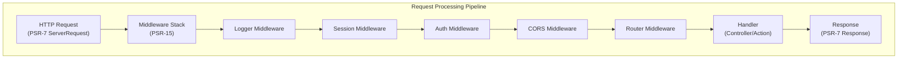

# ADR-005: PSR-15 Middleware-patroon voor XOOPS 4.0

> Gebruik PSR-15 HTTP serververzoekhandlers (middleware) voor een verbeterde pijplijn voor de verwerking van verzoeken.

:::let op[XOOPS 4.0 voorstel — niet beschikbaar in 2.5.x]
Deze ADR beschrijft een **voorgestelde architectuur voor XOOPS 4.0**. PSR-15-middleware is **niet beschikbaar in XOOPS 2.5.x**. De huidige 2.5.x-modules gebruiken het Page Controller-patroon met `mainfile.php`-bootstrap. Zie XOOPS Architecture voor de huidige levenscyclus van verzoeken.
:::

---

## Status

**Voorgesteld** - Wordt momenteel geëvalueerd voor de release XOOPS 4.0

---

## Context

### Huidige aanpak

XOOPS 2.5 maakt gebruik van een monolithische aanpak voor het afhandelen van verzoeken:

```php
// Current: Sequential processing
require_once 'mainfile.php';
// → Kernel initialization
// → User authentication
// → Module loading
// → Page rendering

// All in one flow, mixed concerns
```

### Problemen met de huidige aanpak

1. **Gemengde problemen** - Authenticatie, logboekregistratie en routering zijn allemaal met elkaar verweven
2. **Moeilijk te testen** - Moeilijk om individuele verwerkingsstappen van verzoeken te testen
3. **Moeilijk uit te breiden** - Modules kunnen alleen aanhaken via preload/gebeurtenissen
4. **Slechte scheiding** - Verzoekverwerkingslogica verspreid over de codebase
5. **Niet composeerbaar** - Kan verwerkingsstappen niet eenvoudig aan elkaar koppelen of opnieuw ordenen

### Wat is PSR-15 middleware?

PSR-15 definieert een standaardinterface voor HTTP-middleware:

```php
<?php
interface RequestHandlerInterface {
    public function handle(ServerRequestInterface $request): ResponseInterface;
}

interface MiddlewareInterface {
    public function process(
        ServerRequestInterface $request,
        RequestHandlerInterface $handler
    ): ResponseInterface;
}
```

**Middleware-keten:**

```
Request
  ↓
[Logger] → logs request
  ↓
[Auth] → validates user session
  ↓
[CORS] → checks cross-origin
  ↓
[Router] → dispatches to handler
  ↓
[Handler] → generates response
  ↓
Response
```

---

## Besluit

### Gebruik PSR-15 Middleware Stack voor XOOPS 4.0

Implementeer een op middleware gebaseerde pijplijn voor aanvraagverwerking volgens de PSR-15-standaard.

### Architectuuroverzicht



### Kern-middleware-componenten

#### 1. Applicatie-middleware (kernlaag)

```php
<?php
declare(strict_types=1);

namespace XoopsCore;

use Psr\Http\Message\ResponseInterface;
use Psr\Http\Message\ServerRequestInterface;
use Psr\Http\Server\MiddlewareInterface;
use Psr\Http\Server\RequestHandlerInterface;

class SessionMiddleware implements MiddlewareInterface
{
    public function process(
        ServerRequestInterface $request,
        RequestHandlerInterface $handler
    ): ResponseInterface {
        // 1. Retrieve session (or start new)
        $sessionId = $request->getCookieParams()['PHPSESSID'] ?? null;
        $session = $this->sessionManager->load($sessionId);

        // 2. Attach session to request
        $request = $request->withAttribute('session', $session);

        // 3. Pass to next middleware
        $response = $handler->handle($request);

        // 4. Set session cookie if needed
        if ($session->isModified()) {
            $response = $response->withAddedHeader(
                'Set-Cookie',
                'PHPSESSID=' . $session->getId() . '; HttpOnly; SameSite=Strict'
            );
        }

        return $response;
    }
}
```

#### 2. Authenticatie-middleware

```php
<?php
class AuthMiddleware implements MiddlewareInterface
{
    public function process(
        ServerRequestInterface $request,
        RequestHandlerInterface $handler
    ): ResponseInterface {
        // Get session from previous middleware
        $session = $request->getAttribute('session');

        // Authenticate user from session
        $user = $this->authenticate($session);

        // Attach user to request
        $request = $request->withAttribute('user', $user);

        return $handler->handle($request);
    }

    private function authenticate(?Session $session): User
    {
        if ($session && $session->has('uid')) {
            return $this->userRepository->findById($session->get('uid'));
        }

        return new AnonymousUser();
    }
}
```

#### 3. Autorisatie-middleware

```php
<?php
class AuthorizationMiddleware implements MiddlewareInterface
{
    public function __construct(private AuthorizationChecker $checker)
    {
    }

    public function process(
        ServerRequestInterface $request,
        RequestHandlerInterface $handler
    ): ResponseInterface {
        $user = $request->getAttribute('user');
        $route = $request->getAttribute('route');

        // Check if user has permission for this route
        if (!$this->checker->isGranted($user, $route)) {
            return new JsonResponse(
                ['error' => 'Unauthorized'],
                403
            );
        }

        return $handler->handle($request);
    }
}
```

#### 4. Module-middleware

```php
<?php
// Modules can provide their own middleware
class PublisherAccessMiddleware implements MiddlewareInterface
{
    public function process(
        ServerRequestInterface $request,
        RequestHandlerInterface $handler
    ): ResponseInterface {
        $user = $request->getAttribute('user');

        // Module-specific access control
        if (!$user->hasPermission('publisher_view')) {
            return new HtmlResponse('Access denied', 403);
        }

        return $handler->handle($request);
    }
}
```

### Implementatievoorbeeld

```php
<?php
// bootstrap.php - Application setup

use Psr\Http\Message\ServerRequestInterface;
use Psr\Http\Server\RequestHandlerInterface;
use Xoops\Core\Middleware\{
    LoggerMiddleware,
    SessionMiddleware,
    AuthMiddleware,
    CorsMiddleware,
    ErrorHandlingMiddleware
};

// Create middleware pipeline
$middlewareStack = [
    // 1. Error handling (outermost)
    new ErrorHandlingMiddleware(),

    // 2. Logging
    new LoggerMiddleware($logger),

    // 3. CORS handling
    new CorsMiddleware($corsConfig),

    // 4. Session management
    new SessionMiddleware($sessionManager),

    // 5. Authentication
    new AuthMiddleware($userRepository),

    // 6. Authorization
    new AuthorizationMiddleware($authChecker),

    // 7. Routing and dispatching
    new RoutingMiddleware($router),

    // 8. Module middleware (dynamic)
    ...$this->loadModuleMiddleware(),
];

// Process request through middleware stack
$request = ServerRequestFactory::fromGlobals();
$dispatcher = new MiddlewareDispatcher($middlewareStack);
$response = $dispatcher->dispatch($request);

// Send response
http_response_code($response->getStatusCode());
foreach ($response->getHeaders() as $name => $values) {
    foreach ($values as $value) {
        header("$name: $value", false);
    }
}
echo $response->getBody();
```

### Module-integratie

Modules kunnen middleware bieden:

```php
<?php
// Publisher module - xoops_version.php

$modversion['middleware'] = [
    'PublisherAccessMiddleware' => true,      // Auto-load
    'PublisherLogMiddleware' => true,
];

// Or custom:
$modversion['middleware_factory'] = function() {
    return [
        new PublisherCacheMiddleware(),
        new PublisherPermissionMiddleware(),
    ];
};
```

---

## Gevolgen

### Positieve effecten

1. **Scheiding van zorgen** - Elke middleware heeft één verantwoordelijkheid
2. **Testbaarheid** - Eenvoudig testen van individuele middleware-componenten
3. **Composibiliteit** - Middleware kan worden gemengd en opnieuw worden gerangschikt
4. **Voldoet aan normen** - Maakt gebruik van de standaarden PSR-15 en PSR-7
5. **Uitbreidbaarheid** - Modules kunnen eenvoudig aangepaste middleware toevoegen
6. **Foutopsporing** - Duidelijke aanvraagstroom via pijplijn
7. **Prestaties** - Kan specifieke middleware-lagen optimaliseren
8. **Interoperabiliteit** - Kan PSR-15 middleware van derden gebruiken

### Negatieve effecten

1. **Leercurve** - Ontwikkelaars moeten PSR-15 begrijpen
2. **Prestatieoverhead** - Meer functieaanroepen in de pijplijn
3. **Complexiteit** - Meer bewegende delen dan een monolithische aanpak
4. **Migratie-inspanning** - Vereist refactoring van bestaande code
5. **Afhankelijkheden** - Vereist PSR-7 HTTP-bibliotheek

### Risico's en oplossingen

| Risico | Ernst | Mitigatie |
|-----|----------|-----------|
| Complexe middlewareketens | Middel | Duidelijke documentatie, voorbeelden |
| Prestatievermindering | Middel | Benchmark, optimaliseer hotpaths |
| Misbruik door ontwikkelaar | Middel | Codebeoordeling, gids voor best practices |
| Migratiebrekende veranderingen | Hoog | Afschrijvingsperiode, helpers |
| Problemen met bestellen van middleware | Middel | Duidelijke afhankelijkheidsgrafiek |

---

## Implementatieplan

### Fase 1: Fundering (Q2 2026)

- [ ] Implementeer PSR-7 HTTP berichtenwrapper
- [ ] MiddlewareDispatcher maken
- [ ] Kern-middleware implementeren (sessie, authenticatie)
- [ ] Kernel bijwerken om middleware te gebruiken

### Fase 2: Integratie (Q3 2026)

- [ ] Migreer bestaande functionaliteit naar middleware
- [ ] Ondersteuning voor module-middleware toegevoegd
- [ ] Maak testhulpprogramma's voor middleware
- [ ] Schrijf uitgebreide documentatie

### Fase 3: Migratie (Q4 2026)

- [ ] Zorg voor een compatibiliteitslaag voor oude code
- [ ] Help-modules worden bijgewerkt naar nieuwe middleware
- [ ] Prestatieoptimalisatie
- [ ] Beveiligingsaudit

### Fase 4: release (Q1 2027)

- [ ] XOOPS 4.0-release met middleware
- [ ] Oude preload/hook-systeem afschaffen
- [ ] Communityfeedback en updates

---## Succescriteria

- [ ] Alle kernfunctionaliteit gemigreerd naar middleware
- [ ] 90%+ testdekking voor middleware
- [ ] Documentatie compleet met voorbeelden
- [ ] Prestaties binnen 10% van de vorige versie
- [ ] Modules gebruiken met succes een nieuw middlewaresysteem
- [ ] Communautair adoptiepercentage >80%

---

## Beste praktijken voor middleware

### Doen

- Houd middleware gefocust (enkele verantwoordelijkheid)
- Gebruik onveranderlijkheid (maak een nieuw verzoek/antwoord)
- Ga netjes om met fouten
- Documentafhankelijkheden
- Voeg typehints toe
- Testen schrijven voor middleware
- Gebruik standaard PSR-15-interfaces

### Niet doen

- Wijzig geen gedeelde verzoek-/antwoordobjecten
- Krijg geen directe toegang tot globals
- Maak geen afhankelijkheden van de volgorde van de middleware
- Houd niet rekening met alle uitzonderingen
- Meng bedrijfslogica niet met middleware
- Laat middleware niet te veel doen

---

## Voorbeelden

### Aangepaste middleware

```php
<?php
// Example: Rate limiting middleware

use Psr\Http\Message\ResponseInterface;
use Psr\Http\Message\ServerRequestInterface;
use Psr\Http\Server\MiddlewareInterface;
use Psr\Http\Server\RequestHandlerInterface;

class RateLimitMiddleware implements MiddlewareInterface
{
    public function __construct(
        private RateLimiter $limiter,
        private int $limit = 100,
        private int $window = 3600
    ) {
    }

    public function process(
        ServerRequestInterface $request,
        RequestHandlerInterface $handler
    ): ResponseInterface {
        $user = $request->getAttribute('user');
        $identifier = $user->getId() ?? $request->getClientIp();

        // Check rate limit
        $remaining = $this->limiter->check($identifier, $this->limit, $this->window);

        if ($remaining < 0) {
            return new JsonResponse(
                ['error' => 'Rate limit exceeded'],
                429
            );
        }

        // Add rate limit headers
        $response = $handler->handle($request);
        return $response
            ->withAddedHeader('X-RateLimit-Limit', (string)$this->limit)
            ->withAddedHeader('X-RateLimit-Remaining', (string)$remaining);
    }
}
```

---

## Gerelateerde beslissingen

- ADR-001: Modulaire architectuur - Fundering
- ADR-004: Beveiligingssysteem - Gebruikt middleware voor verificatie
- ADR-006: Twee-Factor Authenticatie - Kan middleware zijn

---

## Referenties

### PSR-normen

- [PSR-7: HTTP berichtinterface](https://www.php-fig.org/psr/psr-7/)
- [PSR-15: HTTP serververzoekafhandelaars](https://www.php-fig.org/psr/psr-15/)

### Middleware-frameworks

- [Slim Framework](https://www.slimframework.com/) - Middleware-voorbeelden
- [Zend Expressive](https://docs.zendframework.com/zend-expressive/) - PSR-15-framework
- [Guzzle](https://docs.guzzlephp.org/) - HTTP client-middleware

### Gereedschap

- [RelayPHP](https://relayphp.com/) - Middleware-bibliotheek
- [PSR-15 Middleware](https://github.com/middlewares) - Verzameling middlewares

---

## Versiegeschiedenis

| Versie | Datum | Wijzigingen |
|---------|------|---------|
| 1.0.0 | 28-01-2024 | Oorspronkelijk voorstel |

---

#xoops #adr #psr-15 #middleware #architectuur #psr-7