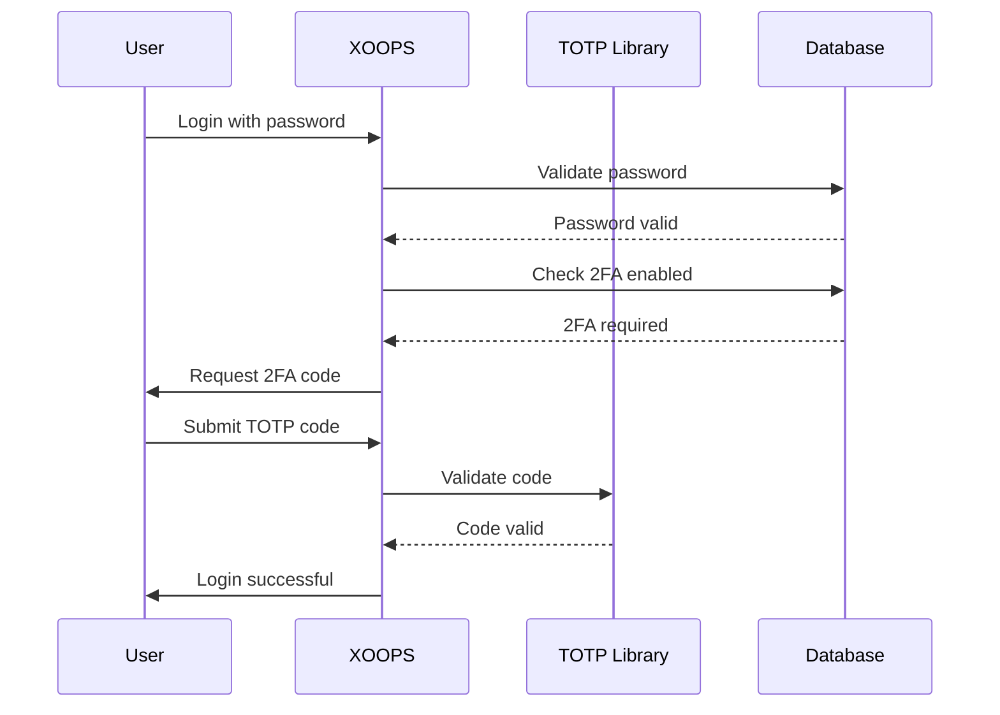

## Status

Voorgesteld

## Context

XOOPS heeft verbeterde beveiliging nodig voor gebruikersauthenticatie. Tweefactorauthenticatie (2FA) biedt een extra beveiligingslaag naast wachtwoorden, waardoor accounts worden beschermd, zelfs als wachtwoorden in gevaar komen.

Belangrijkste overwegingen:
- Achterwaartse compatibiliteit met bestaande authenticatie
- Ondersteuning voor meerdere 2FA-methoden
- Gebruikerservaring tijdens installatie en inloggen
- Herstelmechanismen voor verloren apparaten
- Integratie met bestaand toestemmingssysteem

## Besluit

We zullen TOTP (Time-based One-Time Password) implementeren als de primaire 2FA-methode met ondersteuning voor back-upcodes.

### Implementatieaanpak



### Databaseschema

```sql
CREATE TABLE `{PREFIX}_users_2fa` (
    `user_id` INT(11) NOT NULL,
    `secret` VARCHAR(32) NOT NULL,
    `enabled` TINYINT(1) DEFAULT 0,
    `backup_codes` TEXT,
    `last_used` INT(11),
    `created` INT(11) NOT NULL,
    PRIMARY KEY (`user_id`),
    FOREIGN KEY (`user_id`) REFERENCES `{PREFIX}_users`(`uid`)
);
```

### Service-interface

```php
interface TwoFactorAuthInterface
{
    public function enable(int $userId): TwoFactorSetup;
    public function disable(int $userId): void;
    public function verify(int $userId, string $code): bool;
    public function generateBackupCodes(int $userId): array;
    public function isEnabled(int $userId): bool;
}
```

### Middleware-integratie

```php
class TwoFactorMiddleware implements MiddlewareInterface
{
    public function process(
        ServerRequestInterface $request,
        RequestHandlerInterface $handler
    ): ResponseInterface {
        $session = $request->getAttribute('session');

        if ($session->has('pending_2fa_user_id')) {
            // User needs to complete 2FA
            if ($this->isVerificationRequest($request)) {
                return $handler->handle($request);
            }
            return new RedirectResponse('/2fa/verify');
        }

        return $handler->handle($request);
    }
}
```

## Gevolgen

### Positief

- Aanzienlijk verbeterde accountbeveiliging
- Industriestandaard TOTP-compatibiliteit (Google Authenticator, Authy, enz.)
- Back-upcodes voorkomen accountvergrendeling
- Optioneel per gebruiker: dwingt acceptatie niet af
- PSR-15 middleware maakt schone integratie mogelijk

### Negatief

- Extra inlogstap heeft invloed op de gebruikerservaring
- Gebruikers moeten authenticator-apps beheren
- Voor verloren apparaten is een herstelproces vereist
- Extra databaseopslag en query's
- Vereist afhankelijkheid van cryptografische bibliotheek

### Migratiepad

1. Voeg een databasetabel toe voor 2FA-gegevens
2. Implementeer de TOTP-service met bibliotheekafhankelijkheid
3. Voeg middleware toe aan de authenticatieketen
4. Maak een installatie- en verificatie-UI
5. Beheerderoptie om 2FA te vereisen voor specifieke groepen

## Alternatieven overwogen

### SMS-gebaseerde OTP

Afgewezen vanwege:
- SIM kwetsbaarheden bij het wisselen
- Kosten van SMS-gateway
- Complexiteit van telefoonnummerverificatie
- Privacyproblemen

### Hardwarebeveiligingssleutels (WebAuthn)

Uitgesteld voor toekomstig ADR:
- Complexere implementatie
- Historisch gezien beperkte browserondersteuning
- Hogere gebruikerskosten
- Kan later naast TOTP worden toegevoegd

### Op e-mail gebaseerd OTP

Afgewezen vanwege:
- Het compromitteren van e-mailaccounts verslaat het doel
- Vertragingen in de levering hebben invloed op de UX
- Problemen met spamfilters

## Referenties

- [RFC 6238 - TOTP](https://tools.ietf.org/html/rfc6238)
- [Google Authenticator-sleutelindeling](https://github.com/google/google-authenticator/wiki/Key-Uri-Format)
- ../../02-Core-Concepts/Security/Security-Best-Practices - Beveiligingsrichtlijnen
- ../../02-Core-Concepts/Users-Permissions/Authentication - Auth-systeemdocumentatie