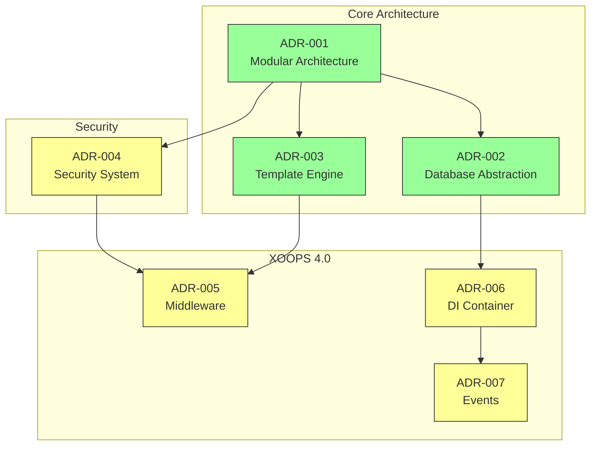
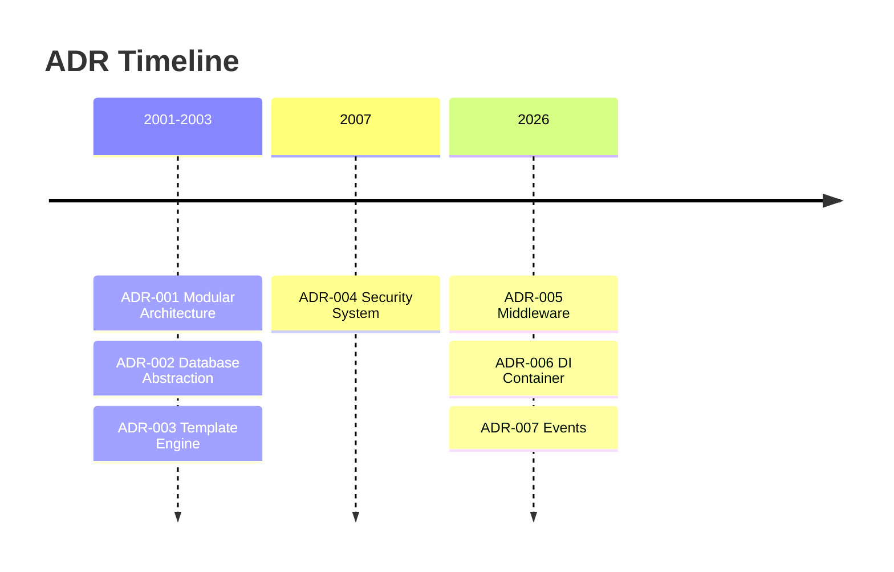

# 📋 Index van architectuurbeslissingsrecords

> Uitgebreide index van architectonische beslissingen die vorm hebben gegeven aan XOOPS CMS.

---

## Wat zijn bijwerkingen?

Architecture Decision Records (ADR's) documenteren belangrijke architecturale beslissingen die zijn genomen tijdens de ontwikkeling van XOOPS. Ze leggen de context, de beslissing en de gevolgen van elke keuze vast en bieden waardevolle historische context voor beheerders en bijdragers.

---

## ADR Statuslegenda

| Staat | Betekenis |
|--------|---------|
| **Voorgesteld** | In discussie, nog niet geaccepteerd |
| **Geaccepteerd** | Besluit is aangenomen |
| **Verouderd** | Niet langer aanbevolen |
| **Vervangen** | Vervangen door een andere ADR |

---

## Huidige bijwerkingen

### Fundamentele beslissingen

| ADR | Titel | Staat | Gevolgen |
|-----|-------|--------|--------|
| ADR-001 | Modulaire architectuur | Geaccepteerd | Kern |
| ADR-002 | Objectgeoriënteerde databasetoegang | Geaccepteerd | Kern |
| ADR-003 | Smarty-sjabloonengine | Geaccepteerd | Kern |

### Geplande bijwerkingen (XOOPS 4.0)

| ADR | Titel | Staat | Gevolgen |
|-----|-------|--------|--------|
| ADR-004 | Ontwerp van beveiligingssysteem | Voorgesteld | Beveiliging |
| ADR-005 | PSR-15 Middleware | Voorgesteld | Architectuur |
| ADR-006 | Afhankelijkheid injectiecontainer | Voorgesteld | Architectuur |
| ADR-007 | Herontwerp van evenementensysteem | Voorgesteld | Architectuur |

---

## ADR-relaties



---

## Tijdlijn



---

## Nieuwe ADR's aanmaken

Bij het voorstellen van een nieuw architectonisch besluit:

1. Kopieer de ADR-sjabloon
2. Vul alle secties in
3. Indienen als Pull Request
4. Bespreek problemen in GitHub
5. Update status na beslissing

### ADR-sjabloonstructuur

```markdown
# ADR-XXX: Title

## Status
Proposed | Accepted | Deprecated | Superseded

## Context
What is the issue motivating this decision?

## Decision
What is the change that we're proposing?

## Consequences
What becomes easier or harder as a result?

## Alternatives Considered
What other options were evaluated?
```

---

## 🔗 Gerelateerde documentatie

- Kernconcepten
- Richtlijnen voor bijdragen
- XOOPS 4.0-routekaart

---

#xoops #adr #architectuur #index #decisions