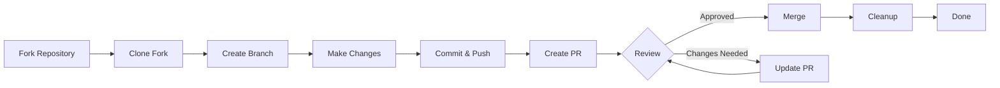

> Deze handleiding leidt u door het volledige proces van bijdragen aan XOOPS, van de eerste installatie tot de samengevoegde pull-aanvraag.

---

## Vereisten

Voordat u begint met bijdragen, moet u ervoor zorgen dat u over het volgende beschikt:

- **Git** geïnstalleerd en geconfigureerd
- **GitHub-account** (gratis)
- **PHP 7.4+** voor XOOPS-ontwikkeling
- **Componist** voor afhankelijkheidsbeheer
- Basiskennis van Git-workflows
- Kennis van de Gedragscode

---

## Stap 1: Fork de repository

### Op GitHub-webinterface

1. Navigeer naar de repository (bijvoorbeeld `XOOPS/XoopsCore27`)
2. Klik op de knop **Vork** in de rechterbovenhoek
3. Selecteer waar u wilt forken (uw persoonlijke account)
4. Wacht tot de vork klaar is

### Waarom vork?

- Je krijgt een eigen exemplaar om aan te werken
- Onderhouders hoeven niet veel vestigingen te beheren
- U heeft volledige controle over uw vork
- Pull Requests verwijzen naar uw fork en de upstream repository

---

## Stap 2: Kloon uw vork lokaal

```bash
# Clone your fork (replace YOUR_USERNAME)
git clone https://github.com/YOUR_USERNAME/XoopsCore27.git
cd XoopsCore27

# Add upstream remote to track original repository
git remote add upstream https://github.com/XOOPS/XoopsCore27.git

# Verify remotes are set correctly
git remote -v
# origin    https://github.com/YOUR_USERNAME/XoopsCore27.git (fetch)
# origin    https://github.com/YOUR_USERNAME/XoopsCore27.git (push)
# upstream  https://github.com/XOOPS/XoopsCore27.git (fetch)
# upstream  https://github.com/XOOPS/XoopsCore27.git (nofetch)
```

---

## Stap 3: Ontwikkelomgeving instellen

### Afhankelijkheden installeren

```bash
# Install Composer dependencies
composer install

# Install development dependencies
composer install --dev

# For module development
cd modules/mymodule
composer install
```

### Git configureren

```bash
# Set your Git identity
git config user.name "Your Name"
git config user.email "your.email@example.com"

# Optional: Set global Git config
git config --global user.name "Your Name"
git config --global user.email "your.email@example.com"
```

### Voer tests uit

```bash
# Make sure tests pass in clean state
./vendor/bin/phpunit

# Run specific test suite
./vendor/bin/phpunit --testsuite unit
```

---

## Stap 4: Maak een functievertakking

### Conventie voor de naamgeving van vertakkingen

Volg dit patroon: `<type>/<description>`

**Soorten:**
- `feature/` - Nieuwe functie
- `fix/` - Bugfix
- `docs/` - Alleen documentatie
- `refactor/` - Coderefactoring
- `test/` - Testtoevoegingen
- `chore/` - Onderhoud, gereedschap

**Voorbeelden:**
```bash
# Feature branch
git checkout -b feature/add-two-factor-auth

# Bug fix branch
git checkout -b fix/prevent-xss-in-forms

# Documentation branch
git checkout -b docs/update-api-guide

# Always branch from upstream/main (or develop)
git checkout -b feature/my-feature upstream/main
```

### Branch up-to-date houden

```bash
# Before you start work, sync with upstream
git fetch upstream
git merge upstream/main

# Later, if upstream has changed
git fetch upstream
git rebase upstream/main
```

---

## Stap 5: breng uw wijzigingen aan

### Ontwikkelingspraktijken

1. **Schrijf code** volgens de PHP-normen
2. **Schrijf tests** voor nieuwe functionaliteit
3. **Update de documentatie** indien nodig
4. **Voer linters uit** en codeformatters

### Codekwaliteitscontroles

```bash
# Run all tests
./vendor/bin/phpunit

# Run with coverage
./vendor/bin/phpunit --coverage-html coverage/

# Run PHP CS Fixer
./vendor/bin/php-cs-fixer fix --dry-run

# Run PHPStan static analysis
./vendor/bin/phpstan analyse class/ src/
```

### Voer goede veranderingen door

```bash
# Check what you changed
git status
git diff

# Stage specific files
git add class/MyClass.php
git add tests/MyClassTest.php

# Or stage all changes
git add .

# Commit with descriptive message
git commit -m "feat(auth): add two-factor authentication support"
```

---

## Stap 6: Houd Branch gesynchroniseerd

Terwijl u aan uw feature werkt, kan de hoofdvertakking vooruitgaan:

```bash
# Fetch latest changes from upstream
git fetch upstream

# Option A: Rebase (preferred for clean history)
git rebase upstream/main

# Option B: Merge (simpler but adds merge commits)
git merge upstream/main

# If conflicts occur, resolve them then:
git add .
git rebase --continue  # or git merge --continue
```

---

## Stap 7: Duw naar je vork

```bash
# Push your branch to your fork
git push origin feature/my-feature

# On subsequent pushes
git push

# If you rebased, you might need force push (use carefully!)
git push --force-with-lease origin feature/my-feature
```

---

## Stap 8: Maak een pull-verzoek

### Op GitHub-webinterface

1. Ga naar je fork op GitHub
2. U ziet een melding om vanuit uw vestiging een PR aan te maken
3. Klik op **"Vergelijken en verzoek ophalen"**
4. Of klik handmatig op **"Nieuwe pull-aanvraag"** en selecteer uw vestiging

### PR-titel en beschrijving

**Titelformaat:**
```
<type>(<scope>): <subject>
```

Voorbeelden:
```
feat(auth): add two-factor authentication
fix(forms): prevent XSS in text input
docs: update installation guide
refactor(core): improve performance
```

**Beschrijvingssjabloon:**

```markdown
## Description
Brief explanation of what this PR does.

## Changes
- Changed X from A to B
- Added feature Y
- Fixed bug Z

## Type of Change
- [ ] New feature (adds new functionality)
- [ ] Bug fix (fixes an issue)
- [ ] Breaking change (API/behavior change)
- [ ] Documentation update

## Testing
- [ ] Added tests for new functionality
- [ ] All existing tests pass
- [ ] Manual testing performed

## Screenshots (if applicable)
Include before/after screenshots for UI changes.

## Related Issues
Closes #123
Related to #456

## Checklist
- [ ] Code follows style guidelines
- [ ] Self-reviewed own code
- [ ] Commented complex code
- [ ] Updated documentation
- [ ] No new warnings generated
- [ ] Tests pass locally
```

### PR-beoordelingchecklist

Zorg ervoor dat u, voordat u het indient, het volgende doet:

- [ ] Code volgt de PHP-normen
- [ ] Tests zijn inbegrepen en slagen
- [ ] Documentatie bijgewerkt (indien nodig)
- [ ] Geen samenvoegconflicten
- [ ] Commit-berichten zijn duidelijk
- [ ] Er wordt verwezen naar gerelateerde problemen
- [ ] PR-beschrijving is gedetailleerd
- [ ] Geen foutopsporingscode of consolelogboeken

---

## Stap 9: Reageer op feedback

### Tijdens codebeoordeling

1. **Lees de opmerkingen aandachtig** - Begrijp de feedback
2. **Stel vragen** - Als het onduidelijk is, vraag dan om opheldering
3. **Bespreek alternatieven** - Bespreek op respectvolle wijze benaderingen
4. **Gevraagde wijzigingen aanbrengen** - Update uw vestiging
5. **Force-push bijgewerkte commits** - Als de geschiedenis wordt herschreven

```bash
# Make changes
git add .
git commit --amend  # Modify last commit
git push --force-with-lease origin feature/my-feature

# Or add new commits
git commit -m "Address feedback on PR review"
git push origin feature/my-feature
```

### Verwacht iteratie

- De meeste PR's vereisen meerdere beoordelingsrondes
- Wees geduldig en constructief
- Zie feedback als leermogelijkheid
- Onderhouders kunnen refactoren voorstellen

---

## Stap 10: Samenvoegen en opruimen

### Na goedkeuring

Zodra de beheerders het goedkeuren en samenvoegen:

1. **GitHub voegt automatisch samen** of klikken van beheerders worden samengevoegd
2. **Uw filiaal wordt verwijderd** (meestal automatisch)
3. **Wijzigingen vinden upstream plaats**

### Lokale opschoning

```bash
# Switch to main branch
git checkout main

# Update main with merged changes
git fetch upstream
git merge upstream/main

# Delete local feature branch
git branch -d feature/my-feature

# Delete from your fork (if not auto-deleted)
git push origin --delete feature/my-feature
```

---

## Werkstroomdiagram



---

## Veelvoorkomende scenario's

### Synchroniseren voordat u begint

```bash
# Always start fresh
git fetch upstream
git checkout -b feature/new-thing upstream/main
```

### Meer commits toevoegen

```bash
# Just push again
git add .
git commit -m "feat: additional changes"
git push origin feature/new-thing
```

### Fouten herstellen

```bash
# Last commit has wrong message
git commit --amend -m "Correct message"
git push --force-with-lease

# Revert to previous state (careful!)
git reset --soft HEAD~1  # Keep changes
git reset --hard HEAD~1  # Discard changes
```

### Samenvoegconflicten afhandelen

```bash
# Rebase and resolve conflicts
git fetch upstream
git rebase upstream/main

# Edit conflicted files to resolve
# Then continue
git add .
git rebase --continue
git push --force-with-lease
```

---

## Beste praktijken

### Doen

- Houd vestigingen gefocust op afzonderlijke kwesties
- Maak kleine, logische commits
- Schrijf beschrijvende commit-berichten
- Update uw filiaal regelmatig
- Test voordat u duwt
- Documentwijzigingen
- Reageer op feedback

### Niet doen- Werk rechtstreeks op de hoofd-/mastertak
- Meng niet-gerelateerde wijzigingen in één PR
- Commit gegenereerde bestanden of node_modules
- Forceer push nadat PR openbaar is (gebruik --force-with-lease)
- Negeer feedback over codebeoordelingen
- Creëer enorme PR's (breek deze op in kleinere)
- Gevoelige gegevens vastleggen (API sleutels, wachtwoorden)

---

## Tips voor succes

### Communiceren

- Stel vragen bij problemen voordat u aan het werk gaat
- Vraag om begeleiding bij complexe veranderingen
- Bespreek aanpak in de PR-beschrijving
- Reageer snel op feedback

### Volg de normen

- Beoordeel de PHP-normen
- Controleer de richtlijnen voor probleemrapportage
- Lees het bijdragenoverzicht
- Volg de Pull Request-richtlijnen

### Leer de Codebase

- Lees bestaande codepatronen
- Bestudeer vergelijkbare implementaties
- Begrijp de architectuur
- Controleer kernconcepten

---

## Gerelateerde documentatie

- Gedragscode
- Richtlijnen voor pull-aanvragen
- Probleemrapportage
- PHP Coderingsnormen
- Bijdragenoverzicht

---

#xoops #git #GitHub #contributing #workflow #pull-request