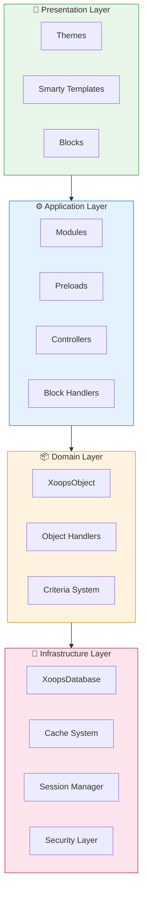
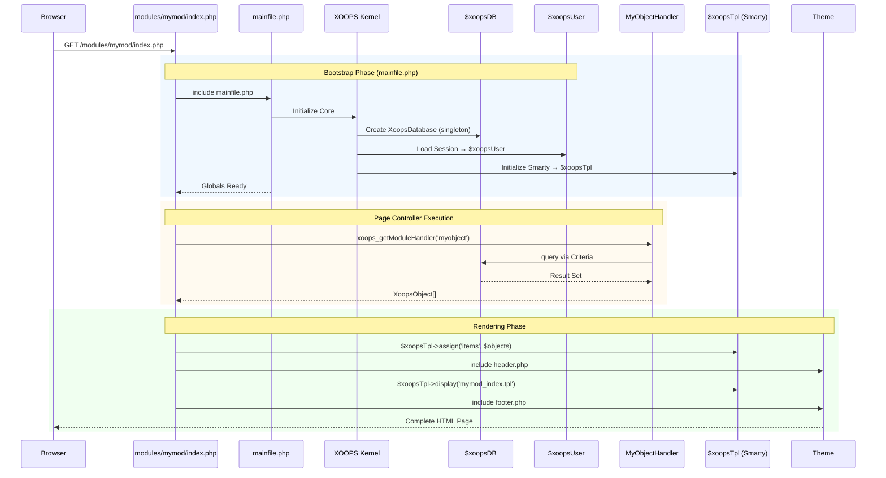

:::note[Over dit document]
Deze pagina beschrijft de **conceptuele architectuur** van XOOPS die van toepassing is op zowel de huidige (2.5.x) als toekomstige (4.0.x) versies. Enkele diagrammen tonen de gelaagde ontwerpvisie.

**Voor versiespecifieke details:**
- **XOOPS 2.5.x Vandaag:** Maakt gebruik van `mainfile.php`, globals (`$xoopsDB`, `$xoopsUser`), preloads en handlerpatroon
- **XOOPS 4.0 Doel:** PSR-15 middleware, DI-container, router - zie [Roadmap](../../07-XOOPS-4.0/XOOPS-4.0-Roadmap.md)
:::

Dit document biedt een uitgebreid overzicht van de XOOPS-systeemarchitectuur en legt uit hoe de verschillende componenten samenwerken om een flexibel en uitbreidbaar contentmanagementsysteem te creëren.

## Overzicht

XOOPS volgt een modulaire architectuur die zorgen in verschillende lagen verdeelt. Het systeem is opgebouwd rond verschillende kernprincipes:

- **Modulariteit**: functionaliteit is georganiseerd in onafhankelijke, installeerbare modules
- **Uitbreidbaarheid**: het systeem kan worden uitgebreid zonder de kerncode te wijzigen
- **Abstractie**: database- en presentatielagen zijn geabstraheerd van de bedrijfslogica
- **Beveiliging**: ingebouwde beveiligingsmechanismen beschermen tegen veelvoorkomende kwetsbaarheden

## Systeemlagen



### 1. Presentatielaag

De presentatielaag verzorgt de weergave van de gebruikersinterface met behulp van de Smarty-sjabloonengine.

**Belangrijkste componenten:**
- **Thema's**: visuele styling en lay-out
- **Smarty-sjablonen**: dynamische weergave van inhoud
- **Blokken**: herbruikbare inhoudwidgets

### 2. Applicatielaag

De applicatielaag bevat bedrijfslogica, controllers en modulefunctionaliteit.

**Belangrijkste componenten:**
- **Modules**: op zichzelf staande functionaliteitspakketten
- **Handlers**: klassen voor gegevensmanipulatie
- **Preloads**: gebeurtenislisteners en hooks

### 3. Domeinlaag

De domeinlaag bevat kernbedrijfsobjecten en regels.

**Belangrijkste componenten:**
- **XoopsObject**: basisklasse voor alle domeinobjecten
- **Handlers**: CRUD-bewerkingen voor domeinobjecten

### 4. Infrastructuurlaag

De infrastructuurlaag biedt kerndiensten zoals databasetoegang en caching.

## Levenscyclus aanvragen

Het begrijpen van de levenscyclus van verzoeken is cruciaal voor een effectieve XOOPS-ontwikkeling.

### XOOPS 2.5.x Paginacontrollerstroom

De huidige XOOPS 2.5.x gebruikt een **Page Controller**-patroon waarbij elk PHP-bestand zijn eigen verzoek afhandelt. Globalen (`$xoopsDB`, `$xoopsUser`, `$xoopsTpl`, enz.) worden geïnitialiseerd tijdens de bootstrap en zijn tijdens de uitvoering beschikbaar.



### Belangrijke globalen in 2.5.x

| Globaal | Typ | Geïnitialiseerd | Doel |
|--------|------|------------|---------|
| `$xoopsDB` | `XoopsDatabase` | Bootstrap | Databaseverbinding (singleton) |
| `$xoopsUser` | `XoopsUser\|null` | Sessiebelasting | Huidige ingelogde gebruiker |
| `$xoopsTpl` | `XoopsTpl` | Sjablooninit | Smarty-sjabloonengine |
| `$xoopsModule` | `XoopsModule` | Modulebelasting | Huidige modulecontext |
| `$xoopsConfig` | `array` | Configuratie laden | Systeemconfiguratie |

:::opmerking[XOOPS 4.0 vergelijking]
In XOOPS 4.0 is het Page Controller-patroon vervangen door een **PSR-15 Middleware Pipeline** en routergebaseerde dispatching. Globals worden vervangen door afhankelijkheidsinjectie. Zie [Hybridemoduscontract](../../07-XOOPS-4.0/Specifications/Hybrid-Mode-Contract.md) voor compatibiliteitsgaranties tijdens de migratie.
:::

### 1. Bootstrap-fase

```php
// mainfile.php is the entry point
include_once XOOPS_ROOT_PATH . '/mainfile.php';

// Core initialization
$xoops = Xoops::getInstance();
$xoops->boot();
```

**Stappen:**
1. Configuratie laden (`mainfile.php`)
2. Initialiseer de autoloader
3. Foutafhandeling instellen
4. Breng een databaseverbinding tot stand
5. Laad gebruikerssessie
6. Initialiseer de Smarty-sjabloonengine

### 2. Routeringsfase

```php
// Request routing to appropriate module
$module = $GLOBALS['xoopsModule'];
$controller = $module->getController();
$controller->dispatch($request);
```

**Stappen:**
1. Parseerverzoek URL
2. Identificeer de doelmodule
3. Laadmoduleconfiguratie
4. Controleer de machtigingen
5. Route naar de juiste handler

### 3. Uitvoeringsfase

```php
// Controller execution
$data = $handler->getObjects($criteria);
$xoopsTpl->assign('items', $data);
```

**Stappen:**
1. Voer de controllerlogica uit
2. Interactie met de gegevenslaag
3. Bedrijfsregels verwerken
4. Bereid weergavegegevens voor

### 4. Renderfase

```php
// Template rendering
include XOOPS_ROOT_PATH . '/header.php';
$xoopsTpl->display('db:module_template.tpl');
include XOOPS_ROOT_PATH . '/footer.php';
```

**Stappen:**
1. Thema-indeling toepassen
2. Rendermodulesjabloon
3. Procesblokken
4. Uitgangsreactie

## Kerncomponenten

### XoopsObjectDe basisklasse voor alle gegevensobjecten in XOOPS.

```php
<?php
class MyModuleItem extends XoopsObject
{
    public function __construct()
    {
        $this->initVar('id', XOBJ_DTYPE_INT, null, false);
        $this->initVar('title', XOBJ_DTYPE_TXTBOX, '', true, 255);
        $this->initVar('content', XOBJ_DTYPE_TXTAREA, '', false);
        $this->initVar('created', XOBJ_DTYPE_INT, time(), false);
    }
}
```

**Belangrijkste methoden:**
- `initVar()` - Objecteigenschappen definiëren
- `getVar()` - Eigenschapswaarden ophalen
- `setVar()` - Eigenschapswaarden instellen
- `assignVars()` - Bulktoewijzing vanuit array

### XoopsPersistableObjectHandler

Verwerkt CRUD-bewerkingen voor XoopsObject-instanties.

```php
<?php
class MyModuleItemHandler extends XoopsPersistableObjectHandler
{
    public function __construct(\XoopsDatabase $db)
    {
        parent::__construct($db, 'mymodule_items', 'MyModuleItem', 'id', 'title');
    }

    public function getActiveItems($limit = 10)
    {
        $criteria = new CriteriaCompo();
        $criteria->add(new Criteria('status', 1));
        $criteria->setSort('created');
        $criteria->setOrder('DESC');
        $criteria->setLimit($limit);

        return $this->getObjects($criteria);
    }
}
```

**Belangrijkste methoden:**
- `create()` - Nieuw objectexemplaar maken
- `get()` - Object ophalen op ID
- `insert()` - Object opslaan in database
- `delete()` - Object uit database verwijderen
- `getObjects()` - Meerdere objecten ophalen
- `getCount()` - Tel overeenkomende objecten

### Modulestructuur

Elke XOOPS-module volgt een standaard directorystructuur:

```
modules/mymodule/
├── class/                  # PHP classes
│   ├── MyModuleItem.php
│   └── MyModuleItemHandler.php
├── include/                # Include files
│   ├── common.php
│   └── functions.php
├── templates/              # Smarty templates
│   ├── mymodule_index.tpl
│   └── mymodule_item.tpl
├── admin/                  # Admin area
│   ├── index.php
│   └── menu.php
├── language/               # Translations
│   └── english/
│       ├── main.php
│       └── modinfo.php
├── sql/                    # Database schema
│   └── mysql.sql
├── xoops_version.php       # Module info
├── index.php               # Module entry
└── header.php              # Module header
```

## Afhankelijkheidsinjectiecontainer

Moderne XOOPS-ontwikkeling kan gebruik maken van afhankelijkheidsinjectie voor betere testbaarheid.

### Basiscontainerimplementatie

```php
<?php
class XoopsDependencyContainer
{
    private array $services = [];

    public function register(string $name, callable $factory): void
    {
        $this->services[$name] = $factory;
    }

    public function resolve(string $name): mixed
    {
        if (!isset($this->services[$name])) {
            throw new \InvalidArgumentException("Service not found: $name");
        }

        $factory = $this->services[$name];

        if (is_callable($factory)) {
            return $factory($this);
        }

        return $factory;
    }

    public function has(string $name): bool
    {
        return isset($this->services[$name]);
    }
}
```

### PSR-11 Compatibele container

```php
<?php
namespace Xmf\Di;

use Psr\Container\ContainerInterface;

class BasicContainer implements ContainerInterface
{
    protected array $definitions = [];

    public function set(string $id, mixed $value): void
    {
        $this->definitions[$id] = $value;
    }

    public function get(string $id): mixed
    {
        if (!$this->has($id)) {
            throw new \InvalidArgumentException("Service not found: $id");
        }

        $entry = $this->definitions[$id];

        if (is_callable($entry)) {
            return $entry($this);
        }

        return $entry;
    }

    public function has(string $id): bool
    {
        return isset($this->definitions[$id]);
    }
}
```

### Gebruiksvoorbeeld

```php
<?php
// Service registration
$container = new XoopsDependencyContainer();

$container->register('database', function () {
    return XoopsDatabaseFactory::getDatabaseConnection();
});

$container->register('userHandler', function ($c) {
    return new XoopsUserHandler($c->resolve('database'));
});

// Service resolution
$userHandler = $container->resolve('userHandler');
$user = $userHandler->get($userId);
```

## Uitbreidingspunten

XOOPS biedt verschillende uitbreidingsmechanismen:

### 1. Voorgeladen

Dankzij preloads kunnen modules aansluiten op kerngebeurtenissen.

```php
<?php
// modules/mymodule/preloads/core.php
class MymoduleCorePreload extends XoopsPreloadItem
{
    public static function eventCoreHeaderEnd($args)
    {
        // Execute when header processing ends
    }

    public static function eventCoreFooterStart($args)
    {
        // Execute when footer processing starts
    }
}
```

### 2. Plug-ins

Plug-ins breiden specifieke functionaliteit binnen modules uit.

```php
<?php
// modules/mymodule/plugins/notify.php
class MymoduleNotifyPlugin
{
    public function onItemCreate($item)
    {
        // Send notification when item is created
    }
}
```

### 3. Filters

Filters wijzigen gegevens terwijl deze door het systeem gaan.

```php
<?php
// Content filter example
$myts = MyTextSanitizer::getInstance();
$content = $myts->displayTarea($rawContent, 1, 1, 1);
```

## Beste praktijken

### Codeorganisatie

1. **Gebruik naamruimten** voor nieuwe code:
   
```php
   namespace XoopsModules\MyModule;

   class Item extends \XoopsObject
   {
       // Implementation
   }
   
```

2. **Volg het automatisch laden van PSR-4**:
   
```json
   {
       "autoload": {
           "psr-4": {
               "XoopsModules\\MyModule\\": "class/"
           }
       }
   }
   
```

3. **Afzonderlijke zorgen**:
   - Domeinlogica in `class/`
   - Presentatie in `templates/`
   - Controllers in moduleroot

### Prestaties

1. **Gebruik caching** voor dure bewerkingen
2. **Lazy load**-bronnen indien mogelijk
3. **Minimaliseer databasequery's** met behulp van batching van criteria
4. **Optimaliseer sjablonen** door complexe logica te vermijden

### Beveiliging

1. **Valideer alle invoer** met `Xmf\Request`
2. **Escape-uitvoer** in sjablonen
3. **Gebruik voorbereide instructies** voor databasequery's
4. **Controleer de machtigingen** vóór gevoelige bewerkingen

## Gerelateerde documentatie

- [Ontwerppatronen](Design-Patterns.md) - Ontwerppatronen gebruikt in XOOPS
- [Databaselaag](../Database/Database-Layer.md) - Details van databaseabstractie
- [Smarty Basics](../Templates/Smarty-Basics.md) - Sjabloonsysteemdocumentatie
- [Beste praktijken op het gebied van beveiliging](../Security/Security-Best-Practices.md) - Beveiligingsrichtlijnen

---

#xoops #architectuur #core #design #system-design