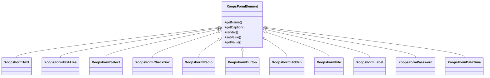

## Overzicht

XOOPS biedt een uitgebreide set formulierelementen via de klassenhiërarchie `XoopsFormElement`. Deze elementen zorgen voor de weergave, validatie en gegevensverwerking voor webformulieren.

## Hiërarchie van formulierelementen



## Tekstinvoerelementen

### XoopsFormText

Tekstinvoer van één regel:

```php
use XoopsFormText;

$element = new XoopsFormText(
    caption: 'Username',
    name: 'username',
    size: 30,
    maxlength: 50,
    value: $currentValue
);
```

### XoopsFormWachtwoord

Wachtwoordinvoer met maskering:

```php
use XoopsFormPassword;

$element = new XoopsFormPassword(
    caption: 'Password',
    name: 'password',
    size: 30,
    maxlength: 100
);
```

### XoopsFormTextArea

Tekstinvoer met meerdere regels:

```php
use XoopsFormTextArea;

$element = new XoopsFormTextArea(
    caption: 'Description',
    name: 'description',
    value: $currentValue,
    rows: 5,
    cols: 50
);
```

## Selectie-elementen

### XoopsFormSelect

Dropdown-selectie:

```php
use XoopsFormSelect;

$element = new XoopsFormSelect(
    caption: 'Category',
    name: 'category_id',
    value: $selected,
    size: 1,
    multiple: false
);

$element->addOption(1, 'Category 1');
$element->addOption(2, 'Category 2');
$element->addOptionArray([
    3 => 'Category 3',
    4 => 'Category 4'
]);
```

### XoopsFormCheckBox

Selectievakje invoer:

```php
use XoopsFormCheckBox;

$element = new XoopsFormCheckBox(
    caption: 'Features',
    name: 'features',
    value: $selected
);

$element->addOption('comments', 'Enable Comments');
$element->addOption('ratings', 'Enable Ratings');
```

### XoopsFormRadio

Keuzerondjegroep:

```php
use XoopsFormRadio;

$element = new XoopsFormRadio(
    caption: 'Status',
    name: 'status',
    value: $currentValue
);

$element->addOption('draft', 'Draft');
$element->addOption('published', 'Published');
$element->addOption('archived', 'Archived');
```

## Bestand uploaden

### XoopsFormBestand

Invoer voor bestandsupload:

```php
use XoopsFormFile;

$element = new XoopsFormFile(
    caption: 'Upload Image',
    name: 'image'
);

$element->setMaxFileSize(2 * 1024 * 1024); // 2MB
```

## Datum en tijd

### XoopsFormDateTime

Datum-/tijdkiezer:

```php
use XoopsFormDateTime;

$element = new XoopsFormDateTime(
    caption: 'Publish Date',
    name: 'publish_date',
    size: 15,
    value: time()
);
```

## Speciale elementen

### XoopsFormVerborgen

Verborgen veld:

```php
use XoopsFormHidden;

$element = new XoopsFormHidden('article_id', $articleId);
```

### XoopsFormLabel

Label voor alleen weergeven:

```php
use XoopsFormLabel;

$element = new XoopsFormLabel(
    caption: 'Created By',
    value: $authorName
);
```

### XoopsFormKnop

Formulierknoppen:

```php
use XoopsFormButton;

// Submit button
$submit = new XoopsFormButton('', 'submit', 'Save', 'submit');

// Reset button
$reset = new XoopsFormButton('', 'reset', 'Reset', 'reset');
```

## Elementaanpassing

### CSS-klassen toevoegen

```php
$element->setExtra('class="form-control custom-class"');
```

### Aangepaste kenmerken toevoegen

```php
$element->setExtra('data-validate="required" placeholder="Enter text..."');
```

### Instelling Beschrijving

```php
$element->setDescription('Enter a unique username (3-20 characters)');
```

## Gerelateerde documentatie

- Formulierenoverzicht
- Formuliervalidatie
- Aangepaste renderers