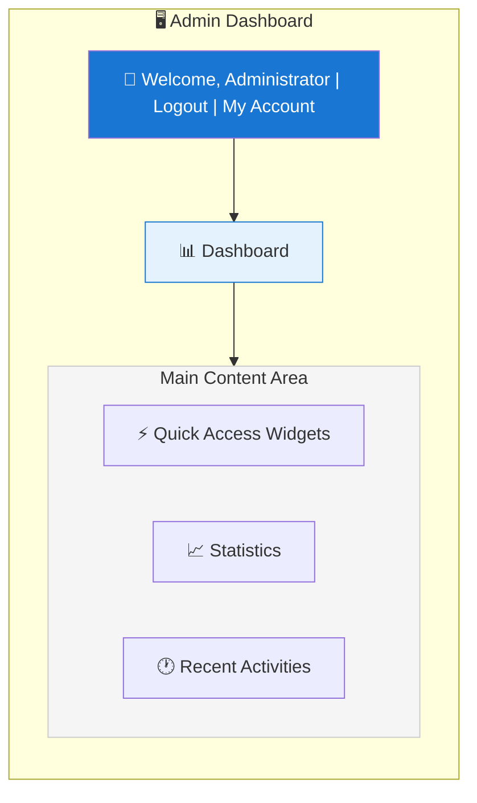
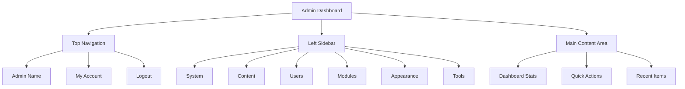

# XOOPS Overzicht beheerderspaneel

Volledige gids voor het navigeren en gebruiken van het XOOPS beheerdersdashboard.

## Toegang tot het beheerdersdashboard

### Beheerdersaanmelding

Open uw browser en navigeer naar:

```
http://your-domain.com/xoops/admin/
```

Of als XOOPS in root staat:

```
http://your-domain.com/admin/
```

Voer uw beheerdersreferenties in:

```
Username: [Your admin username]
Password: [Your admin password]
```

### Na inloggen

U ziet het hoofdbeheerdersdashboard:



## Indeling beheerderspaneel



## Dashboardcomponenten

### Bovenste balk

De bovenste balk bevat essentiële bedieningselementen:

| Element | Doel |
|---|---|
| **Beheerderlogo** | Klik om terug te keren naar dashboard |
| **Welkomstbericht** | Toont ingelogde beheerdersnaam |
| **Mijn account** | Beheerdersprofiel en wachtwoord bewerken |
| **Hulp** | Toegang tot documentatie |
| **Uitloggen** | Afmelden bij het beheerdersdashboard |

### Linkernavigatiezijbalk

Hoofdmenu georganiseerd op functie:

```
├── System
│   ├── Dashboard
│   ├── Preferences
│   ├── Admin Users
│   ├── Groups
│   ├── Permissions
│   ├── Modules
│   └── Tools
├── Content
│   ├── Pages
│   ├── Categories
│   ├── Comments
│   └── Media Manager
├── Users
│   ├── Users
│   ├── User Requests
│   ├── Online Users
│   └── User Groups
├── Modules
│   ├── Modules
│   ├── Module Settings
│   └── Module Updates
├── Appearance
│   ├── Themes
│   ├── Templates
│   ├── Blocks
│   └── Images
└── Tools
    ├── Maintenance
    ├── Email
    ├── Statistics
    ├── Logs
    └── Backups
```

### Hoofdinhoudsgebied

Toont informatie en bedieningselementen voor de geselecteerde sectie:

- Formulieren voor configuratie
- Gegevenstabellen met lijsten
- Grafieken en statistieken
- Snelle actieknoppen
- Helptekst en tooltips

### Dashboardwidgets

Snelle toegang tot belangrijke informatie:

- **Systeeminformatie:** PHP-versie, MySQL-versie, XOOPS-versie
- **Snelle statistieken:** Aantal gebruikers, totaal aantal berichten, geïnstalleerde modules
- **Recente activiteit:** Laatste logins, inhoudswijzigingen, fouten
- **Serverstatus:** CPU, geheugen, schijfgebruik
- **Meldingen:** Systeemwaarschuwingen, updates in behandeling

## Kernbeheerdersfuncties

### Systeembeheer

**Locatie:** Systeem > [Diverse opties]

#### Voorkeuren

Basissysteeminstellingen configureren:

```
System > Preferences > [Settings Category]
```

Categorieën:
- Algemene instellingen (sitenaam, tijdzone)
- Gebruikersinstellingen (registratie, profielen)
- E-mailinstellingen (SMTP-configuratie)
- Cache-instellingen (caching-opties)
- URL Instellingen (vriendelijke URL's)
- Metatags (SEO-instellingen)

Zie Basisconfiguratie en Systeeminstellingen.

#### Beheerders

Beheer beheerdersaccounts:

```
System > Admin Users
```

Functies:
- Voeg nieuwe beheerders toe
- Bewerk beheerdersprofielen
- Wijzig beheerderswachtwoorden
- Verwijder beheerdersaccounts
- Stel beheerdersrechten in

### Inhoudsbeheer

**Locatie:** Inhoud > [Diverse opties]

#### Pagina's/Artikelen

Beheer site-inhoud:

```
Content > Pages (or your module)
```

Functies:
- Maak nieuwe pagina's
- Bewerk bestaande inhoud
- Pagina's verwijderen
- Publiceren/publiceren ongedaan maken
- Categorieën instellen
- Beheer revisies

#### Categorieën

Inhoud organiseren:

```
Content > Categories
```

Functies:
- Creëer categoriehiërarchie
- Categorieën bewerken
- Categorieën verwijderen
- Toewijzen aan pagina's

#### Opmerkingen

Gematigde gebruikersreacties:

```
Content > Comments
```

Functies:
- Bekijk alle opmerkingen
- Reacties goedkeuren
- Opmerkingen bewerken
- Spam verwijderen
- Blokkeer commentatoren

### Gebruikersbeheer

**Locatie:** Gebruikers > [Diverse opties]

#### Gebruikers

Beheer gebruikersaccounts:

```
Users > Users
```

Functies:
- Bekijk alle gebruikers
- Nieuwe gebruikers aanmaken
- Gebruikersprofielen bewerken
- Accounts verwijderen
- Wachtwoorden opnieuw instellen
- Wijzig de gebruikersstatus
- Toewijzen aan groepen

#### Onlinegebruikers

Actieve gebruikers monitoren:

```
Users > Online Users
```

Toont:
- Momenteel online gebruikers
- Laatste activiteitstijd
- IP-adres
- Gebruikerslocatie (indien geconfigureerd)

#### Gebruikersgroepen

Beheer gebruikersrollen en machtigingen:

```
Users > Groups
```

Functies:
- Maak aangepaste groepen
- Groepsrechten instellen
- Wijs gebruikers toe aan groepen
- Verwijder groepen

### Modulebeheer

**Locatie:** Modules > [Diverse opties]

#### Modules

Modules installeren en configureren:

```
Modules > Modules
```

Functies:
- Bekijk geïnstalleerde modules
- Modules in-/uitschakelen
- Modules bijwerken
- Configureer module-instellingen
- Installeer nieuwe modules
- Bekijk moduledetails

#### Controleer op updates

```
Modules > Modules > Check for Updates
```

Weergaven:
- Beschikbare module-updates
- Wijzigingslog
- Download- en installatieopties

### Uiterlijkbeheer

**Locatie:** Uiterlijk > [Diverse opties]

#### Thema's

Sitethema's beheren:

```
Appearance > Themes
```

Functies:
- Bekijk geïnstalleerde thema's
- Stel het standaardthema in
- Upload nieuwe thema's
- Verwijder thema's
- Themavoorbeeld
- Themaconfiguratie

#### Blokken

Beheer inhoudsblokken:

```
Appearance > Blocks
```

Functies:
- Maak aangepaste blokken
- Bewerk blokinhoud
- Schik blokken op pagina
- Blokzichtbaarheid instellen
- Verwijder blokken
- Configureer blokcaching

#### Sjablonen

Sjablonen beheren (geavanceerd):
```
Appearance > Templates
```

Voor gevorderde gebruikers en ontwikkelaars.

### Systeemwerkset

**Locatie:** Systeem > Extra

#### Onderhoudsmodus

Voorkom gebruikerstoegang tijdens onderhoud:

```
System > Maintenance Mode
```

Configureer:
- Onderhoud in-/uitschakelen
- Aangepast onderhoudsbericht
- Toegestane IP-adressen (voor testen)

#### Databasebeheer

```
System > Database
```

Functies:
- Controleer de consistentie van de database
- Voer database-updates uit
- Reparatietafels
- Optimaliseer database
- Databasestructuur exporteren

#### Activiteitenlogboeken

```
System > Logs
```

Monitor:
- Gebruikersactiviteit
- Administratieve handelingen
- Systeemgebeurtenissen
- Foutlogboeken

## Snelle acties

Algemene taken toegankelijk vanaf het dashboard:

```
Quick Links:
├── Create New Page
├── Add New User
├── Create Content Block
├── Upload Image
├── Send Mass Email
├── Update All Modules
└── Clear Cache
```

## Sneltoetsen op het beheerderspaneel

Snelle navigatie:

| Sneltoets | Actie |
|---|---|
| `Ctrl+H` | Ga naar hulp |
| `Ctrl+D` | Ga naar dashboard |
| `Ctrl+Q` | Snel zoeken |
| `Ctrl+L` | Uitloggen |

## Gebruikersaccountbeheer

### Mijn account

Toegang tot uw beheerdersprofiel:

1. Klik rechtsboven op "Mijn account".
2. Profielinformatie bewerken:
   - E-mailadres
   - Echte naam
   - Gebruikersinformatie
   - Avatar

### Wachtwoord wijzigen

Wijzig uw beheerderswachtwoord:

1. Ga naar **Mijn account**
2. Klik op ‘Wachtwoord wijzigen’
3. Voer het huidige wachtwoord in
4. Voer een nieuw wachtwoord in (tweemaal)
5. Klik op "Opslaan"

**Beveiligingstips:**
- Gebruik sterke wachtwoorden (16+ tekens)
- Inclusief hoofdletters, kleine letters, cijfers en symbolen
- Wijzig het wachtwoord elke 90 dagen
- Deel nooit beheerdersreferenties

### Uitloggen

Afmelden bij het beheerdersdashboard:

1. Klik rechtsboven op "Uitloggen".
2. U wordt doorgestuurd naar de inlogpagina

## Beheerderspaneelstatistieken

### Dashboardstatistieken

Snel overzicht van sitestatistieken:

| Metrisch | Waarde |
|--------|-------|
| Gebruikers online | 12 |
| Totaal aantal gebruikers | 256 |
| Totaal aantal berichten | 1.234 |
| Totaal aantal reacties | 5.678 |
| Totaal modules | 8 |

### Systeemstatus

Server- en prestatie-informatie:

| Onderdeel | Versie/waarde |
|-----------|--------------|
| XOOPS-versie | 2.5.11 |
| PHP-versie | 8.2.x |
| MySQL-versie | 8.0.x |
| Serverbelasting | 0,45, 0,42 |
| Uptime | 45 dagen |

### Recente activiteit

Tijdlijn van recente gebeurtenissen:

```
12:45 - Admin login
12:30 - New user registered
12:15 - Page published
12:00 - Comment posted
11:45 - Module updated
```

## Meldingssysteem

### Beheerderwaarschuwingen

Ontvang meldingen voor:

- Nieuwe gebruikersregistraties
- Reacties wachten op moderatie
- Mislukte inlogpogingen
- Systeemfouten
- Module-updates beschikbaar
- Databaseproblemen
- Waarschuwingen voor schijfruimte

Waarschuwingen configureren:

**Systeem > Voorkeuren > E-mailinstellingen**

```
Notify Admin on Registration: Yes
Notify Admin on Comments: Yes
Notify Admin on Errors: Yes
Alert Email: admin@your-domain.com
```

## Algemene beheerderstaken

### Maak een nieuwe pagina

1. Ga naar **Inhoud > Pagina's** (of relevante module)
2. Klik op 'Nieuwe pagina toevoegen'
3. Vul in:
   - Titel
   - Inhoud
   - Beschrijving
   - Categorie
   - Metagegevens
4. Klik op "Publiceren"

### Gebruikers beheren

1. Ga naar **Gebruikers > Gebruikers**
2. Bekijk de gebruikerslijst met:
   - Gebruikersnaam
   - E-mail
   - Registratiedatum
   - Laatste login
   - Status

3. Klik op gebruikersnaam om:
   - Profiel bewerken
   - Wachtwoord wijzigen
   - Groepen bewerken
   - Gebruiker blokkeren/deblokkeren

### Module configureren

1. Ga naar **Modules > Modules**
2. Zoek de module in de lijst
3. Klik op de modulenaam
4. Klik op "Voorkeuren" of "Instellingen"
5. Configureer moduleopties
6. Wijzigingen opslaan

### Maak een nieuw blok

1. Ga naar **Uiterlijk > Blokken**
2. Klik op 'Nieuw blok toevoegen'
3. Voer in:
   - Bloktitel
   - Inhoud blokkeren (HTML toegestaan)
   - Positie op pagina
   - Zichtbaarheid (alle pagina's of specifiek)
   - Module (indien van toepassing)
4. Klik op "Verzenden"

## Hulp bij beheerdersdashboard

### Ingebouwde documentatie

Toegang tot hulp via het beheerdersdashboard:

1. Klik op de knop "Help" in de bovenste balk
2. Contextgevoelige hulp voor de huidige pagina
3. Links naar documentatie
4. Veelgestelde vragen

### Externe bronnen

- XOOPS Officiële site: https://xoops.org/
- Gemeenschapsforum: https://xoops.org/modules/newbb/
- Moduleopslagplaats: https://xoops.org/modules/repository/
- Bugs/problemen: https://github.com/XOOPS/XoopsCore/issues

## Beheerderspaneel aanpassen

### Beheerderthema

Kies het thema van de beheerdersinterface:

**Systeem > Voorkeuren > Algemene instellingen**

```
Admin Theme: [Select theme]
```

Beschikbare thema's:
- Standaard (licht)
- Donkere modus
- Aangepaste thema's

### Dashboardaanpassing

Kies welke widgets verschijnen:

**Dashboard > Aanpassen**

Selecteer:
- Systeeminformatie
- Statistieken
- Recente activiteit
- Snelle links
- Aangepaste widgets

## Machtigingen beheerderspaneelVerschillende beheerdersniveaus hebben verschillende machtigingen:

| Rol | Mogelijkheden |
|---|---|
| **Webmaster** | Volledige toegang tot alle beheerdersfuncties |
| **Beheer** | Beperkte beheerdersfuncties |
| **Moderator** | Alleen moderatie van inhoud |
| **Redacteur** | Creëren en bewerken van inhoud |

Beheer machtigingen:

**Systeem > Machtigingen**

## Best practices voor beveiliging voor het beheerdersdashboard

1. **Sterk wachtwoord:** Gebruik een wachtwoord van meer dan 16 tekens
2. **Regelmatige wijzigingen:** Wijzig het wachtwoord elke 90 dagen
3. **Toegang controleren:** Controleer regelmatig de logboeken van "Admin Users".
4. **Toegang beperken:** Hernoem de beheerdersmap voor extra beveiliging
5. **Gebruik HTTPS:** Altijd toegang tot beheerder via HTTPS
6. **IP Whitelisting:** Beperk beheerderstoegang tot specifieke IP's
7. **Normaal uitloggen:** Uitloggen wanneer u klaar bent
8. **Browserbeveiliging:** Wis de browsercache regelmatig

Zie Beveiligingsconfiguratie.

## Problemen oplossen via het beheerdersdashboard

### Kan het beheerdersdashboard niet openen

**Oplossing:**
1. Controleer de inloggegevens
2. Wis browsercache en cookies
3. Probeer een andere browser
4. Controleer of het pad naar de beheerdersmap correct is
5. Controleer de bestandsrechten op de admin-map
6. Controleer de databaseverbinding in mainfile.php

### Lege beheerderspagina

**Oplossing:**
```bash
# Check PHP errors
tail -f /var/log/apache2/error.log

# Enable debug mode temporarily
sed -i "s/define('XOOPS_DEBUG', 0)/define('XOOPS_DEBUG', 1)/" /var/www/html/xoops/mainfile.php

# Check file permissions
ls -la /var/www/html/xoops/admin/
```

### Langzaam beheerderspaneel

**Oplossing:**
1. Cache wissen: **Systeem > Extra > Cache wissen**
2. Database optimaliseren: **Systeem > Database > Optimaliseren**
3. Controleer de serverbronnen: `htop`
4. Bekijk langzame zoekopdrachten in MySQL

### Module verschijnt niet

**Oplossing:**
1. Controleer of de module is geïnstalleerd: **Modules > Modules**
2. Controleer of de module is ingeschakeld
3. Controleer de toegewezen machtigingen
4. Controleer of er modulebestanden bestaan
5. Bekijk de foutenlogboeken

## Volgende stappen

Nadat u vertrouwd bent geraakt met het beheerdersdashboard:

1. Maak uw eerste pagina
2. Gebruikersgroepen instellen
3. Installeer extra modules
4. Basisinstellingen configureren
5. Implementeer beveiliging

---

**Tags:** #admin-panel #dashboard #navigatie #aan de slag

**Gerelateerde artikelen:**
- ../Configuratie/Basisconfiguratie
- ../Configuratie/Systeeminstellingen
- Uw eerste pagina maken
- Beheer-gebruikers
- Modules installeren