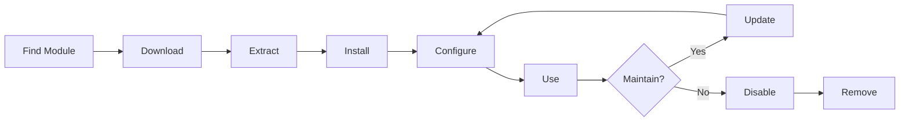

# XOOPS-modules installeren en beheren

Leer hoe u de XOOPS-functionaliteit kunt uitbreiden door modules te installeren en te configureren.

## XOOPS-modules begrijpen

### Wat zijn modules?

Modules zijn uitbreidingen die functionaliteit toevoegen aan XOOPS:

| Typ | Doel | Voorbeelden |
|---|---|---|
| **Inhoud** | Beheer specifieke inhoudstypen | Nieuws, Blog, Tickets |
| **Gemeenschap** | Gebruikersinteractie | Forum, opmerkingen, recensies |
| **e-commerce** | Producten verkopen | Winkel, winkelwagen, betalingen |
| **Media** | Bestanden/afbeeldingen verwerken | Galerij, downloads, video's |
| **Hulpprogramma** | Gereedschappen en helpers | E-mail, back-up, analyse |

### Kern versus optionele modules

| module | Typ | Inbegrepen | Afneembaar |
|---|---|---|---|
| **Systeem** | Kern | Ja | Nee |
| **Gebruiker** | Kern | Ja | Nee |
| **Profiel** | Aanbevolen | Ja | Ja |
| **PM (privébericht)** | Aanbevolen | Ja | Ja |
| **WF-kanaal** | Optioneel | Vaak | Ja |
| **Nieuws** | Optioneel | Nee | Ja |
| **Forum** | Optioneel | Nee | Ja |

## Modulelevenscyclus



## Modules zoeken

### XOOPS Moduleopslagplaats

Officiële XOOPS-modulerepository:

**Bezoek:** https://xoops.org/modules/repository/

```
Directory > Modules > [Browse Categories]
```

Blader per categorie:
- Inhoudsbeheer
- Gemeenschap
- e-commerce
- Multimediaal
- Ontwikkeling
- Sitebeheer

### Modules evalueren

Controleer vóór installatie:

| Criteria | Waar u op moet letten |
|---|---|
| **Compatibiliteit** | Werkt met uw XOOPS-versie |
| **Beoordeling** | Goede gebruikersrecensies en beoordelingen |
| **Updates** | Recent onderhouden |
| **Downloads** | Populair en veel gebruikt |
| **Vereisten** | Compatibel met uw server |
| **Licentie** | GPL of soortgelijke open source |
| **Ondersteuning** | Actieve ontwikkelaar en community |

### Module-informatie lezen

Elke modulelijst toont:

```
Module Name: [Name]
Version: [X.X.X]
Requires: XOOPS [Version]
Author: [Name]
Last Update: [Date]
Downloads: [Number]
Rating: [Stars]
Description: [Brief description]
Compatibility: PHP [Version], MySQL [Version]
```

## Modules installeren

### Methode 1: Installatie van het beheerderspaneel

**Stap 1: Sectie Toegangsmodules**

1. Log in op het beheerdersdashboard
2. Navigeer naar **Modules > Modules**
3. Klik op **"Nieuwe module installeren"** of **"Bladeren door modules"**

**Stap 2: Module uploaden**

Optie A - Direct uploaden:
1. Klik op **"Kies bestand"**
2. Selecteer het .zip-bestand van de module op de computer
3. Klik op **"Uploaden"**

Optie B - URL Uploaden:
1. Module URL plakken
2. Klik op **"Downloaden en installeren"**

**Stap 3: Module-informatie bekijken**

```
Module Name: [Name shown]
Version: [Version]
Author: [Author info]
Description: [Full description]
Requirements: [PHP/MySQL versions]
```

Controleer en klik op **"Doorgaan met installatie"**

**Stap 4: Kies installatietype**

```
☐ Fresh Install (New installation)
☐ Update (Upgrade existing)
☐ Delete Then Install (Replace existing)
```

Selecteer de juiste optie.

**Stap 5: Installatie bevestigen**

Beoordeling definitieve bevestiging:
```
Module will be installed to: /modules/modulename/
Database: xoops_db
Proceed? [Yes] [No]
```

Klik op **"Ja"** om te bevestigen.

**Stap 6: Installatie voltooid**

```
Installation successful!

Module: [Module Name]
Version: [Version]
Tables created: [Number]
Files installed: [Number]

[Go to Module Settings]  [Return to Modules]
```

### Methode 2: Handmatige installatie (geavanceerd)

Voor handmatige installatie of probleemoplossing:

**Stap 1: Module downloaden**

1. Download module .zip uit de repository
2. Uitpakken naar `/var/www/html/xoops/modules/modulename/`

```bash
# Extract module
unzip module_name.zip
cp -r module_name /var/www/html/xoops/modules/

# Set permissions
chmod -R 755 /var/www/html/xoops/modules/module_name
```

**Stap 2: Voer het installatiescript uit**

```
Visit: http://your-domain.com/xoops/modules/module_name/admin/index.php?op=install
```

Of via het beheerdersdashboard (Systeem > Modules > DB bijwerken).

**Stap 3: Installatie verifiëren**

1. Ga naar **Modules > Modules** in admin
2. Zoek uw module in de lijst
3. Controleer of het wordt weergegeven als 'Actief'

## Moduleconfiguratie

### Toegang tot module-instellingen

1. Ga naar **Modules > Modules**
2. Zoek uw module
3. Klik op de modulenaam
4. Klik op **"Voorkeuren"** of **"Instellingen"**

### Algemene module-instellingen

De meeste modules bieden:

```
Module Status: [Enabled/Disabled]
Display in Menu: [Yes/No]
Module Weight: [1-999](display order)
Visible To Groups: [Checkboxes for user groups]
```

### Modulespecifieke opties

Elke module heeft unieke instellingen. Voorbeelden:

**Nieuwsmodule:**
```
Items Per Page: 10
Show Author: Yes
Allow Comments: Yes
Moderation Required: Yes
```

**Forummodule:**
```
Topics Per Page: 20
Posts Per Page: 15
Maximum Attachment Size: 5MB
Enable Signatures: Yes
```

**Galerijmodule:**
```
Images Per Page: 12
Thumbnail Size: 150x150
Maximum Upload: 10MB
Watermark: Yes/No
```

Bekijk uw moduledocumentatie voor specifieke opties.

### Configuratie opslaan

Na het aanpassen van de instellingen:

1. Klik op **"Verzenden"** of **"Opslaan"**
2. Je ziet een bevestiging:
   
```
   Settings saved successfully!
   
```

## Moduleblokken beheren

Veel modules creëren "blokken" - widgetachtige inhoudsgebieden.

### Moduleblokken bekijken

1. Ga naar **Uiterlijk > Blokken**
2. Zoek naar blokken uit uw module
3. De meeste modules tonen "[Modulenaam] - [Blokbeschrijving]"

### Blokken configureren

1. Klik op bloknaam
2. Aanpassen:
   - Bloktitel
   - Zichtbaarheid (alle pagina's of specifiek)
   - Positie op pagina (links, midden, rechts)
   - Gebruikersgroepen die kunnen zien
3. Klik op **"Verzenden"**

### Weergaveblok op startpagina1. Ga naar **Uiterlijk > Blokken**
2. Zoek het gewenste blok
3. Klik op **"Bewerken"**
4. Stel in:
   - **Zichtbaar voor:** Selecteer groepen
   - **Positie:** Kies kolom (links/midden/rechts)
   - **Pagina's:** Homepagina of alle pagina's
5. Klik op **"Verzenden"**

## Specifieke modulevoorbeelden installeren

### Nieuwsmodule installeren

**Perfect voor:** Blogberichten, aankondigingen

1. Download de Nieuwsmodule uit de repository
2. Uploaden via **Modules > Modules > Installeren**
3. Configureer in **Modules > Nieuws > Voorkeuren**:
   - Verhalen per pagina: 10
   - Reacties toestaan: Ja
   - Goedkeuren vóór publicatie: Ja
4. Maak blokken voor het laatste nieuws
5. Begin met het publiceren van verhalen!

### Forummodule installeren

**Perfect voor:** Gemeenschapsdiscussie

1. Download de Forum-module
2. Installeer via het beheerderspaneel
3. Creëer forumcategorieën in de module
4. Instellingen configureren:
   - Onderwerpen/pagina: 20
   - Berichten/pagina: 15
   - Moderatie inschakelen: Ja
5. Wijs machtigingen voor gebruikersgroepen toe
6. Maak blokken voor de nieuwste onderwerpen

### Galerijmodule installeren

**Perfect voor:** Beeldshowcase

1. Download de Galerijmodule
2. Installeren en configureren
3. Maak fotoalbums
4. Upload afbeeldingen
5. Stel rechten in voor bekijken/uploaden
6. Toon galerij op website

## Modules bijwerken

### Controleer op updates

```
Admin Panel > Modules > Modules > Check for Updates
```

Dit laat zien:
- Beschikbare module-updates
- Huidige versus nieuwe versie
- Changelog/release-opmerkingen

### Een module bijwerken

1. Ga naar **Modules > Modules**
2. Klik op module met beschikbare update
3. Klik op de knop **"Bijwerken"**
4. Selecteer **"Update" bij Installatietype**
5. Volg de installatiewizard
6. Module bijgewerkt!

### Belangrijke update-opmerkingen

Voordat u gaat updaten:

- [ ] Back-updatabase
- [ ] Back-upmodulebestanden
- [ ] Wijzigingslogboek bekijken
- [ ] Test eerst op de staging-server
- [ ] Noteer eventuele aangepaste wijzigingen

Na het updaten:
- [ ] Functionaliteit verifiëren
- [ ] Controleer module-instellingen
- [ ] Controleer op waarschuwingen/fouten
- [ ] Cache wissen

## Modulerechten

### Toegang tot gebruikersgroep toewijzen

Bepaal welke gebruikersgroepen toegang hebben tot modules:

**Locatie:** Systeem > Machtigingen

Configureer voor elke module:

```
Module: [Module Name]

Admin Access: [Select groups]
User Access: [Select groups]
Read Permission: [Groups allowed to view]
Write Permission: [Groups allowed to post]
Delete Permission: [Administrators only]
```

### Algemene machtigingsniveaus

```
Public Content (News, Pages):
├── Admin Access: Webmaster
├── User Access: All logged-in users
└── Read Permission: Everyone

Community Features (Forum, Comments):
├── Admin Access: Webmaster, Moderators
├── User Access: All logged-in users
└── Write Permission: All logged-in users

Admin Tools:
├── Admin Access: Webmaster only
└── User Access: Disabled
```

## Modules uitschakelen en verwijderen

### Module uitschakelen (bestanden bewaren)

Behoud de module maar verberg deze voor de site:

1. Ga naar **Modules > Modules**
2. Zoek module
3. Klik op modulenaam
4. Klik op **"Uitschakelen"** of stel de status in op Inactief
5. Module verborgen maar gegevens behouden

Op elk gewenst moment opnieuw inschakelen:
1. Klik op module
2. Klik op **"Inschakelen"**

### Module volledig verwijderen

Module en zijn gegevens verwijderen:

1. Ga naar **Modules > Modules**
2. Zoek module
3. Klik op **"Verwijderen"** of **"Verwijderen"**
4. Bevestigen: "Module en alle gegevens verwijderen?"
5. Klik op **"Ja"** om te bevestigen

**Waarschuwing:** Bij het verwijderen worden alle modulegegevens verwijderd!

### Opnieuw installeren na verwijdering

Als u een module verwijdert:
- Modulebestanden verwijderd
- Databasetabellen verwijderd
- Alle gegevens verloren
- Moet opnieuw installeren om opnieuw te gebruiken
- Kan herstellen vanaf een back-up

## Problemen oplossen met module-installatie

### Module verschijnt niet na installatie

**Symptoom:** Module vermeld, maar niet zichtbaar op de site

**Oplossing:**
```
1. Check module is "Active" (Modules > Modules)
2. Enable module blocks (Appearance > Blocks)
3. Verify user permissions (System > Permissions)
4. Clear cache (System > Tools > Clear Cache)
5. Check .htaccess doesn't block module
```

### Installatiefout: "Tabel bestaat al"

**Symptoom:** Fout tijdens module-installatie

**Oplossing:**
```
1. Module partially installed before
2. Try "Delete then Install" option
3. Or uninstall first, then install fresh
4. Check database for existing tables:
   mysql> SHOW TABLES LIKE 'xoops_module%';
```

### Module ontbrekende afhankelijkheden

**Symptoom:** Module kan niet worden geïnstalleerd - vereist een andere module

**Oplossing:**
```
1. Note required modules from error message
2. Install required modules first
3. Then install the module
4. Install in correct order
```

### Lege pagina bij toegang tot module

**Symptoom:** Module wordt geladen maar toont niets

**Oplossing:**
```
1. Enable debug mode in mainfile.php:
   define('XOOPS_DEBUG', 1);

2. Check PHP error log:
   tail -f /var/log/php_errors.log

3. Verify file permissions:
   chmod -R 755 /var/www/html/xoops/modules/modulename

4. Check database connection in module config

5. Disable module and reinstall
```

### Module breekt site

**Symptoom:** Het installeren van de module verbreekt de website

**Oplossing:**
```
1. Disable the problematic module immediately:
   Admin > Modules > [Module] > Disable

2. Clear cache:
   rm -rf /var/www/html/xoops/cache/*
   rm -rf /var/www/html/xoops/templates_c/*

3. Restore from backup if needed

4. Check error logs for root cause

5. Contact module developer
```

## Beveiligingsoverwegingen voor modules

### Alleen installeren vanaf vertrouwde bronnen

```
✓ Official XOOPS Repository
✓ GitHub official XOOPS modules
✓ Trusted module developers
✗ Unknown websites
✗ Unverified sources
```

### Controleer de modulemachtigingen

Na installatie:

1. Controleer de modulecode op verdachte activiteiten
2. Controleer databasetabellen op afwijkingen
3. Controleer bestandswijzigingen
4. Houd modules up-to-date
5. Verwijder ongebruikte modules

### Beste praktijk voor rechten

```
Module directory: 755 (readable, not writable by web server)
Module files: 644 (readable only)
Module data: Protected by database
```

## Hulpmiddelen voor moduleontwikkeling

### Leer moduleontwikkeling

- Officiële documentatie: https://xoops.org/
- GitHub-opslagplaats: https://github.com/XOOPS/
- Gemeenschapsforum: https://xoops.org/modules/newbb/
- Handleiding voor ontwikkelaars: beschikbaar in de map Documenten

## Beste praktijken voor modules1. **Installeer één voor één:** Controleer op conflicten
2. **Test na installatie:** Controleer functionaliteit
3. **Document Custom Config:** Noteer uw instellingen
4. **Blijf op de hoogte:** Installeer module-updates onmiddellijk
5. **Ongebruikt verwijderen:** Verwijder modules die niet nodig zijn
6. **Back-up maken vóór:** Maak altijd een back-up voordat u installeert
7. **Lees de documentatie:** Controleer de module-instructies
8. **Word lid van de community:** Vraag indien nodig om hulp

## Controlelijst voor module-installatie

Voor elke module-installatie:

- [ ] Onderzoek en lees recensies
- [ ] Controleer de compatibiliteit van de XOOPS-versie
- [ ] Back-up van database en bestanden
- [ ] Download de nieuwste versie
- [ ] Installeren via beheerderspaneel
- [ ] Instellingen configureren
- [ ] Blokken maken/positioneren
- [ ] Gebruikersrechten instellen
- [ ] Testfunctionaliteit
- [ ] Documentconfiguratie
- [ ] Schema voor updates

## Volgende stappen

Na het installeren van modules:

1. Creëer inhoud voor modules
2. Gebruikersgroepen instellen
3. Ontdek beheerdersfuncties
4. Optimaliseer de prestaties
5. Installeer indien nodig extra modules

---

**Tags:** #modules #installatie #extensie #beheer

**Gerelateerde artikelen:**
- Beheerderspaneel-overzicht
- Beheer-gebruikers
- Uw eerste pagina maken
- ../Configuratie/Systeeminstellingen