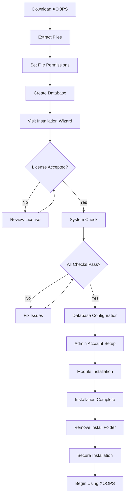

# Volledige XOOPS installatiehandleiding

Deze handleiding biedt uitgebreide uitleg voor het helemaal opnieuw installeren van XOOPS met behulp van de installatiewizard.

## Vereisten

Voordat u met de installatie begint, moet u ervoor zorgen dat u beschikt over:

- Toegang tot uw webserver via FTP of SSH
- Beheerdertoegang tot uw databaseserver
- Een geregistreerde domeinnaam
- Serververeisten geverifieerd
- Back-uptools beschikbaar

## Installatieproces



## Stapsgewijze installatie

### Stap 1: XOOPS downloaden

Download de nieuwste versie van [https://xoops.org/](https://xoops.org/):

```bash
# Using wget
wget https://xoops.org/download/xoops-2.5.8.zip

# Using curl
curl -O https://xoops.org/download/xoops-2.5.8.zip
```

### Stap 2: bestanden uitpakken

Pak het XOOPS-archief uit naar uw webroot:

```bash
# Navigate to web root
cd /var/www/html

# Extract XOOPS
unzip xoops-2.5.8.zip

# Rename folder (optional, but recommended)
mv xoops-2.5.8 xoops
cd xoops
```

### Stap 3: Bestandsrechten instellen

Stel de juiste machtigingen in voor XOOPS-mappen:

```bash
# Make directories writable (755 for dirs, 644 for files)
find . -type d -exec chmod 755 {} \;
find . -type f -exec chmod 644 {} \;

# Make specific directories writable by web server
chmod 777 uploads/
chmod 777 templates_c/
chmod 777 var/
chmod 777 cache/

# Secure mainfile.php after installation
chmod 644 mainfile.php
```

### Stap 4: Database maken

Maak een nieuwe database voor XOOPS met behulp van MySQL:

```sql
-- Create database
CREATE DATABASE xoops_db CHARACTER SET utf8mb4 COLLATE utf8mb4_unicode_ci;

-- Create user
CREATE USER 'xoops_user'@'localhost' IDENTIFIED BY 'secure_password_here';

-- Grant privileges
GRANT ALL PRIVILEGES ON xoops_db.* TO 'xoops_user'@'localhost';
FLUSH PRIVILEGES;
```

Of gebruik phpMyAdmin:

1. Log in op phpMyAdmin
2. Klik op het tabblad "Databases".
3. Voer de databasenaam in: `xoops_db`
4. Selecteer de sortering "utf8mb4_unicode_ci".
5. Klik op "Maken"
6. Maak een gebruiker aan met dezelfde naam als de database
7. Verleen alle rechten

### Stap 5: Voer de installatiewizard uit

Open uw browser en navigeer naar:

```
http://your-domain.com/xoops/install/
```

#### Systeemcontrolefase

De wizard controleert uw serverconfiguratie:

- PHP-versie >= 5.6.0
- MySQL/MariaDB beschikbaar
- Vereiste PHP-extensies (GD, PDO, enz.)
- Directory-machtigingen
- Databaseconnectiviteit

**Als de controles mislukken:**

Zie de sectie #Veelvoorkomende installatieproblemen voor oplossingen.

#### Databaseconfiguratie

Voer uw databasegegevens in:

```
Database Host: localhost
Database Name: xoops_db
Database User: xoops_user
Database Password: [your_secure_password]
Table Prefix: xoops_
```

**Belangrijke opmerkingen:**
- Als uw databasehost verschilt van localhost (bijvoorbeeld een externe server), voert u de juiste hostnaam in
- Het tabelvoorvoegsel helpt bij het uitvoeren van meerdere XOOPS-instanties in één database
- Gebruik een sterk wachtwoord met hoofdletters, cijfers en symbolen

#### Beheerdersaccount instellen

Maak uw beheerdersaccount aan:

```
Admin Username: admin (or choose custom)
Admin Email: admin@your-domain.com
Admin Password: [strong_unique_password]
Confirm Password: [repeat_password]
```

**Beste praktijken:**
- Gebruik een unieke gebruikersnaam, niet "admin"
- Gebruik een wachtwoord met meer dan 16 tekens
- Bewaar inloggegevens in een veilige wachtwoordbeheerder
- Deel nooit beheerdersreferenties

#### Module-installatie

Kies standaardmodules om te installeren:

- **Systeemmodule** (vereist) - Kernfunctionaliteit XOOPS
- **Gebruikersmodule** (vereist) - Gebruikersbeheer
- **Profielmodule** (aanbevolen) - Gebruikersprofielen
- **PM-module (privébericht)** (aanbevolen) - Interne berichtenuitwisseling
- **WF-Channel Module** (optioneel) - Contentbeheer

Selecteer alle aanbevolen modules voor een volledige installatie.

### Stap 6: Voltooi de installatie

Na alle stappen ziet u een bevestigingsscherm:

```
Installation Complete!

Your XOOPS installation is ready to use.
Admin Panel: http://your-domain.com/xoops/admin/
User Panel: http://your-domain.com/xoops/
```

### Stap 7: Beveilig uw installatie

#### Installatiemap verwijderen

```bash
# Remove the install directory (CRITICAL for security)
rm -rf /var/www/html/xoops/install/

# Or rename it
mv /var/www/html/xoops/install/ /var/www/html/xoops/install.bak
```

**WARNING:** Laat de installatiemap nooit toegankelijk tijdens de productie!

#### Veilig mainfile.php

```bash
# Make mainfile.php read-only
chmod 644 /var/www/html/xoops/mainfile.php

# Set ownership
chown www-data:www-data /var/www/html/xoops/mainfile.php
```

#### Stel de juiste bestandsrechten in

```bash
# Recommended production permissions
find . -type f -name "*.php" -exec chmod 644 {} \;
find . -type d -exec chmod 755 {} \;

# Writable directories for web server
chmod 777 uploads/ var/ cache/ templates_c/
```

#### HTTPS/SSL inschakelen

Configureer SSL in uw webserver (nginx of Apache).

**Voor Apache:**
```apache
<VirtualHost *:443>
    ServerName your-domain.com
    DocumentRoot /var/www/html/xoops

    SSLEngine on
    SSLCertificateFile /etc/ssl/certs/your-cert.crt
    SSLCertificateKeyFile /etc/ssl/private/your-key.key

    # Force HTTPS redirect
    <IfModule mod_rewrite.c>
        RewriteEngine On
        RewriteCond %{HTTPS} off
        RewriteRule ^(.*)$ https://%{HTTP_HOST}%{REQUEST_URI} [L,R=301]
    </IfModule>
</VirtualHost>
```

## Configuratie na installatie

### 1. Open het beheerdersdashboard

Navigeer naar:
```
http://your-domain.com/xoops/admin/
```

Log in met uw beheerdersgegevens.

### 2. Basisinstellingen configureren

Configureer het volgende:

- Sitenaam en beschrijving
- Beheerder e-mailadres
- Tijdzone en datumformaat
- Zoekmachineoptimalisatie

### 3. Installatie testen

- [ ] Bezoek de startpagina
- [ ] Controleer de modulebelasting
- [ ] Controleer of de gebruikersregistratie werkt
- [ ] Test de functies van het beheerderspaneel
- [ ] Bevestig dat SSL/HTTPS werkt

### 4. Back-ups plannen

Automatische back-ups instellen:

```bash
# Create backup script (backup.sh)
#!/bin/bash
DATE=$(date +%Y%m%d_%H%M%S)
BACKUP_DIR="/backups/xoops"
XOOPS_DIR="/var/www/html/xoops"

# Backup database
mysqldump -u xoops_user -p[password] xoops_db > $BACKUP_DIR/db_$DATE.sql

# Backup files
tar -czf $BACKUP_DIR/files_$DATE.tar.gz $XOOPS_DIR

echo "Backup completed: $DATE"
```

Schema met cron:
```bash
# Daily backup at 2 AM
0 2 * * * /usr/local/bin/backup.sh
```

## Veelvoorkomende installatieproblemen

### Probleem: fouten met geweigerde toestemming

**Symptoom:** "Toestemming geweigerd" bij het uploaden of maken van bestanden

**Oplossing:**
```bash
# Check web server user
ps aux | grep apache  # For Apache
ps aux | grep nginx   # For Nginx

# Fix permissions (replace www-data with your web server user)
chown -R www-data:www-data /var/www/html/xoops
chmod -R 755 /var/www/html/xoops
chmod 777 uploads/ var/ cache/ templates_c/
```

### Probleem: databaseverbinding mislukt

**Symptoom:** "Kan geen verbinding maken met databaseserver"**Oplossing:**
1. Controleer de databasereferenties in de installatiewizard
2. Controleer of MySQL/MariaDB actief is:
   
```bash
   service mysql status  # or mariadb
   
```
3. Controleer of de database bestaat:
   
```sql
   SHOW DATABASES;
   
```
4. Test de verbinding vanaf de opdrachtregel:
   
```bash
   mysql -h localhost -u xoops_user -p xoops_db
   
```

### Probleem: leeg wit scherm

**Symptoom:** Als u XOOPS bezoekt, wordt een lege pagina weergegeven

**Oplossing:**
1. Controleer de PHP-foutlogboeken:
   
```bash
   tail -f /var/log/apache2/error.log
   
```
2. Schakel de foutopsporingsmodus in mainfile.php in:
   
```php
   define('XOOPS_DEBUG', 1);
   
```
3. Controleer de bestandsrechten op mainfile.php en configuratiebestanden
4. Controleer of de PHP-MySQL-extensie is geïnstalleerd

### Probleem: kan niet naar de uploadmap schrijven

**Symptoom:** Uploadfunctie mislukt: "Kan niet schrijven naar uploads/"

**Oplossing:**
```bash
# Check current permissions
ls -la uploads/

# Fix permissions
chmod 777 uploads/
chown www-data:www-data uploads/

# For specific files
chmod 644 uploads/*
```

### Probleem: PHP-extensies ontbreken

**Symptoom:** Systeemcontrole mislukt omdat er ontbrekende extensies zijn (GD, MySQL, enz.)

**Oplossing (Ubuntu/Debian):**
```bash
# Install PHP GD library
apt-get install php-gd

# Install PHP MySQL support
apt-get install php-mysql

# Restart web server
systemctl restart apache2  # or nginx
```

**Oplossing (CentOS/RHEL):**
```bash
# Install PHP GD library
yum install php-gd

# Install PHP MySQL support
yum install php-mysql

# Restart web server
systemctl restart httpd
```

### Probleem: langzaam installatieproces

**Symptoom:** Er treedt een time-out op bij de installatiewizard of deze werkt erg langzaam

**Oplossing:**
1. Verhoog de time-out voor PHP in php.ini:
   
```ini
   max_execution_time = 300  # 5 minutes
   
```
2. Verhoog MySQL max_allowed_packet:
   
```sql
   SET GLOBAL max_allowed_packet = 256M;
   
```
3. Controleer serverbronnen:
   
```bash
   free -h  # Check RAM
   df -h    # Check disk space
   
```

### Probleem: beheerderspaneel niet toegankelijk

**Symptoom:** Geen toegang tot het beheerderspaneel na installatie

**Oplossing:**
1. Controleer of de admin-gebruiker bestaat in de database:
   
```sql
   SELECT * FROM xoops_users WHERE uid = 1;
   
```
2. Wis browsercache en cookies
3. Controleer of de sessiemap schrijfbaar is:
   
```bash
   chmod 777 var/
   
```
4. Controleer of de htaccess-regels de beheerderstoegang niet blokkeren

## Verificatiechecklist

Controleer na de installatie:

- [x] XOOPS-startpagina wordt correct geladen
- [x] Beheerderspaneel is toegankelijk via /xoops/admin/
- [x] SSL/HTTPS werkt
- [x] Installatiemap is verwijderd of ontoegankelijk
- [x] Bestandsrechten zijn veilig (644 voor bestanden, 755 voor mappen)
- [x] Databaseback-ups zijn gepland
- [x] Modules worden zonder fouten geladen
- [x] Gebruikersregistratiesysteem werkt
- [x] De functionaliteit voor het uploaden van bestanden werkt
- [x] E-mailmeldingen worden correct verzonden

## Volgende stappen

Zodra de installatie is voltooid:

1. Lees de Basisconfiguratiehandleiding
2. Beveilig uw installatie
3. Verken het beheerderspaneel
4. Installeer extra modules
5. Stel gebruikersgroepen en machtigingen in

---

**Tags:** #installatie #setup #aan de slag #probleemoplossing

**Gerelateerde artikelen:**
- Serververeisten
- Upgraden-XOOPS
- ../Configuratie/Veiligheidsconfiguratie