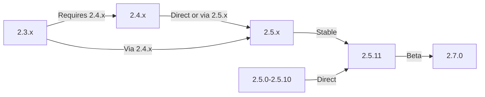

In deze handleiding wordt beschreven hoe u XOOPS kunt upgraden van oudere versies naar de nieuwste versie, terwijl uw gegevens en aanpassingen behouden blijven.

> **Versie-informatie**
> - **Stabiel:** XOOPS 2.5.11
> - **Beta:** XOOPS 2.7.0 (testen)
> - **Toekomst:** XOOPS 4.0 (in ontwikkeling - zie Roadmap)

## Controlelijst vóór de upgrade

Controleer voordat u met de upgrade begint:

- [ ] Huidige XOOPS-versie gedocumenteerd
- [ ] Doelversie XOOPS geïdentificeerd
- [ ] Volledige systeemback-up voltooid
- [ ] Databaseback-up geverifieerd
- [ ] Lijst met geïnstalleerde modules opgenomen
- [ ] Aangepaste wijzigingen gedocumenteerd
- [ ] Testomgeving beschikbaar
- [ ] Upgradepad aangevinkt (sommige versies slaan tussentijdse releases over)
- [ ] Serverbronnen geverifieerd (voldoende schijfruimte, geheugen)
- [ ] Onderhoudsmodus ingeschakeld

## Upgradepadgids

Verschillende upgradepaden afhankelijk van de huidige versie:



**Belangrijk:** Sla nooit hoofdversies over. Als u upgradet van 2.3.x, upgrade dan eerst naar 2.4.x en vervolgens naar 2.5.x.

## Stap 1: Voltooi de systeemback-up

### Databaseback-up

Gebruik mysqldump om een back-up van de database te maken:

```bash
# Full database backup
mysqldump -u xoops_user -p xoops_db > /backups/xoops_db_backup_$(date +%Y%m%d_%H%M%S).sql

# Compressed backup
mysqldump -u xoops_user -p xoops_db | gzip > /backups/xoops_db_backup_$(date +%Y%m%d_%H%M%S).sql.gz
```

Of gebruik phpMyAdmin:

1. Selecteer uw XOOPS-database
2. Klik op het tabblad "Exporteren".
3. Kies het formaat "SQL".
4. Selecteer "Opslaan als bestand"
5. Klik op "Ga"

Back-upbestand verifiëren:

```bash
# Check backup size
ls -lh /backups/xoops_db_backup*.sql

# Verify backup integrity (uncompressed)
head -20 /backups/xoops_db_backup_*.sql

# Verify compressed backup
zcat /backups/xoops_db_backup_*.sql.gz | head -20
```

### Back-up van bestandssysteem

Maak een back-up van alle XOOPS-bestanden:

```bash
# Compressed file backup
tar -czf /backups/xoops_files_$(date +%Y%m%d_%H%M%S).tar.gz /var/www/html/xoops

# Uncompressed (faster, requires more disk space)
tar -cf /backups/xoops_files_$(date +%Y%m%d_%H%M%S).tar /var/www/html/xoops

# Show backup progress
tar -czf /backups/xoops_files_$(date +%Y%m%d_%H%M%S).tar.gz --verbose /var/www/html/xoops | tail
```

Back-ups veilig opslaan:

```bash
# Secure backup storage
chmod 600 /backups/xoops_*
ls -lah /backups/

# Optional: Copy to remote storage
scp /backups/xoops_* user@backup-server:/secure/backups/
```

### Back-upherstel testen

**CRITICAL:** Test altijd of uw back-up werkt:

```bash
# Verify tar archive contents
tar -tzf /backups/xoops_files_*.tar.gz | head -20

# Extract to test location
mkdir /tmp/restore_test
cd /tmp/restore_test
tar -xzf /backups/xoops_files_*.tar.gz

# Verify key files exist
ls -la xoops/mainfile.php
ls -la xoops/install/
```

## Stap 2: Onderhoudsmodus inschakelen

Voorkom dat gebruikers toegang krijgen tot de site tijdens de upgrade:

### Optie 1: XOOPS beheerderspaneel

1. Log in op het beheerdersdashboard
2. Ga naar Systeem > Onderhoud
3. Schakel "Siteonderhoudsmodus" in
4. Onderhoudsmelding instellen
5. Opslaan

### Optie 2: Handmatige onderhoudsmodus

Maak een onderhoudsbestand in de webroot:

```html
<!-- /var/www/html/maintenance.html -->
<!DOCTYPE html>
<html>
<head>
    <title>Under Maintenance</title>
    <style>
        body { font-family: Arial; text-align: center; padding: 50px; }
        h1 { color: #333; }
        p { color: #666; margin: 20px 0; }
    </style>
</head>
<body>
    <h1>Site Under Maintenance</h1>
    <p>We're currently upgrading our site.</p>
    <p>Expected time: approximately 30 minutes.</p>
    <p>Thank you for your patience!</p>
</body>
</html>
```

Configureer Apache om de onderhoudspagina weer te geven:

```apache
# In .htaccess or vhost config
ErrorDocument 503 /maintenance.html

# Redirect all traffic to maintenance page
<IfModule mod_rewrite.c>
    RewriteEngine On
    RewriteCond %{REMOTE_ADDR} !^192\.168\.1\.100$  # Your IP
    RewriteRule ^(.*)$ - [R=503,L]
</IfModule>
```

## Stap 3: Download nieuwe versie

Download XOOPS van de officiële site:

```bash
# Download latest version
cd /tmp
wget https://xoops.org/download/xoops-2.5.8.zip

# Verify checksum (if provided)
sha256sum xoops-2.5.8.zip
# Compare with official SHA256 hash

# Extract to temporary location
unzip xoops-2.5.8.zip
cd xoops-2.5.8
```

## Stap 4: Bestandsvoorbereiding vóór de upgrade

### Identificeer aangepaste wijzigingen

Controleer op aangepaste kernbestanden:

```bash
# Look for modified files (files with newer mtime)
find /var/www/html/xoops -type f -newer /var/www/html/xoops/install.php

# Check for custom themes
ls /var/www/html/xoops/themes/
# Note any custom themes

# Check for custom modules
ls /var/www/html/xoops/modules/
# Note any custom modules created by you
```

### Huidige status van document

Maak een upgraderapport:

```bash
cat > /tmp/upgrade_report.txt << EOF
=== XOOPS Upgrade Report ===
Date: $(date)
Current Version: 2.5.6
Target Version: 2.5.8

=== Installed Modules ===
$(ls /var/www/html/xoops/modules/)

=== Custom Modifications ===
[Document any custom theme or module modifications]

=== Themes ===
$(ls /var/www/html/xoops/themes/)

=== Plugin Status ===
[List any custom code modifications]

EOF
```

## Stap 5: Nieuwe bestanden samenvoegen met huidige installatie

### Strategie: bewaar aangepaste bestanden

Vervang de XOOPS-kernbestanden, maar behoud:
- `mainfile.php` (uw databaseconfiguratie)
- Aangepaste thema's in `themes/`
- Aangepaste modules in `modules/`
- Gebruikersuploads in `uploads/`
- Locatiegegevens in `var/`

### Handmatig samenvoegproces

```bash
# Set variables
XOOPS_OLD="/var/www/html/xoops"
XOOPS_NEW="/tmp/xoops-2.5.8"
BACKUP="/backups/pre-upgrade"

# Create pre-upgrade backup in place
mkdir -p $BACKUP
cp -r $XOOPS_OLD/* $BACKUP/

# Copy new files (but preserve sensitive files)
# Copy everything except protected directories
rsync -av --exclude='mainfile.php' \
    --exclude='modules/custom*' \
    --exclude='themes/custom*' \
    --exclude='uploads' \
    --exclude='var' \
    --exclude='cache' \
    --exclude='templates_c' \
    $XOOPS_NEW/ $XOOPS_OLD/

# Verify critical files preserved
ls -la $XOOPS_OLD/mainfile.php
```

### upgrade.php gebruiken (indien beschikbaar)

Sommige XOOPS-versies bevatten een geautomatiseerd upgradescript:

```bash
# Copy new files with installer
cp -r /tmp/xoops-2.5.8/* /var/www/html/xoops/

# Run upgrade wizard
# Visit: http://your-domain.com/xoops/upgrade/
```

### Bestandsrechten na samenvoegen

Herstel de juiste rechten:

```bash
# Set ownership
chown -R www-data:www-data /var/www/html/xoops

# Set directory permissions
find /var/www/html/xoops -type d -exec chmod 755 {} \;

# Set file permissions
find /var/www/html/xoops -type f -exec chmod 644 {} \;

# Make writable directories
chmod 777 /var/www/html/xoops/cache
chmod 777 /var/www/html/xoops/templates_c
chmod 777 /var/www/html/xoops/uploads
chmod 777 /var/www/html/xoops/var

# Secure mainfile.php
chmod 644 /var/www/html/xoops/mainfile.php
```

## Stap 6: Databasemigratie

### Databasewijzigingen bekijken

Controleer de release-opmerkingen van XOOPS voor wijzigingen in de databasestructuur:

```bash
# Extract and review SQL migration files
find /tmp/xoops-2.5.8 -name "*.sql" -type f
# Document all .sql files found
```

### Database-updates uitvoeren

### Optie 1: Automatische update (indien beschikbaar)

Gebruik het beheerderspaneel:

1. Log in op beheerder
2. Ga naar **Systeem > Database**
3. Klik op 'Updates controleren'
4. Bekijk openstaande wijzigingen
5. Klik op 'Updates toepassen'

### Optie 2: Handmatige database-updates

Voer migratie SQL-bestanden uit:

```bash
# Connect to database
mysql -u xoops_user -p xoops_db

# View pending changes (varies by version)
SELECT * FROM xoops_config WHERE conf_name LIKE '%version%';

# Run migration scripts manually if needed
SOURCE /tmp/xoops-2.5.8/migrate_2.5.6_to_2.5.8.sql;
```

### Databaseverificatie

Database-integriteit verifiëren na update:

```sql
-- Check database consistency
REPAIR TABLE xoops_users;
OPTIMIZE TABLE xoops_users;

-- Verify key tables exist
SHOW TABLES LIKE 'xoops_%';

-- Check row counts (should increase or stay same)
SELECT COUNT(*) FROM xoops_users;
SELECT COUNT(*) FROM xoops_posts;
```

## Stap 7: Upgrade verifiëren

### Homepaginacontrole

Bezoek uw XOOPS-startpagina:

```
http://your-domain.com/xoops/
```

Verwacht: Pagina wordt zonder fouten geladen, wordt correct weergegeven

### Beheerderspaneelcontrole

Toegang beheerder:

```
http://your-domain.com/xoops/admin/
```

Verifiëren:
- [ ] Beheerderspaneel wordt geladen
- [ ] Navigatie werkt
- [ ] Dashboard wordt correct weergegeven
- [ ] Geen databasefouten in logs

### Moduleverificatie

Controleer geïnstalleerde modules:

1. Ga naar **Modules > Modules** in admin
2. Controleer of alle modules nog geïnstalleerd zijn
3. Controleer op eventuele foutmeldingen
4. Schakel alle modules in die zijn uitgeschakeld

### Logbestandscontrole

Systeemlogboeken controleren op fouten:

```bash
# Check web server error log
tail -50 /var/log/apache2/error.log

# Check PHP error log
tail -50 /var/log/php_errors.log

# Check XOOPS system log (if available)
# In admin panel: System > Logs
```

### Kernfuncties testen- [ ] Inloggen/uitloggen van gebruiker werkt
- [ ] Gebruikersregistratie werkt
- [ ] Functies voor het uploaden van bestanden
- [ ] E-mailmeldingen verzenden
- [ ] Zoekfunctionaliteit werkt
- [ ] Beheerfuncties operationeel
- [ ] Modulefunctionaliteit intact

## Stap 8: Opschonen na de upgrade

### Tijdelijke bestanden verwijderen

```bash
# Remove extraction directory
rm -rf /tmp/xoops-2.5.8

# Clear template cache (safe to delete)
rm -rf /var/www/html/xoops/templates_c/*

# Clear site cache
rm -rf /var/www/html/xoops/cache/*
```

### Onderhoudsmodus verwijderen

Schakel normale sitetoegang opnieuw in:

```apache
# Remove maintenance mode redirect from .htaccess
# Or delete maintenance.html file
rm /var/www/html/maintenance.html
```

### Documentatie bijwerken

Update uw upgrade-opmerkingen:

```bash
# Document successful upgrade
cat >> /tmp/upgrade_report.txt << EOF

=== Upgrade Results ===
Status: SUCCESS
Upgrade Date: $(date)
New Version: 2.5.8
Duration: [time in minutes]

Post-Upgrade Tests:
- [x] Homepage loads
- [x] Admin panel accessible
- [x] Modules functional
- [x] User registration works
- [x] Database optimized

EOF
```

## Problemen met upgrades oplossen

### Probleem: leeg wit scherm na upgrade

**Symptoom:** De startpagina toont niets

**Oplossing:**
```bash
# Check PHP errors
tail -f /var/log/apache2/error.log

# Enable debug mode temporarily
echo "define('XOOPS_DEBUG', 1);" >> /var/www/html/xoops/mainfile.php

# Check file permissions
ls -la /var/www/html/xoops/mainfile.php

# Restore from backup if needed
cp /backups/xoops_files_*.tar.gz /tmp/
cd /tmp && tar -xzf xoops_files_*.tar.gz
```

### Probleem: databaseverbindingsfout

**Symptoom:** Bericht 'Kan geen verbinding maken met database'

**Oplossing:**
```bash
# Verify database credentials in mainfile.php
grep -i "database\|host\|user" /var/www/html/xoops/mainfile.php

# Test connection
mysql -h localhost -u xoops_user -p xoops_db -e "SELECT 1"

# Check MySQL status
systemctl status mysql

# Verify database still exists
mysql -u xoops_user -p -e "SHOW DATABASES" | grep xoops
```

### Probleem: beheerderspaneel niet toegankelijk

**Symptoom:** Kan geen toegang krijgen tot /xoops/admin/

**Oplossing:**
```bash
# Check .htaccess rules
cat /var/www/html/xoops/.htaccess

# Verify admin files exist
ls -la /var/www/html/xoops/admin/

# Check mod_rewrite enabled
apache2ctl -M | grep rewrite

# Restart web server
systemctl restart apache2
```

### Probleem: modules worden niet geladen

**Symptoom:** Modules vertonen fouten of zijn gedeactiveerd

**Oplossing:**
```bash
# Verify module files exist
ls /var/www/html/xoops/modules/

# Check module permissions
ls -la /var/www/html/xoops/modules/*/

# Check module configuration in database
mysql -u xoops_user -p xoops_db -e "SELECT * FROM xoops_modules WHERE module_status = 0"

# Reactivate modules in admin panel
# System > Modules > Click module > Update Status
```

### Probleem: fouten met geweigerde toestemming

**Symptoom:** "Toestemming geweigerd" bij uploaden of opslaan

**Oplossing:**
```bash
# Check file ownership
ls -la /var/www/html/xoops/ | head -20

# Fix ownership
chown -R www-data:www-data /var/www/html/xoops

# Fix directory permissions
find /var/www/html/xoops -type d -exec chmod 755 {} \;

# Make cache/uploads writable
chmod 777 /var/www/html/xoops/cache
chmod 777 /var/www/html/xoops/templates_c
chmod 777 /var/www/html/xoops/uploads
chmod 777 /var/www/html/xoops/var
```

### Probleem: langzaam laden van pagina's

**Symptoom:** Pagina's laden erg langzaam na de upgrade

**Oplossing:**
```bash
# Clear all caches
rm -rf /var/www/html/xoops/cache/*
rm -rf /var/www/html/xoops/templates_c/*

# Optimize database
mysql -u xoops_user -p xoops_db << EOF
OPTIMIZE TABLE xoops_users;
OPTIMIZE TABLE xoops_posts;
OPTIMIZE TABLE xoops_config;
ANALYZE TABLE xoops_users;
EOF

# Check PHP error log for warnings
grep -i "deprecated\|warning" /var/log/php_errors.log | tail -20

# Increase PHP memory/execution time temporarily
# Edit php.ini:
memory_limit = 256M
max_execution_time = 300
```

## Terugdraaiprocedure

Als de upgrade kritiek mislukt, herstel dan vanaf een back-up:

### Database herstellen

```bash
# Restore from backup
mysql -u xoops_user -p xoops_db < /backups/xoops_db_backup_YYYYMMDD_HHMMSS.sql

# Or from compressed backup
gunzip < /backups/xoops_db_backup_YYYYMMDD_HHMMSS.sql.gz | mysql -u xoops_user -p xoops_db

# Verify restoration
mysql -u xoops_user -p xoops_db -e "SELECT COUNT(*) FROM xoops_users"
```

### Bestandssysteem herstellen

```bash
# Stop web server
systemctl stop apache2

# Remove current installation
rm -rf /var/www/html/xoops/*

# Extract backup
cd /var/www/html
tar -xzf /backups/xoops_files_YYYYMMDD_HHMMSS.tar.gz

# Fix permissions
chown -R www-data:www-data xoops/
find xoops -type d -exec chmod 755 {} \;
find xoops -type f -exec chmod 644 {} \;
chmod 777 xoops/cache xoops/templates_c xoops/uploads xoops/var

# Start web server
systemctl start apache2

# Verify restoration
# Visit http://your-domain.com/xoops/
```

## Upgradeverificatiechecklist

Controleer na voltooiing van de upgrade:

- [ ] XOOPS-versie bijgewerkt (controleer beheerder > Systeeminfo)
- [ ] Homepagina wordt zonder fouten geladen
- [ ] Alle modules functioneel
- [ ] Gebruikersaanmelding werkt
- [ ] Beheerderspaneel toegankelijk
- [ ] Bestandsuploads werken
- [ ] E-mailmeldingen functioneel
- [ ] Database-integriteit geverifieerd
- [ ] Bestandsrechten correct
- [ ] Onderhoudsmodus verwijderd
- [ ] Back-ups beveiligd en getest
- [ ] Prestaties acceptabel
- [ ] SSL/HTTPS werkend
- [ ] Geen foutmeldingen in logs

## Volgende stappen

Na succesvolle upgrade:

1. Update eventuele aangepaste modules naar de nieuwste versies
2. Bekijk de releaseopmerkingen voor verouderde functies
3. Overweeg het optimaliseren van de prestaties
4. Update de beveiligingsinstellingen
5. Test alle functionaliteit grondig
6. Houd back-upbestanden veilig

---

**Tags:** #upgrade #onderhoud #backup #database-migratie

**Gerelateerde artikelen:**
- ../../06-Publisher-Module/Gebruikershandleiding/Installatie
- Serververeisten
- ../Configuratie/Basisconfiguratie
- ../Configuratie/Veiligheidsconfiguratie