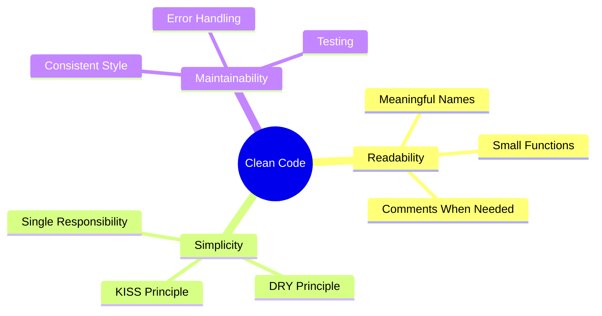

## Overzicht

Schone code is code die gemakkelijk te lezen, te begrijpen en te onderhouden is. Deze gids behandelt schone codeprincipes die specifiek worden toegepast op de ontwikkeling van XOOPS-modules.

## Kernprincipes



## Betekenisvolle namen

### Variabelen

```php
// Bad
$d = new DateTime();
$u = $memberHandler->getUser($id);
$arr = [];

// Good
$createdDate = new DateTime();
$currentUser = $memberHandler->getUser($userId);
$publishedArticles = [];
```

### Functies

```php
// Bad
function process($data) { ... }
function handle($item) { ... }
function doStuff($x, $y) { ... }

// Good
function publishArticle(Article $article): void { ... }
function calculateTotalPrice(array $items): float { ... }
function sendNotificationEmail(User $user, string $subject): bool { ... }
```

### Klassen

```php
// Bad
class Manager { ... }
class Helper { ... }
class Utils { ... }

// Good
class ArticleRepository { ... }
class NotificationService { ... }
class PermissionChecker { ... }
```

## Kleine functies

### Eén verantwoordelijkheid

```php
// Bad - does too many things
function processArticle($data) {
    // Validate
    if (empty($data['title'])) {
        throw new Exception('Title required');
    }
    // Save
    $article = new Article();
    $article->setTitle($data['title']);
    $this->repository->save($article);
    // Notify
    $this->mailer->send($article->getAuthor(), 'Article published');
    // Log
    $this->logger->info('Article created');
    return $article;
}

// Good - each function does one thing
function validateArticleData(array $data): void
{
    if (empty($data['title'])) {
        throw new ValidationException('Title required');
    }
}

function createArticle(array $data): Article
{
    $this->validateArticleData($data);
    return Article::create($data['title'], $data['content']);
}

function publishArticle(Article $article): void
{
    $this->repository->save($article);
    $this->notifyAuthor($article);
    $this->logArticleCreation($article);
}
```

### Functielengte

Houd de functies kort – idealiter onder de 20 regels:

```php
// Good - focused function
public function getPublishedArticles(int $limit = 10): array
{
    $criteria = new CriteriaCompo();
    $criteria->add(new Criteria('status', 'published'));
    $criteria->setSort('published_at');
    $criteria->setOrder('DESC');
    $criteria->setLimit($limit);

    return $this->repository->getObjects($criteria);
}
```

## DRY-principe (herhaal jezelf niet)

### Algemene code extraheren

```php
// Bad - repeated code
function getActiveUsers() {
    $criteria = new CriteriaCompo();
    $criteria->add(new Criteria('level', 0, '>'));
    $criteria->setSort('uname');
    return $this->userHandler->getObjects($criteria);
}

function getActiveAdmins() {
    $criteria = new CriteriaCompo();
    $criteria->add(new Criteria('level', 0, '>'));
    $criteria->add(new Criteria('is_admin', 1));
    $criteria->setSort('uname');
    return $this->userHandler->getObjects($criteria);
}

// Good - shared logic extracted
function getUsers(CriteriaCompo $criteria): array
{
    $criteria->add(new Criteria('level', 0, '>'));
    $criteria->setSort('uname');
    return $this->userHandler->getObjects($criteria);
}

function getActiveUsers(): array
{
    return $this->getUsers(new CriteriaCompo());
}

function getActiveAdmins(): array
{
    $criteria = new CriteriaCompo();
    $criteria->add(new Criteria('is_admin', 1));
    return $this->getUsers($criteria);
}
```

## Foutafhandeling

### Gebruik uitzonderingen op de juiste manier

```php
// Bad - generic exceptions
throw new Exception('Error');

// Good - specific exceptions
throw new ArticleNotFoundException($articleId);
throw new PermissionDeniedException('Cannot edit article');
throw new ValidationException(['title' => 'Title is required']);
```

### Ga netjes om met fouten

```php
public function findArticle(string $id): ?Article
{
    try {
        return $this->repository->findById($id);
    } catch (DatabaseException $e) {
        $this->logger->error('Database error finding article', [
            'id' => $id,
            'error' => $e->getMessage()
        ]);
        throw new ServiceException('Unable to retrieve article', 0, $e);
    }
}
```

## Opmerkingen

### Wanneer moet u reageren

```php
// Bad - obvious comment
// Increment counter
$counter++;

// Good - explains why, not what
// Cache for 1 hour to reduce database load during peak traffic
$cache->set($key, $data, 3600);

// Good - documents complex algorithm
/**
 * Calculate article relevance score using TF-IDF algorithm.
 * Higher scores indicate better match with search terms.
 */
function calculateRelevanceScore(Article $article, array $terms): float
{
    // ...
}
```

## Codeorganisatie

### Klassenstructuur

```php
class ArticleService
{
    // 1. Constants
    private const MAX_TITLE_LENGTH = 255;

    // 2. Properties
    private ArticleRepository $repository;
    private EventDispatcher $events;

    // 3. Constructor
    public function __construct(
        ArticleRepository $repository,
        EventDispatcher $events
    ) {
        $this->repository = $repository;
        $this->events = $events;
    }

    // 4. Public methods
    public function publish(Article $article): void { ... }
    public function archive(Article $article): void { ... }

    // 5. Private methods
    private function validateForPublication(Article $article): void { ... }
}
```

## Controlelijst voor schone code

- [ ] Namen zijn betekenisvol en uitspreekbaar
- [ ] Functies doen maar één ding
- [ ] Functies zijn klein (< 20 regels)
- [ ] Geen dubbele code
- [ ] Correcte foutafhandeling met specifieke uitzonderingen
- [ ] Opmerkingen leggen uit "waarom", niet "wat"
- [ ] Consistente opmaak en stijl
- [ ] Geen magische getallen of strings
- [ ] Afhankelijkheden worden geïnjecteerd, niet gecreëerd

## Gerelateerde documentatie

- Codeorganisatie
- Foutafhandeling
- Best practices testen
- PHP-normen