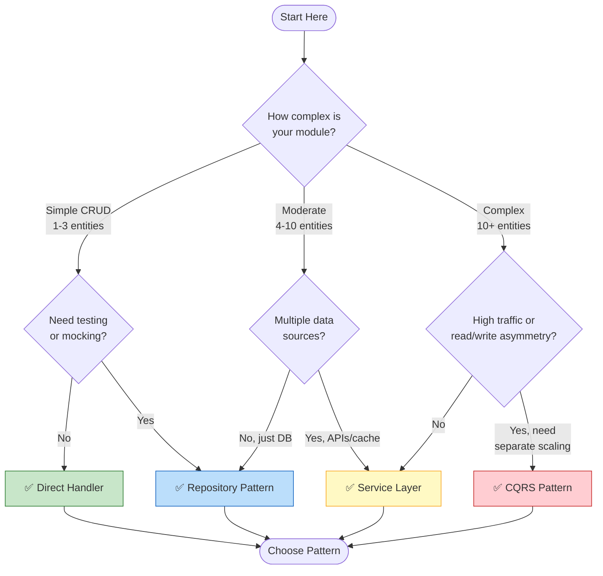
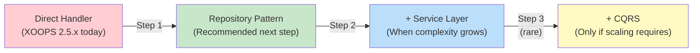

<span class="version-badge versie-25x">2.5.x ✅</span> <span class="version-badge versie-40x">4.0.x ✅</span>

> **Welk patroon moet ik gebruiken?** Deze beslissingsboom helpt u bij het kiezen tussen directe handlers, Repository Pattern, Service Layer en CQRS.

---

## Snelle beslissingsboom



---

## Patroonvergelijking

| Criteria | Directe afhandeling | Bewaarplaats | Servicelaag | CQRS |
|----------|---------------|-----------|--------------|-----|
| **Complexiteit** | ⭐ | ⭐⭐ | ⭐⭐⭐ | ⭐⭐⭐⭐⭐ |
| **Testbaarheid** | ❌ Moeilijk | ✅ Goed | ✅ Geweldig | ✅ Geweldig |
| **Flexibiliteit** | ❌ Laag | ✅ Middel | ✅ Hoog | ✅ Zeer hoog |
| **XOOPS 2.5.x** | ✅ Native | ✅ Werkt | ✅ Werkt | ⚠️Complex |
| **XOOPS 4.0** | ⚠️Verouderd | ✅ Aanbevolen | ✅ Aanbevolen | ✅ Voor schaal |
| **Teamgrootte** | 1 ontwikkelaar | 1-3 ontwikkelaars | 2-5 ontwikkelaars | 5+ ontwikkelaars |
| **Onderhoud** | ❌ Hoger | ✅ Matig | ✅ Lager | ⚠️ Vereist expertise |

---

## Wanneer elk patroon gebruiken?

### ✅ Directe afhandeling (`XoopsPersistableObjectHandler`)

**Best voor:** Eenvoudige modules, snelle prototypes, leren XOOPS

```php
// Simple and direct - good for small modules
$handler = xoops_getModuleHandler('article', 'news');
$articles = $handler->getObjects(new Criteria('status', 1));
```

**Kies dit wanneer:**
- Het bouwen van een eenvoudige module met 1-3 databasetabellen
- Snel een prototype maken
- Je bent de enige ontwikkelaar en hebt geen tests nodig
- De module zal niet significant groeien

**Beperkingen:**
- Moeilijk te testen (mondiale afhankelijkheid)
- Nauwe koppeling met databaselaag XOOPS
- Bedrijfslogica heeft de neiging om in controllers te lekken

---

### ✅ Repositorypatroon

**Beste voor:** De meeste modules, teams die testbaarheid willen

```php
// Abstraction allows mocking for tests
interface ArticleRepositoryInterface {
    public function findPublished(): array;
    public function save(Article $article): void;
}

class XoopsArticleRepository implements ArticleRepositoryInterface {
    private $handler;

    public function __construct() {
        $this->handler = xoops_getModuleHandler('article', 'news');
    }

    public function findPublished(): array {
        return $this->handler->getObjects(new Criteria('status', 1));
    }
}
```

**Kies dit wanneer:**
- Je wilt unit-tests schrijven
- Mogelijk wijzigt u de gegevensbronnen later (DB → API)
- Werken met 2+ ontwikkelaars
- Modules bouwen voor distributie

**Upgradepad:** Dit is het aanbevolen patroon voor de voorbereiding van XOOPS 4.0.

---

### ✅ Servicelaag

**Beste voor:** Modules met complexe bedrijfslogica

```php
// Service coordinates multiple repositories and contains business rules
class ArticlePublicationService {
    public function __construct(
        private ArticleRepositoryInterface $articles,
        private NotificationServiceInterface $notifications,
        private CacheInterface $cache
    ) {}

    public function publish(int $articleId): void {
        $article = $this->articles->find($articleId);
        $article->setStatus('published');
        $article->setPublishedAt(new DateTime());

        $this->articles->save($article);
        $this->notifications->notifySubscribers($article);
        $this->cache->invalidate("article:{$articleId}");
    }
}
```

**Kies dit wanneer:**
- Operaties omvatten meerdere gegevensbronnen
- Bedrijfsregels zijn complex
- Je hebt transactiebeheer nodig
- Meerdere delen van de app doen hetzelfde

**Upgradepad:** Combineer met Repository voor een robuuste architectuur.

---

### ⚠️ CQRS (segregatie van opdrachtqueryverantwoordelijkheden)

**Beste voor:** Grootschalige modules met lees-/schrijfasymmetrie

```php
// Commands modify state
class PublishArticleCommand {
    public function __construct(
        public readonly int $articleId,
        public readonly int $publisherId
    ) {}
}

// Queries read state (can use denormalized read models)
class GetPublishedArticlesQuery {
    public function __construct(
        public readonly int $limit = 10
    ) {}
}
```

**Kies dit wanneer:**
- Leest veel meer dan schrijft (100:1 of meer)
- U hebt verschillende schaling nodig voor lees- en schrijfbewerkingen
- Complexe rapportage-/analysevereisten
- Eventsourcing zou uw domein ten goede komen

**Waarschuwing:** CQRS voegt aanzienlijke complexiteit toe. De meeste XOOPS-modules hebben dit niet nodig.

---

## Aanbevolen upgradepad



### Stap 1: Handlers in opslagplaatsen verpakken (2-4 uur)

1. Creëer een interface voor uw behoeften op het gebied van gegevenstoegang
2. Implementeer het met behulp van de bestaande handler
3. Injecteer de repository in plaats van `xoops_getModuleHandler()` rechtstreeks aan te roepen

### Stap 2: Voeg servicelaag toe wanneer nodig (1-2 dagen)

1. Wanneer bedrijfslogica in controllers verschijnt, extraheren naar een service
2. De service maakt gebruik van repository's en niet rechtstreeks van handlers
3. Controllers worden dun (route → service → respons)

### Stap 3: Overweeg alleen CQRS als (zeldzaam)

1. Je leest miljoenen berichten per dag
2. Lees- en schrijfmodellen verschillen aanzienlijk
3. Je hebt eventsourcing nodig voor audittrails
4. Je hebt een team dat ervaring heeft met CQRS

---

## Snelle referentiekaart

| Vraag | Antwoord |
|----------|--------|
| **"Ik moet alleen gegevens opslaan/laden"** | Directe afhandeling |
| **"Ik wil tests schrijven"** | Repositorypatroon |
| **"Ik heb complexe bedrijfsregels"** | Servicelaag |
| **"Ik moet leesbewerkingen afzonderlijk schalen"** | CQRS |
| **"Ik bereid me voor op XOOPS 4.0"** | Repository + servicelaag |

---

## Gerelateerde documentatie

- [Repositorypatroongids](Patterns/Repository-Pattern.md)
- [Servicelaagpatroongids](Patterns/Service-Layer-Pattern.md)
- [CQRS-patroongids](../07-XOOPS-4.0/Implementation-Guides/CQRS-Pattern-Guide.md) *(geavanceerd)*
- [Hybride moduscontract](../07-XOOPS-4.0/Specifications/Hybrid-Mode-Contract.md)

---

#patterns #data-access #decision-tree #best-practices #xoops