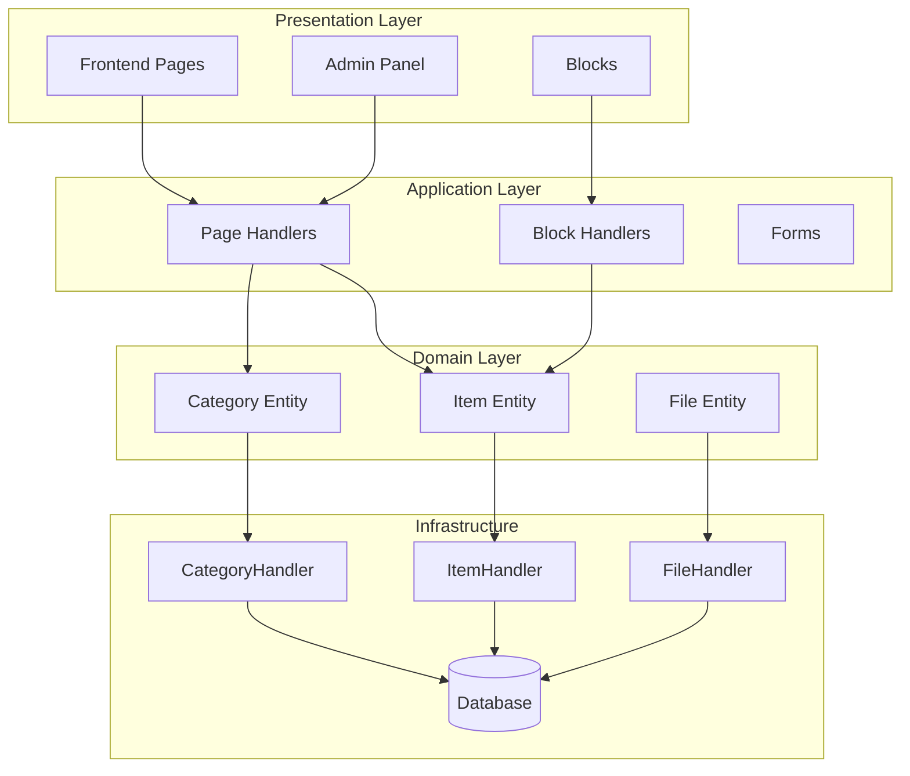
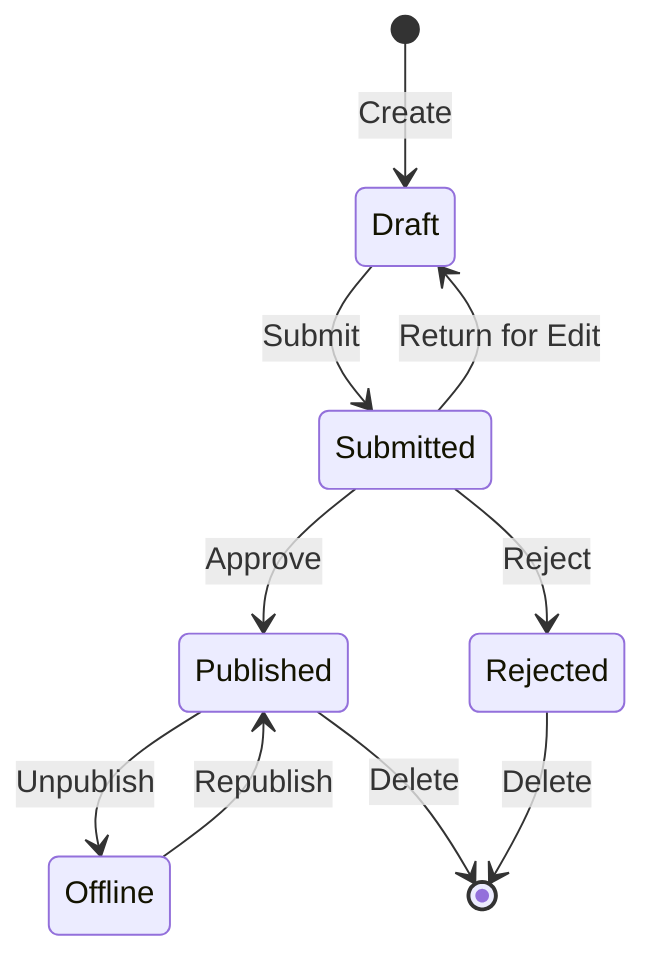

## Overzicht

Dit document biedt een technische analyse van de architectuur, patronen en implementatiedetails van de Publisher-module. Gebruik dit als referentie om te begrijpen hoe een XOOPS-module van productiekwaliteit is gestructureerd.

## Architectuuroverzicht



## Directorystructuur

```
publisher/
├── admin/
│   ├── index.php           # Admin dashboard
│   ├── item.php            # Article management
│   ├── category.php        # Category management
│   ├── permission.php      # Permissions
│   ├── file.php            # File manager
│   └── menu.php            # Admin menu
├── assets/
│   ├── css/
│   ├── js/
│   └── images/
├── class/
│   ├── Category.php        # Category entity
│   ├── CategoryHandler.php # Category data access
│   ├── Item.php            # Article entity
│   ├── ItemHandler.php     # Article data access
│   ├── File.php            # File attachment
│   ├── FileHandler.php     # File data access
│   ├── Form/               # Form classes
│   ├── Common/             # Utilities
│   └── Helper.php          # Module helper
├── include/
│   ├── common.php          # Initialization
│   ├── functions.php       # Utility functions
│   ├── oninstall.php       # Install hooks
│   ├── onupdate.php        # Update hooks
│   └── search.php          # Search integration
├── language/
├── templates/
├── sql/
└── xoops_version.php
```

## Entiteitsanalyse

### Artikel (artikel) Entiteit

```php
class Item extends \XoopsObject
{
    // Fields
    public function initVar(): void
    {
        $this->initVar('itemid', XOBJ_DTYPE_INT, null, false);
        $this->initVar('categoryid', XOBJ_DTYPE_INT, 0, false);
        $this->initVar('title', XOBJ_DTYPE_TXTBOX, '', true);
        $this->initVar('subtitle', XOBJ_DTYPE_TXTBOX, '');
        $this->initVar('summary', XOBJ_DTYPE_TXTAREA, '');
        $this->initVar('body', XOBJ_DTYPE_TXTAREA, '', true);
        $this->initVar('uid', XOBJ_DTYPE_INT, 0);
        $this->initVar('status', XOBJ_DTYPE_INT, 0);
        $this->initVar('datesub', XOBJ_DTYPE_INT, time());
        // ... more fields
    }

    // Business methods
    public function isPublished(): bool
    {
        return $this->getVar('status') == _PUBLISHER_STATUS_PUBLISHED;
    }

    public function canEdit(int $userId): bool
    {
        return $this->getVar('uid') == $userId
            || $this->isAdmin($userId);
    }
}
```

### Handlerpatroon

```php
class ItemHandler extends \XoopsPersistableObjectHandler
{
    public function __construct(\XoopsDatabase $db)
    {
        parent::__construct(
            $db,
            'publisher_items',
            Item::class,
            'itemid',
            'title'
        );
    }

    public function getPublishedItems(int $limit = 10): array
    {
        $criteria = new \CriteriaCompo();
        $criteria->add(new \Criteria('status', _PUBLISHER_STATUS_PUBLISHED));
        $criteria->setSort('datesub');
        $criteria->setOrder('DESC');
        $criteria->setLimit($limit);

        return $this->getObjects($criteria);
    }
}
```

## Toestemmingssysteem

### Toestemmingstypen

| Toestemming | Beschrijving |
|-----------|------------|
| `publisher_view` | Bekijk categorie/artikelen |
| `publisher_submit` | Nieuwe artikelen indienen |
| `publisher_approve` | Inzendingen automatisch goedkeuren |
| `publisher_moderate` | In behandeling zijnde artikelen bekijken |
| `publisher_global` | Algemene modulemachtigingen |

### Toestemmingscontrole

```php
class PermissionHandler
{
    public function isGranted(string $permission, int $categoryId): bool
    {
        $userId = $GLOBALS['xoopsUser']?->uid() ?? 0;
        $groups = $this->getUserGroups($userId);

        return $this->grouppermHandler->checkRight(
            $permission,
            $categoryId,
            $groups,
            $this->helper->getModule()->mid()
        );
    }
}
```

## Werkstroomstatussen



## Sjabloonstructuur

### Frontend-sjablonen

| Sjabloon | Doel |
|----------|---------|
| `publisher_index.tpl` | Module-startpagina |
| `publisher_item.tpl` | Enkel artikel |
| `publisher_category.tpl` | Categorieoverzicht |
| `publisher_submit.tpl` | Inzendingsformulier |
| `publisher_search.tpl` | Zoekresultaten |

### Bloksjablonen

| Sjabloon | Doel |
|----------|---------|
| `publisher_block_latest.tpl` | Recente artikelen |
| `publisher_block_spotlight.tpl` | Uitgelicht artikel |
| `publisher_block_category.tpl` | Categoriemenu |

## Gebruikte sleutelpatronen

1. **Handlerpatroon** - Inkapseling van gegevenstoegang
2. **Waardeobject** - Statusconstanten
3. **Sjabloonmethode** - Formulier genereren
4. **Strategie** - Verschillende weergavemodi
5. **Waarnemer** - Meldingen over evenementen

## Lessen voor moduleontwikkeling

1. Gebruik XoopsPersistableObjectHandler voor CRUD
2. Implementeer gedetailleerde machtigingen
3. Scheid presentatie van logica
4. Gebruik criteria voor query's
5. Ondersteuning van meerdere inhoudsstatussen
6. Integreer met XOOPS-meldingssysteem

## Gerelateerde documentatie

- Artikelen aanmaken - Artikelbeheer
- Beheren van categorieën - Categoriesysteem
- Machtigingen-instellingen - Machtigingsconfiguratie
- Developer-Guide/Hooks-and-Events - Extensiepunten