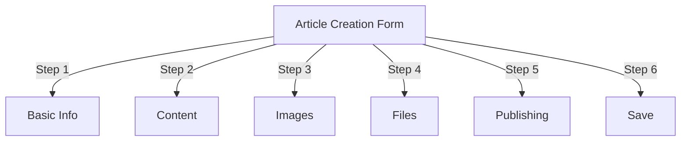
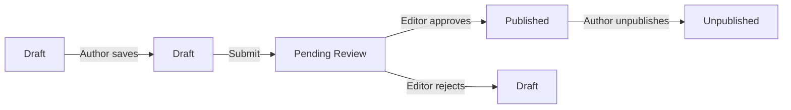
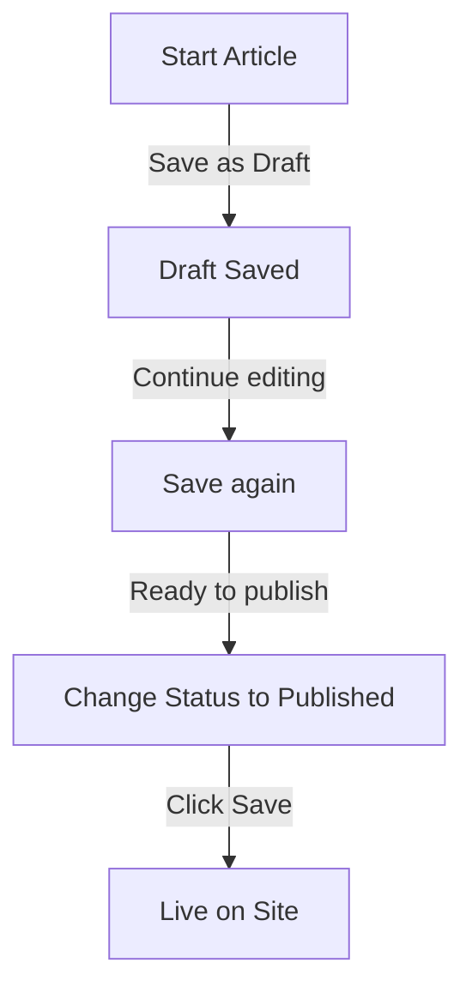

# Artikelen maken in Publisher

> Stapsgewijze handleiding voor het maken, bewerken, opmaken en publiceren van artikelen in de Uitgeversmodule.

---

## Toegang tot artikelbeheer

### Navigatie op het beheerderspaneel

```
Admin Panel
└── Modules
    └── Publisher
        └── Articles
            ├── Create New
            ├── Edit
            ├── Delete
            └── Publish
```

### Snelste pad

1. Log in als **Beheerder**
2. Klik op **Modules** in de beheerbalk
3. Zoek **Uitgever**
4. Klik op de link **Beheer**
5. Klik op **Artikelen** in het linkermenu
6. Klik op de knop **Artikel toevoegen**

---

## Formulier voor het maken van artikelen

### Basisinformatie

Wanneer u een nieuw artikel aanmaakt, vult u de volgende secties in:



---

## Stap 1: Basisinformatie

### Verplichte velden

#### Titel van artikel

```
Field: Title
Type: Text input (required)
Max length: 255 characters
Example: "Top 5 Tips for Better Photography"
```

**Richtlijnen:**
- Beschrijvend en specifiek
- Voeg trefwoorden toe voor SEO
- Vermijd ALL CAPS
- Houd minder dan 60 tekens aan voor de beste weergave

#### Categorie selecteren

```
Field: Category
Type: Dropdown (required)
Options: List of created categories
Example: Photography > Tutorials
```

**Tips:**
- Ouder- en subcategorieën beschikbaar
- Kies de meest relevante categorie
- Slechts één categorie per artikel
- Kan later gewijzigd worden

#### Ondertitel artikel (optioneel)

```
Field: Subtitle
Type: Text input (optional)
Max length: 255 characters
Example: "Learn photography fundamentals in 5 easy steps"
```

**Gebruik voor:**
- Samenvattende kop
- Teasertekst
- Uitgebreide titel

### Artikelbeschrijving

#### Korte beschrijving

```
Field: Short Description
Type: Textarea (optional)
Max length: 500 characters
```

**Doel:**
- Artikelvoorbeeldtekst
- Wordt weergegeven in categorielijst
- Gebruikt in zoekresultaten
- Metabeschrijving voor SEO

**Voorbeeld:**
```
"Discover essential photography techniques that will transform your photos
from ordinary to extraordinary. This comprehensive guide covers composition,
lighting, and exposure settings."
```

#### Volledige inhoud

```
Field: Article Body
Type: WYSIWYG Editor (required)
Max length: Unlimited
Format: HTML
```

Het hoofdartikelinhoudsgebied met rich-text-bewerking.

---

## Stap 2: Inhoud opmaken

### Met behulp van de WYSIWYG-editor

#### Tekstopmaak

```
Bold:           Ctrl+B or click [B] button
Italic:         Ctrl+I or click [I] button
Underline:      Ctrl+U or click [U] button
Strikethrough:  Alt+Shift+D or click [S] button
Subscript:      Ctrl+, (comma)
Superscript:    Ctrl+. (period)
```

#### Kopstructuur

Creëer de juiste documenthiërarchie:

```html
<h1>Article Title</h1>      <!-- Use once at top -->
<h2>Main Section</h2>        <!-- For major sections -->
<h3>Subsection</h3>          <!-- For subtopics -->
<h4>Sub-subsection</h4>      <!-- For details -->
```

**In de redactie:**
- Klik op de vervolgkeuzelijst **Formaat**
- Selecteer koersniveau (H1-H6)
- Typ uw kop

#### Lijsten

**Ongeordende lijst (opsommingstekens):**

```markdown
• Point one
• Point two
• Point three
```

Stappen in de editor:
1. Klik op de knop [≡] Lijst met opsommingstekens
2. Typ elk punt
3. Druk op Enter voor het volgende item
4. Druk tweemaal op Backspace om de lijst te beëindigen

**Geordende lijst (genummerd):**

```markdown
1. First step
2. Second step
3. Third step
```

Stappen in de editor:
1. Klik op [1.] Knop Genummerde lijst
2. Typ elk item
3. Druk op Enter voor volgende
4. Druk tweemaal op Backspace om te beëindigen

**Geneste lijsten:**

```markdown
1. Main point
   a. Sub-point
   b. Sub-point
2. Next point
```

Stappen:
1. Maak een eerste lijst
2. Druk op Tab om te laten inspringen
3. Geneste items maken
4. Druk op Shift+Tab om de inspringing te vergroten

#### Koppelingen

**Hyperlink toevoegen:**

1. Selecteer de tekst die u wilt koppelen
2. Klik op de knop **[🔗] Koppelen**
3. Voer URL in: `https://example.com`
4. Optioneel: Voeg titel/doel toe
5. Klik op **Link invoegen**

**Link verwijderen:**

1. Klik binnen gekoppelde tekst
2. Klik op de knop **[🔗] Link verwijderen**

#### Code en offertes

**Blokcitaat:**

```
"This is an important quote from an expert"
- Attribution
```

Stappen:
1. Typ de citaattekst
2. Klik op de knop **[❝] Blockquote**
3. Tekst is ingesprongen en opgemaakt

**Codeblok:**

```python
def hello_world():
    print("Hello, World!")
```

Stappen:
1. Klik op **Opmaak → Code**
2. Code plakken
3. Selecteer taal (optioneel)
4. Codeweergaven met syntaxisaccentuering

---

## Stap 3: Afbeeldingen toevoegen

### Uitgelichte afbeelding (heldenafbeelding)

```
Field: Featured Image / Main Image
Type: Image upload
Format: JPG, PNG, GIF, WebP
Max size: 5 MB
Recommended: 600x400 px
```

**Om te uploaden:**

1. Klik op de knop **Afbeelding uploaden**
2. Selecteer een afbeelding op de computer
3. Bijsnijden/formaat wijzigen indien nodig
4. Klik op **Deze afbeelding gebruiken**

**Afbeeldingplaatsing:**
- Wordt bovenaan het artikel weergegeven
- Gebruikt in categorielijsten
- Getoond in archief
- Gebruikt voor sociaal delen

### Inline-afbeeldingen

Afbeeldingen invoegen in artikeltekst:

1. Plaats de cursor in de editor waar de afbeelding moet komen
2. Klik op de knop **[🖼️] Afbeelding** in de werkbalk
3. Kies de uploadoptie:
   - Upload nieuwe afbeelding
   - Selecteer uit galerij
   - Voer afbeelding URL in
4. Configureer:
   
```
   Image Size:
   - Width: 300-600 px
   - Height: Auto (maintains ratio)
   - Alignment: Left/Center/Right
   
```
5. Klik op **Afbeelding invoegen**

**Tekst rond afbeelding omwikkelen:**

In de editor na het invoegen:

```html
<!-- Image floats left, text wraps around -->

```

### Afbeeldingengalerij

Galerij met meerdere afbeeldingen maken:

1. Klik op de knop **Galerij** (indien beschikbaar)
2. Meerdere afbeeldingen uploaden:
   - Enkele klik: voeg er een toe
   - Drag & drop: meerdere toevoegen
3. Ordenen door te slepen
4. Stel bijschriften in voor elke afbeelding
5. Klik op **Galerij maken**

---

## Stap 4: Bestanden bijvoegen

### Bestandsbijlagen toevoegen

```
Field: File Attachments
Type: File upload (multiple allowed)
Supported: PDF, DOC, XLS, ZIP, etc.
Max per file: 10 MB
Max per article: 5 files
```

**Om bij te voegen:**

1. Klik op de knop **Bestand toevoegen**
2. Selecteer een bestand op de computer
3. Optioneel: Voeg bestandsbeschrijving toe
4. Klik op **Bestand bijvoegen**
5. Herhaal dit voor meerdere bestanden

**Bestandsvoorbeelden:**
- PDF-handleidingen
- Excel-spreadsheets
- Word-documenten
- ZIP-archieven
- Broncode

### Beheer bijgevoegde bestanden

**Bewerk bestand:**1. Klik op bestandsnaam
2. Beschrijving bewerken
3. Klik op **Opslaan**

**Bestand verwijderen:**

1. Zoek het bestand in de lijst
2. Klik op het pictogram **[×] Verwijderen**
3. Bevestig het verwijderen

---

## Stap 5: Publiceren en status

### Artikelstatus

```
Field: Status
Type: Dropdown
Options:
  - Draft: Not published, only author sees
  - Pending: Waiting for approval
  - Published: Live on site
  - Archived: Old content
  - Unpublished: Was published, now hidden
```

**Statuswerkstroom:**



### Publicatieopties

#### Onmiddellijk publiceren

```
Status: Published
Start Date: Today (auto-filled)
End Date: (leave blank for no expiration)
```

#### Plan voor later

```
Status: Scheduled
Start Date: Future date/time
Example: February 15, 2024 at 9:00 AM
```

Het artikel wordt automatisch op een bepaald tijdstip gepubliceerd.

#### Vervaldatum instellen

```
Enable Expiration: Yes
Expiration Date: Future date
Action: Archive/Hide/Delete
Example: April 1, 2024 (article auto-archives)
```

### Zichtbaarheidsopties

```yaml
Show Article:
  - Display on front page: Yes/No
  - Show in category: Yes/No
  - Include in search: Yes/No
  - Include in recent articles: Yes/No

Featured Article:
  - Mark as featured: Yes/No
  - Featured section position: (number)
```

---

## Stap 6: SEO en metadata

### SEO-instellingen

```
Field: SEO Settings (Expand section)
```

#### Metabeschrijving

```
Field: Meta Description
Type: Text (160 characters recommended)
Used by: Search engines, social media

Example:
"Learn photography fundamentals in 5 easy steps.
Discover composition, lighting, and exposure techniques."
```

#### Meta-trefwoorden

```
Field: Meta Keywords
Type: Comma-separated list
Max: 5-10 keywords

Example: Photography, Tutorial, Composition, Lighting, Exposure
```

#### URL Naaktslak

```
Field: URL Slug (auto-generated from title)
Type: Text
Format: lowercase, hyphens, no spaces

Auto: "top-5-tips-for-better-photography"
Edit: Change before publishing
```

#### Open grafiektags

Automatisch gegenereerd op basis van artikelinformatie:
- Titel
- Beschrijving
- Uitgelichte afbeelding
- Artikel URL
- Publicatiedatum

Gebruikt door Facebook, LinkedIn, WhatsApp, enz.

---

## Stap 7: Opmerkingen en interactie

### Commentaarinstellingen

```yaml
Allow Comments:
  - Enable: Yes/No
  - Default: Inherit from preferences
  - Override: Specific to this article

Moderate Comments:
  - Require approval: Yes/No
  - Default: Inherit from preferences
```

### Beoordelingsinstellingen

```yaml
Allow Ratings:
  - Enable: Yes/No
  - Scale: 5 stars (default)
  - Show average: Yes/No
  - Show count: Yes/No
```

---

## Stap 8: Geavanceerde opties

### Auteur en naamregel

```
Field: Author
Type: Dropdown
Default: Current user
Options: All users with author permission

Display:
  - Show author name: Yes/No
  - Show author bio: Yes/No
  - Show author avatar: Yes/No
```

### Bewerkingsvergrendeling

```
Field: Edit Lock
Purpose: Prevent accidental changes

Lock Article:
  - Locked: Yes/No
  - Lock reason: "Final version"
  - Unlock date: (optional)
```

### Revisiegeschiedenis

Automatisch opgeslagen versies van artikel:

```
View Revisions:
  - Click "Revision History"
  - Shows all saved versions
  - Compare versions
  - Restore previous version
```

---

## Opslaan en publiceren

### Werkstroom opslaan



### Artikel opslaan

**Automatisch opslaan:**
- Wordt elke 60 seconden geactiveerd
- Wordt automatisch opgeslagen als concept
- Toont "Laatst opgeslagen: 2 minuten geleden"

**Handmatig opslaan:**
- Klik op **Opslaan en doorgaan** om door te gaan met bewerken
- Klik op **Opslaan en bekijken** om de gepubliceerde versie te zien
- Klik op **Opslaan** om op te slaan en te sluiten

### Artikel publiceren

1. Stel **Status** in: Gepubliceerd
2. Stel **Startdatum** in: Nu (of toekomstige datum)
3. Klik op **Opslaan** of **Publiceren**
4. Er verschijnt een bevestigingsbericht
5. Artikel is live (of gepland)

---

## Bestaande artikelen bewerken

### Toegang tot de artikeleditor

1. Ga naar **Beheerder → Uitgever → Artikelen**
2. Zoek het artikel in de lijst
3. Klik op het pictogram/de knop **Bewerken**
4. Breng wijzigingen aan
5. Klik op **Opslaan**

### Bulkbewerking

Meerdere artikelen tegelijk bewerken:

```
1. Go to Articles list
2. Select articles (checkboxes)
3. Choose "Bulk Edit" from dropdown
4. Change selected field
5. Click "Update All"

Available for:
  - Status
  - Category
  - Featured (Yes/No)
  - Author
```

### Voorbeeldartikel

Vóór publicatie:

1. Klik op de knop **Voorbeeld**
2. Bekijk zoals lezers zullen zien
3. Controleer de opmaak
4. Testkoppelingen
5. Keer terug naar de editor om aan te passen

---

## Artikelbeheer

### Bekijk alle artikelen

**Artikelenlijstweergave:**

```
Admin → Publisher → Articles

Columns:
  - Title
  - Category
  - Author
  - Status
  - Created date
  - Modified date
  - Actions (Edit, Delete, Preview)

Sorting:
  - By title (A-Z)
  - By date (newest/oldest)
  - By status (Published/Draft)
  - By category
```

### Artikelen filteren

```
Filter Options:
  - By category
  - By status
  - By author
  - By date range
  - Search by title

Example: Show all "Draft" articles by "John" in "News" category
```

### Artikel verwijderen

**Zacht verwijderen (aanbevolen):**

1. Wijzig **Status**: Niet gepubliceerd
2. Klik op **Opslaan**
3. Artikel verborgen maar niet verwijderd
4. Kan later worden hersteld

**Harde verwijdering:**

1. Selecteer een artikel in de lijst
2. Klik op de knop **Verwijderen**
3. Bevestig het verwijderen
4. Artikel definitief verwijderd

---

## Beste praktijken voor inhoud

### Kwaliteitsartikelen schrijven

```
Structure:
  ✓ Compelling title
  ✓ Clear subtitle/description
  ✓ Engaging opening paragraph
  ✓ Logical sections with headers
  ✓ Supporting visuals
  ✓ Conclusion/summary
  ✓ Call-to-action

Length:
  - Blog posts: 500-2000 words
  - News: 300-800 words
  - Guides: 2000-5000 words
  - Minimum: 300 words
```

### SEO Optimalisatie

```
Title Optimization:
  ✓ Include primary keyword
  ✓ Keep under 60 characters
  ✓ Put keyword near beginning
  ✓ Be descriptive and specific

Content Optimization:
  ✓ Use headings (H1, H2, H3)
  ✓ Include keyword in heading
  ✓ Use bold for important terms
  ✓ Add descriptive links
  ✓ Include images with alt text

Meta Description:
  ✓ Include primary keyword
  ✓ 155-160 characters
  ✓ Action-oriented
  ✓ Unique per article
```

### Opmaaktips

```
Readability:
  ✓ Short paragraphs (2-4 sentences)
  ✓ Bullet points for lists
  ✓ Subheadings every 300 words
  ✓ Generous whitespace
  ✓ Line breaks between sections

Visual Appeal:
  ✓ Featured image at top
  ✓ Inline images in content
  ✓ Alt text on all images
  ✓ Code blocks for technical
  ✓ Blockquotes for emphasis
```

---

## Sneltoetsen

### Editor-snelkoppelingen

```
Bold:               Ctrl+B
Italic:             Ctrl+I
Underline:          Ctrl+U
Link:               Ctrl+K
Save Draft:         Ctrl+S
```

### Tekstsnelkoppelingen

```
-- →  (dash to em dash)
... → … (three dots to ellipsis)
(c) → © (copyright)
(r) → ® (registered)
(tm) → ™ (trademark)
```

---

## Algemene taken

### Kopieer artikel

1. Artikel openen
2. Klik op de knop **Dupliceren** of **Klonen**
3. Artikel gekopieerd als concept
4. Titel en inhoud bewerken
5. Publiceer

### Schemaartikel

1. Artikel aanmaken
2. Stel **Startdatum** in: toekomstige datum/tijd
3. Stel **Status** in: Gepubliceerd
4. Klik op **Opslaan**
5. Artikel wordt automatisch gepubliceerd

### Batchpublicatie

1. Maak artikelen als concepten
2. Stel publicatiedatums in
3. Artikelen worden automatisch gepubliceerd op geplande tijden
4. Monitor vanuit de weergave "Gepland".

### Verplaatsen tussen categorieën

1. Artikel bewerken
2. Wijzig de vervolgkeuzelijst **Categorie**
3. Klik op **Opslaan**
4. Artikel verschijnt in nieuwe categorie

---

## Problemen oplossen

### Probleem: Kan artikel niet opslaan

**Oplossing:**
```
1. Check form for required fields
2. Verify category is selected
3. Check PHP memory limit
4. Try saving as draft first
5. Clear browser cache
```

### Probleem: Afbeeldingen worden niet weergegeven

**Oplossing:**
```
1. Verify image upload succeeded
2. Check image file format (JPG, PNG)
3. Verify image path in database
4. Check upload directory permissions
5. Try re-uploading image
```

### Probleem: Editor-werkbalk wordt niet weergegeven

**Oplossing:**
```
1. Clear browser cache
2. Try different browser
3. Disable browser extensions
4. Check JavaScript console for errors
5. Verify editor plugin installed
```

### Probleem: Artikel wordt niet gepubliceerd

**Oplossing:**
```
1. Verify Status = "Published"
2. Check Start Date is today or earlier
3. Verify permissions allow publishing
4. Check category is published
5. Clear module cache
```

---

## Gerelateerde gidsen

- Configuratiegids
- Categoriebeheer
- Toestemming instellen
- Aangepaste sjablonen

---

## Volgende stappen

- Maak uw eerste artikel
- Categorieën instellen
- Configureer machtigingen
- Beoordeel sjabloonaanpassing

---

#publisher #articles #content #creation #formatting #editing #xoops