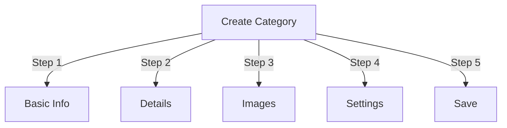

# Categorieën beheren in Publisher

> Volledige gids voor het maken, organiseren van hiërarchieën en het beheren van categorieën in de Uitgeversmodule.

---

## Categoriebasis

### Wat zijn categorieën?

Categorieën organiseren artikelen in logische groepen:

```
Example Structure:

  News (Main Category)
    ├── Technology
    ├── Sports
    └── Entertainment

  Tutorials (Main Category)
    ├── Photography
    │   ├── Basics
    │   └── Advanced
    └── Writing
        └── Blogging
```

### Voordelen van een goede categoriestructuur

```
✓ Better user navigation
✓ Organized content
✓ Improved SEO
✓ Easier content management
✓ Better editorial workflow
```

---

## Toegang tot categoriebeheer

### Navigatie op het beheerderspaneel

```
Admin Panel
└── Modules
    └── Publisher
        └── Categories
            ├── Create New
            ├── Edit
            ├── Delete
            ├── Permissions
            └── Organize
```

### Snelle toegang

1. Log in als **Beheerder**
2. Ga naar **Beheer → Modules**
3. Klik op **Uitgever → Beheerder**
4. Klik op **Categorieën** in het linkermenu

---

## Categorieën maken

### Formulier voor het maken van categorieën



### Stap 1: Basisinformatie

#### Categorienaam

```
Field: Category Name
Type: Text input (required)
Max length: 100 characters
Uniqueness: Should be unique
Example: "Photography"
```

**Richtlijnen:**
- Beschrijvend en consequent enkel- of meervoud
- Correct met hoofdletter geschreven
- Vermijd speciale tekens
- Houd het redelijk kort

#### Categorie Beschrijving

```
Field: Description
Type: Textarea (optional)
Max length: 500 characters
Used in: Category listing pages, category blocks
```

**Doel:**
- Verklaart categorie-inhoud
- Verschijnt boven de categorie artikelen
- Helpt gebruikers de reikwijdte te begrijpen
- Gebruikt voor SEO metabeschrijving

**Voorbeeld:**
```
"Photography tips, tutorials, and inspiration for
all skill levels. From composition basics to advanced
lighting techniques, master your craft."
```

### Stap 2: Bovenliggende categorie

#### Hiërarchie creëren

```
Field: Parent Category
Type: Dropdown
Options: None (root), or existing categories
```

**Hiërarchievoorbeelden:**

```
Flat Structure:
  News
  Tutorials
  Reviews

Nested Structure:
  News
    Technology
    Business
    Sports
  Tutorials
    Photography
      Basics
      Advanced
    Writing
```

**Maak subcategorie:**

1. Klik op de vervolgkeuzelijst **Bovenliggende categorie**
2. Selecteer ouder (bijvoorbeeld 'Nieuws')
3. Vul de categorienaam in
4. Opslaan
5. Nieuwe categorie verschijnt als kind

### Stap 3: Categorieafbeelding

#### Categorieafbeelding uploaden

```
Field: Category Image
Type: Image upload (optional)
Format: JPG, PNG, GIF, WebP
Max size: 5 MB
Recommended: 300x200 px (or your theme size)
```

**Om te uploaden:**

1. Klik op de knop **Afbeelding uploaden**
2. Selecteer een afbeelding op de computer
3. Bijsnijden/formaat wijzigen indien nodig
4. Klik op **Deze afbeelding gebruiken**

**Waar gebruikt:**
- Categorieoverzichtpagina
- Categorieblokkop
- Broodkruimel (sommige thema's)
- Delen op sociale media

### Stap 4: Categorie-instellingen

#### Weergave-instellingen

```yaml
Status:
  - Enabled: Yes/No
  - Hidden: Yes/No (hidden from menus, still accessible)

Display Options:
  - Show description: Yes/No
  - Show image: Yes/No
  - Show article count: Yes/No
  - Show subcategories: Yes/No

Layout:
  - Items per page: 10-50
  - Display order: Date/Title/Author
  - Display direction: Ascending/Descending
```

#### Categorierechten

```yaml
Who Can View:
  - Anonymous: Yes/No
  - Registered: Yes/No
  - Specific groups: Configure per group

Who Can Submit:
  - Registered: Yes/No
  - Specific groups: Configure per group
  - Author must have: "submit articles" permission
```

### Stap 5: SEO-instellingen

#### Metatags

```
Field: Meta Description
Type: Text (160 characters)
Purpose: Search engine description

Field: Meta Keywords
Type: Comma-separated list
Example: photography, tutorials, tips, techniques
```

#### URL-configuratie

```
Field: URL Slug
Type: Text
Auto-generated from category name
Example: "photography" from "Photography"
Can be customized before saving
```

### Categorie opslaan

1. Vul alle verplichte velden in:
   - Categorienaam ✓
   - Beschrijving (aanbevolen)
2. Optioneel: afbeelding uploaden, SEO instellen
3. Klik op **Categorie opslaan**
4. Er verschijnt een bevestigingsbericht
5. Categorie is nu beschikbaar

---

## Categoriehiërarchie

### Geneste structuur maken

```
Step-by-step example: Create News → Technology subcategory

1. Go to Categories admin
2. Click "Add Category"
3. Name: "News"
4. Parent: (leave blank - this is root)
5. Save
6. Click "Add Category" again
7. Name: "Technology"
8. Parent: "News" (select from dropdown)
9. Save
```

### Hiërarchieboom bekijken

```
Categories view shows tree structure:

📁 News
  📄 Technology
  📄 Sports
  📄 Entertainment
📁 Tutorials
  📄 Photography
    📄 Basics
    📄 Advanced
  📄 Writing
```

Klik op de pijlen uitvouwen om subcategorieën te tonen/verbergen.

### Categorieën reorganiseren

#### Categorie verplaatsen

1. Ga naar de categorieënlijst
2. Klik op **Bewerken** bij de categorie
3. Wijzig **Oudercategorie**
4. Klik op **Opslaan**
5. Categorie verplaatst naar nieuwe positie

#### Categorieën opnieuw rangschikken

Indien beschikbaar, gebruik slepen en neerzetten:

1. Ga naar de categorieënlijst
2. Klik en sleep de categorie
3. Ga naar een nieuwe positie
4. Bestelling wordt automatisch opgeslagen

#### Categorie verwijderen

**Optie 1: Zacht verwijderen (verbergen)**

1. Categorie bewerken
2. Stel **Status** in: Uitgeschakeld
3. Klik op **Opslaan**
4. Categorie verborgen maar niet verwijderd

**Optie 2: harde verwijdering**

1. Ga naar de categorieënlijst
2. Klik op **Verwijderen** bij de categorie
3. Kies actie voor artikelen:
   
```
   ☐ Move articles to parent category
   ☐ Move articles to root (News)
   ☐ Delete all articles in category
   
```
4. Bevestig het verwijderen

---

## Categoriebewerkingen

### Categorie bewerken

1. Ga naar **Beheerder → Uitgever → Categorieën**
2. Klik op **Bewerken** bij de categorie
3. Velden wijzigen:
   - Naam
   - Beschrijving
   - Oudercategorie
   - Afbeelding
   - Instellingen
4. Klik op **Opslaan**

### Categorierechten bewerken

1. Ga naar Categorieën
2. Klik op **Machtigingen** bij de categorie (of klik op categorie en klik vervolgens op Machtigingen)
3. Groepen configureren:

```
For each group:
  ☐ View articles in this category
  ☐ Submit articles to this category
  ☐ Edit own articles
  ☐ Edit all articles
  ☐ Approve/Moderate articles
  ☐ Manage category
```

4. Klik op **Machtigingen opslaan**

### Categorieafbeelding instellen

**Nieuwe afbeelding uploaden:**

1. Categorie bewerken
2. Klik op **Afbeelding wijzigen**
3. Upload of selecteer afbeelding
4. Bijsnijden/formaat wijzigen
5. Klik op **Afbeelding gebruiken**
6. Klik op **Categorie opslaan**

**Afbeelding verwijderen:**

1. Categorie bewerken
2. Klik op **Afbeelding verwijderen** (indien beschikbaar)
3. Klik op **Categorie opslaan**

---

## Categorierechten

### Toestemmingsmatrix

```
                 Anonymous  Registered  Editor  Admin
View category        ✓         ✓         ✓       ✓
Submit article       ✗         ✓         ✓       ✓
Edit own article     ✗         ✓         ✓       ✓
Edit all articles    ✗         ✗         ✓       ✓
Moderate articles    ✗         ✗         ✓       ✓
Manage category      ✗         ✗         ✗       ✓
```

### Machtigingen op categorieniveau instellen

#### Toegangscontrole per categorie

1. Ga naar de lijst **Categorieën**
2. Selecteer een categorie
3. Klik op **Machtigingen**
4. Selecteer voor elke groep machtigingen:

```
Example: News category
  Anonymous:   View only
  Registered:  Submit articles
  Editors:     Approve articles
  Admins:      Full control
```

5. Klik op **Opslaan**

#### Machtigingen op veldniveau

Bepaal welke formuliervelden gebruikers kunnen zien/bewerken:

```
Example: Limit field visibility for Registered users

Registered users can see/edit:
  ✓ Title
  ✓ Description
  ✓ Content
  ✗ Author (auto-set to current user)
  ✗ Scheduled date (only editors)
  ✗ Featured (only admins)
```

**Configureren in:**
- Categoriemachtigingen
- Zoek naar het gedeelte 'Veldzichtbaarheid'

---

## Beste praktijken voor categorieën

### Categoriestructuur
```
✓ Keep hierarchy 2-3 levels deep
✗ Don't create too many top-level categories
✗ Don't create categories with one article

✓ Use consistent naming (plural or singular)
✗ Don't use vague names ("Stuff", "Other")

✓ Create categories for articles that exist
✗ Don't create empty categories in advance
```

### Richtlijnen voor naamgeving

```
Good names:
  "Photography"
  "Web Development"
  "Travel Tips"
  "Business News"

Avoid:
  "Articles" (too vague)
  "Content" (redundant)
  "News&Updates" (inconsistent)
  "PHOTOGRAPHY STUFF" (formatting)
```

### Organisatietips

```
By Topic:
  News
    Technology
    Sports
    Entertainment

By Type:
  Tutorials
    Video
    Text
    Interactive

By Audience:
  For Beginners
  For Experts
  Case Studies

Geographic:
  North America
    United States
    Canada
  Europe
```

---

## Categorieblokken

### Uitgeverscategorieblok

Geef categorievermeldingen op uw site weer:

1. Ga naar **Beheer → Blokken**
2. Zoek **Uitgever - Categorieën**
3. Klik op **Bewerken**
4. Configureer:

```
Block Title: "News Categories"
Show subcategories: Yes/No
Show article count: Yes/No
Height: (pixels or auto)
```

5. Klik op **Opslaan**

### Categorie Artikelen Blok

Toon de nieuwste artikelen uit een specifieke categorie:

1. Ga naar **Beheer → Blokken**
2. Zoek **Uitgever - Categorieartikelen**
3. Klik op **Bewerken**
4. Selecteer:

```
Category: News (or specific category)
Number of articles: 5
Show images: Yes/No
Show description: Yes/No
```

5. Klik op **Opslaan**

---

## Categorieanalyse

### Categoriestatistieken bekijken

Van Categorieënbeheerder:

```
Each category shows:
  - Total articles: 45
  - Published: 42
  - Draft: 2
  - Pending approval: 1
  - Total views: 5,234
  - Latest article: 2 hours ago
```

### Bekijk categorieverkeer

Als analyses zijn ingeschakeld:

1. Klik op categorienaam
2. Klik op het tabblad **Statistieken**
3. Bekijk:
   - Paginaweergaven
   - Populaire artikelen
   - Verkeerstrends
   - Gebruikte zoektermen

---

## Categoriesjablonen

### Categorieweergave aanpassen

Als u aangepaste sjablonen gebruikt, kan elke categorie het volgende overschrijven:

```
publisher_category.tpl
  ├── Category header
  ├── Category description
  ├── Category image
  ├── Article listing
  └── Pagination
```

**Om aan te passen:**

1. Kopieer het sjabloonbestand
2. Wijzig HTML/CSS
3. Wijs toe aan categorie in admin
4. Categorie maakt gebruik van een aangepast sjabloon

---

## Algemene taken

### Maak een nieuwshiërarchie

```
Admin → Publisher → Categories
1. Create "News" (parent)
2. Create "Technology" (parent: News)
3. Create "Sports" (parent: News)
4. Create "Entertainment" (parent: News)
```

### Verplaats artikelen tussen categorieën

1. Ga naar het beheer van **Artikelen**
2. Artikelen selecteren (keuzevakjes)
3. Selecteer **"Categorie wijzigen"** in de vervolgkeuzelijst voor bulkacties
4. Kies een nieuwe categorie
5. Klik op **Alles bijwerken**

### Categorie verbergen zonder te verwijderen

1. Categorie bewerken
2. Stel **Status** in: Uitgeschakeld/Verborgen
3. Opslaan
4. Categorie niet weergegeven in menu's (nog steeds toegankelijk via URL)

### Categorie voor concepten maken

```
Best Practice:

Create "In Review" category
  ├── Purpose: Articles awaiting approval
  ├── Permissions: Hidden from public
  ├── Only admins/editors can see
  ├── Move articles here until approved
  └── Move to "News" when published
```

---

## Categorieën importeren/exporteren

### Categorieën exporteren

Indien beschikbaar:

1. Ga naar het **Categorieën**-beheer
2. Klik op **Exporteren**
3. Formaat selecteren: CSV/JSON/XML
4. Bestand downloaden
5. Back-up opgeslagen

### Categorieën importeren

Indien beschikbaar:

1. Bereid een bestand met categorieën voor
2. Ga naar het **Categorieën**-beheer
3. Klik op **Importeren**
4. Bestand uploaden
5. Kies updatestrategie:
   - Maak alleen nieuwe aan
   - Bestaande bijwerken
   - Vervang alles
6. Klik op **Importeren**

---

## Categorieën voor probleemoplossing

### Probleem: Subcategorieën worden niet weergegeven

**Oplossing:**
```
1. Verify parent category status is "Enabled"
2. Check permissions allow viewing
3. Verify subcategories have status "Enabled"
4. Clear cache: Admin → Tools → Clear Cache
5. Check theme shows subcategories
```

### Probleem: Kan categorie niet verwijderen

**Oplossing:**
```
1. Category must have no articles
2. Move or delete articles first:
   Admin → Articles
   Select articles in category
   Change category to another
3. Then delete empty category
4. Or choose "move articles" option when deleting
```

### Probleem: Categorieafbeelding wordt niet weergegeven

**Oplossing:**
```
1. Verify image uploaded successfully
2. Check image file format (JPG, PNG)
3. Verify upload directory permissions
4. Check theme displays category images
5. Try re-uploading image
6. Clear browser cache
```

### Probleem: Machtigingen worden niet van kracht

**Oplossing:**
```
1. Check group permissions in Category
2. Check global Publisher permissions
3. Check user belongs to configured group
4. Clear session cache
5. Log out and log back in
6. Check permission modules installed
```

---

## Checklist voor beste praktijken voor categorieën

Voordat u categorieën implementeert:

- [ ] De hiërarchie is 2-3 niveaus diep
- [ ] Elke categorie heeft 5+ artikelen
- [ ] Categorienamen zijn consistent
- [ ] Machtigingen zijn passend
- [ ] Categorieafbeeldingen zijn geoptimaliseerd
- [ ] Beschrijvingen zijn voltooid
- [ ] SEO-metagegevens ingevuld
- [ ] URL's zijn vriendelijk
- [ ] Categorieën getest op front-end
- [ ] Documentatie bijgewerkt

---

## Gerelateerde gidsen

- Artikelcreatie
- Toestemmingsbeheer
- Moduleconfiguratie
- Installatiehandleiding

---

## Volgende stappen

- Maak artikelen in categorieën
- Configureer machtigingen
- Aanpassen met aangepaste sjablonen

---

#uitgever #categories #organisatie #hiërarchie #management #xoops