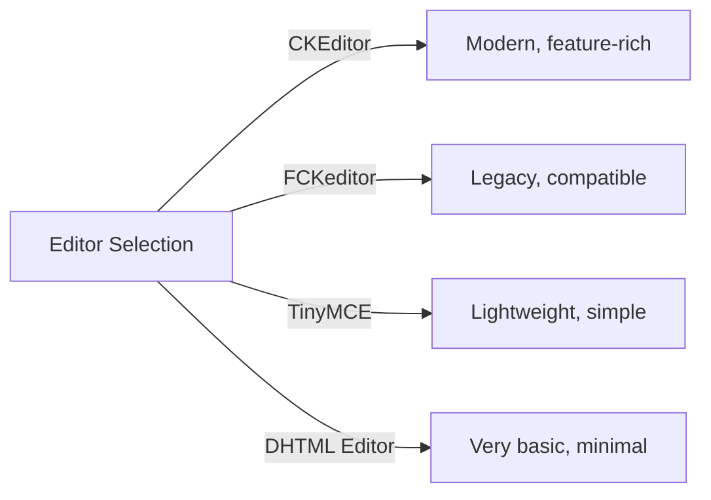
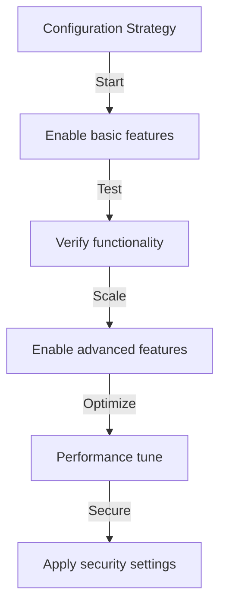

# Basisconfiguratie van uitgever

> Configureer de instellingen, voorkeuren en algemene opties van de Publisher-module voor uw XOOPS-installatie.

---

## Toegang tot configuratie

### Navigatie op het beheerderspaneel

```
XOOPS Admin Panel
└── Modules
    └── Publisher
        ├── Preferences
        ├── Settings
        └── Configuration
```

1. Log in als **Beheerder**
2. Ga naar **Beheerderspaneel → Modules**
3. Zoek de module **Uitgever**
4. Klik op de link **Voorkeuren** of **Beheerder**

---

## Algemene instellingen

### Toegang tot configuratie

```
Admin Panel → Modules → Publisher
```

Klik op het **tandwielpictogram** of **Instellingen** voor deze opties:

#### Weergaveopties

| Instelling | Opties | Standaard | Beschrijving |
|---------|---------|---------|------------|
| **Artikelen per pagina** | 5-50 | 10 | Artikelen getoond in lijsten |
| **Toon broodkruimel** | Ja/Nee | Ja | Weergave navigatiepad |
| **Gebruik paging** | Ja/Nee | Ja | Lange lijsten pagineren |
| **Toon datum** | Ja/Nee | Ja | Artikeldatum weergeven |
| **Categorie weergeven** | Ja/Nee | Ja | Artikelcategorie weergeven |
| **Auteur tonen** | Ja/Nee | Ja | Toon artikelauteur |
| **Bezichtigingen weergeven** | Ja/Nee | Ja | Aantal artikelweergaven weergeven |

**Voorbeeldconfiguratie:**

```yaml
Items Per Page: 15
Show Breadcrumb: Yes
Use Paging: Yes
Show Date: Yes
Show Category: Yes
Show Author: Yes
Show Views: Yes
```

#### Auteuropties

| Instelling | Standaard | Beschrijving |
|---------|---------|------------|
| **Toon auteursnaam** | Ja | Echte naam of gebruikersnaam weergeven |
| **Gebruik gebruikersnaam** | Nee | Toon gebruikersnaam in plaats van naam |
| **E-mailadres van auteur weergeven** | Nee | Contact-e-mailadres auteur weergeven |
| **Toon auteuravatar** | Ja | Gebruikersavatar weergeven |

---

## Editorconfiguratie

### Selecteer WYSIWYG-editor

Uitgever ondersteunt meerdere editors:

#### Beschikbare editors



### CKEditor (aanbevolen)

**Beste voor:** De meeste gebruikers, moderne browsers, volledige functies

1. Ga naar **Voorkeuren**
2. Stel **Editor**: CKEditor in
3. Opties configureren:

```
Editor: CKEditor 4.x
Toolbar: Full
Height: 400px
Width: 100%
Remove plugins: []
Add plugins: [mathjax, codesnippet]
```

### FCKeditor

**Beste voor:** Compatibiliteit, oudere systemen

```
Editor: FCKeditor
Toolbar: Default
Custom config: (optional)
```

### TinyMCE

**Beste voor:** Minimale footprint, eenvoudige bewerking

```
Editor: TinyMCE
Plugins: [paste, table, link, image]
Toolbar: minimal
```

---

## Bestands- en uploadinstellingen

### Uploadmappen configureren

```
Admin → Publisher → Preferences → Upload Settings
```

#### Instellingen voor bestandstype

```yaml
Allowed File Types:
  Images:
    - jpg
    - jpeg
    - gif
    - png
    - webp
  Documents:
    - pdf
    - doc
    - docx
    - xls
    - xlsx
    - ppt
    - pptx
  Archives:
    - zip
    - rar
    - 7z
  Media:
    - mp3
    - mp4
    - webm
    - mov
```

#### Limieten bestandsgrootte

| Bestandstype | Maximale grootte | Opmerkingen |
|-----------|----------|-------|
| **Afbeeldingen** | 5MB | Per afbeeldingsbestand |
| **Documenten** | 10MB | PDF, Office-bestanden |
| **Media** | 50 MB | Video-/audiobestanden |
| **Alle bestanden** | 100MB | Totaal per upload |

**Configuratie:**

```
Max Image Upload Size: 5 MB
Max Document Upload Size: 10 MB
Max Media Upload Size: 50 MB
Total Upload Size: 100 MB
Max Files per Article: 5
```

### Formaat van afbeelding wijzigen

Uitgever past automatisch het formaat van afbeeldingen aan voor consistentie:

```yaml
Thumbnail Size:
  Width: 150
  Height: 150
  Mode: Crop/Resize

Category Image Size:
  Width: 300
  Height: 200
  Mode: Resize

Article Featured Image:
  Width: 600
  Height: 400
  Mode: Resize
```

---

## Commentaar- en interactie-instellingen

### Opmerkingen Configuratie

```
Preferences → Comments Section
```

#### Commentaaropties

```yaml
Allow Comments:
  - Enabled: Yes/No
  - Default: Yes
  - Per-article override: Yes

Comment Moderation:
  - Moderate comments: Yes/No
  - Moderate guest comments only: Yes/No
  - Spam filter: Enabled
  - Max comments per day: (unlimited)

Comment Display:
  - Display format: Threaded/Flat
  - Comments per page: 10
  - Date format: Full date/Time ago
  - Show comment count: Yes/No
```

### Beoordelingsconfiguratie

```yaml
Allow Ratings:
  - Enabled: Yes/No
  - Default: Yes
  - Per-article override: Yes

Rating Options:
  - Rating scale: 5 stars (default)
  - Allow user to rate own: No
  - Show average rating: Yes
  - Show rating count: Yes
```

---

## SEO & URL-instellingen

### Zoekmachineoptimalisatie

```
Preferences → SEO Settings
```

#### URL-configuratie

```yaml
SEO URLs:
  - Enabled: No (set to Yes for SEO URLs)
  - URL rewriting: None/Apache mod_rewrite/IIS rewrite

URL Format:
  - Category: /category/news
  - Article: /article/welcome-to-site
  - Archive: /archive/2024/01

Meta Description:
  - Auto-generate: Yes
  - Max length: 160 characters

Meta Keywords:
  - Auto-generate: Yes
  - From: Article tags, title
```

### SEO-URL's inschakelen (geavanceerd)

**Vereisten:**
- Apache met `mod_rewrite` ingeschakeld
- `.htaccess`-ondersteuning ingeschakeld

**Configuratiestappen:**

1. Ga naar **Voorkeuren → SEO-instellingen**
2. **SEO URL's** instellen: Ja
3. Stel **URL Herschrijven** in: Apache mod_rewrite
4. Controleer of het `.htaccess`-bestand aanwezig is in de Publisher-map

**.htaccess-configuratie:**

```apache
<IfModule mod_rewrite.c>
    RewriteEngine On
    RewriteBase /modules/publisher/

    # Category rewrites
    RewriteRule ^category/([0-9]+)-(.*)\.html$ index.php?op=showcategory&categoryid=$1 [L,QSA]

    # Article rewrites
    RewriteRule ^article/([0-9]+)-(.*)\.html$ index.php?op=showitem&itemid=$1 [L,QSA]

    # Archive rewrites
    RewriteRule ^archive/([0-9]+)/([0-9]+)/$ index.php?op=archive&year=$1&month=$2 [L,QSA]
</IfModule>
```

---

## Cache en prestaties

### Caching-configuratie

```
Preferences → Cache Settings
```

```yaml
Enable Caching:
  - Enabled: Yes
  - Cache type: File (or Memcache)

Cache Lifetime:
  - Category lists: 3600 seconds (1 hour)
  - Article lists: 1800 seconds (30 minutes)
  - Single article: 7200 seconds (2 hours)
  - Recent articles block: 900 seconds (15 minutes)

Cache Clear:
  - Manual clear: Available in admin
  - Auto-clear on article save: Yes
  - Clear on category change: Yes
```

### Cache wissen

**Handmatig cache wissen:**

1. Ga naar **Beheer → Uitgever → Tools**
2. Klik op **Cache wissen**
3. Selecteer cachetypen om te wissen:
   - [ ] Categoriecache
   - [ ] Artikelcache
   - [ ] Cache blokkeren
   - [ ] Alle cache
4. Klik op **Selectie wissen**

**Opdrachtregel:**

```bash
# Clear all Publisher cache
php /path/to/xoops/admin/cache_manage.php publisher

# Or directly delete cache files
rm -rf /path/to/xoops/var/cache/publisher/*
```

---

## Melding en workflow

### E-mailmeldingen

```
Preferences → Notifications
```

```yaml
Notify Admin on New Article:
  - Enabled: Yes
  - Recipient: Admin email
  - Include summary: Yes

Notify Moderators:
  - Enabled: Yes
  - On new submission: Yes
  - On pending articles: Yes

Notify Author:
  - On approval: Yes
  - On rejection: Yes
  - On comment: No (optional)
```

### Werkstroom voor indiening

```yaml
Require Approval:
  - Enabled: Yes
  - Editor approval: Yes
  - Admin approval: No

Draft Save:
  - Auto-save interval: 60 seconds
  - Save local versions: Yes
  - Revision history: Last 5 versions
```

---

## Inhoudsinstellingen

### Standaardinstellingen voor publicatie

```
Preferences → Content Settings
```

```yaml
Default Article Status:
  - Draft/Published: Draft
  - Featured by default: No
  - Auto-publish time: None

Default Visibility:
  - Public/Private: Public
  - Show on front page: Yes
  - Show in categories: Yes

Scheduled Publishing:
  - Enabled: Yes
  - Allow per-article: Yes

Content Expiration:
  - Enabled: No
  - Auto-archive old: No
  - Archive after days: (unlimited)
```

### WYSIWYG Inhoudsopties

```yaml
Allow HTML:
  - In articles: Yes
  - In comments: No

Allow Embedded Media:
  - Videos (iframe): Yes
  - Images: Yes
  - Plugins: No

Content Filtering:
  - Strip tags: No
  - XSS filter: Yes (recommended)
```

---

## Zoekmachine-instellingen

### Zoekintegratie configureren

```
Preferences → Search Settings
```

```yaml
Enable Article Indexing:
  - Include in site search: Yes
  - Index type: Full text/Title only

Search Options:
  - Search in titles: Yes
  - Search in content: Yes
  - Search in comments: Yes

Meta Tags:
  - Auto generate: Yes
  - OG tags (social): Yes
  - Twitter cards: Yes
```

---

## Geavanceerde instellingen

### Foutopsporingsmodus (alleen ontwikkeling)

```
Preferences → Advanced
```

```yaml
Debug Mode:
  - Enabled: No (only for development!)

Development Features:
  - Show SQL queries: No
  - Log errors: Yes
  - Error email: admin@example.com
```

### Database-optimalisatie

```
Admin → Tools → Optimize Database
```

```bash
# Manual optimization
mysql> OPTIMIZE TABLE publisher_items;
mysql> OPTIMIZE TABLE publisher_categories;
mysql> OPTIMIZE TABLE publisher_comments;
```

---

## Moduleaanpassing

### Themasjablonen

```
Preferences → Display → Templates
```

Sjablonenset selecteren:
- Standaard
- Klassiek
- Modern
- Donker
- Op maatElke sjabloon regelt:
- Artikelindeling
- Categorielijst
- Archiefweergave
- Commentaarweergave

---

## Configuratietips

### Beste praktijken



1. **Begin eenvoudig** - Schakel eerst de kernfuncties in
2. **Test elke wijziging** - Controleer voordat u verder gaat
3. **Caching inschakelen** - Verbetert de prestaties
4. **Eerst een back-up maken** - Instellingen exporteren vóór grote wijzigingen
5. **Monitorlogboeken** - Controleer de foutlogboeken regelmatig

### Prestatieoptimalisatie

```yaml
For Better Performance:
  - Enable caching: Yes
  - Cache lifetime: 3600 seconds
  - Limit items per page: 10-15
  - Compress images: Yes
  - Minify CSS/JS: Yes (if available)
```

### Beveiligingsverscherping

```yaml
For Better Security:
  - Moderate comments: Yes
  - Disable HTML in comments: Yes
  - XSS filtering: Yes
  - File type whitelist: Strict
  - Max upload size: Reasonable limit
```

---

## Instellingen exporteren/importeren

### Back-upconfiguratie

```
Admin → Tools → Export Settings
```

**Om een back-up te maken van de huidige configuratie:**

1. Klik op **Configuratie exporteren**
2. Sla het gedownloade `.cfg`-bestand op
3. Op een veilige plaats bewaren

**Om te herstellen:**

1. Klik op **Configuratie importeren**
2. Selecteer het `.cfg`-bestand
3. Klik op **Herstellen**

---

## Gerelateerde configuratiehandleidingen

- Categoriebeheer
- Artikelcreatie
- Toestemmingsconfiguratie
- Installatiehandleiding

---

## Problemen oplossen met configuratie

### Instellingen kunnen niet worden opgeslagen

**Oplossing:**
1. Controleer de maprechten op `/var/config/`
2. Controleer de schrijftoegang tot PHP
3. Controleer het PHP-foutenlogboek op problemen
4. Wis de browsercache en probeer het opnieuw

### Editor verschijnt niet

**Oplossing:**
1. Controleer of de editorplug-in is geïnstalleerd
2. Controleer de configuratie van de XOOPS-editor
3. Probeer een andere editoroptie
4. Controleer de browserconsole op JavaScript-fouten

### Prestatieproblemen

**Oplossing:**
1. Schakel caching in
2. Verminder items per pagina
3. Comprimeer afbeeldingen
4. Controleer de databaseoptimalisatie
5. Bekijk het trage querylogboek

---

## Volgende stappen

- Configureer groepsrechten
- Maak uw eerste artikel
- Categorieën instellen
- Aangepaste sjablonen bekijken

---

#publisher #configuratie #preferences #settings #xoops