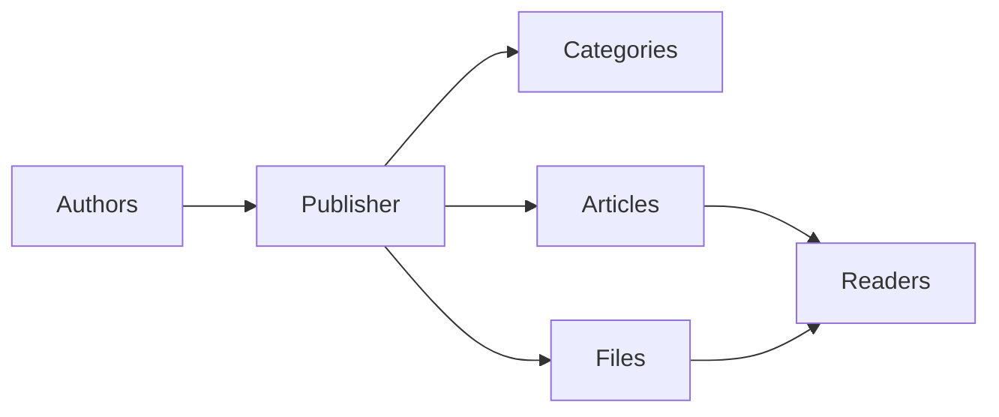
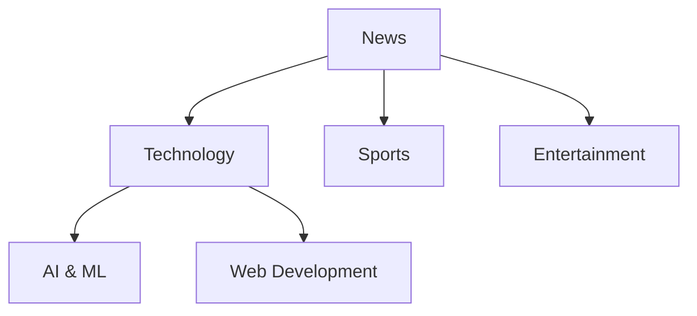
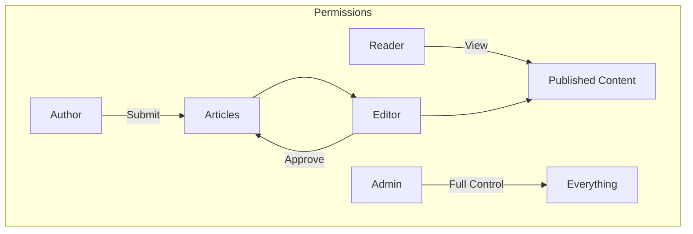
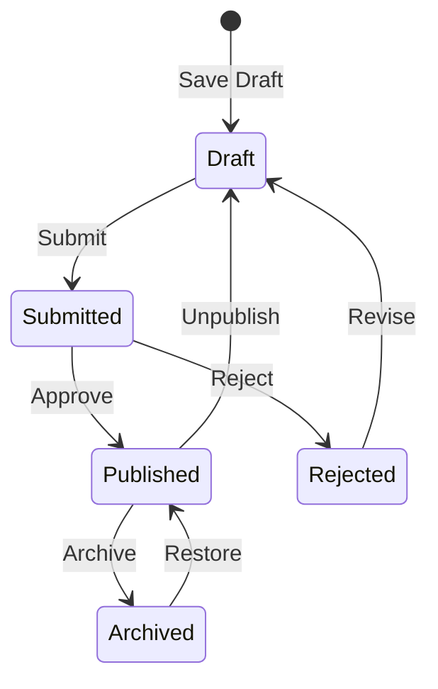

# Aan de slag met Publisher

> Een stapsgewijze handleiding voor het instellen en gebruiken van de Publisher-nieuws-/blogmodule.

---

## Wat is Uitgever?

Publisher is de belangrijkste contentbeheermodule voor XOOPS, ontworpen voor:

- **Nieuwssites** - Publiceer artikelen met categorieën
- **Blogs** - Bloggen met persoonlijke of meerdere auteurs``
- **Documentatie** - Georganiseerde kennisbanken
- **Inhoudsportals** - Gemengde media-inhoud



---

## Snelle installatie

### Stap 1: Installeer Publisher

1. Downloaden van [GitHub](https://github.com/XoopsModules25x/publisher)
2. Uploaden naar `modules/publisher/`
3. Ga naar Beheer → Modules → Installeren

### Stap 2: Categorieën maken



1. Beheerder → Uitgever → Categorieën
2. Klik op 'Categorie toevoegen'
3. Vul in:
   - **Naam**: Categorienaam
   - **Beschrijving**: wat deze categorie bevat
   - **Afbeelding**: optionele categorieafbeelding
4. Machtigingen instellen (wie kan indienen/bekijken)
5. Opslaan

### Stap 3: Instellingen configureren

1. Beheerder → Uitgever → Voorkeuren
2. Belangrijkste instellingen om te configureren:

| Instelling | Aanbevolen | Beschrijving |
|---------|-------------|------------|
| Artikelen per pagina | 10-20 | Artikelen over index |
| Redacteur | TinyMCE/CKEditor | Richtext-editor |
| Beoordelingen toestaan ​​| Ja | Feedback van lezers |
| Reacties toestaan ​​| Ja | Discussies |
| Automatisch goedkeuren | Nee | Redactionele controle |

### Stap 4: Maak uw eerste artikel

1. Hoofdmenu → Uitgever → Artikel indienen
2. Vul het formulier in:
   - **Titel**: kop van het artikel
   - **Categorie**: waar het thuishoort
   - **Samenvatting**: korte beschrijving
   - **Body**: volledige artikelinhoud
3. Voeg optionele elementen toe:
   - Uitgelichte afbeelding
   - Bestandsbijlagen
   - SEO-instellingen
4. Ter beoordeling indienen of publiceren

---

## Gebruikersrollen



### Lezer
- Bekijk gepubliceerde artikelen
- Beoordeel en geef commentaar
- Zoek inhoud

### Auteur
- Dien nieuwe artikelen in
- Eigen artikelen bewerken
- Bestanden bijvoegen

### Redacteur
- Inzendingen goedkeuren/afwijzen
- Bewerk elk artikel
- Beheer categorieën

### Beheerder
- Volledige modulecontrole
- Configureer instellingen
- Beheer machtigingen

---

## Artikelen schrijven

### Artikeleditor

```
┌─────────────────────────────────────────────────────┐
│ Title: [Your Article Title                        ] │
├─────────────────────────────────────────────────────┤
│ Category: [Select Category          ▼]              │
├─────────────────────────────────────────────────────┤
│ Summary:                                            │
│ ┌─────────────────────────────────────────────────┐ │
│ │ Brief description shown in listings...          │ │
│ └─────────────────────────────────────────────────┘ │
├─────────────────────────────────────────────────────┤
│ Body:                                               │
│ ┌─────────────────────────────────────────────────┐ │
│ │ [B] [I] [U] [Link] [Image] [Code]               │ │
│ ├─────────────────────────────────────────────────┤ │
│ │                                                  │ │
│ │ Full article content goes here...               │ │
│ │                                                  │ │
│ └─────────────────────────────────────────────────┘ │
├─────────────────────────────────────────────────────┤
│ [Submit] [Preview] [Save Draft]                     │
└─────────────────────────────────────────────────────┘
```

### Beste praktijken

1. **Boeiende titels** - Duidelijke, boeiende koppen
2. **Goede samenvattingen** - Verleid lezers om te klikken
3. **Gestructureerde inhoud** - Gebruik kopjes, lijsten, afbeeldingen
4. **Juiste categorisering** - Help lezers inhoud te vinden
5. **SEO-optimalisatie** - Trefwoorden in titel en inhoud

---

## Inhoud beheren

### Artikelstatusstroom



### Statusbeschrijvingen

| Staat | Beschrijving |
|--------|-------------|
| Ontwerp | Werk in uitvoering |
| Ingediend | In afwachting van beoordeling |
| Gepubliceerd | Live ter plaatse |
| Verlopen | Verleden vervaldatum |
| Afgewezen | Revisie nodig |
| Gearchiveerd | Verwijderd uit aanbiedingen |

---

## Navigatie

### Toegang tot uitgever

- **Hoofdmenu** → Uitgever
- **Direct URL**: `yoursite.com/modules/publisher/`

### Sleutelpagina's

| Pagina | URL | Doel |
|------|-----|---------|
| Indexering | `/modules/publisher/` | Artikelvermeldingen |
| Categorie | `/modules/publisher/category.php?id=X` | Categorie artikelen |
| Artikel | `/modules/publisher/item.php?itemid=X` | Enkel artikel |
| Verzenden | `/modules/publisher/submit.php` | Nieuw artikel |
| Zoeken | `/modules/publisher/search.php` | Vind artikelen |

---

## Blokken

Publisher biedt verschillende blokken voor uw site:

### Recente artikelen
Toont de laatst gepubliceerde artikelen

### Categoriemenu
Navigatie per categorie

### Populaire artikelen
Meest bekeken inhoud

### Willekeurig artikel
Laat willekeurige inhoud zien

### Spotlight
Uitgelichte artikelen

---

## Gerelateerde documentatie

- Artikelen maken en bewerken
- Categorieën beheren
- Uitgever uitbreiden

---

#xoops #publisher #user-guide #aan de slag #CMS