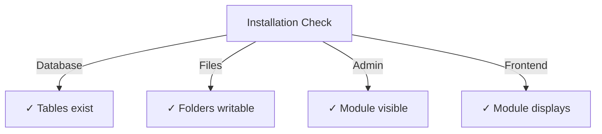

# Installatiehandleiding voor uitgevers

> Volledige instructies voor het installeren en configureren van de Publisher-module voor XOOPS CMS.

---

## Systeemvereisten

### Minimale vereisten

| Vereiste | Versie | Opmerkingen |
|------------|---------|-------|
| XOOPS | 2.5.10+ | Kern CMS-platform |
| PHP | 7,1+ | PHP 8.x aanbevolen |
| MySQL | 5,7+ | Databaseserver |
| Webserver | Apache/Nginx | Met herschrijfondersteuning |

### PHP-extensies

```
- PDO (PHP Data Objects)
- pdo_mysql or mysqli
- mb_string (multibyte strings)
- curl (for external content)
- json
- gd (image processing)
```

### Schijfruimte

- **Modulebestanden**: ~5 MB
- **Cachemap**: 50+ MB aanbevolen
- **Uploaddirectory**: indien nodig voor inhoud

---

## Controlelijst vóór installatie

Controleer het volgende voordat u Publisher installeert:

- [ ] XOOPS-kern is geïnstalleerd en actief
- [ ] Beheerdersaccount heeft machtigingen voor modulebeheer
- [ ] Databaseback-up gemaakt
- [ ] Bestandsrechten staan schrijftoegang tot de map `/modules/` toe
- [ ] PHP geheugenlimiet is minimaal 128 MB
- [ ] Limieten voor de bestandsuploadgrootte zijn van toepassing (min. 10 MB)

---

## Installatiestappen

### Stap 1: Uitgever downloaden

#### Optie A: Van GitHub (aanbevolen)

```bash
# Navigate to modules directory
cd /path/to/xoops/htdocs/modules/

# Clone the repository
git clone https://github.com/XoopsModules25x/publisher.git

# Verify download
ls -la publisher/
```

#### Optie B: Handmatig downloaden

1. Ga naar [GitHub Publisher Releases](https://github.com/XoopsModules25x/publisher/releases)
2. Download het nieuwste `.zip`-bestand
3. Uitpakken naar `modules/publisher/`

### Stap 2: Bestandsrechten instellen

```bash
# Set proper ownership
chown -R www-data:www-data /path/to/xoops/htdocs/modules/publisher

# Set directory permissions (755)
find publisher -type d -exec chmod 755 {} \;

# Set file permissions (644)
find publisher -type f -exec chmod 644 {} \;

# Make scripts executable
chmod 755 publisher/admin/index.php
chmod 755 publisher/index.php
```

### Stap 3: Installeren via XOOPS Admin

1. Meld u als beheerder aan bij **XOOPS beheerdersdashboard**
2. Navigeer naar **Systeem → Modules**
3. Klik op **Module installeren**
4. Zoek **Uitgever** in de lijst
5. Klik op de knop **Installeren**
6. Wacht tot de installatie is voltooid (toont aangemaakte databasetabellen)

```
Installation Progress:
✓ Tables created
✓ Configuration initialized
✓ Permissions set
✓ Cache cleared
Installation Complete!
```

---

## Initiële installatie

### Stap 1: Toegang tot uitgeversbeheer

1. Ga naar **Beheerderspaneel → Modules**
2. Zoek de module **Uitgever**
3. Klik op de link **Beheer**
4. U bevindt zich nu in Uitgeversbeheer

### Stap 2: Modulevoorkeuren configureren

1. Klik op **Voorkeuren** in het linkermenu
2. Basisinstellingen configureren:

```
General Settings:
- Editor: Select your WYSIWYG editor
- Items per page: 10
- Show breadcrumb: Yes
- Allow comments: Yes
- Allow ratings: Yes

SEO Settings:
- SEO URLs: No (enable later if needed)
- URL rewriting: None

Upload Settings:
- Max upload size: 5 MB
- Allowed file types: jpg, png, gif, pdf, doc, docx
```

3. Klik op **Instellingen opslaan**

### Stap 3: Maak een eerste categorie

1. Klik op **Categorieën** in het linkermenu
2. Klik op **Categorie toevoegen**
3. Formulier invullen:

```
Category Name: News
Description: Latest news and updates
Image: (optional) Upload category image
Parent Category: (leave blank for top-level)
Status: Enabled
```

4. Klik op **Categorie opslaan**

### Stap 4: Controleer de installatie

Controleer deze indicatoren:



#### Databasecontrole

```bash
mysql -u xoops_user -p xoops_database
mysql> SHOW TABLES LIKE 'publisher%';

# Should show tables:
# - publisher_categories
# - publisher_items
# - publisher_comments
# - publisher_files
```

#### Front-endcontrole

1. Bezoek uw XOOPS-startpagina
2. Zoek naar het blok **Uitgever** of **Nieuws**
3. Moet recente artikelen weergeven

---

## Configuratie na installatie

### Editorselectie

Publisher ondersteunt meerdere WYSIWYG-editors:

| Redacteur | Pluspunten | Nadelen |
|--------|------|------|
| FCKeditor | Functierijk | Ouder, groter |
| CKEditor | Moderne standaard | Complexiteit configureren |
| TinyMCE | Lichtgewicht | Beperkte functies |
| DHTML-editor | Basis | Heel eenvoudig |

**Om de editor te wijzigen:**

1. Ga naar **Voorkeuren**
2. Scroll naar de **Editor**-instelling
3. Selecteer uit de vervolgkeuzelijst
4. Opslaan en testen

### Directory-instellingen uploaden

```bash
# Create upload directories
mkdir -p /path/to/xoops/uploads/publisher/
mkdir -p /path/to/xoops/uploads/publisher/categories/
mkdir -p /path/to/xoops/uploads/publisher/images/
mkdir -p /path/to/xoops/uploads/publisher/files/

# Set permissions
chmod 755 /path/to/xoops/uploads/publisher/
chmod 755 /path/to/xoops/uploads/publisher/*
```

### Afbeeldingsformaten configureren

Stel in Voorkeuren de miniatuurgroottes in:

```
Category image size: 300 x 200 px
Article image size: 600 x 400 px
Thumbnail size: 150 x 100 px
```

---

## Stappen na installatie

### 1. Groepsrechten instellen

1. Ga naar **Rechten** in het beheerdersmenu
2. Toegang voor groepen configureren:
   - Anoniem: alleen bekijken
   - Geregistreerde gebruikers: artikelen indienen
   - Redacteuren: artikelen goedkeuren/bewerken
   - Beheerders: volledige toegang

### 2. Modulezichtbaarheid configureren

1. Ga naar **Blokken** in het XOOPS-beheer
2. Zoek Publisher-blokken:
   - Uitgever - Laatste artikelen
   - Uitgever - Categorieën
   - Uitgever - Archief
3. Configureer de blokzichtbaarheid per pagina

### 3. Testinhoud importeren (optioneel)

Importeer voorbeeldartikelen om te testen:

1. Ga naar **Uitgeversbeheerder → Importeren**
2. Selecteer **Voorbeeldinhoud**
3. Klik op **Importeren**

### 4. Schakel SEO URL's in (optioneel)

Voor zoekvriendelijke URL's:

1. Ga naar **Voorkeuren**
2. **SEO URL's** instellen: Ja
3. Schakel het herschrijven van **.htaccess** in
4. Controleer of het `.htaccess`-bestand aanwezig is in de Publisher-map

```apache
# .htaccess example
<IfModule mod_rewrite.c>
    RewriteEngine On
    RewriteBase /modules/publisher/
    RewriteRule ^category/([0-9]+)-(.*)\.html$ index.php?op=showcategory&categoryid=$1 [L]
    RewriteRule ^article/([0-9]+)-(.*)\.html$ index.php?op=showitem&itemid=$1 [L]
</IfModule>
```

---

## Problemen met installatie oplossen

### Probleem: Module verschijnt niet in admin

**Oplossing:**
```bash
# Check file permissions
ls -la /path/to/xoops/modules/publisher/

# Check xoops_version.php exists
ls /path/to/xoops/modules/publisher/xoops_version.php

# Verify PHP syntax
php -l /path/to/xoops/modules/publisher/xoops_version.php
```

### Probleem: Databasetabellen zijn niet gemaakt**Oplossing:**
1. Controleer of de MySQL-gebruiker het recht CREATE TABLE heeft
2. Controleer het databasefoutenlogboek:
   
```bash
   mysql> SHOW WARNINGS;
   
```
3. SQL handmatig importeren:
   
```bash
   mysql -u user -p database < modules/publisher/sql/mysql.sql
   
```

### Probleem: Bestandsupload mislukt

**Oplossing:**
```bash
# Check directory exists and is writable
stat /path/to/xoops/uploads/publisher/

# Fix permissions
chmod 777 /path/to/xoops/uploads/publisher/

# Verify PHP settings
php -i | grep upload_max_filesize
```

### Probleem: "Pagina niet gevonden"-foutmeldingen

**Oplossing:**
1. Controleer of het `.htaccess`-bestand aanwezig is
2. Controleer of Apache `mod_rewrite` is ingeschakeld:
   
```bash
   a2enmod rewrite
   systemctl restart apache2
   
```
3. Controleer `AllowOverride All` in Apache-configuratie

---

## Upgrade van eerdere versies

### Van uitgever 1.x naar 2.x

1. **Back-up huidige installatie:**
   
```bash
   cp -r modules/publisher/ modules/publisher-backup/
   mysqldump -u user -p database > publisher-backup.sql
   
```

2. **Uitgever 2.x downloaden**

3. **Bestanden overschrijven:**
   
```bash
   rm -rf modules/publisher/
   unzip publisher-2.0.zip -d modules/
   
```

4. **Update uitvoeren:**
   - Ga naar **Beheer → Uitgever → Update**
   - Klik op **Database bijwerken**
   - Wacht op voltooiing

5. **Verifiëren:**
   - Controleer of alle artikelen correct worden weergegeven
   - Controleer of de machtigingen intact zijn
   - Test bestandsuploads

---

## Beveiligingsoverwegingen

### Bestandsrechten

```
- Core files: 644 (readable by web server)
- Directories: 755 (browseable by web server)
- Upload directories: 755 or 777
- Config files: 600 (not readable by web)
```

### Schakel directe toegang tot gevoelige bestanden uit

Maak `.htaccess` aan in uploadmappen:

```apache
<FilesMatch "\.(php|phtml|php3|php4|php5|phtml)$">
    Deny from all
</FilesMatch>
```

### Databasebeveiliging

```bash
# Use strong password
ALTER USER 'publisher_user'@'localhost' IDENTIFIED BY 'strong_password_here';

# Grant minimal permissions
GRANT SELECT, INSERT, UPDATE, DELETE ON publisher_db.* TO 'publisher_user'@'localhost';
FLUSH PRIVILEGES;
```

---

## Verificatiechecklist

Controleer na de installatie:

- [ ] Module verschijnt in de lijst met beheerdersmodules
- [ ] Heeft toegang tot het uitgeversbeheergedeelte
- [ ] Kan categorieën maken
- [ ] Kan artikelen maken
- [ ] Artikelen worden weergegeven op de front-end
- [ ] Bestandsuploads werken
- [ ] Afbeeldingen worden correct weergegeven
- [ ] Machtigingen worden correct toegepast
- [ ] Databasetabellen gemaakt
- [ ] Cachemap is beschrijfbaar

---

## Volgende stappen

Na succesvolle installatie:

1. Lees de Basisconfiguratiehandleiding
2. Maak uw eerste artikel
3. Stel groepsmachtigingen in
4. Bekijk Categoriebeheer

---

## Ondersteuning en bronnen

- **GitHub-problemen**: [Uitgeverproblemen](https://github.com/XoopsModules25x/publisher/issues)
- **XOOPS Forum**: [Community-ondersteuning](https://www.xoops.org/modules/newbb/)
- **GitHub Wiki**: [Hulp bij installatie](https://github.com/XoopsModules25x/publisher/wiki)

---

#publisher #installatie #setup #xoops #module #configuratie